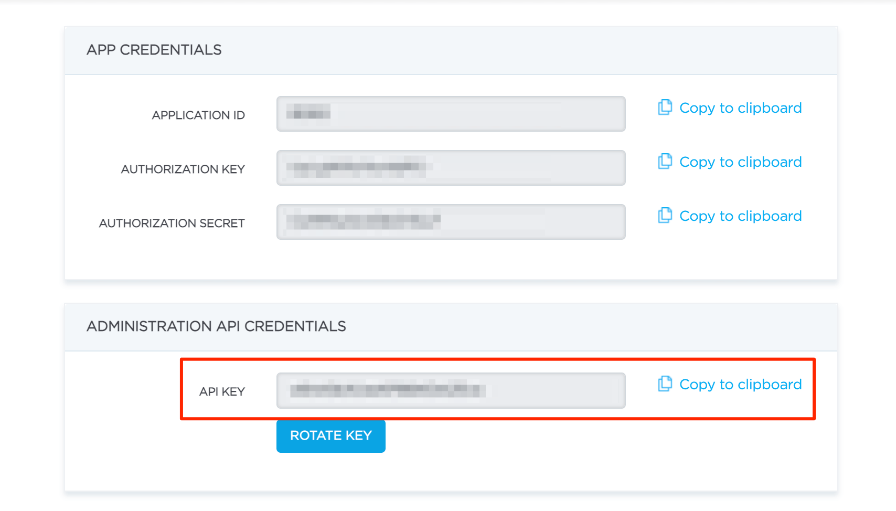

Admin API is a set of APIs to manage your app outside of user app.

Available starting from **Advanced plan**. 

A special key called **API Key** needs to be used to access the Admin API. You can access (or generate/rotate) your application Administration API Credentials (API KEY) in [ConnectyCube Dashboard](https://admin.connectycube.com):.

## List of APIs

  * [Statistics](/admin_api/statistics/)
  * [Chat](/admin_api/chat/)
  * [Meeting](/admin_api/meeting/)