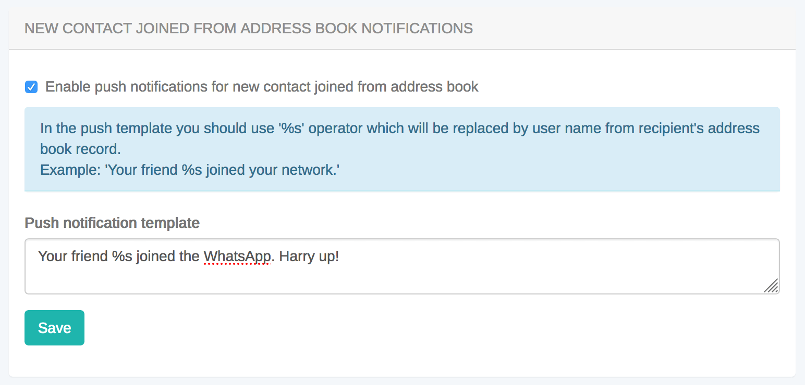

import { Tabs, TabItem } from "@astrojs/starlight/components";

Address Book API provides an interface to work with phone address book, upload it to server and retrieve already registered ConnectyCube users from your address book.

With conjunction of [User authentication via phone number](/android/authentication-and-users#authentication-via-phone-number) you can easily organize a modern state of the art logic in your App where you can easily start chatting with your phone contacts, without adding them manually as friends - the same what you can see in WhatsApp, Telegram, Facebook Messenger and Viber.

## Upload Address Book

First of all you need to upload your Address Book to the backend. It's a normal practice to do a full upload for the 1st time and then upload diffs on future app logins.

<Tabs syncKey="codeExamples">
<TabItem label='SDK v2 kotlin'>
```kotlin
//val UDID = UUID.randomUUID().toString()
val UDID: String? = null
val force = true

val contact = ConnectycubeContact(phone = "13656516112", name = "Bob Bobson")
val contactsGlobal: ArrayList<ConnectycubeContact> = arrayListOf(contact)

ConnectyCube.uploadAddressBook(contactsGlobal, force, UDID, successCallback = {result -> }, errorCallback = { error ->})

````

</TabItem>
<TabItem label='SDK v1 kotlin (deprecated)'>
```kotlin
//val UDID = Utils.generateDeviceId(context)
val UDID: String? = null
val force = true

val contact = ConnectycubeAddressBookContact().apply {
    phone = "13656516112"
    name = "Bob Bobson"
}

val contactsGlobal: ArrayList<ConnectycubeAddressBookContact> = ArrayList()
contactsGlobal.add(contact)

ConnectycubeUsers.uploadAddressBook(contactsGlobal, UDID, force)
    .performAsync(object : EntityCallback<ConnectycubeAddressBookResponse> {
        override fun onSuccess(result: ConnectycubeAddressBookResponse,
                               params: Bundle?
        ) {

        }

        override fun onError(responseException: ResponseException) {

        }
})
````

</TabItem>
<TabItem label='SDK v1 java (deprecated)'>
```java
//String UDID = Utils.generateDeviceId(context);
String UDID = null;
boolean force = true;

ArrayList<ConnectycubeAddressBookContact> contactsGlobal = new ArrayList<>();

ConnectycubeAddressBookContact contact = new ConnectycubeAddressBookContact();
contact.setPhone("13656516112");
contact.setName("Bob Bobson");

contactsGlobal.add(contact);

ConnectycubeUsers.uploadAddressBook(contactsGlobal, UDID, force).performAsync(new EntityCallback<ConnectycubeAddressBookResponse>() {
@Override
public void onSuccess(ConnectycubeAddressBookResponse result, Bundle params) {

    }

    @Override
    public void onError(ResponseException responseException) {

    }

});

````

</TabItem>
</Tabs>

- You also can edit an existing contact by providing a new name for it.
- You also can upload more contacts, not just all in one request - they will be added to your address book on the backend. If you want to override the whole address book on the backend - just provide `boolean force = true`
- You also can remove a contact by setting `contact.setIsDestroy(true);`
- A device UDID is used in cases where user has 2 or more devices and contacts sync is off. Otherwise - user has a single global address book.

## Retrieve Address Book

If you want you can retrieve your uploaded address book:

<Tabs syncKey="codeExamples">
<TabItem label='SDK v2 kotlin'>
```kotlin
val UDID: String? = null

ConnectyCube.getAddressBook(UDID, successCallback = {result -> }, errorCallback = { error ->})
````

</TabItem>
<TabItem label='SDK v1 kotlin (deprecated)'>
```kotlin
val UDID: String? = null

ConnectycubeUsers.getAddressBook(UDID)
.performAsync(object : EntityCallback<ArrayList<ConnectycubeAddressBookContact>> {
override fun onSuccess(uploadedContacts: ArrayList<ConnectycubeAddressBookContact>,
params: Bundle
) {

        }

        override fun onError(responseException: ResponseException) {

        }
    })

````

</TabItem>
<TabItem label='SDK v1 java (deprecated)'>
```java
String UDID = null;

ConnectycubeUsers.getAddressBook(UDID).performAsync(new EntityCallback<ArrayList<ConnectycubeAddressBookContact>>() {
    @Override
    public void onSuccess(ArrayList<ConnectycubeAddressBookContact> uploadedContacts, Bundle params) {

    }

    @Override
    public void onError(ResponseException responseException) {

    }
});
````

</TabItem>
</Tabs>

## Retrieve Registered Users

Using this request you can easily retrieve the ConnectyCube users - you phone Address Book contacts that already registered in your app, so you can start communicate with these users right away:

<Tabs syncKey="codeExamples">
<TabItem label='SDK v2 kotlin'>
```kotlin
val UDID: String? = null
val isCompact = true

ConnectyCube.getRegisteredUsersFromAddressBook(isCompact, UDID, successCallback = {result -> }, errorCallback = { error ->})

````

</TabItem>
<TabItem label='SDK v1 kotlin (deprecated)'>
```kotlin
val UDID: String? = null
val isCompact = true

ConnectycubeUsers.getRegisteredUsersFromAddressBook(UDID, isCompact)
    .performAsync(object : EntityCallback<ArrayList<ConnectycubeUser>> {
        override fun onSuccess(users: ArrayList<ConnectycubeUser>,
                               params: Bundle
        ) {

        }

        override fun onError(responseException: ResponseException) {

        }
    })
````

</TabItem>
<TabItem label='SDK v1 java (deprecated)'>
```java
String UDID = null;
boolean isCompact = true;
ConnectycubeUsers.getRegisteredUsersFromAddressBook(UDID, isCompact).performAsync(new EntityCallback<ArrayList<ConnectycubeUser>>() {
    @Override
    public void onSuccess(ArrayList<ConnectycubeUser> users, Bundle params) {

    }

    @Override
    public void onError(ResponseException responseException) {

    }

});

```

</TabItem>
</Tabs>

If `isCompact = true` - server will return only id and phone fields of User. Otherwise - all User's fields will be returned.

## Push notification on new contact joined

There is a way to get a push notification when some contact from your Address Book registered in an app.

You can enable this feature at [ConnectyCube Dashboard](https://admin.connectycube.com), Users module, Settings tab:



> **Note**
>
> this works only with *PRODUCTION* environment push subscription.
```
