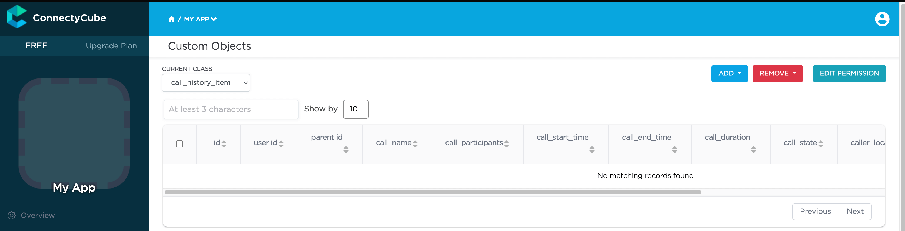

Custom Data, also known as cloud tables or custom objects, provide users with
the flexibility to define and manage data in a way that is specific to their application's requirements.
Here are some common reasons why you might need use custom data in your app:

- Custom Data allows you to define data structures that align precisely with your
  application's needs. This is particularly useful when dealing with complex or unique data types
  that don't fit well into standard ConnectyCube models.

- In certain applications, there may be entities or objects that are unique to that particular use
  case. Custom Data enable the representation of these entities in the database, ensuring
  that the data storage is optimized for the application's logic.

- Custom Data allows you to extend the functionality of the app by introducing new types of data that
  go beyond what the ConnectyCube platform's standard models support. Custom Data empower you to
  introduce these extensions and additional features.

- In situations where data needs to be migrated from an existing system or transformed in a specific
  way, Custom Data offer the flexibility to accommodate these requirements.

- Your application needs to integrate with external systems or APIs, Custom Data can
  be designed to align seamlessly with the data structures of your external systems.


## Get started with SDK

Follow the [Getting Started guide](/android/) on how to connect ConnectyCube SDK and start building your first app.

## Preparations

In order to start using Custom Data you need first create the data scheme in the ConnectyCube Admin panel.
For it navigate to **`Home -> Your App -> Custom -> List`** then click on **`ADD`** and from the dropdown menu select **`ADD NEW CLASS`**.
In the opened dialog, enter your model name and add the necessary fields.
The ConnectyCube Custom Data models' fields support various data types or arrays (except `Location`). These include:
- Integer([`Int`]);
- Float ([`Double`]);
- Boolean ([`Boolean`]);
- String ([`String`]);
- Location (the array what consist of **two** `double`s);

After adding all the required fields, click the **`CREATE CLASS`** button to save your scheme.


Newly created class is now available and contains the following data:

* **_id** - record identifier generated by system automatically
* **user_id** - identifier of user who created a record
* **_parent_id** - by default is null
* **field_1** - field defined in a scheme
* **field_2** - field defined in a scheme
* ...
* **field_N** - field defined in a scheme
* **created_at** - date and time when a record is created



After that you can perform all **CRUD** operations with your Custom Data.

> **Note**: The **Class name** field will be represented as the DB table name and will be used for identification of your requests during the work with Custom Data.

## Permissions

Access control list (ACL) is a list of permissions attached to some object. An ACL specifies which users have an access to objects, as well as what operations are allowed with such objects. Each entry in a typical ACL specifies a subject and an operation. ACL models may be applied to collections of objects as well as to individual entities within the system's hierarchy.

Adding the Access Control list is only available within the Custom Data module.

### Permissions scheme

ConnectyCube permission scheme contains five permissions levels:

* **Open** (open) - any user within the application can access the record(s) in the class and perform actions with the record
* **Owner** (owner) - only the Owner (the user who created a record) is authorized to perform actions with the record
* **Not allowed** (not_allowed) - no one (except the Account Administrator) can proceed with a chosen action
* **Open for groups** (open_for_groups) - users with the specified tag(s) will be included in the group that is authorized to perform actions with a record. Multiple groups can be specified (number of groups is not limited).
* **Open for users ids** (open_for_users_ids) - only users with listed IDs can perform actions with a record.

Actions for work with an entity:

* **Create** - create a new record
* **Read** - retrieve information about a record and view it in the read-only mode
* **Update** - update any parameter of the chosen record that can be updated by user
* **Delete** - delete a record

To set a permission schema for the Class, go to ConnectyCube dashboard and find a required class within Custom Data module Click on **`EDIT PERMISSION`** button to open permissions schema to edit.

Each listed action has a separate permission level to select. The exception is a 'Create' action that isn’t available for 'Owner' permission level.


### Permission levels

Two access levels are available in the ConnectyCube: access to Class and access to Record.

Only one permission schema can be applied for the record. Using the Class permission schema means that the Record permission schema won’t be affected on a reсord.

**Class entity**

**Class** is an entity that contains records. Class can be created via ConnectyCube dashboard only within Custom data module. Operations with Class entity are not allowed in API.

All actions (Create, Read, Update and Delete) that are available for the ‘Class’ entity are also applicable for all records within a class.

Default Class permission schema is using during the creation of a class:

* **Create:** Open
* **Read:** Open
* **Update:** Owner
* **Delete:** Owner

To enable applying Class permissions for any of the action types, 'Use Class permissions' check box should be ticked. It means that the record permission schema (if existing) won’t be affected on a record.

**Record entity**

**Record** is an entity within the Class in the Custom Data module that can be created in ConnectyCube dashboard and via API. Each record within a Class has its own permission level. Unlike Class entity, 'Not allowed' permission level isn't available for a record as well as only three actions are available to work with a record - read, update and delete.

Default values for Record permission scheme:

* Read: Open
* Update: Owner
* Delete: Owner

To set a separate permission scheme for a record, open a record to edit and click on **`SET PERMISSION ON RECORD`** button:


Define the permission level for each of available actions.

## Create a new record

Create a new record with the defined parameters in the class. Fields that weren't defined in the
request but are available in the scheme (class) will have null values.

```kotlin
val className = "call_history_item"
val customObject: ConnectycubeCustomObject = ConnectycubeCustomObject(className)

customObject.fields = hashMapOf (                              
    "call_name" to "Group call",                               
    "call_participants" to intArrayOf(2325293, 563541, 563543),
    "call_start_time" to 1701789791673,                        
    "call_end_time" to 0,                                      
    "call_duration" to 0,                                      
    "call_state" to "accepted",                                
    "is_group_call" to true,                                   
    "call_id" to "f8c3de3d-1fea-4d7c-a8b0-29f63c4c3454",       
    "user_id" to 2325293,                                      
    "caller_location" to doubleArrayOf(50.004444, 36.234380)   
)                                                              

ConnectyCube.createCustomObject(customObject, { createdObject ->                                         
    val objectFields = createdObject.fields // the fields of your object saved on the ConnectyCube server
}, { ex ->  })                                                                                                 
```

For example, you can use [kotlinx.serialization](https://kotlinlang.org/docs/serialization.html) for serialization and deserialization your objects.
In this case, the code will appear as follows:

```kotlin
val className = "call_history_item"
val customObject: ConnectycubeCustomObject = ConnectycubeCustomObject(className)
val callItem: CallItem // the instance of the class that has annotation `@Serializable`
customObject.fields = HashMap(Json.encodeToJsonElement(callItem).jsonObject.toMap())

ConnectyCube.createCustomObject(customObject, { createdObject ->
  val callItem: CallItem = Json.decodeFromJsonElement(createdObject.fields.toJsonObject())
}, { ex -> })
```

### Create a record with permissions

To create a new record with permissions, add the `permissions` parameter to the instance of the `ConnectycubeCustomObject` you use to create the object.
In this case, the request will look like this:

```kotlin
val className = "call_history_item"
val customObject = ConnectycubeCustomObject(className)
val callItem: CallItem // the instance of the class that has annotation `@Serializable`
customObject.fields = HashMap(Json.encodeToJsonElement(callItem).jsonObject.toMap())

val updatePermission = CustomObjectPermission(Level.OPEN_FOR_USERS_IDS, ids = listOf(232529, 563542, 563541))
val permissions = CustomObjectPermissions(updatePermission = updatePermission)

customObject.permissions = permissions

ConnectyCube.createCustomObject(customObject, { createdObject ->
  val permissions = createdObject.permissions
}, { ex ->  })
```

## Retrieve record by ID

Retrieve the record by specifying its identifier.

```kotlin
val className = "call_history_item"
val id = '656f407e29d6c5002fce89dc'

ConnectyCube.getCustomObjectById(className, id, { record ->
  val customObject = record // the found record or null if requested record was not found
}, { ex -> })
```

## Retrieve records by IDs

Retrieve records by specifying their identifiers.

```kotlin
val className = "call_history_item"
val ids = listOf("656f407e29d6c5002fce89dc", "5f985984ca8bf43530e81233")

ConnectyCube.getCustomObjectsByIds(className, ids, { records ->
  val customObjects: List<ConnectycubeCustomObject> = records.items // the list of the found items
}, { ex -> })
```

## Retrieve records within a class

Search records within the particular class.

> **Note:** If you are sorting records by time, use the `_id` field. It is indexed and it will be much faster than sorting by `created_at` field.

The list of additional parameter for sorting, filtering, aggregation of the search response is provided by link https://developers.connectycube.com/server/custom_objects/#options-to-apply

```kotlin
val className = "call_history_item"
val params = mapOf("call_start_time[gt]" to 1701789791673)
        
ConnectyCube.getCustomObjectsByClassName(className, params, { result ->
  val customObjects: List<ConnectycubeCustomObject> = result.items // the list of the found items
}, { ex -> })
```

## Retrieve the record's permissions

> **Note:** record permissions are checked during request processing. Only the owner has an ability to view a record's permissions.

```kotlin
val className = "call_history_item"
val id = "656f407e29d6c5002fce89dc"

ConnectyCube.getCustomObjectPermissions(className, id, { permissions ->
  val recordPermissions = permissions // the permissions applied for a searched record 
}, { ex -> })
```

## Update record by ID

Update record data by specifying its ID.

```kotlin
val className = "call_history_item"
val id = "656f407e29d6c5002fce89dc"

val params = mapOf("call_end_time" to 1701945033120)

ConnectyCube.updateCustomObject(className, id, params, { updatedObject ->
  val updatedCustomObject = updatedObject
}, { ex -> })
```

## Update records by criteria

Update records found by the specified search criteria with a new parameter(s).

The structure of the parameter `search_criteria` and the list of available operators provided by link https://developers.connectycube.com/server/custom_objects/#parameters-4

```kotlin
val className = "call_history_item"

val params = mapOf(
  "search_criteria" to mapOf("user_id" to 1234567),
  "call_name" to "Deleted user"
)

ConnectyCube.updateCustomObjectsByCriteria(className, params, { result ->
  val updatedItems = result.items // the list of updated items
}, { ex -> })
```

## Delete record by ID

Delete a record from a class by record identifier.

```kotlin
val className = "call_history_item"
val id = "656f407e29d6c5002fce89dc"

ConnectyCube.deleteCustomObjectById(className, id, { result ->
// the record was successfully deleted
}, { ex -> })
```

## Delete several records by their IDs

Delete several records from a class by specifying their identifiers. If one or more records can not be deleted, an appropriate error is returned for that record(s).

```kotlin
val className = "call_history_item"
val ids = listOf("656f407e29d6c5002fce89dc", "5f998d3bca8bf4140543f79a")

ConnectyCube.deleteCustomObjectsByIds(className, ids, { result ->
  val deletedItemsIds = result.successfullyDeleted?.ids // `ids` is the result with identifiers of the deleted records request
}, { ex -> })
```

## Delete records by criteria

Delete records from the class by specifying a criteria to find records to delete.

The search query format is provided by link https://developers.connectycube.com/server/custom_objects/#query-format

```kotlin
val className = "call_history_item"
val params = mapOf("call_id[in]" to "f8c3de3d-1fea-4d7c-a8b0-29f63c4c3454")

ConnectyCube.deleteCustomObjectsByCriteria(className, params, { totalDeleted ->
  // `totalDeleted` is the count of deleted items
}, { ex -> })
```

## Relations

Objects (records) in different classes can be linked with a `parentId` field. If the record from the **Class 1** is pointed with a record from **Class 2** via its `parentId`, the `parentId` field will contain an ID of a record from the **Class 2**.

If a record from the **Class 2** is deleted, all its children (records of the **Class 1** with `parentId` field set to the **Class 2** record ID) will be automatically deleted as well.

The linked children can be retrieved with `_parent_id={id_of_parent_class_record}` parameter.


