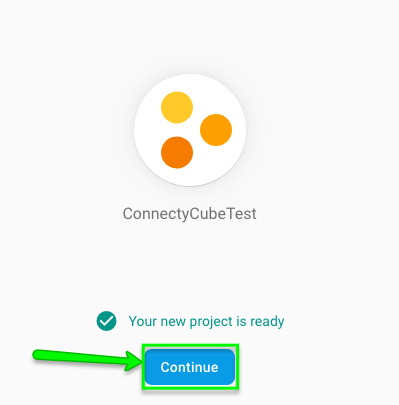
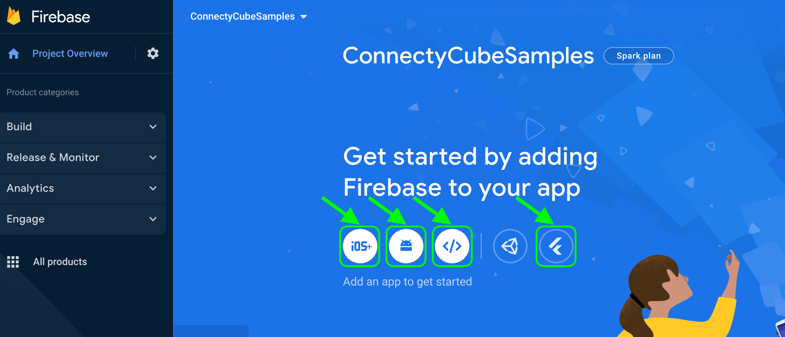
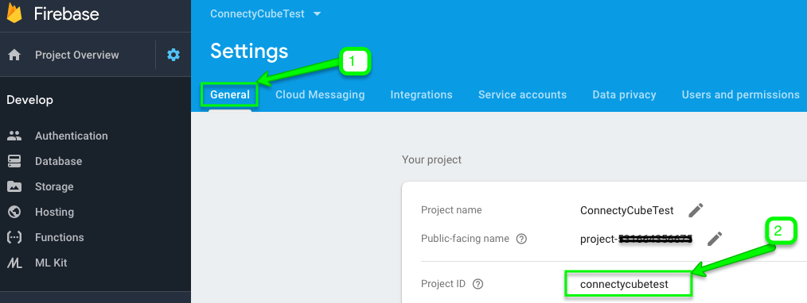

import { Tabs, TabItem } from "@astrojs/starlight/components";

You might need to use Firebase for the following reasons:

1. Firebase authentication of users in your app via phone number.
2. Firebase Cloud Messaging (FCM) push notifications (former GCM).

It might look a bit scary at first. But don’t panic and let's check how to do this right step by step.

## Firebase account and project registration

Follow these steps to register your Firebase account and create a Firebase project:

1. **Register a Firebase account** at [Firebase console](https://console.firebase.google.com/) .
   You can use your Google account to authenticate at Firebase.

2. Click **Create project**

   

   > **Note**
   >
   > If you have a Google project registered for your mobile app, select it from the **Project name** dropdown menu.

   You can also edit your **Project ID** if you need. A unique ID is assigned automatically to each project. This ID is used in publicly visible Firebase features. For example, it will be used in database URLs and in your Firebase Hosting subdomain. If you need to use a specific subdomain, you can change it.

3. Fill in the fields required (Project name, Project ID, etc.) and click **Continue**.

   

   

4. Configure Google Analytics for your project and click **Create project**.

   

   Then click Continue.

   

5. Select platform for which you need Firebase

   

6. Fill in the fields on **Add Firebase to your Android App** screen and click **Register App**

   

## Connect Firebase SDK

For **Android** projects Firebase has the following **requirements** to be added successfully:

- Android OS 4.0 or newer
- Google Play Services 15.0.0 or higher
- The latest version of Android Studio

Here is a step by step guide how to connect Firebase SDK to your Android Project:

1. Download **Google-Services.json** config file

   

2. Open **Project view** in Android Studio and upload **Google-Services.json** file you have just downloaded into the root directory of your Android app module.

   

3. **Add Firebase SDK** according to the instructions in your Firebase console

   

4. **Add Google services plugin** to your **project build.gradle** file

   

5. **Add Google services plugin** in the bottom of your **module build.gradle** file.

   

6. Click **Sync Now** at the pop-up in your Android Studio

   

   You are done now.

## Firebase authentication

This option allows users in your app authenticate themselves via phone number. If you use this method for user authentication, the user receives an SMS with verification code and authenticates via that code in your app.

You need to follow these steps to add Firebase authentication to your Android project:

1. Add Firebase authentication dependency to your **Module build.gradle** file:

   

2. Sync your project as prompted by Android Studio:

   

3. Find your app’s SHA-1 hash - check [Authenticating Your Client](https://developers.google.com/android/guides/client-auth) guide.

4. Add your app’s SHA-1 hash in your [Firebase console](https://console.firebase.google.com/) >> **Project settings** tab:

   

   And then:

   

5. Go to **Firebase console >> Authentication >> Sign-in method** section:

   

6. Enable **Phone** number sign-in method:

   

7. Add `PhoneAuthProvider.verifyPhoneNumber` method to request that Firebase verify the user's phone number:

```java
PhoneAuthProvider.getInstance().verifyPhoneNumber(
        phoneNumber,         // Phone number to verify
        60,                 // Timeout duration
        TimeUnit.SECONDS,    // Unit of timeout
        this,               // Activity (for callback binding)
        mCallbacks);        // OnVerificationStateChangedCallbacks
```

```kotlin
PhoneAuthProvider.getInstance().verifyPhoneNumber(
    phoneNumber,      // Phone number to verify
    60,               // Timeout duration
    TimeUnit.SECONDS, // Unit of timeout
    this,             // Activity (for callback binding)
    mCallbacks)       // OnVerificationStateChangedCallbacks
```

> **Note**
>
> `verifyPhoneNumber` method is reentrant: if you call it multiple times, such as in an activity's `onStart` method, `verifyPhoneNumber` method will not send a second SMS unless the original request has timed out.

> **Note**
>
> As a best practice please do not forget to inform your users that if they use phone sign-in, they might receive an SMS message for verification and standard rates apply.

8. (Optional) To resume the phone number sign in process if your app closes before the user can sign in (if the user checks SMS app, for instance), after `verifyPhoneNumber` method is called, set a flag that indicates verification is in progress. Then, save the flag in your Activity's `onSaveInstanceState` method and restore the flag in `onRestoreInstanceState`. In your Activity's `onStart` method, check if verification is already in progress, and if it is not, call `verifyPhoneNumber` again. Be sure to clear the flag when verification completes or fails. Check this [guide](https://firebase.google.com/docs/auth/android/phone-auth#verification-callbacks) for more details.

9. `setLanguageCode` method on your Auth instance allows specifying the auth language and therefore localize SMS message sent by Firebase:

```java
auth.setLanguageCode("fr");
// To apply the default app language instead of explicitly setting it.
// auth.useAppLanguage();
```

```kotlin
auth.setLanguageCode("fr")
// To apply the default app language instead of explicitly setting it.
// auth.useAppLanguage();
```

10. When you call `PhoneAuthProvider.verifyPhoneNumber` method, you must also provide an instance of `OnVerificationStateChangedCallbacks`, which contains implementations of the callback functions that handle the results of the request:

```java
mCallbacks = new PhoneAuthProvider.OnVerificationStateChangedCallbacks() {

    @Override
    public void onVerificationCompleted(PhoneAuthCredential credential) {
        // This callback will be invoked in two situations:
        // 1 - Instant verification. In some cases the phone number can be instantly
        //     verified without needing to send or enter a verification code.
        // 2 - Auto-retrieval. On some devices Google Play services can automatically
        //     detect the incoming verification SMS and perform verification without
        //     user action.
        Log.d(TAG, "onVerificationCompleted:" + credential);

        signInWithPhoneAuthCredential(credential);
    }

    @Override
    public void onVerificationFailed(FirebaseException e) {
        // This callback is invoked in an invalid request for verification is made,
        // for instance if the the phone number format is not valid.
        Log.w(TAG, "onVerificationFailed", e);

        if (e instanceof FirebaseAuthInvalidCredentialsException) {
            // Invalid request
            // ...
        } else if (e instanceof FirebaseTooManyRequestsException) {
            // The SMS quota for the project has been exceeded
            // ...
        }

        // Show a message and update the UI
        // ...
    }

    @Override
    public void onCodeSent(String verificationId,
                           PhoneAuthProvider.ForceResendingToken token) {
        // The SMS verification code has been sent to the provided phone number, we
        // now need to ask the user to enter the code and then construct a credential
        // by combining the code with a verification ID.
        Log.d(TAG, "onCodeSent:" + verificationId);

        // Save verification ID and resending token so we can use them later
        mVerificationId = verificationId;
        mResendToken = token;

        // ...
    }
};
```

```kotlin
mCallbacks = object : OnVerificationStateChangedCallbacks() {
    override fun onVerificationCompleted(credential: PhoneAuthCredential) {
        // This callback will be invoked in two situations:
        // 1 - Instant verification. In some cases the phone number can be instantly
        //     verified without needing to send or enter a verification code.
        // 2 - Auto-retrieval. On some devices Google Play services can automatically
        //     detect the incoming verification SMS and perform verification without
        //     user action.
        Log.d(TAG, "onVerificationCompleted:$credential")
        signInWithPhoneAuthCredential(credential)
    }

    override fun onVerificationFailed(e: FirebaseException) {
        // This callback is invoked in an invalid request for verification is made,
        // for instance if the the phone number format is not valid.
        Log.w(TAG, "onVerificationFailed", e)
        if (e is FirebaseAuthInvalidCredentialsException) {
            // Invalid request
            // ...
        } else if (e is FirebaseTooManyRequestsException) {
            // The SMS quota for the project has been exceeded
            // ...
        }
            // Show a message and update the UI
            // ...
    }

    override fun onCodeSent(verificationId: String,
                            token: ForceResendingToken
    ) {
        // The SMS verification code has been sent to the provided phone number, we
        // now need to ask the user to enter the code and then construct a credential
        // by combining the code with a verification ID.
        Log.d(TAG, "onCodeSent:$verificationId")
        // Save verification ID and resending token so we can use them later
        mVerificationId = verificationId
        mResendToken = token
        // ...
    }
}
```

11. Create a `PhoneAuthCredential` object using the verification code and the verification ID that was passed to `onCodeSent` callback. You get a `PhoneAuthCredential` object when `onVerificationCompleted` is called.
    To create `PhoneAuthCredential` object, call `PhoneAuthProvider.getCredential`:

```java
PhoneAuthCredential credential = PhoneAuthProvider.getCredential(verificationId, code);
```

```kotlin
val credential = PhoneAuthProvider.getCredential(verificationId, code)
```

12. Complete the sign-in flow by passing the `PhoneAuthCredential` object to `FirebaseAuth.signInWithCredential`:

```java
private void signInWithPhoneAuthCredential(PhoneAuthCredential credential) {
   mAuth.signInWithCredential(credential)
            .addOnCompleteListener(this, new OnCompleteListener<AuthResult>() {
                @Override
                public void onComplete(@NonNull Task<AuthResult> task) {
                    if (task.isSuccessful()) {
                        // Sign in success, update UI with the signed-in user's information
                        Log.d(TAG, "signInWithCredential:success");

                        FirebaseUser user = task.getResult().getUser();
                        // ...
                    } else {
                        // Sign in failed, display a message and update the UI
                        Log.w(TAG, "signInWithCredential:failure", task.getException());
                        if (task.getException() instanceof FirebaseAuthInvalidCredentialsException) {
                            // The verification code entered was invalid
                        }
                    }
                }
            });
}
```

```kotlin
private fun signInWithPhoneAuthCredential(credential: PhoneAuthCredential) {
    mAuth.signInWithCredential(credential)
        .addOnCompleteListener(this) { task ->
            if (task.isSuccessful) {
                // Sign in success, update UI with the signed-in user's information
                Log.d(TAG, "signInWithCredential:success")
                val user = task.result?.user
                // ...
            } else {
                // Sign in failed, display a message and update the UI
                Log.w(TAG, "signInWithCredential:failure", task.exception)
                if (task.exception is FirebaseAuthInvalidCredentialsException) {
                    // The verification code entered was invalid
                }
            }
        }
    }
```

13. Get Firebase `access_token` after SMS code verification as follows:

```java
public Task<GetTokenResult> getIdToken (boolean forceRefresh)
```

```kotlin
fun getIdToken(forceRefresh: Boolean): Task<GetTokenResult>
```

_Example of the method implementation_:

```java
FirebaseAuth.getInstance().getCurrentUser().getIdToken(forceRefresh);
```

```kotlin
FirebaseAuth.getInstance().currentUser?.getIdToken(forceRefresh)
```

14. Add ConnectyCube user sign in to your project as follows:

1)  Get your **Project ID** from your **Firebase console**:



2.  Pass your Firebase `project_id` and Firebase `access_token` parameters to `signInUsingFirebase` method:

<Tabs syncKey="codeExamples">
<TabItem label='SDK v2'>
```kotlin
//Coming soon
```

</TabItem>
<TabItem label='SDK v1'>
```java
String projectId = "...";
String accessToken = "...";

ConnectycubeUsers.signInUsingFirebase(projectId, accessToken).performAsync(new EntityCallback<ConnectycubeUser>() {
@Override
public void onSuccess(ConnectycubeUser user, Bundle args) {

    }

    @Override
    public void onError(ResponseException error) {

    }

});

````


```kotlin
val projectId = "..."
val accessToken = "..."

ConnectycubeUsers.signInUsingFirebase(projectId, accessToken)
    .performAsync(object : EntityCallback<ConnectycubeUser> {
        override fun onSuccess(user: ConnectycubeUser, args: Bundle?) {

        }

        override fun onError(error: ResponseException) {

        }
    })
````

</TabItem>
</Tabs>

14. Try running a test.
    Once your user is logged in successfully, you will find him/her in your **Dashboard >> Your App >> Users** section.


So now you know how to use Firebase features in your ConnectyCube apps. If you have any difficulties - please let us know via [support channel](mailto:support@connectycube.com)
