import { Tabs, TabItem } from "@astrojs/starlight/components";

Push Notifications provide a way to deliver some information to user while he is not using your app actively.
The following use cases can be covered additionally with push notifications:

- send a chat message if recipient is offline (a push notification will be send automatically)
- make a video call with offline opponents (need to send a push notification manually)
- request to add a user to contact list (need to send a push notification manually)

## Configure Firebase project and Service account key (recommended)

In order to start working with push notifications functionality you need to configure it.

1. Create and configure your [Firebase project](https://console.firebase.google.com) and obtain the **Service account key**. If you have any difficulties with Firebase project registration, [follow our guide](/android/firebase-setup-guide).

   To find your **FCM service account key** go to your **Firebase console > Cloud Messaging > Manage Service Accounts** section:
   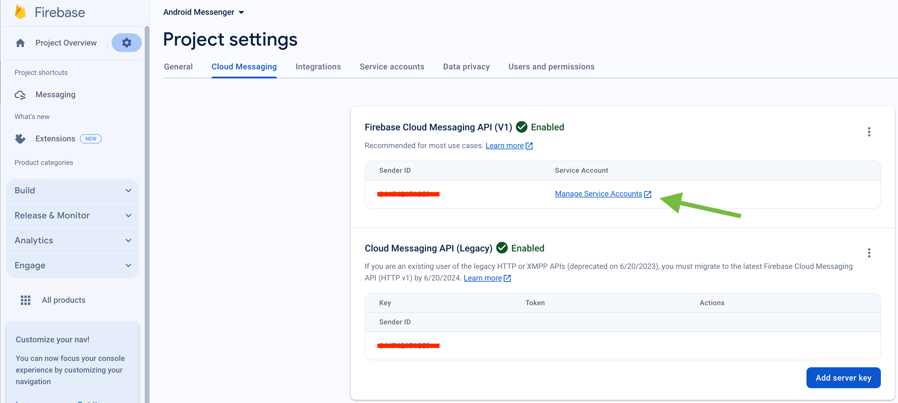

2. Select and configure **Manage Keys** option:

   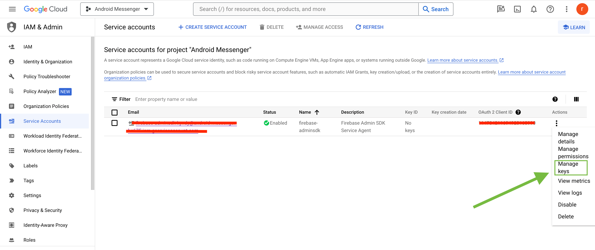

3. Select **ADD KEY**, **Create new key**:

   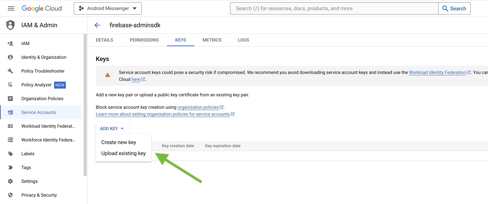

4. Select **Key type** (json recommended) and create:

   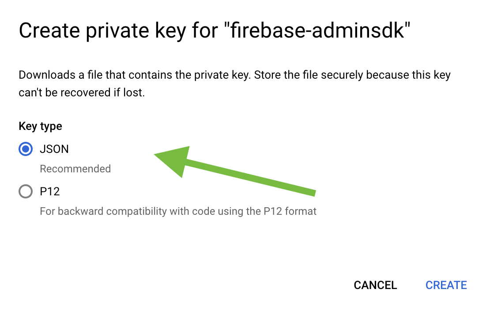

5. Save it locally:

   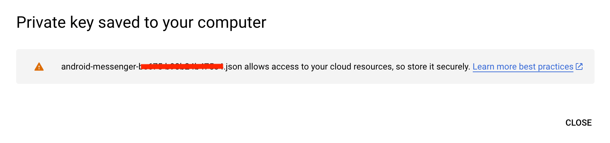

6. Browse your saved **FCM Service account key** in your **Dashboard > Your App > Push Notifications > Credentials**, select the environment for which you are adding the key. Use the same key for development and production zones.
   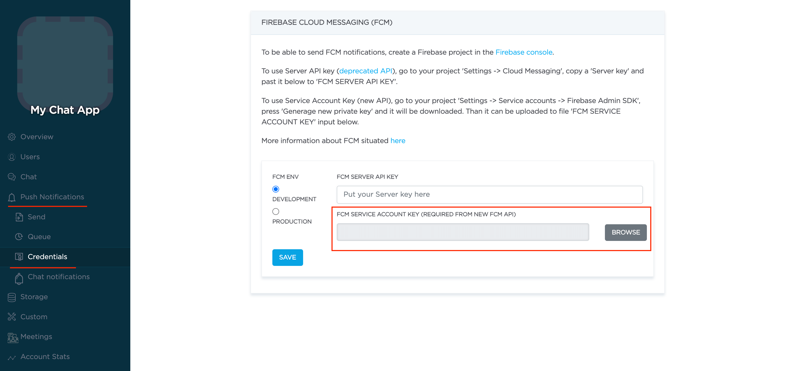

## Configure Firebase project and Server key (DEPRECATED)

1. Create and configure your [Firebase project](https://console.firebase.google.com) and obtain the **Server key**. If you have any difficulties with Firebase project registration, [follow our guide](/android/firebase-setup-guide).

   To find your **FCM server key** go to your **Firebase console > Cloud Messaging** section:
   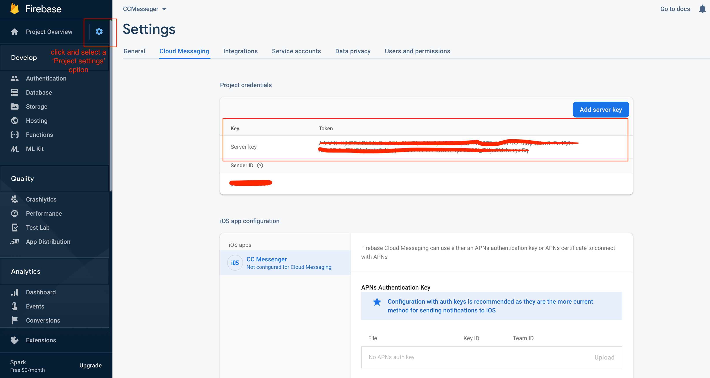

2. Copy your **FCM server key** to your **Dashboard > Your App > Push Notifications > Credentials**, select the environment for which you are adding the key and hit **Save key**. Use the same key for development and production zones.
   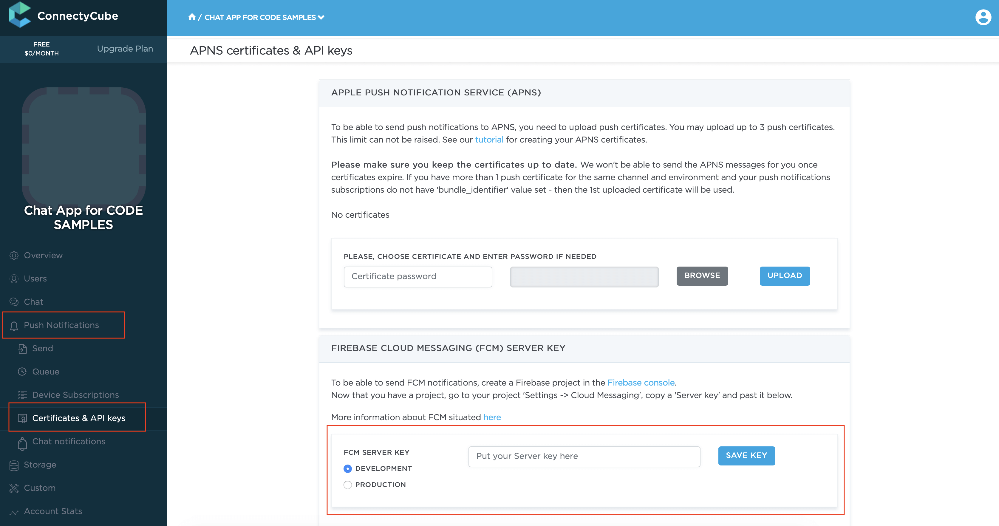

## Prepare app dependencies

1\. As part of enabling Firebase services in your Android application you need to add the **google-services plugin** to your Project **build.gradle** file:

```groovy
dependencies {
    classpath 'com.google.gms:google-services:3.0.0'
    ...
}
```

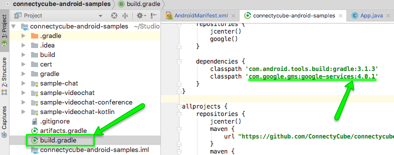

> **Note**:
> If you use google play services in your project, use version 11.8.0 or higher (version we use in our SDK) as all com.google.android.gms libraries must use the exact same version specification.

If you use version higher than 11.8.0, then just add explicit dependency:

```groovy
compile "com.google.android.gms:play-services-gcm:17.0.0"
compile "com.google.firebase:firebase-messaging:17.0.0"
compile "com.google.firebase:firebase-core:17.0.0"
```

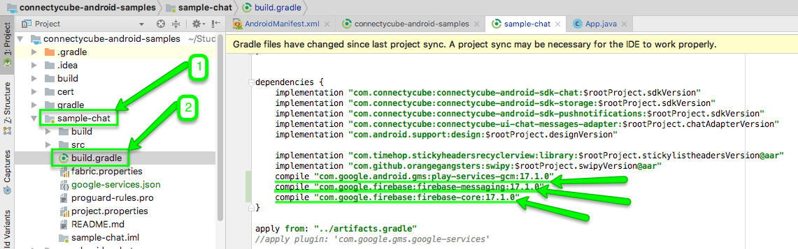

2\. Include **gms** plugin in the bottom of your module **build.gradle** :

```groovy
apply plugin: 'com.google.gms.google-services'
```

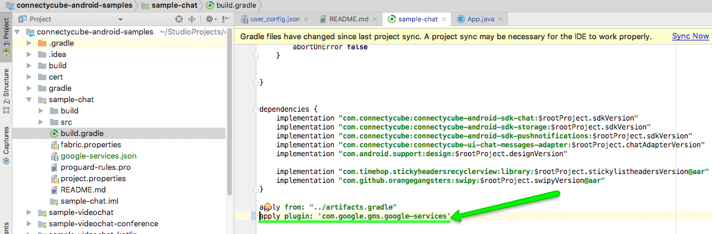

3\. For **GCM** push type add an empty **current_key** settings into your **google-services.json** file for your package name _(this paragraph relates to GCM. If you use FCM and already have some value in current_key field, leave it as is)_:

```json
"client": [
    {
      "client_info": {
        "mobilesdk_app_id": "1:861750218637:android:c7299bc46191b2d7",
        "client_id": "android:com.your.app.package.id",
        "client_type": 1,
        "android_client_info": {
          "package_name": "com.your.app.package.id"
        }
      },
      "api_key": [
        {
          "current_key": ""
        }
      ],
    }
  ]
```

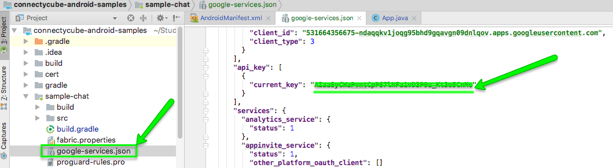

## Prepare app AndroidManifest (only v1)

1. Copy **Sender ID** value from your **Firebase console**:

   

2. Edit your app **AndroidManifest.xml** file and add your Firebase **Sender ID** as well as notification type and environment there:

To integrate automatic push subscription you just need set values in **AndroidManifest**:

```xml
<meta-data android:name="com.connectycube.pushnotifications.TYPE" android:value="FCM" />
<meta-data android:name="com.connectycube.pushnotifications.SENDER_ID" android:value="@string/sender_id" />
<meta-data android:name="com.connectycube.pushnotifications.ENVIRONMENT" android:value="DEVELOPMENT" />
```

- com.connectycube.pushnotifications.TYPE - can be FCM
- com.connectycube.pushnotifications.SENDER_ID - your sender id from google console (for ex.8617520217632)
- com.connectycube.pushnotifications.ENVIRONMENT - can be DEVELOPMENT or PRODUCTION

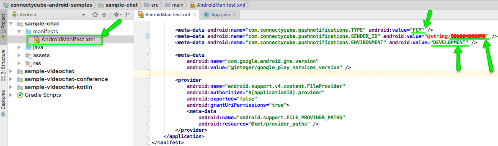

Then you need to setup **FcmPushListenerService** and **FcmPushInstanceIDService**:

```xml
<service
   android:name="com.connectycube.pushnotifications.services.fcm.FcmPushListenerService">
   <intent-filter>
       <action android:name="com.google.firebase.MESSAGING_EVENT" />
   </intent-filter>
</service>
<service
   android:name="com.connectycube.pushnotifications.services.fcm.FcmPushInstanceIDService">
   <intent-filter>
       <action android:name="com.google.firebase.INSTANCE_ID_EVENT"/>
   </intent-filter>
</service>
```

## Automatic push subscription (only v1)

ConnectyCube Android SDK provides automatic push subscription management. It means you don’t need bother how to get FCM device token, create push subscription and what to do with the received data. Thus, you can reduce your code and make it cleaner.

Here are the requirements on how to integrate automatic push subscription feature to your app:

### Enable/Disable push subscription

Here you can use global setting to enable or disable delivery of push notifications (means to set this parameter only one time):

<Tabs syncKey="codeExamples">
<TabItem label='SDK v1 kotlin (deprecated)'>
```kotlin
ConnectycubeSettings.getInstance().isEnablePushNotification = false // default is 'true'

val isEnabled = ConnectycubeSettings.getInstance().isEnablePushNotification

````

</TabItem>
<TabItem label='SDK v1 java (deprecated)'>
```java
ConnectycubeSettings.getInstance().setEnablePushNotification(false); // default is 'true'

boolean isEnabled = ConnectycubeSettings.getInstance().isEnablePushNotification();
````

</TabItem>
</Tabs>

### Track subscription status (only v1)

To be aware about what is happening with your push subscription, whether you're subscribed successfully or not, you can use the **SubscribeListener**. Just add **SubscribeListener** right after the **ConnectycubeSettings.getInstance().init()** code:

<Tabs syncKey="codeExamples">
<TabItem label='SDK v1 kotlin (deprecated)'>
```kotlin
ConnectycubePushManager.getInstance()
    .addListener(object : ConnectycubePushManager.SubscribeListener {
        override fun onSubscriptionCreated() {}

        override fun onSubscriptionError(e: Exception, resultCode: Int) {
            Log.d(TAG, "onSubscriptionError$e")

            if (resultCode >= 0) {
                Log.d(TAG, "Google play service exception$resultCode")
            }
        }

        override fun onSubscriptionDeleted(success: Boolean) {

        }
    })

````

</TabItem>
<TabItem label='SDK v1 java (deprecated)'>
```java
ConnectycubePushManager.getInstance().addListener(new ConnectycubePushManager.SubscribeListener() {
    @Override
    public void onSubscriptionCreated() {

    }

    @Override
    public void onSubscriptionError(final Exception e, int resultCode) {
        Log.d(TAG, "onSubscriptionError" + e);
        if (resultCode >= 0) {
            Log.d(TAG, "Google play service exception" + resultCode);
        }
    }

    @Override
    public void onSubscriptionDeleted(boolean success) {

    }
});
````

</TabItem>
</Tabs>

## Manual push subscription

If you don’t want to use automatic push subscription feature (**only v1**), then do the following:

- Set **SubscribePushStrategy.MANUAL** as the main strategy:

<Tabs syncKey="codeExamples">
<TabItem label='SDK v1 kotlin (deprecated)'>
```kotlin
// default SubscribePushStrategy.ALWAYS
ConnectycubeSettings.getInstance().subscribePushStrategy = SubscribePushStrategy.MANUAL
```

</TabItem>
<TabItem label='SDK v1 java (deprecated)'>
```java
// default SubscribePushStrategy.ALWAYS
ConnectycubeSettings.getInstance().setSubscribePushStrategy(SubscribePushStrategy.MANUAL)
```

</TabItem>
</Tabs>

In this case you need to subscribe and unsubscribe manually using the following methods:

<Tabs syncKey="codeExamples">
<TabItem label='SDK v2 kotlin'>
```kotlin
//create push subscription
val subscriptionParameters = CreatePushSubscriptionParameters(environment = "development",
                channel = "gcm", udid = deviceId, platform = "android", pushToken = registrationID)

ConnectyCube.createPushSubscription(subscriptionParameters.getRequestParameters(), { subscriptions -> },
{ ex -> })

//delete push subscription
ConnectyCube.deletePushSubscription(subscriptionId, {},
{ ex -> })

````

</TabItem>
<TabItem label='SDK v1 kotlin (deprecated)'>
```kotlin
val tokenRefreshed = false
SubscribeService.subscribeToPushes(context, tokenRefreshed)
SubscribeService.unSubscribeFromPushes(context)

// this comes from 'InstanceIDListenerService'
override fun onTokenRefresh() {
    val tokenRefreshed = true
    SubscribeService.subscribeToPushes(context, tokenRefreshed)
}
````

</TabItem>
<TabItem label='SDK v1 java (deprecated)'>
```java
boolean tokenRefreshed = false;
SubscribeService.subscribeToPushes(context, tokenRefreshed);
SubscribeService.unSubscribeFromPushes(context);

// this comes from 'InstanceIDListenerService'
@Override
public void onTokenRefresh() {
boolean tokenRefreshed = true;
SubscribeService.subscribeToPushes(context, tokenRefreshed);
}

````

</TabItem>
</Tabs>

## Send push notifications

You can manually initiate sending of push notifications to user/users on any event in your application. To do so you need to form a push notification parameters (payload) and set the push recipients:

<Tabs syncKey="codeExamples">
<TabItem label='SDK v2 kotlin'>
```kotlin
val cubeEventParams = CreateEventParams()
cubeEventParams.parameters["message"] = "Some text"
cubeEventParams.notificationType = NotificationType.PUSH
cubeEventParams.environment = ConnectycubeEnvironment.DEVELOPMENT
cubeEventParams.eventType = PushEventType.ONE_SHOT
cubeEventParams.usersIds.add(373737)
val cubeEvent = cubeEventParams.getEventForRequest()

ConnectyCube.createPushEvent(cubeEvent, successCallback = {result -> }, errorCallback = { error ->})
````

</TabItem>
<TabItem label='SDK v1 kotlin (deprecated)'>
```kotlin
val userIds = StringifyArrayList<Int>().apply {
    add(21)
    add(22)
}

val event = ConnectycubeEvent().apply {
this.userIds = userIds
environment = ConnectycubeEnvironment.DEVELOPMENT
notificationType = ConnectycubeNotificationType.PUSH
}

val json = JSONObject()
json.put("message", "New bitcoin trends today")

// custom parameters
json.put("user_id", "56")
json.put("dialog_id", "54123123123416234614263123")

event.message = json.toString()

ConnectycubePushNotifications.createEvent(event)
.performAsync(object : EntityCallback<ConnectycubeEvent> {
override fun onSuccess(event: ConnectycubeEvent, args: Bundle?) {
// sent
}

        override fun onError(errors: ResponseException) {

        }

})

````

</TabItem>
<TabItem label='SDK v1 java (deprecated)'>
```java
ArrayList<Integer> recipientsUserIds = new StringifyArrayList<Integer>();
userIds.add(21);
userIds.add(22);

ConnectycubeEvent event = new ConnectycubeEvent();
event.setUserIds(userIds);
event.setEnvironment(ConnectycubeEnvironment.DEVELOPMENT);
event.setNotificationType(ConnectycubeNotificationType.PUSH);

JSONObject json = new JSONObject();
try {
    json.put("message", "New bitcoin trends today");
    // custom parameters
    json.put("user_id", "56");
    json.put("dialog_id", "54123123123416234614263123");
} catch (Exception e) {
    e.printStackTrace();
}

event.setMessage(json.toString());

ConnectycubePushNotifications.createEvent(event).performAsync(new EntityCallback<ConnectycubeEvent>() {
    @Override
    public void onSuccess(ConnectycubeEvent event, Bundle args) {
        // sent
    }

    @Override
    public void onError(ResponseException errors) {

    }
});
````

</TabItem>
</Tabs>

## Receive push notifications

To receive push notifications extend _FirebaseMessagingService_ and register it in _AndroidManifest_:

<Tabs syncKey="codeExamples"><TabItem label='SDK v2 kotlin'>
```kotlin
class PushListenerService: FirebaseMessagingService() {

    override fun onNewToken(token: String) {
        Timber.d("Refreshed token: $token")

        if( ConnectycubeSessionManager.activeSession?.user?.id != 0) {
            //need to createPushSubscription() with new token
        }
    }

    override fun onMessageReceived(remoteMessage: RemoteMessage) {
        //need to process push notification
        Log.d(TAG, "From: ${remoteMessage.from}")
        if (remoteMessage.data.isNotEmpty()) {
            Log.d(TAG, "remoteMessage.data ${remoteMessage.data}")
            AppNotificationManager.getInstance().processPushNotification(this, remoteMessage.data)
        }
    }

}

// register service in AndroidManifest

<service android:name=".fcm.PushListenerService" android:exported="false">
  <intent-filter>
    <action android:name="com.google.firebase.MESSAGING_EVENT" />
  </intent-filter>
</service>
```

</TabItem></Tabs>

or you need to register the **BroadcastReceiver** (**only v1**) :

<Tabs syncKey="codeExamples">
<TabItem label='SDK v1 kotlin (deprecated)'>
```kotlin
val pushBroadcastReceiver: BroadcastReceiver = object : BroadcastReceiver() {
    override fun onReceive(context: Context, intent: Intent) {
        val message = intent.getStringExtra("message")
        val from = intent.getStringExtra("from")
        Log.i(TAG, "New push message: $message, from $from")
    }
}

LocalBroadcastManager.getInstance(context).registerReceiver(
pushBroadcastReceiver,
IntentFilter("new-push-event")
)

````

</TabItem>
<TabItem label='SDK v1 java (deprecated)'>
```java
private BroadcastReceiver pushBroadcastReceiver = new BroadcastReceiver() {
    @Override
    public void onReceive(Context context, Intent intent) {
        String message = intent.getStringExtra("message");
        String from = intent.getStringExtra("from");
        Log.i(TAG, "New push message: " + message + ", from " + from);
    }
};

LocalBroadcastManager.getInstance(this).registerReceiver(pushBroadcastReceiver,
    new IntentFilter("new-push-event"));
````

</TabItem>
</Tabs>
