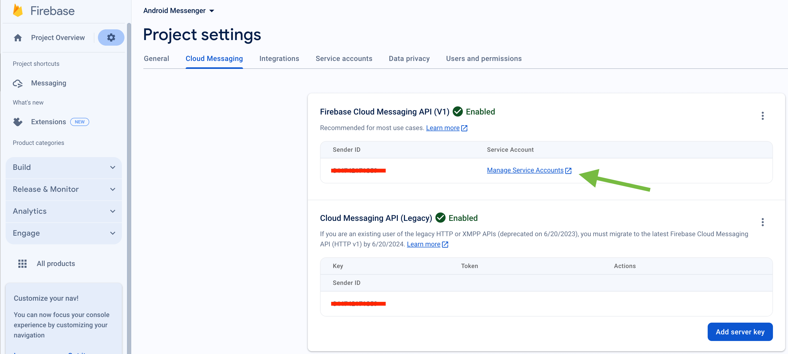

Push Notifications provide a way to deliver some information to users while they are not using your app actively.
The following use cases can be covered additionally with push notifications:

- send a chat message when a recipient is offline (a push notification will be initiated automatically in this case)
- make a video call with offline opponents (need to send a push notification manually)

## Configuration

In order to start work with push notifications you need to configure it.

There are various client-side libs for Cordova push notifications:

- [cordova-plugin-firebasex](https://github.com/dpa99c/cordova-plugin-firebasex)
- [cordova-plugin-firebase](https://github.com/arnesson/cordova-plugin-firebase)

This guide is based on **cordova-plugin-firebasex** lib.

First of all we need to install it. Just follow the [cordova-plugin-firebasex installation](https://github.com/dpa99c/cordova-plugin-firebasex#installation) guide in the lib's README.

Then make sure you followed [cordova-plugin-firebasex Firebase config setup](https://github.com/dpa99c/cordova-plugin-firebasex#firebase-config-setup)

Then follow the platform specific steps.

### iOS

1. First of all you need to generate Apple push certificate (*.p12 file) and upload it to ConnectyCube dashboard.
Here is a guide on how to create a certificate https://developers.connectycube.com/ios/how-to-create-apns-certificate

2. Upload Apple push certificate (*.p12 file) to ConnectyCube dashboard:

    - Open your ConnectyCube Dashboard at [admin.connectycube.com](https://admin.connectycube.com)
    - Go to **Push notifications** module, **Credentials** page
    - Upload the newly created APNS certificate on **Apple Push Notification Service (APNS)** form.
 
   

3. Lastly, open Xcode project of your Flutter app and enable Push Notifications capabilities. Open Xcode, 
  choose your project file, Signing & Capabilities tab and then add a Push Notifications capability. Also - tick a 
  'Remote notifications' checkbox in Background Modes section.

   

### Android

#### Configure Firebase project and Service account key (recommended)

In order to start working with push notifications functionality you need to configure it.

1. Create and configure your [Firebase project](https://console.firebase.google.com) and obtain the **Service account key**. If you have any difficulties with Firebase project registration, [follow our guide](/android/firebase-setup-guide).

   To find your **FCM service account key** go to your **Firebase console > Cloud Messaging > Manage Service Accounts** section:
   

2. Select and configure **Manage Keys** option:

   

3. Select **ADD KEY**, **Create new key**:

   

4. Select **Key type** (json recommended) and create:

   

5. Save it locally:

   

6. Browse your saved **FCM Service account key** in your **Dashboard > Your App > Push Notifications > Credentials**, select the environment for which you are adding the key. Use the same key for development and production zones.
   

7. Copy **Sender ID** value from your Firebase console **Cloud Messaging** section. You may require it later.

   

8. In order to use push notifications on Android, you need to create `google-services.json` file and copy it into project's `android/app` folder. Also, you need to update the `applicationId` in `android/app/build.gradle` to the one which is specified in `google-services.json`, so they must match. If you have no existing API project yet, the easiest way to go about in creating one is using this [step-by-step installation process](https://firebase.google.com/docs/android/setup)

#### Configure Firebase project and Server key (DEPRECATED)

1. Create and configure your [Firebase project](https://console.firebase.google.com) and obtain the **Server key**. If you have any difficulties with Firebase project registration, [follow our guide](/android/firebase-setup-guide).

   To find your **FCM server key** go to your **Firebase console > Cloud Messaging** section:
   

2. Copy your **FCM server key** to your **Dashboard > Your App > Push Notifications > Credentials**, select the environment for which you are adding the key and hit **Save key**. Use the same key for development and production zones.
   

3. Copy **Sender ID** value from your Firebase console **Cloud Messaging** section. You may require it later.

   

4. In order to use push notifications on Android, you need to create `google-services.json` file and copy it into project's `android/app` folder. Also, you need to update the `applicationId` in `android/app/build.gradle` to the one which is specified in `google-services.json`, so they must match. If you have no existing API project yet, the easiest way to go about in creating one is using this [step-by-step installation process](https://firebase.google.com/docs/android/setup)

## cordova-plugin-firebasex API

The list of available methods for the **cordova-plugin-firebasex** plugin is described here https://github.com/dpa99c/cordova-plugin-firebasex#api . It's useful to have a quick overview before further integration.

## Init cordova-plugin-firebasex lib

Next step is to initialize the **cordova-plugin-firebasex** lib.

The following code requests permissions for iOS and then does the initialization of main functions:

```javascript
document.addEventListener('deviceready', () => {
  if (typeof device !== 'undefined') {
    if (device.platform === 'iOS') {
      try {
        FirebasePlugin.grantPermission(hasPermission => {
          console.log("Permission was " + (hasPermission ? "granted" : "denied"));
        });

        firebaseSetup();
      } catch (e) {
        console.error("FirebasePlugin grantPermission error", e);
      }
    } else {
      firebaseSetup();
    }
  }
})

...

firebaseSetup() {
  const isOniOS = return typeof device !== "undefined" && !!device.platform && device.platform.toUpperCase() === "IOS";

  // We use FCM only for Android. For iOS - we use plain APNS
  if (!isOniOS) {
    FirebasePlugin.onTokenRefresh(fcmToken => {
      console.log(fcmToken);
    }, error => {
      console.error(error);
    });
  }

  // iOS device token
  FirebasePlugin.onApnsTokenReceived(apnsToken => {
    console.log(apnsToken);
  }, error => {
    console.error(error);
  });

  FirebasePlugin.onMessageReceived(message => {
    console.log(message);
  }, error => {
    console.error(error);
  });
}
```

## Subscribe to push notifications

In order to start receiving push notifications you need to subscribe your current device as follows:

```javascript
const isOniOS = return typeof device !== "undefined" && !!device.platform && device.platform.toUpperCase() === "IOS";

// We use FCM only for Android. For iOS - we use plain APNS
if (!isOniOS) {
  FirebasePlugin.onTokenRefresh(fcmToken => {
    if (token && token.trim().length > 0) {
      this.subscribeToPushNotification(fcmToken);
    }
  }, error => {
    console.error(error);
  });
}

// iOS device token
FirebasePlugin.onApnsTokenReceived(apnsToken => {
  if (token && token.trim().length > 0) {
    this.subscribeToPushNotification(apnsToken);
  }
}, error => {
  console.error(error);
});

...

subscribeToPushNotification(deviceToken) {
  const isOniOS = return typeof device !== "undefined" && !!device.platform && device.platform.toUpperCase() === "IOS";

  const platform = isOniOS ? "ios" : "android";

  // https://stackoverflow.com/questions/51585819/how-to-detect-environment-in-a-cordova-android-application
  let IS_DEV_ENV;
  cordova.plugins.IsDebug.getIsDebug(isDebug => {
    IS_DEV_ENV = isDebug;
  }, err => {
    console.error("cordova.plugins.IsDebug error", err);
  });

  const params = {
    // for iOS VoIP it should be 'apns_voip'
    notification_channel: isOniOS ? 'apns' : 'gcm',
    device: {
      platform: platform,
      udid: device.uuid
    },
    push_token: {
      environment: IS_DEV_ENV ? 'development' : 'production',
      client_identification_sequence: deviceToken,
      bundle_identifier: "com.your.app.package.id"
    }
  }

  ConnectyCube.pushnotifications.subscriptions.create(params)
    .then(result => {})
    .catch(error => {});
}
```

## Send push notifications

You can manually initiate a push notification to user/users on any event in your application. To do so you need to form a push notification parameters (payload) and set the push recipients:

```javascript
const payload = JSON.stringify({
  message: "Alice is calling you",
  ios_badge: 1,
  // ios_voip: 1
});

// https://stackoverflow.com/questions/51585819/how-to-detect-environment-in-a-cordova-android-application
let IS_DEV_ENV;
cordova.plugins.IsDebug.getIsDebug(
  (isDebug) => {
    IS_DEV_ENV = isDebug;
  },
  (err) => {
    console.error("cordova.plugins.IsDebug error", err);
  }
);

const pushParameters = {
  notification_type: "push",
  user: { ids: [21, 12] }, // recipients.
  environment: IS_DEV_ENV ? "development" : "production",
  message: ConnectyCube.pushnotifications.base64Encode(payload),
};

ConnectyCube.pushnotifications.events
  .create(pushParameters)
  .then((result) => {})
  .catch((error) => {});
```

Please refer [Universal Push Notifications standard parameters](/server/push_notifications#universal-push-notifications) section on how to form the payload.

## Receive push notifications

When any notification is opened or received the callback `onMessageReceived` is called passing an object with the notification data:

```javascript
FirebasePlugin.onMessageReceived(
  (message) => {
    console.dir(message);
  },
  (error) => {}
);
```

You can check more details about a `message` object fields https://github.com/dpa99c/cordova-plugin-firebasex#onmessagereceived

Here you can add an appropriate logic in your app. The things can be one of the following:

- If this is a chat message, once clicked on it - we can redirect a user to an appropriate chat by **dialog_id** data param
- Raise a local notification with an alternative info to show for a user

## Unsubscribe from push notifications

In order to unsubscribe and stop receiving push notifications you need to list your current subscriptions and then choose those to be deleted:

```javascript
FirebasePlugin.unregister();

const deleteSubscription = (subscriptions) => {
  let subscriptionIdToDelete;

  subscriptions.forEach((sbs) => {
    if (sbs.subscription.device.platform === "ios" && sbs.subscription.device.udid === device.uuid) {
      subscriptionIdToDelete = sbs.subscription.id;
    }
  });

  if (subscriptionIdToDelete) {
    ConnectyCube.pushnotifications.subscriptions.delete(subscriptionIdToDelete);
  }
};

ConnectyCube.pushnotifications.subscriptions
  .list()
  .then(deleteSubscription)
  .catch((error) => {});
```

## CallKit and VoIP push notifications

In a case you need to show a native calling interface on incoming call - you need to integrate a CallKit functionality via the following libs - [CordovaCall](https://github.com/WebsiteBeaver/CordovaCall) or [cordova-plugin-callkit](https://github.com/mattkhaw/cordova-plugin-callkit)

For iOS, this will also require to integrate VoIP push notifications along with it. A [cordova-ios-voip-push](https://github.com/Hitman666/cordova-ios-voip-push) can be used for it.

ConnectyCube supports iOS VoIP push notifications via same API described above:

- for VoIP pushes it requires to generate a separated VoIP device token.
- then when token is retrieved, you need to subscribe to voip pushes by passing a `notification_channel: apns_voip` channel in a subscription request
- then when you want to send a voip push notification, use `ios_voip: 1` parameter in a push payload in a create event request.

## CallKit and VoIP push notifications (Ionic)

The above flow is valid for Ionic. The following Ionic libs can be used for it:

- [ionic-plugin-callkit](https://github.com/Taracque/ionic-plugin-callkit) for CallKit
- [cordova-ios-voip-push](https://github.com/Hitman666/cordova-ios-voip-push) for VoIP push notifications
