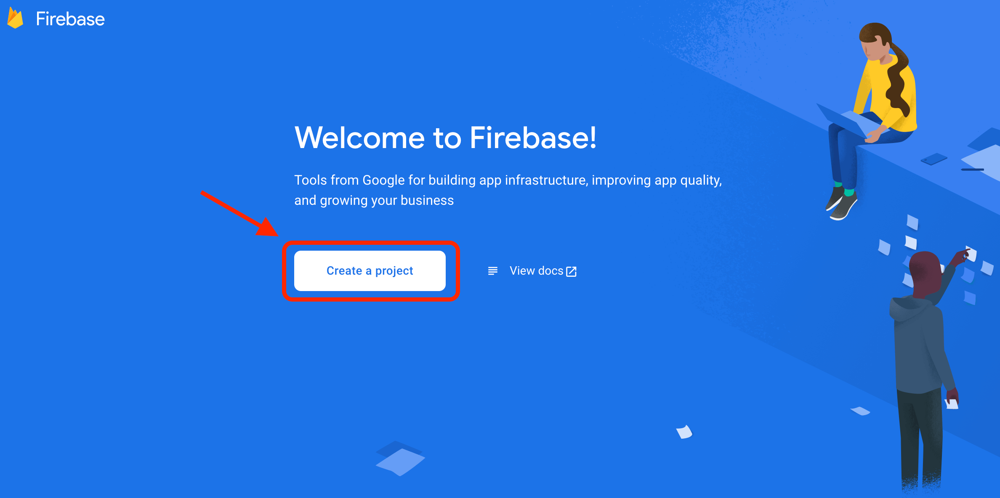
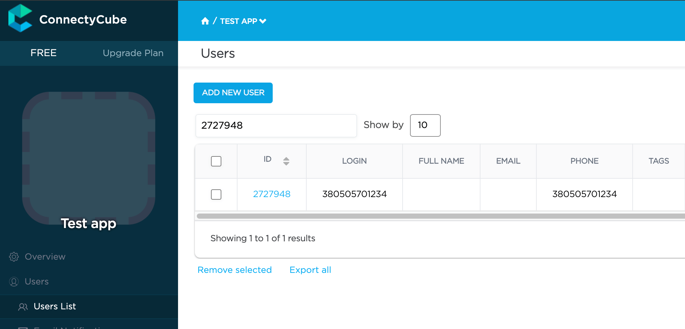

You might need to use Firebase for the following reasons:

1. Firebase authentication of users in your app via phone number.
2. Firebase Cloud Messaging (FCM) push notifications (former GCM).

It might look a bit scary at first. But don’t panic and let's check how to do this right step by
step.

## Firebase account and project registration

Follow these steps to register your Firebase account and create a Firebase project:

1. **Register a Firebase account** at [Firebase console](https://console.firebase.google.com/) .
   You can use your Google account to authenticate at Firebase.

2. Click **Create a project**

   

   > **Note**: If you have a Google project registered for your mobile app, select it from the **
   Project name** dropdown menu.

   You can also edit your **Project ID** if you need. A unique ID is assigned automatically to each
   project. This ID is used in publicly visible Firebase features. For example, it will be used in
   database URLs and in your Firebase Hosting subdomain. If you need to use a specific subdomain,
   you can change it.

3. Fill in the fields required (Project name, Project ID, etc.) and click **Continue**.

   

   

4. Configure Google Analytics for your project and click **Create project**.

   

   Then click Continue.

   

5. Select platform for which you need Firebase

   

## Connect Firebase SDK

The Firebase team has developed the convenient tool for integration the Firebase features to your
**Flutter** project. For using this tool just do few steps provided in the guide.

The main steps include:

* [Install the Firebase CLI](https://firebase.google.com/docs/cli?authuser=1&hl=en#install_the_firebase_cli)

You can install the Firebase CLI using a method that matches your operating system, experience
level, and/or use case. Regardless of how you install the CLI, you have access to the same
functionality and the `firebase` command.

[**`Windows`**](https://firebase.google.com/docs/cli?authuser=1&hl=en#install-cli-windows)      [**`macOS/Linux`**](https://firebase.google.com/docs/cli?authuser=1&hl=en#install-cli-mac-linux)

<br>

* [Log in the Firebase CLI](https://firebase.google.com/docs/cli?authuser=1&hl=en#sign-in-test-cli)

After installing the CLI, you must authenticate. Then you can confirm authentication by listing your
Firebase projects.

1) Log into Firebase using your Google account by running the following command:
```commandline
firebase login
```
This command connects your local machine to Firebase and grants you access to your Firebase
projects.

2) Install the FlutterFire CLI by running the following command from any directory:

```commandline
dart pub global activate flutterfire_cli
```

<br>

* [Configure your app to use Firebase](https://firebase.google.com/docs/flutter/setup?platform=ios#configure-firebase)

Use the FlutterFire CLI to configure your Flutter apps to connect to Firebase.

From your Flutter project directory, run the following command to start the app configuration
workflow:

```commandline
flutterfire configure
```

The `flutterfire configure` workflow does the following:

* Asks you to select the platforms (iOS, Android, Web) supported in your Flutter app. For each
  selected
  platform, the FlutterFire CLI creates a new Firebase app in your Firebase project.
  <br>
  <br>
  You can select either to use an existing Firebase project or to create a new Firebase project.
  If you already have apps registered in an existing Firebase project, the FlutterFire CLI will
  attempt to match them based on your current Flutter project configuration.

* Creates a Firebase configuration file (`firebase_options.dart`) and adds it to your `lib/`
  directory.

* (for Crashlytics or Performance Monitoring on Android) Adds the required product-specific Gradle
  plugins to your Flutter app.

> **Note**: After this initial running of `flutterfire configure`, you need to re-run the command any time
that you:
<br>&nbsp;&nbsp;&nbsp;&nbsp; - Start supporting a new platform in your Flutter app.
<br>&nbsp;&nbsp;&nbsp;&nbsp; - Start using a new Firebase service or product in your Flutter app,
especially if you start using sign-in with Google, Crashlytics, Performance Monitoring, or Realtime
Database.
<br>
<br>Re-running the command ensures that your Flutter app's Firebase configuration is up-to-date
and (for Android) automatically adds any required Gradle plugins to your app.

* [Initialize Firebase in your app](https://firebase.google.com/docs/flutter/setup?platform=ios#initialize-firebase)

1) From your Flutter project directory, run the following command to install the core plugin:

```commandline
flutter pub add firebase_core
```

2) From your Flutter project directory, run the following command to ensure that your Flutter app's
   Firebase configuration is up-to-date:

```commandline
flutterfire configure
```

3) In your `lib/main.dart` file, import the Firebase core plugin and the configuration file you
   generated earlier:

```dart
import 'package:firebase_core/firebase_core.dart';
import 'firebase_options.dart';
```

4) Also in your `lib/main.dart` file, initialize Firebase using the `DefaultFirebaseOptions` object
   exported by the configuration file:

```dart
await Firebase.initializeApp(options: DefaultFirebaseOptions.currentPlatform);
```

5) Rebuild your Flutter application:

```commandline
flutter run
```

## Firebase Phone authentication

This option allows users in your app authenticate themselves via phone number. If you use this
method for user authentication, the user receives an SMS with verification code and authenticates
via that code in your app.

You need to follow these steps to add Firebase authentication to your Flutter project:

1. Setup the Firebase console for using Phone auth per every supported platform your project support
   according [this guide](https://firebase.google.com/docs/auth/flutter/phone-auth#setup).

2. Install the [**Firebase UI Auth**](https://pub.dev/packages/firebase_ui_auth) plugin in your project using next command:
```commandline
flutter pub add firebase_ui_auth
```
3. Configure the routing of your project for opening needed screens according to the plugin logic:
```dart
MaterialApp(
  routes: {
    // ...other routes
    '/phone': (context) => PhoneInputScreen(
      actions: [
        SMSCodeRequestedAction((context, action, flowKey, phoneNumber) {
          Navigator.of(context).push(
            MaterialPageRoute(
              builder: (context) => SMSCodeInputScreen(
                flowKey: flowKey,
              ),
            ),
          );
        }),
      ]
    ),
  }
);
```

4. Add the action for listening the auth state changes and using it for the ConnectyCube API requests:
```dart
AuthStateChangeAction<SignedIn>(
  (context, state) {
    state.user?.getIdToken().then((idToken) {
      signInUsingFirebasePhone(
        DefaultFirebaseOptions.currentPlatform.projectId, 
        idToken
      ).then((cubeUser) {
        // the user was successfully signed in
        // start required logic (processing the user, opening screen with chats, etc.)
        Navigator.of(context).popUntil((route) {
          return route.isFirst;
        });
      });
    });
});
```
After it the rout will look similar to the next:
```dart
MaterialApp(
  routes: {
    // ...other routes
    '/phone': (context) => PhoneInputScreen(
      actions: [
        SMSCodeRequestedAction((context, action, flowKey, phoneNumber) {
          Navigator.of(context).push(
            MaterialPageRoute(
              builder: (context) => SMSCodeInputScreen(
                flowKey: flowKey,
                actions: [
                  AuthStateChangeAction<SignedIn>(
                    (context, state) {
                      state.user?.getIdToken().then((idToken) {
                        signInUsingFirebasePhone(
                          DefaultFirebaseOptions.currentPlatform.projectId, 
                          idToken
                        ).then((cubeUser) {
                          // the user was successfully signed in
                          // start required logic (processing the user, opening screen with chats, etc.)
                          // in our example we just go to the first screen
                          Navigator.of(context).popUntil((route) {
                            return route.isFirst;
                          });
                        });
                      });
                  })
                ],
              ),
            ),
          );
        }),
      ]
    ),
  }
);
```

5. Try running a test. Once your user is logged in successfully, you will find him/her in your 
**Dashboard >> Your App >> Users >> Users List** section.



> The simplest method for using the Firebase Phone Auth feature in your Flutter project was provided. 
It is available the manual user verification without using the [`firebase_ui_auth`](https://pub.dev/packages/firebase_ui_auth) plugin too. 
Use [this guide](https://firebase.google.com/docs/auth/flutter/phone-auth#usage) for manual implementation of the Firebase Phone Auth feature.


## Firebase E-mail authentication

This option allows users in your app authenticate themselves via **Firebase Email/Password** or **Firebase OAuth (Google Sign In)**.

The Firebase E-mail authentication setup flow is very similar to the [Firebase Phone authentication](./flutter/firebase-setup-guide#firebase-phone-authentication) but has 
its own features.

As this authentication type supports two auth providers 
[EmailAuthProvider](https://github.com/firebase/flutterfire/blob/master/packages/firebase_ui_auth/doc/providers/email.md#firebase-ui-email-auth-provider) and 
[GoogleProvider](https://github.com/firebase/flutterfire/blob/master/packages/firebase_ui_auth/doc/providers/oauth.md#google-sign-in) 
we will separate this guide on two sub-sections:

- [Firebase Email auth](./flutter/firebase-setup-guide#firebase-email-auth-provider);
- [Google Sign In](./flutter/firebase-setup-guide#google-sign-in);

### Firebase Email auth provider

The official FlutterFire [guide](https://github.com/firebase/flutterfire/blob/master/packages/firebase_ui_auth/doc/providers/email.md#firebase-ui-email-auth-provider) 
is detailed enough and we will just provide the main aspects of required configurations.

1. To support email as a provider, first ensure that the "Email/Password" provider is enabled in the [Firebase Console](https://console.firebase.google.com/project/_/authentication/providers):
   - In the Firebase console's **Authentication** section, open the [Sign in method](https://console.firebase.google.com/project/_/authentication/providers?_gl=1*9tft23*_ga*ODk2NjM0OTA4LjE2NzY0NjQ2MDM.*_ga_CW55HF8NVT*MTY5MTU3MjY2NC4zOS4xLjE2OTE1NzMwNzguMC4wLjA.) page;
   - From the **Sign in method** page, enable the **Email/password sign-in** method and click **Save**.


2. Install the [**Firebase UI Auth**](https://pub.dev/packages/firebase_ui_auth) plugin in your project using next command:
```commandline
flutter pub add firebase_ui_auth
```

3. Configure the routing of your project for opening the `SignInScreen` that contains the suggestion to input 
the e-mail and password of the Firebase user:
```dart
  MaterialApp(
    routes: {
      // ...other routes
      '/firebase-email': (context) => SignInScreen(
        providers: [EmailAuthProvider()],
      ),
    }
  );
```

4. Add the action(s) for listening the auth state changes and using it for the ConnectyCube API requests:
```dart
actions: [
    AuthStateChangeAction<SignedIn>((context, state) {
      state.user?.getIdToken().then((idToken) {
        if (idToken != null) {
          signInUsingFirebaseEmail(
            DefaultFirebaseOptions.currentPlatform.projectId,
            idToken)
          .then((cubeUser) {
            // user successfully authenticated on the Connectycube
          }).catchError((onError) {
            // error occurs during authentication on the Connectycube
          });
        }
      });
   }),
],
```

    After it the rout will look similar to the next:
```dart
  MaterialApp(
    routes: {
      // ...other routes
      '/firebase-email': (context) => SignInScreen(
        providers: [EmailAuthProvider()],
        actions: [
          AuthStateChangeAction<SignedIn>((context, state) {
            state.user?.getIdToken().then((idToken) {
              if (idToken != null) {
                signInUsingFirebaseEmail(
                  DefaultFirebaseOptions.currentPlatform.projectId,
                  idToken)
                .then((cubeUser) {
                  // user successfully authenticated on the Connectycube
                }).catchError((onError) {
                  // error occurs during authentication on the Connectycube
                });
              }
            });
          }),
        ],
      );,
    }
  );
```

Starting this point the app will show separated screen for authentication via Firebase Email provider.
After successful login to the Firebase the action `SignedIn` will be performed and the request to the 
Connectycube will run.

### Google Sign In

The configuration of the Firebase Google OAuth requires few veri simple steps:

1. Install the official [google_sign_in](https://pub.dev/packages/google_sign_in)
   plugin to your project as described in the README.

   > **Note**: you need go through configuration steps for each platform as described on
   the [README](https://pub.dev/packages/google_sign_in).

2. Enable the "Google" provider in the Firebase Console and configure it:
   - In the Firebase console's **Authentication** section, open
     the [Sign in method](https://console.firebase.google.com/project/_/authentication/providers?_gl=1*9tft23*_ga*ODk2NjM0OTA4LjE2NzY0NjQ2MDM.*_ga_CW55HF8NVT*MTY5MTU3MjY2NC4zOS4xLjE2OTE1NzMwNzguMC4wLjA.)
     page;
   - From the **Sign in method** page, enable the **Google** method and click **Save**.
   
   
   
   > To ensure cross-platform support, please ensure you have followed installation instructions for
   both the `google_sign_in` package and the provider on the Firebase Console (such as adding
   a [SHA1 fingerprint](https://developers.google.com/android/guides/client-auth?authuser=0) for
   Android applications).

3. Install the [firebase_ui_oauth_google](https://pub.dev/packages/firebase_ui_oauth_google) plugin:
   <br>
```commandline
flutter pub add firebase_ui_oauth_google
```

4. Copy and save the `clientId` property (which can be found in the Firebase Console):
   

Almost done. After these configurations your app is ready for requesting the Google data from user. 
The `firebase_ui_oauth_google` support few variants of requesting the data. We will use the `OAuthProviderButton` 
with the `GoogleProvider`:

```dart
AuthStateListener<OAuthController>(
  listener: (oldState, newState, controller) {
    if (newState is SignedIn) {
      newState.user?.getIdToken().then((idToken) {
        if (idToken != null) {
          signInUsingFirebaseEmail(
            DefaultFirebaseOptions.currentPlatform.projectId,
            idToken)
          .then((cubeUser) {
            // user successfully authenticated on the Connectycube
          }).catchError((onError) {
            // error occurs during authentication on the Connectycube
          });
        }
      });
    }
  },
  child: OAuthProviderButton(
    provider: GoogleProvider(
      clientId: ''), // set the `clientId` from the value copied in the p.4 of this guide
  ),
)
```
<br>
<br>
<br>

So now you know how to use Firebase features in your ConnectyCube apps. If you have any
difficulties - please let us know via [support channel](mailto:support@connectycube.com)
