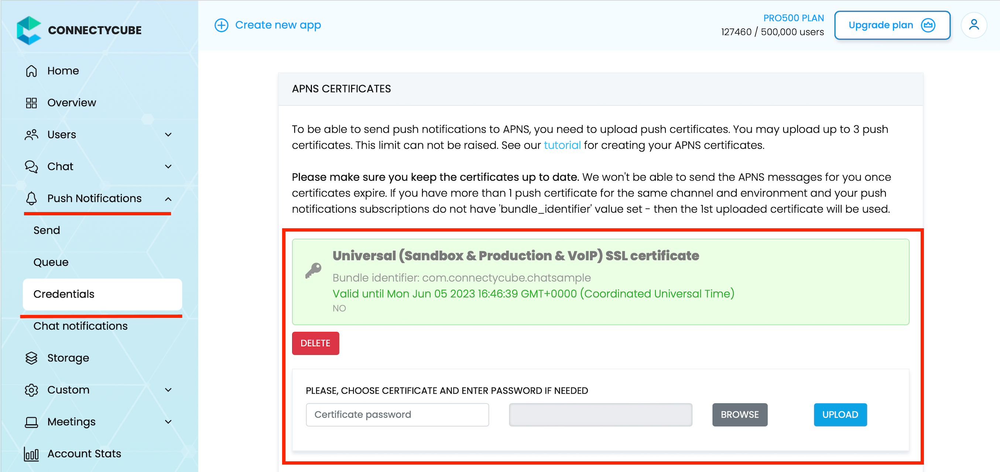
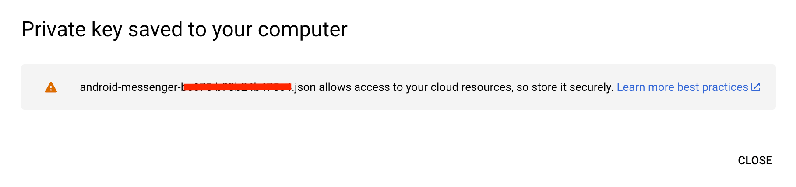

Push Notifications provide a way to deliver some information to users while they are not using your app actively.
The following use cases can be covered additionally with push notifications:

- send a chat message when a recipient is offline (a push notification will be initiated automatically in this case)
- make a video call with offline opponents (need to send a push notification manually)

## Configuration

In order to start work with push notifications you need to configure it for all required platforms.


### iOS and macOS

1. First of all you need to generate Apple push certificate (*.p12 file) and upload it to ConnectyCube dashboard.
Here is a guide on how to create a certificate https://developers.connectycube.com/ios/how-to-create-apns-certificate

2. Upload Apple push certificate (*.p12 file) to ConnectyCube dashboard:

    - Open your ConnectyCube Dashboard at [admin.connectycube.com](https://admin.connectycube.com)
    - Go to **Push notifications** module, **Credentials** page
    - Upload the newly created APNS certificate on **Apple Push Notification Service (APNS)** form.
 
   

3. Lastly, open Xcode project of your Flutter app and enable Push Notifications capabilities. Open Xcode, 
  choose your project file, Signing & Capabilities tab and then add a Push Notifications capability. Also - tick a 
  'Remote notifications' checkbox in Background Modes section.

   

### Android and Web

#### Configure Firebase project and Service account key (recommended)

In order to start working with push notifications functionality you need to configure it.

1. Create and configure your [Firebase project](https://console.firebase.google.com) and obtain the **Service account key**. If you have any difficulties with Firebase project registration, [follow our guide](/android/firebase-setup-guide).

   To find your **FCM service account key** go to your **Firebase console > Cloud Messaging > Manage Service Accounts** section:
   

2. Select and configure **Manage Keys** option:

   

3. Select **ADD KEY**, **Create new key**:

   

4. Select **Key type** (json recommended) and create:

   

5. Save it locally:

   

6. Browse your saved **FCM Service account key** in your **Dashboard > Your App > Push Notifications > Credentials**, select the environment for which you are adding the key. Use the same key for development and production zones.
   

7. Copy **Sender ID** value from your Firebase console **Cloud Messaging** section. You may require it later.

   

8. In order to use push notifications on Android, you need to create `google-services.json` file and copy it into project's `android/app` folder. Also, you need to update the `applicationId` in `android/app/build.gradle` to the one which is specified in `google-services.json`, so they must match. If you have no existing API project yet, the easiest way to go about in creating one is using this [step-by-step installation process](https://firebase.google.com/docs/android/setup)

#### Configure Firebase project and Server key (DEPRECATED)

1. Create and configure your [Firebase project](https://console.firebase.google.com) and obtain the **Server key**. If you have any difficulties with Firebase project registration, [follow our guide](/android/firebase-setup-guide).

   To find your **FCM server key** go to your **Firebase console > Cloud Messaging** section:
   

2. Copy your **FCM server key** to your **Dashboard > Your App > Push Notifications > Credentials**, select the environment for which you are adding the key and hit **Save key**. Use the same key for development and production zones.
   

3. Copy **Sender ID** value from your Firebase console **Cloud Messaging** section. You may require it later.

   

4. In order to use push notifications on Android, you need to create `google-services.json` file and copy it into project's `android/app` folder. Also, you need to update the `applicationId` in `android/app/build.gradle` to the one which is specified in `google-services.json`, so they must match. If you have no existing API project yet, the easiest way to go about in creating one is using this [step-by-step installation process](https://firebase.google.com/docs/android/setup)


### Config `firebase_messaging` plugin

> Note: Below provided the short guide for configuring the `firebase_messaging`. For more details and 
> specific platform configs please follow the [FlutterFire](https://firebase.flutter.dev/docs/overview) official documentation. 

There is [**firebase_messaging**](https://pub.dev/packages/firebase_messaging) plugin's official repo.

#### Add dependency
Add this to your package's `pubspec.yaml` file:
```yaml
dependencies:
    ...
    firebase_core: ^x.x.x
    firebase_messaging: ^x.x.x
    ...
```

#### Install it
You can install packages from the command line:
```bash
flutter pub get
```

#### Add classpath for goggle services plugin
Add classpath to your `build.gradle` file by path `android/build.gradle`

```groovy
buildscript {
    ...
    }

    dependencies {
        ...
        classpath 'com.google.gms:google-services:4.3.3'
    }
}
```

#### Apply Google Services plugin
Add at bottom of `android/app/build.gradle` next line:
```groovy
apply plugin: 'com.google.gms.google-services'
```

#### Add required files from Firebase development console
  * add `google-services.json` to Android project;
  * add `GoogleService-Info.plist` to iOS project;

#### Add imports 
```dart
import 'package:firebase_core/firebase_core.dart';
import 'package:firebase_messaging/firebase_messaging.dart';
```

#### Init and configure plugin in your app
```dart
...

void init() {
    Firebase.initializeApp();
    FirebaseMessaging firebaseMessaging = FirebaseMessaging.instance;

    // request permissions for showing notification in iOS
    firebaseMessaging.requestPermission(alert: true, badge: true, sound: true);

    // add listener for foreground push notifications
    FirebaseMessaging.onMessage.listen((remoteMessage) {
        log('[onMessage] message: $remoteMessage');
        showNotification(remoteMessage);
    });

    // set listener for push notifications, which will be received when app in background or killed
    FirebaseMessaging.onBackgroundMessage(onBackgroundMessage);
}
```

### Automatic config using FlutterFire CLI

There is alternative way for configuring the FCM in your Flutter project. 
It is the [FlutterFire CLI](https://firebase.flutter.dev/docs/cli/). Using this tool you can configure 
FCM in automatic mode. Just follow the guide on how to generate and use the configuration file.

## Subscribe to push notifications

In order to start receiving push notifications you need to subscribe your current device.
First of all you have to get `token`:
```dart
FirebaseMessaging firebaseMessaging = FirebaseMessaging.instance;
String token;
if (Platform.isAndroid || kIsWeb) {
    token = await firebaseMessaging.getToken();
} else if (Platform.isIOS || Platform.isMacOS) {
    token = await firebaseMessaging.getAPNSToken();
}

if (!isEmpty(token)) {
    subscribe(token);
}

firebaseMessaging.onTokenRefresh.listen((newToken) {
    subscribe(newToken);
});
```

Then you can subscribe for push notifications using `token`:

```dart
subscribe(String token) async {
    log('[subscribe] token: $token');

    bool isProduction = bool.fromEnvironment('dart.vm.product');

    CreateSubscriptionParameters parameters = CreateSubscriptionParameters();
    parameters.environment =
        isProduction ? CubeEnvironment.PRODUCTION : CubeEnvironment.DEVELOPMENT;

    if (Platform.isAndroid) {
      parameters.channel = NotificationsChannels.GCM;
      parameters.platform = CubePlatform.ANDROID;
      parameters.bundleIdentifier = "com.connectycube.flutter.chat_sample";
    } else if (Platform.isIOS) {
      parameters.channel = NotificationsChannels.APNS;
      parameters.platform = CubePlatform.IOS;
      parameters.bundleIdentifier = Platform.isIOS
          ? "com.connectycube.flutter.chatSample.app"
          : "com.connectycube.flutter.chatSample.macOS";
    }

    String deviceId = await DeviceId.getID;
    parameters.udid = deviceId;
    parameters.pushToken = token;

    createSubscription(parameters.getRequestParameters())
        .then((cubeSubscription) {})
        .catchError((error) {});
}
```

### FCM on the iOS/macOS

Alternatively, there is a way to use Firebase (FCM) push notifications on the iOS and macOS platforms.
While we **recommend use native Apple push notifications on iOS** (as described above), you may have a requirement to use (FCM) push notifications on iOS.

The configuration of the Flutter project is easy and you can do it in a few simple steps by following the 
official [FlutterFire documentation](https://firebase.flutter.dev/docs/messaging/overview#4-apple-integration). 
The main steps include:
 - [Configuring your app](https://firebase.flutter.dev/docs/messaging/apple-integration#configuring-your-app);
 - [Enable Push Notifications](https://firebase.flutter.dev/docs/messaging/apple-integration#enable-push-notifications)
(in the same way as for APNS); 
 - [Enable Background Modes](https://firebase.flutter.dev/docs/messaging/apple-integration#enable-background-modes-ios-only) 
(iOS only) (in the same way as for APNS);
 - [Linking APNs with FCM](https://firebase.flutter.dev/docs/messaging/apple-integration#linking-apns-with-fcm);

After that you can use the FCM push notifications on the iOS/macOS in the same way as the Android/Web.
It means that you should use the FCM configuration for making the subscription on the iOS/macOS, namely: 

```dart
CreateSubscriptionParameters parameters = CreateSubscriptionParameters();

if (Platform.isAndroid || kIsWeb) {
  parameters.channel = NotificationsChannels.GCM;
  parameters.platform = CubePlatform.ANDROID;
} else if (Platform.isIOS || Platform.isMacOS) {
  parameters.channel = NotificationsChannels.GCM;
  parameters.platform = CubePlatform.IOS;
}

FirebaseMessaging firebaseMessaging = FirebaseMessaging.instance;
var token = await firebaseMessaging.getToken();
parameters.pushToken = token;
// and other required parameters for subscription on the push notifications
```

## Send push notifications

You can manually initiate a push notification to user/users on any event in your application. To do so you need to form a push notification parameters (payload) and set the push recipients:

```dart
bool isProduction = bool.fromEnvironment('dart.vm.product');

CreateEventParams params = CreateEventParams();
params.parameters = {
  'message': "Some message in push", // 'message' field is required
  'custom_parameter1': "custom parameter value 1",
  'custom_parameter2': "custom parameter value 2",
  'ios_voip': 1 // to send VoIP push notification to iOS
  //more standard parameters you can found by link https://developers.connectycube.com/server/push_notifications#universal-push-notifications 
};

params.notificationType = NotificationType.PUSH;
params.environment = isProduction ? CubeEnvironment.PRODUCTION : CubeEnvironment.DEVELOPMENT;
params.usersIds = [88707, 88708];

createEvent(params.getEventForRequest())
  .then((cubeEvent) {})
  .catchError((error) {});
```

## Receive push notifications

Depending on a devices state, incoming messages are handled differently. They will be received in one of the registered callbacks which you set during initialisation plugin according to
[documentation](https://firebase.flutter.dev/docs/messaging/usage#handling-messages).

```dart
FirebaseMessaging.onMessage.listen((RemoteMessage message) {
    log('[onMessage] message: $message', TAG);
    showNotification(message);
});

FirebaseMessaging.onBackgroundMessage(onBackgroundMessage);

Future<void> onBackgroundMessage(RemoteMessage message) {
  log('[onBackgroundMessage] message: $message');
  showNotification(message);
  return Future.value();
}
```

Here you can add an appropriate logic in your app. The things can be one of the following:
- If this is a chat message, once clicked on it - we can redirect a user to an appropriate chat by **dialog_id** data param
- Raise a local notification https://pub.dev/packages/flutter_local_notifications with an alternative info to show for a user


## Unsubscribe

In order to unsubscribe and stop receiving push notifications you need to list your current subscriptions and then choose those to be deleted:

```dart
getSubscriptions()
  .then((subscriptionsList) {
    int subscriptionIdToDelete = subscriptionsList[0].id; // or other subscription's id
    return deleteSubscription(subscriptionIdToDelete);
  })
  .then((voidResult) {})
  .catchError((error) {});
```

## VoIP push notifications

ConnectyCube supports iOS VoIP push notifications via same API described above. The main use case
for iOS VoIP push notifications is to show a native calling interface on incoming call when an app
is in killed/background state - via CallKit.

The common flow of using VoIP push notifications is the following:

- for VoIP pushes it requires to generate a separated VoIP device token. The Flutter platform has a
  lot of plugins for getting the VoIP token from the system. There are:
    * [connectycube_flutter_call_kit](https://pub.dev/packages/connectycube_flutter_call_kit);
    * [firebase_messaging](https://pub.dev/packages/firebase_messaging);
    * [flutter_voip_push_notification](https://pub.dev/packages/flutter_voip_push_notification);
    * etc.

  We will use our own development [connectycube_flutter_call_kit](https://pub.dev/packages/connectycube_flutter_call_kit) in examples below.

  So, get the VoIP token:

  ```dart
  var token = await ConnectycubeFlutterCallKit.getToken();
  ```

- then when token is retrieved, you need to subscribe to voip pushes by passing
  a `notification_channel: apns_voip` channel in a subscription request:

  ```dart
  var token = await ConnectycubeFlutterCallKit.getToken();

  subscribe(String token) async {
      CreateSubscriptionParameters parameters = CreateSubscriptionParameters();
      parameters.pushToken = token;

      bool isProduction = kReleaseMode ? CubeEnvironment.PRODUCTION : CubeEnvironment.DEVELOPMENT;

      if (Platform.isIOS) {
        parameters.channel = NotificationsChannels.APNS_VOIP;
        parameters.platform = CubePlatform.IOS;
      }

      String? deviceId = await PlatformDeviceId.getDeviceId;
      parameters.udid = deviceId;

      var packageInfo = await PackageInfo.fromPlatform();
      parameters.bundleIdentifier = packageInfo.packageName;

      createSubscription(parameters.getRequestParameters())
          .then((cubeSubscriptions) {
        log('[subscribe] subscription SUCCESS', TAG);
      }).catchError((error) {
        log('[subscribe] subscription ERROR: $error', TAG);
      });
  }
  ```

- then when you want to send a voip push notification, use `ios_voip: 1` parameter in a push payload
  in a create event request:

  ```dart
  P2PSession callSession; // the call session created before 

  CreateEventParams params = CreateEventParams();
  params.parameters = {
    'message': "Incoming ${callSession.callType == CallType.VIDEO_CALL ? "Video" : "Audio"} call",
    'call_type': callSession.callType,
    'session_id': callSession.sessionId,
    'caller_id': callSession.callerId,
    'caller_name': callerName,
    'call_opponents': callSession.opponentsIds.join(','),
    'signal_type': 'startCall',
    'ios_voip': 1,
  };

  params.notificationType = NotificationType.PUSH;
  params.environment = kReleaseMode ? CubeEnvironment.PRODUCTION : CubeEnvironment.DEVELOPMENT;
  params.usersIds = callSession.opponentsIds.toList();

  createEvent(params.getEventForRequest()).then((cubeEvent) {
      // event was created
  }).catchError((error) {
      // something went wrong during event creation
  });
  ```
