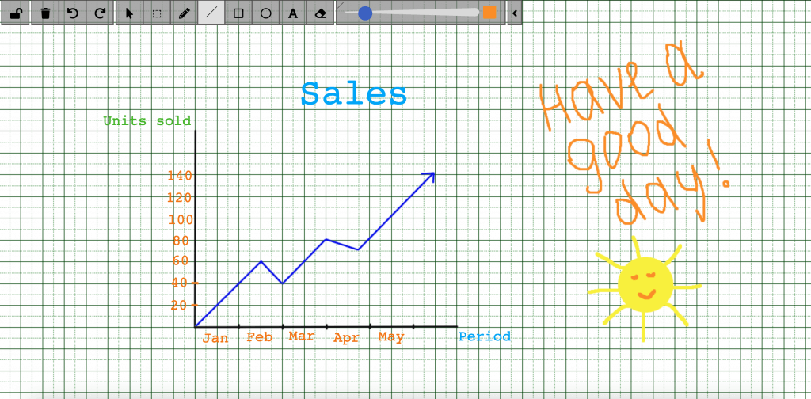

ConnectyCube **Whiteboard API** allows to create whiteboard functionality and associate it with a chat dialog.
Chat dialog’s users can collaborate and draw simultaneously on a whiteboard.

You can do freehand drawing with a number of tools, add shapes, lines, text and erase.
To share boards, you just get an easy link which you can email. Your whiteboard stays safe in the cloud until you’re ready to return to it.

   

The most popular use cases for using the whiteboard:

- Remote meetings
- Remote teaching
- Sales presentations
- Workflows
- Real-time collaboration

https://whiteboard.connectycube.com

## Get started with SDK

Follow the [Getting Started guide](/flutter/) on how to connect ConnectyCube SDK and start building your first app.

## Preparations

In order to start using whiteboard, an additional config has to be provided:

```dart
CubeSettings.instance.whiteboardUrl = 'https://whiteboard.connectycube.com';
```

Then, ConnectyCube whiteboard is associated with a chat dialog.
In order to create a whiteboard, you need to have a chat dialog. Refer to [chat dialog creation API](/flutter/messaging#create-new-dialog).

## Create whiteboard

When create a whiteboard you need to pass a name (any) and a chat dialog id to which whiteboard will be connected.

```dart
CubeWhiteboard whiteboard = CubeWhiteboard()
    ..name = "New Whiteboard"
    ..chatDialogId = "5356c64ab35c12bd3b108a41";

createWhiteboard(whiteboard)
    .then((createdWhiteboard) {
        var wid = createdWhiteboard.whiteboardId;
    })
    .catchError((onError) {});
```

Once a whiteboard is created - a user can display it in the app in a WebView using the URL from the following method `whiteboard.getUrlForUser(username)`.
For `username` any value can be provided but it should contain only Latin symbols. This is to display a text hint near the drawing arrow.

You can build URL by yourself, for it use next template `https://whiteboard.connectycube.com?whiteboardid=<whiteboard.whiteboardId>&username=<any_desired_username>&title=<whiteboard.name>`

## Retrieve whiteboards

Use the following code snippet to retrieve a list of whiteboards associated with a chat dialog:

```dart
var chatDialogId = "5356c64ab35c12bd3b108a41";

getWhiteboards(chatDialogId)
    .then((whiteboards) {})
    .catchError((onError) {});
```

## Update whiteboard

A whiteboard can be updated, e.g. its name:

```dart
var whiteboardId = "5456c64ab35c17bd3b108a76";
var updatedName = 'Updated Name';

updateWhiteboard(whiteboardId, updatedName)
    .then((updatedWhiteboard) {})
    .catchError((onError) {});
```

## Delete whiteboard

```dart
var whiteboardId = "5456c64ab35c17bd3b108a76";;

deleteWhiteboard(whiteboardId)
    .then((voidResult) {})
    .catchError((onError) {});
```
