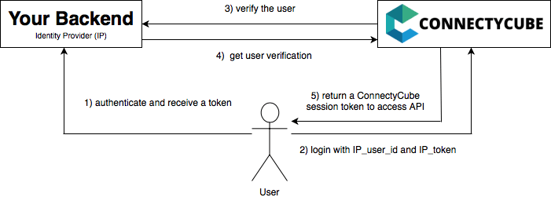
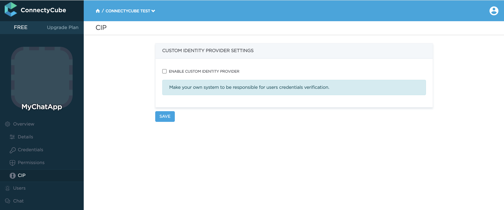
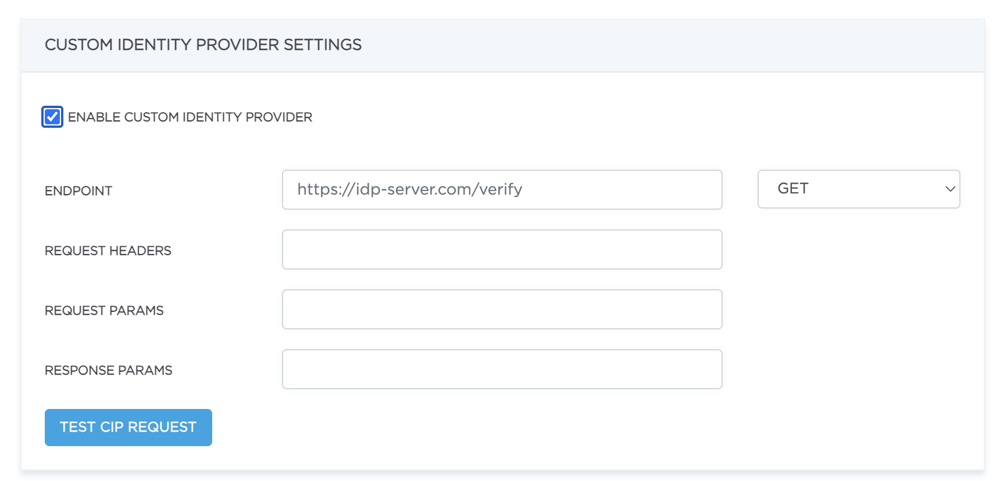

**Custom Identity Provider (CIdP)** feature is necessary if you have your own user database and want to authenticate users in ConnectyCube against it. It works the same way as Facebook/Twitter SSO.

With Custom Identity Provider feature you can continue use your user database instead of storing/copying user data to ConnectyCube database.

## Login flow diagram



Here are explanations to the diagram:

1. A user logins in your Backend and receives a token.

2. The user logins to ConnectyCube with data received from your Backend:

   ```
   POST https://api.connectycube.com/login
   login=<IP-user-token>
   password=<any-random-value-to-pass-the-validation>
   ```

3. ConnectyCube backend sends a request to your Backend to verify the user:

   ```
   GET https://yourserver.co/user/verify?token={token}
   ```

   **Note**: This URL has to be configured in your ConnectyCube Dashboard (check the instructions below).

4. Get user verification confirmation from your Backend. If ConnectyCube server gets successful verification, a ConnectyCube User entity will be created (during first login) and ConnectyCube session token will be returned to access API.

6. Next step is login to Chat. Use **user_id** and ConnectyCube session token retrieved at the previous stage instead of password to log in to Chat.


## Setup mapping

In order to use Custom Identity Provider feature you need to configure it in your ConnectyCube Dashboard as follows:

1. Go to your **Dashboard > Your App > Overview > CIP** page and enable **Custom Identity Provider** feature:

   

2. In the fields that appear **configure your API URL to verify user and parameters mapping settings** and click **Update** button:

   

### Example of mapping

Let's assume your API URL to verify users looks like following:

```
GET https://yourserver.co/user/verify?token={token}
```

And it returns the following JSON response in case of successful verification:

```json
{"user": {"id": 2345, "login": "simon371", "fill_name": "Simon Davis"}}
```

In this case you need to set the following mapping parameters in ConnectyCube Dashboard:

* **API URL**: https://yourserver.co/user/verify
* **Request params**:

   ```
   {"token": "#{login}"}
   ```

* **Response params**:

   ```
   {"uid": "#{user.id}"}
   ```

After that you can login  to ConnectyCube with the following login method:

```
POST https://api.connectycube.com/login

Params:
login=<your_external_user_token>
```

The **login** parameter will be translated into **token** parameter then.

## Starter Kit

There is a starter kit project to develop Custom identity provider service for ConnectyCube:

https://github.com/ConnectyCube/custom-idp-starter-kit

## Have any issues?

Raise an issue https://github.com/ConnectyCube/custom-idp-starter-kit/issues
