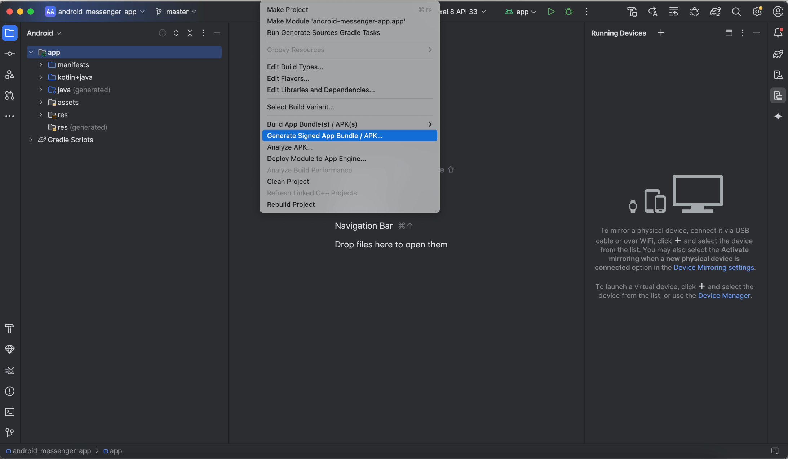
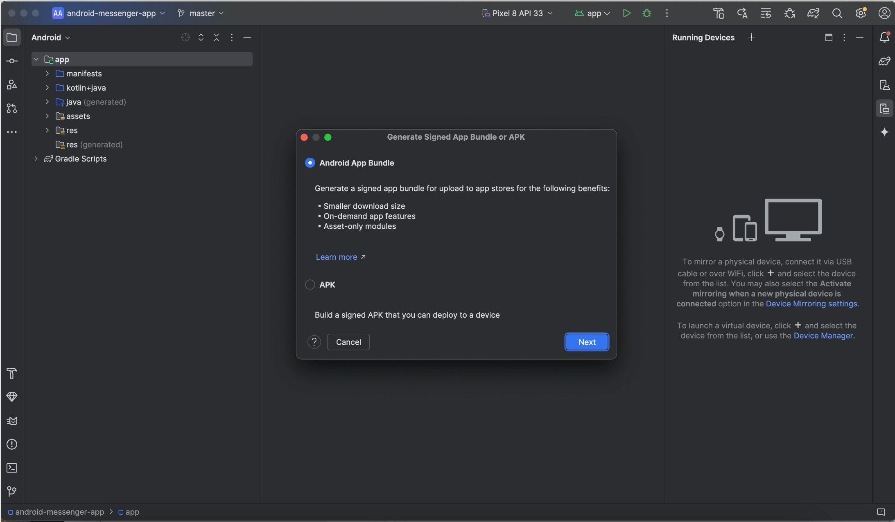
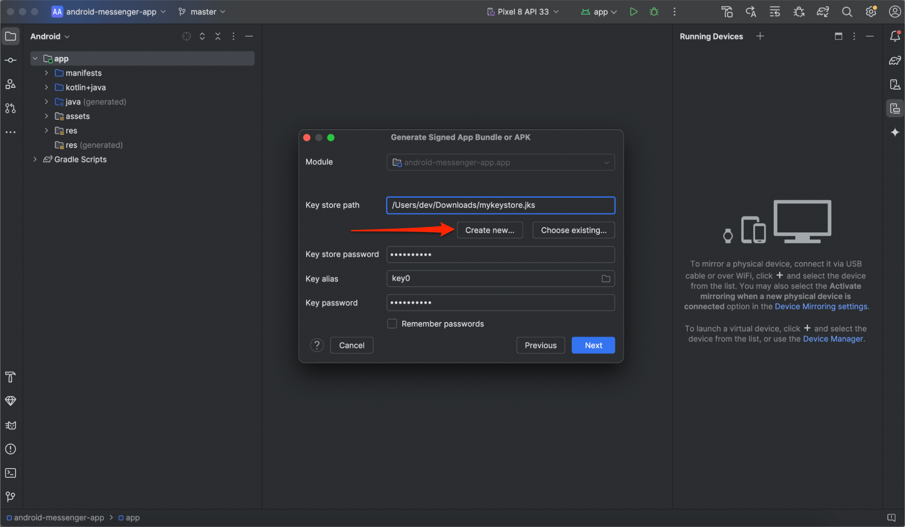
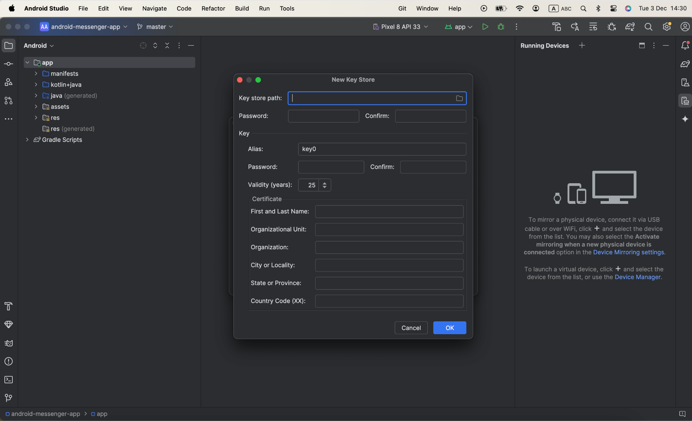
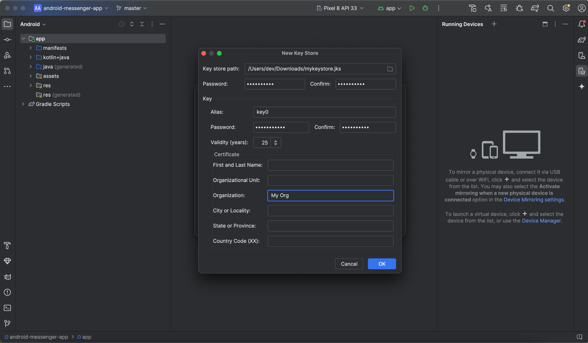
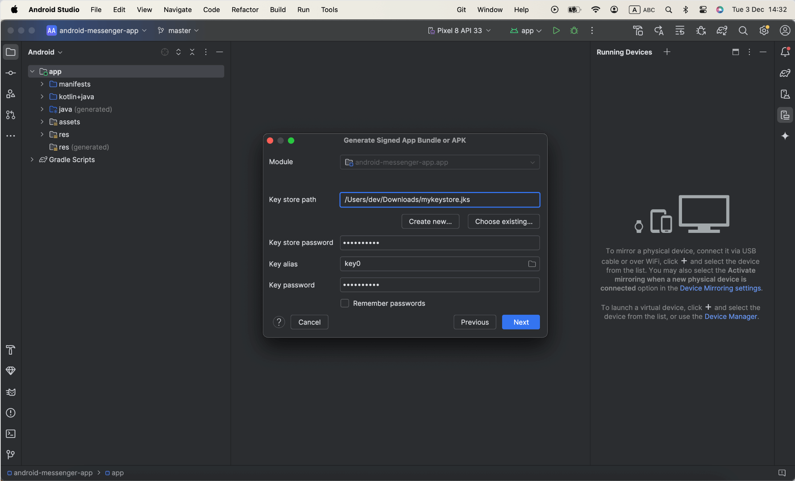
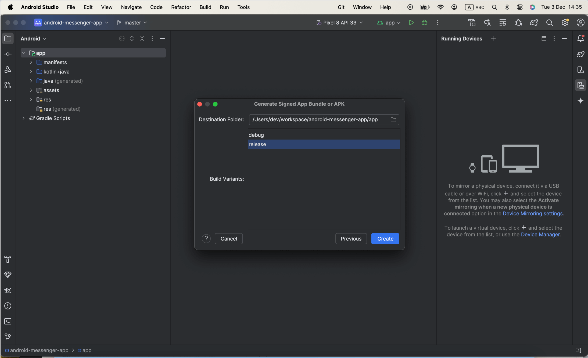
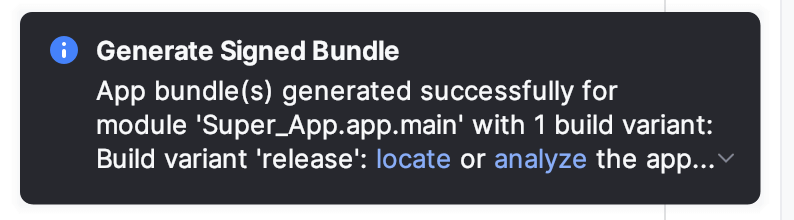

Before publishing your app on the Google Play Store, it needs to be signed with a unique cryptographic key. Think of this as a "digital signature" that proves the app's authenticity and guarantees that the app hasn't been tampered with. The signing configuration links your app to this key, ensuring that future updates can be trusted and securely delivered to your users.

This guide walks you through the process step by step. It consists of 2 steps only: 
* generate signing key.
* sign your app with the generated key.

## Before we start: why we use AAB instead of APK

Before diving into the steps, it's important to understand why we work with **Android App Bundles (AAB)** instead of the traditional **APK** format.

Starting August 2021, Google Play started requiring new apps to be published with the Android App Bundle. An **Android App Bundle** is a publishing format that includes all your app's compiled code and resources, and defers APK generation and signing to Google Play.

AABs are a better way of organizing app files and resources. Furthermore, developers would still need an APK build to test an Android app before it goes live.

As the guide describes signing the app to be published on Google Play, AAB file type is chosen in the steps.

## Step 1: Generate an upload key and keystore

To generate an upload key, go to Android Studio and follow the steps below:

1. **Menu** bar -> **Build** section-> choose **Generate Signed App Bundle / APK**:

    

2. In the dialog that appears, select **Android App Bundle (AAB)** and click **Next**:

    

3. Below the field for **Key store path**, click **Create new**:

    

    After this step the **New Key Store** window is opened:

    

4. Fill out the required details in the **New Key Store** window:
    1. **Key store**:
        1. **Key store path**: choose a location for the keystore file and add a file name with the _.jks_ extension.
        2. **Password**: create and confirm a secure password for your keystore.
    2. **Key**:
        1. **Alias&#42;**: enter a unique name to identify your key.
        2. **Password&#42;**: set and confirm a password for your key (ideally the same as your keystore password).
        3. **Validity (years)&#42;**: specify how long the key will remain valid. The key should be valid for at least **25 years** to ensure app updates can be signed throughout its lifespan.
        4. **Certificate Information** (optional): provide your details (e.g., name, organization). This information is included in your certificate but won’t appear in your app.

        _// &#42; - required fields_

        

5. After completing the form, click **OK**.

On this stage the **‘Generate Signed App Bundle or APK’** window is opened. It means, you’ve now created an upload key and are ready to use it to sign your application. 

Leave the **Generate Signed Bundle** dialog opened, you will start to sign the application from this dialog in the **Step 2** below.

## Step 2: Signing app with the generated key

Follow these steps to sign your app:
1. Select a **module** from the drop down.
    > if you have the only module available for your project, it will be chosen by default and disabled in the field.
2. **Key store details** are filled automatically with the data from the previous step: **path**, **alias** and the **passwords** for both the key store and the key.
3. Click **Next** to open next dialog under **‘Generate Signed App Bundle or APK’** window with a build options:

    

4. **Choose build options**:
    1. Select a **destination folder** for the signed app.
    2. Choose the **release build type** (‘debug' is also available to be selected).
5. Click **Create**.

    

Once the build is complete, a pop-up notification will appear. Use the options in the notification to either **locate** or **analyze** your app:

* **locate** -> this option opens the folder where your signed app file is saved. It allows you to quickly find the file on your computer for uploading to a distribution platform or sharing it.
* **analyze** -> shows the bundle stats.

    

So, now the app is ready to be uploaded to Google Play Store, this is probably one of the major steps to complete before going to the Developer’s console and proceed with the file uploading together with the app submission.

Continue with the [How to upload app to the Google Play Store: Step-by-step guide](/guides/uploading-android-app-to-store) to go through the next steps of app submission and avoid any excess information of the process and to be concentrated only of the important things to do.

## Conclusion

Now that you’ve learned how to sign your Android app, why not take your app development to the next level? Simplify your app development process by using **ConnectyCube** - a platform that provides a ready-to-use backend for chat, video calls, push notifications, and more.

With a **free ConnectyCube account**, you can kickstart your app journey faster and focus on delivering features to your users.

Take the first step towards app development - [join ConnectyCube now and get started for free!](https://connectycube.com/signup/) Let ConnectyCube handle the backend for you!
