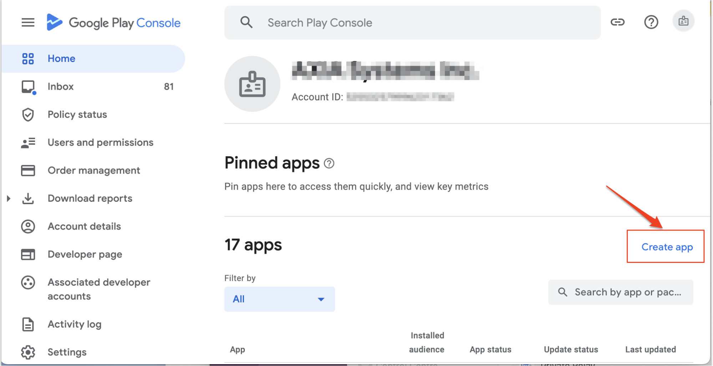
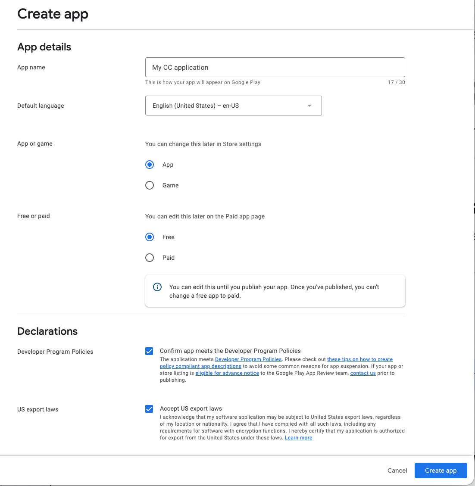
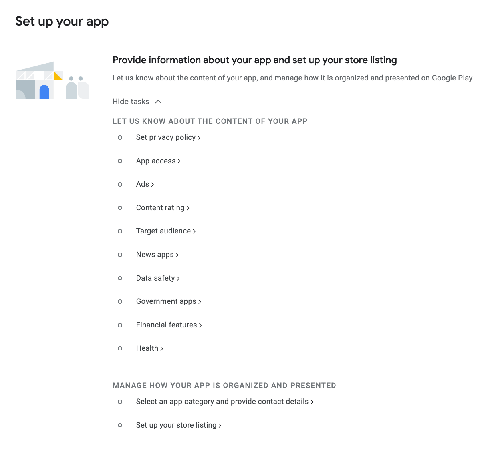
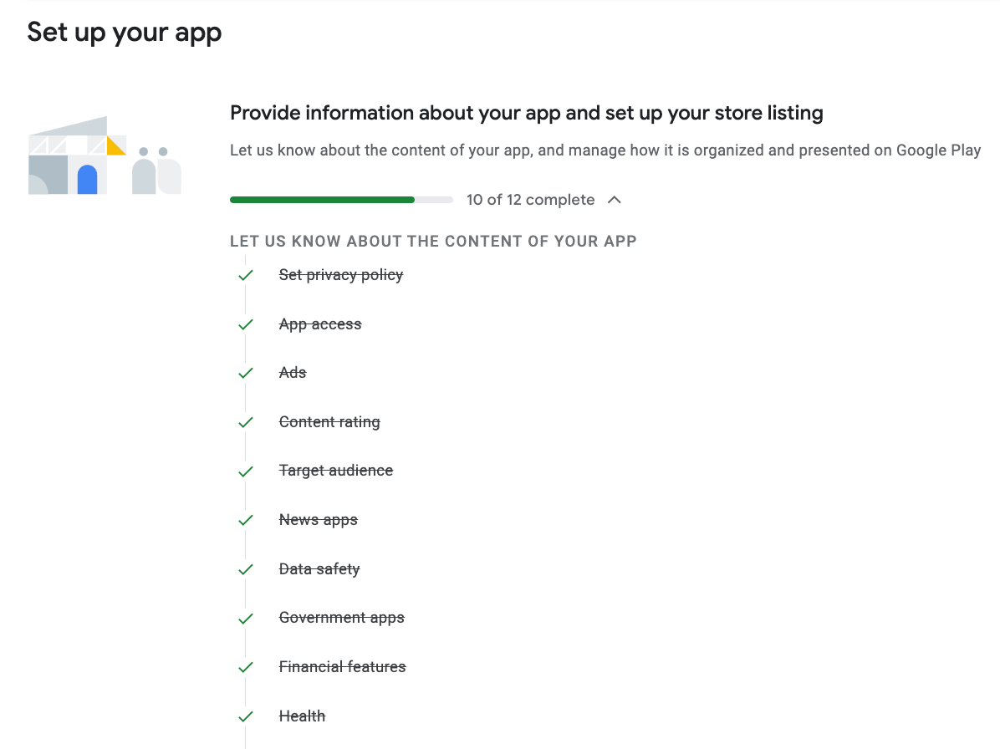
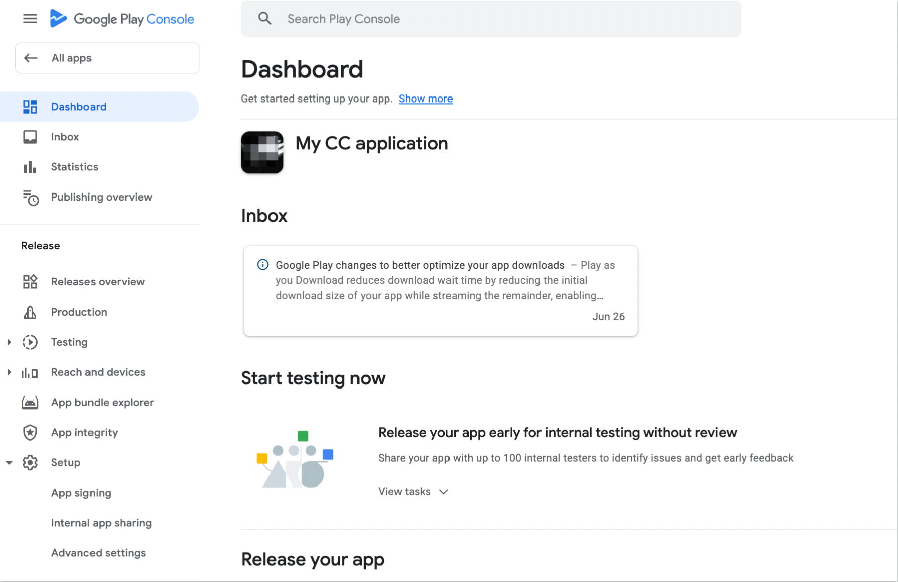
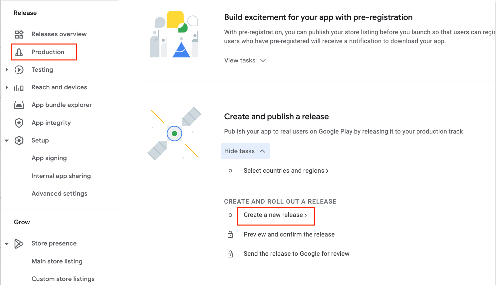
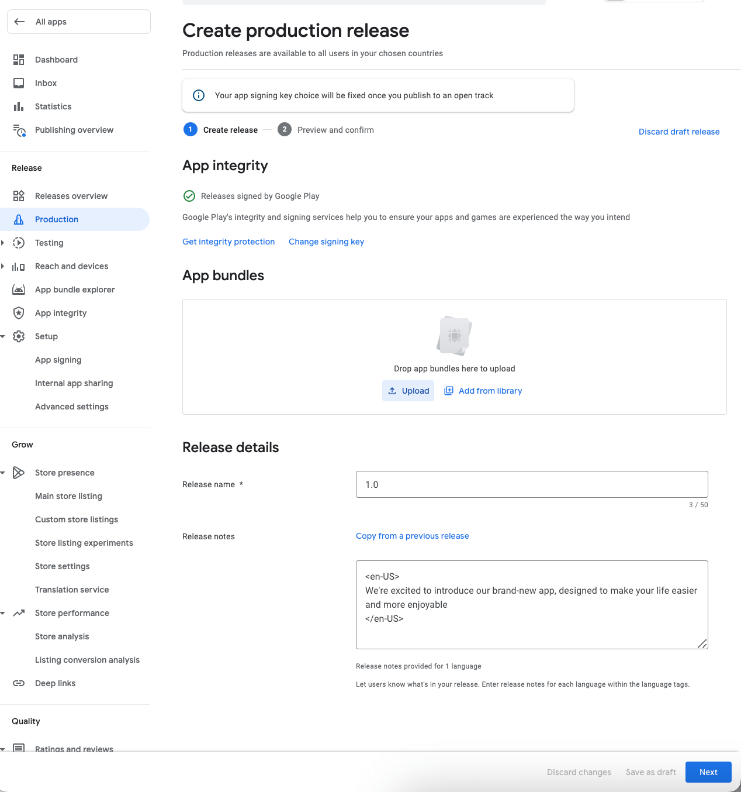
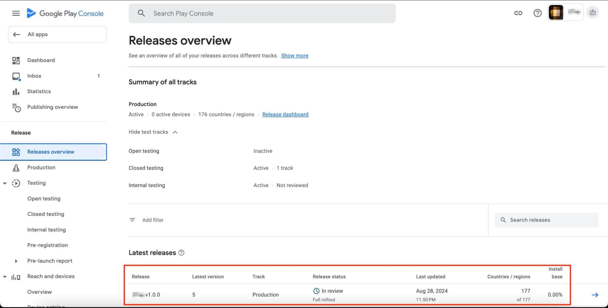

Releasing an app on the Google Play Store is essential for Android developers looking to connect with millions of users globally. The process includes several important stages, from getting your app ready and creating a developer account to submitting the app for approval. In this guide, we’ll guide you through each step to help ensure your app gets published smoothly.

The process of submitting application to the Google Play Store itself isn’t difficult and consists of **5 main steps**:

&nbsp;&nbsp;&nbsp;&nbsp;**Step 1:** Sign the release version of your application

&nbsp;&nbsp;&nbsp;&nbsp;**Step 2:** Create an application in Google Developers account

&nbsp;&nbsp;&nbsp;&nbsp;**Step 3:** Provide information about the app and set up app listing 

&nbsp;&nbsp;&nbsp;&nbsp;**Step 4:** Upload AAB file 

&nbsp;&nbsp;&nbsp;&nbsp;**Step 5:** Review and rollout

Each step doesn’t take much time except for work on the application you will create the AAB file for.

## Step 1: Sign the release version of your application

All Android apps must be digitally signed with a certificate before they can be installed. To distribute your Android app through the Google Play Store, it must be signed with a **release key**, which should be used for all future updates. Additionally, before uploading your AAB to Google Play, it needs to be signed with an **upload key**.  
When publishing your app to Google Play for the first time, you must also configure **Play App Signing.**

To configure signing for an app that has not yet been published to Google Play, proceed with **generating an upload key** and **signing your app with that upload key**.

The [Signing Your Applications](/guides/sign-app-for-release-to-google-store) page describes the topic in detail.

## Step 2: Create an application in Google Developers account

Creating the application in Google Play is the first major step that initiates the publishing procedure itself. It means, the app will be existing in Google Play as a record and will be waiting for the AAB file to be uploaded. Better to say, it is a “shell” of your application that will be fulfilled with the build and all necessary information later.

For creating an application, do the following:

* log in to the [Google Play Console](https://play.google.com/console/).
If you are new here \- [sign up for a Play console developer account](https://play.google.com/apps/publish/signup), the one-time fee for the registration is $25 

* On the **Home** page click **"Create app"**

    

* Enter the app name, select the default language, choose whether it's an app or game, if the app is free or paid.

* Make sure that your app complies with Google’s Developer Program policies and adheres to US export laws. Once you've reviewed and agreed to the terms and conditions, click **"Create App"** button

     

By clicking on the **"Create app"** button, the application is now created and the application dashboard is opened for the newly created application. The Dashboard shows you what you need to do to get your app up and running. This includes recommendations on how to manage, test, and promote your app.

## Step 3: Add information about the application

On the Dashboard expand the "Provide information about your app and set up your store listing" section with the points to fill to complete the application information. This is the section that blocks adding the info in other sections when empty. First, you need to provide the information for the app and only after \- proceed with other options available.   
Follow all the questionnaires to provide the full information about the application content, all points are required. 

When completed all the questions, your listing should look like this:

Next \- Manage how your app is organised and presented: 

- **Prepare store listing** 

  - choose the appropriate category and add tags.

  - provide an email address, website, and phone number for users to contact you.

  - title and description, 

  - upload screenshots, a high-res icon and a feature graphic.

- **Set up app content**

  - content rating, 

  - privacy policy and 

  - target audience

- **Set up pricing and distribution**

When all the fields are completed correctly, app becomes available on the top of the page.

## Step 4: Upload build \- AAB

Section to upload the build can be opened from the left side menu by selecting "Production" section OR from the Dashboard \-\> Create and publish a release 

Here you need to:

1. Click on the **"Create a new release"** button.  
   If this is your first release for this app, follow the instructions to [configure Play App Signing](https://support.google.com/googleplay/android-developer/answer/9842756).  
2. Upload your AAB file.  
   **Note:** since August 2021 APKs have already been phased out for the most part and it is only able to submit new apps to Google Play as AABs.  
3. Provide a **release name** and add **release notes** for users.  
4. To save any changes you make to your release, select **Save as draft**.  
5. When you've finished preparing your release, select **Next**.

   

## Step 5: Review and rollout

Verify that all the information is correct, then click "**Review**" to check the app for issues and warnings. 

1. Open Play Console and go to the [Releases Overview](https://play.google.com/console/developers/app/releases/overview) page.  
2. Open the **Release details** for the release to roll out  
3. In the “**Release overview**” section, select **View release dashboard**.  
4. Select the **Releases** tab, then **Edit**.  
5. Review your draft release, make any necessary additional changes, and select **Next**.   
   \- You'll be taken to the "**Preview and confirm**" screen, where you can make sure there aren't any issues with your release before rolling it out to users.  
   \- If you see the heading “**Errors summary**” at the top of the page, click **Show more** to review the details and resolve any problems. 

   **Note:** You can’t publish your app until errors have been resolved. If you only have warnings, minor issues, or a combination of the two, then you can still publish your app

6. Select **Start rollout**.  
   If you're rolling out your app's first release on production, clicking **Start rollout to production** will also publish your app to all Google Play users in the countries you selected.

Once you've created a release, you'll see the following information for the latest app release you rolled out to each track in a table under “**Latest releases**” on your **Releases overview** page.

After submitting, Google will review your app, which may take a few hours to a few days. You will be notified via email once your app is live on the Play Store.

## Conclusion

Uploading and submitting an app to the Google Play Store may seem complex, but by following these step-by-step instructions, you can navigate the process with confidence. From setting up a Google Developer account to preparing your app for release and configuring your store listing, each step plays a vital role in ensuring your app reaches a global audience. Remember to thoroughly test your app, comply with all of Google's guidelines, and provide accurate and engaging information in your store listing.

Once your app is published, monitor its performance through the Google Play Console and continue to update and improve it based on user feedback. With careful preparation and attention to detail, you can successfully launch your app and start building a strong presence on the Google Play Store.
