Uploading the iOS application to AppStore might seem challenging for the first time, especially for people who never did that before. With a step-by-step guide and detailed instruction this process can be quite easy and clear to successfully release the first application. 

Before you start, make sure you have the following things ready for the further work:
1. Apple Developer Program Membership is active
    * If you are new, visit <a href="https://developer.apple.com/programs/enroll/" target="_blank">https://developer.apple.com/programs/enroll/</a> to enroll in the Apple developer program.    
    __Price:__ The Apple Developer Program is $99 USD per membership year
2. iOS certificates for publishing to the App Store are created:
    * __Bundle ID__ - The Bundle ID is used to identify the app.
    * __Provisioning profile__ - The provisioning profile saves the configuration of the apps for different devices and must be used together with the distribution certificate and bundle ID to sign the app.
    * __iOS Distribution Certificate__ - Apple requires the app to be signed with a valid iOS distribution certificate. You can sign all your apps with a single certificate.
    * __Push Notification Certificate__ - To configure the Push notifications, you will use the tool One Signal. This requests a certificate from Apple to identify the app to send the notifications to. This certificate will be created on the Apple Developer Program.
    
The process of submitting application to the Apple App Store consists of **5 main steps**:

&nbsp;&nbsp;&nbsp;&nbsp;**Step 1:** Create an App Store Connect record for the application  
&nbsp;&nbsp;&nbsp;&nbsp;**Step 2:** Configure application using Xcode  
&nbsp;&nbsp;&nbsp;&nbsp;**Step 3:** Archive and upload application to App Store Connect  
&nbsp;&nbsp;&nbsp;&nbsp;**Step 4:** Configure application's metadata and further details in its App Store Connect record  
&nbsp;&nbsp;&nbsp;&nbsp;**Step 5:** Submit application for review

## Step 1: create an App Store Connect record for the application

Creating the record in App store Connect is the first major step that initiates the publishing procedure itself. It means, the app will be existing in the App store as a record and will be waiting for the build from the Xcode to be uploaded. Better to say, it is a “shell” of your application that will be fulfilled with the build and all necessary information later.

To create a record for the application in the App Store Connect:
1. **Log in** to App Store connect:  
go to App Store Connect and log in with your Apple ID. Available sections become available right after login:

    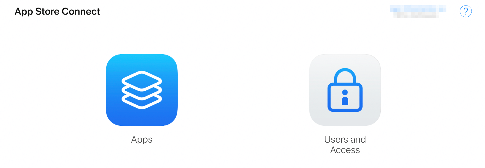

2. Create a __New App__:
    * Click on __"Apps"__
    * Click on the __"+"__ button and select __"New App"__.  

    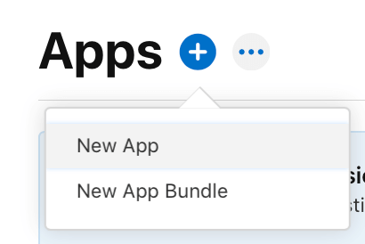

    * Fill in the required information. All fields are mandatory, you can't change these details later, so be sure of what you enter:
	    * __platform__ - the platform where your application operates;
	    * __app name__ - the name of the application that will be displayed on the App Store;
	    * __primary language__ - the language of the application;
	    * __bundle ID__ - the unique identifier for your app on the App Store. This should match the one created when setting up iOS certificates and provisioning profiles.
	    * __SKU__ - the unique identifier for your app that isn't visible to users. It should match the Bundle ID and can include letters, numbers, hyphens, periods, and underscores, starting with a letter or number
        * __user access__ - set it if applicable.

        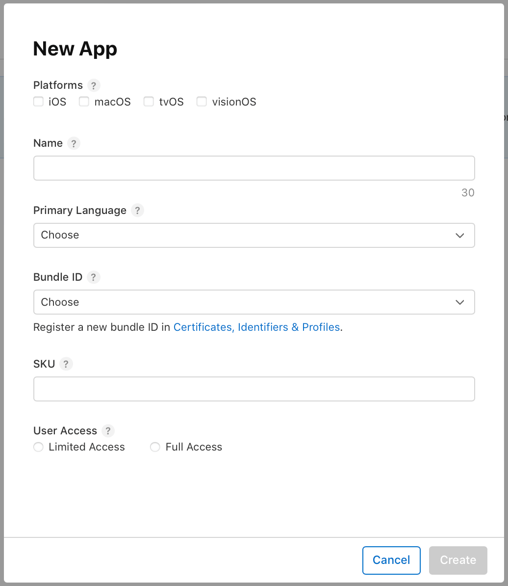

	    __'Create'__ button becomes active when all the fields on the form are filled. Once the new application name and information from the forms are verified, the application is created and the window to input the distribution information for the created application is shown.

        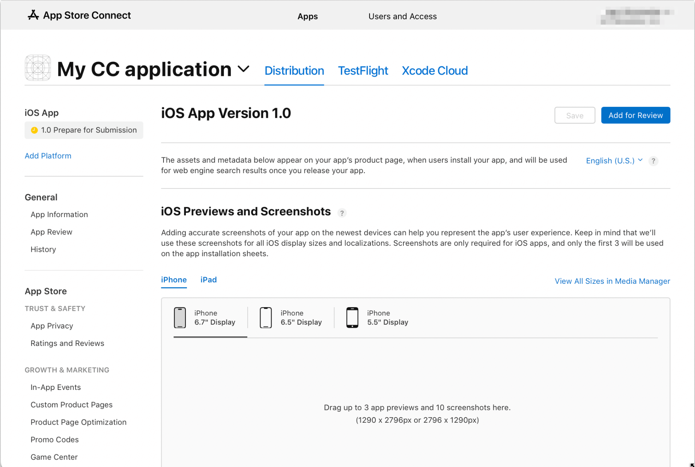

	    __Note:__ adding required information to submit application to App store is covered below in 'Configure application's information in App Store Connect' section

## Step 2: Configure application in Xcode

When the record for the application is ready in the App Store Connect, the build needs to be uploaded from the Xcode to the created record, so the application will be considered as an application ready to be submitted. 

For that, launch the Xcode and do the following:
* In Xcode, select your project in the __Project Navigator__.
* Select the __target__ and then go to the __General__ tab.
* Update the __version__ and __build numbers__.
* Set the __deployment target__: ensure that the deployment target is set to the appropriate iOS version.

    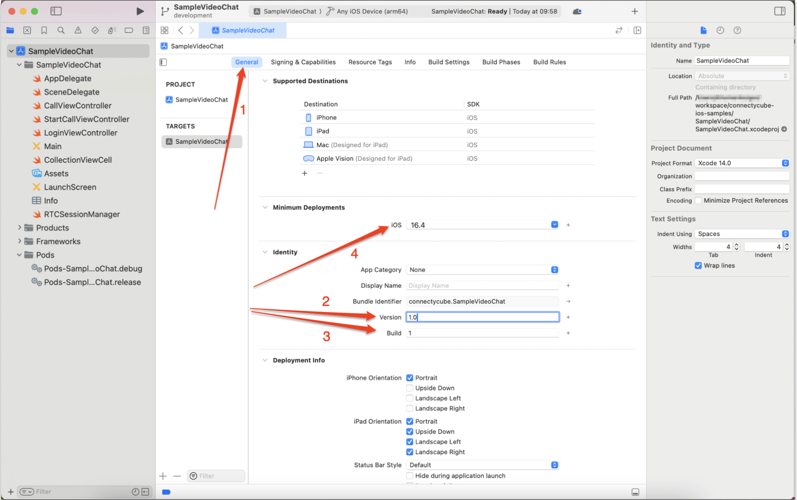

Once the Version and Build Number are set, proceed with code signing:
* Go to the __Signing & Capabilities__ tab.
* Ensure that __"Automatically manage signing"__ is checked.
* Select your __Apple Developer account__.

    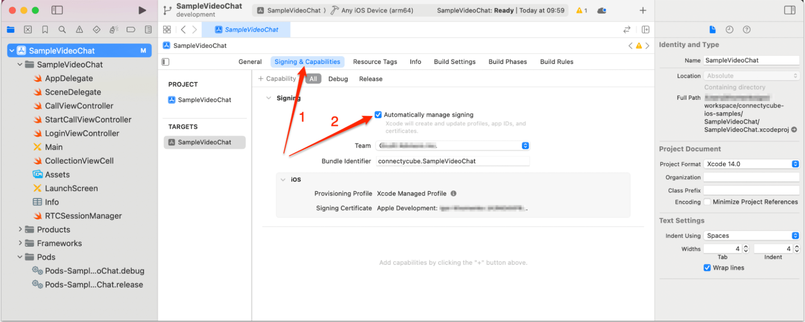

## Step 3: Archive and upload application using Xcode

In Xcode, an archive of your app is a packaged version that includes everything needed to distribute the app, such as the compiled code, resources, and debugging information. It's more than just a simple build, it’s a complete snapshot of your app in a state that’s ready for distribution.

You need an archive for submitting your app to the App Store because it ensures that your app is in the correct format, with all the necessary metadata and resources bundled together. The archive also allows Xcode to repackage your app based on your distribution settings, whether that’s for the App Store, TestFlight, or Ad Hoc distribution. 

This process ensures that your app meets all the necessary requirements and is properly signed before being submitted to the App Store for review and distribution.

1. Archive your app:
    * In Xcode, select the target and go to __Product__ > __Archive__
    * After the archive is created, the __Organizer window__ will open.

    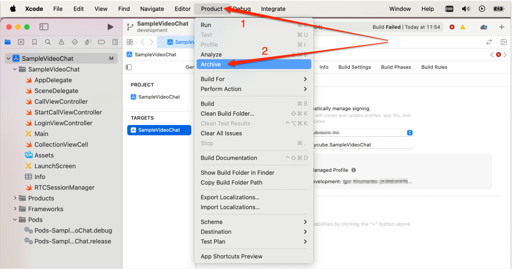

2. Validate and upload your app  
Before uploading, it's essential to validate the archive to catch and resolve any potential issues. Once validated, you can upload your app to App Store Connect. 
    * Select the archive in the __Organizer window__ in Xcode
    * Click on the __"Distribute App"__ button
    * Select __"App Store Connect"__ as the distribution method
    * Choose __"Upload"__  

	Follow the prompts to validate the archive and resolve any errors before proceeding and upload your application 

After this step the build is uploaded and appears under the __‘Builds’__ section. It will be available to be selected during the submitting the app for review in Step 5.

## Step 4: configure application's information in App Store Connect

The final step before the final submit of application for review is to add all necessary information about the application in the appropriate sections in App Store Connect. 
The information required for submitting the application becomes available when clicking on the created application (at this stage the application has 'Prepare for submission' status):
* __Enter app information__ - enter the app’s information, including the description, keywords, and app review information.

    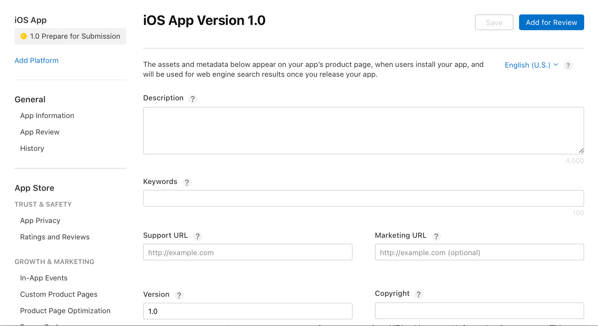

* __Upload screenshots__ - upload the screenshots for all required device sizes.
This information is used for all platforms of the application. Any changes will be released with all next application versions.

    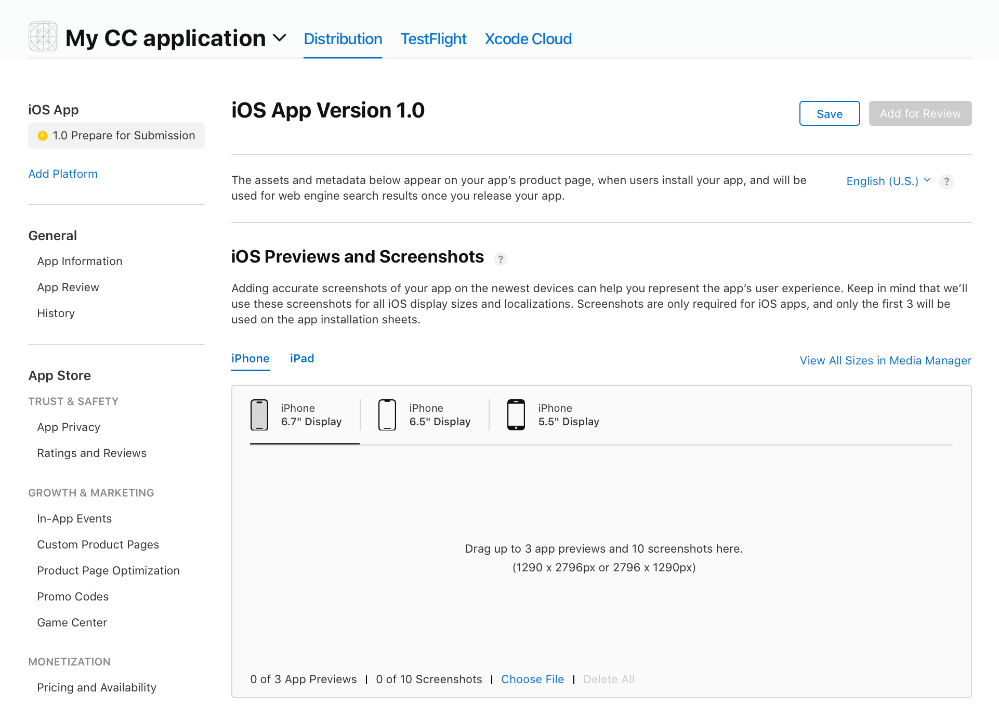

After publishing an app to the App Store it appears on the application’s product page, when users install the application, and will be used for web engine search results once the application is released.

## Step 5: Submit application for review

When you are sure all required fields are filled out and all necessary documents are uploaded, you are ready for submission.  
* Go to the __"iOS app"__ section and click on your app that is in ‘Ready for submission’ status now
* Scroll page to __‘Builds’__ section -> pick the build you want to push for review
* Scroll page down to __‘AppStore version release’__ section -> select the appropriate submission options (e.g., Manual release or Automatic release after approval).

    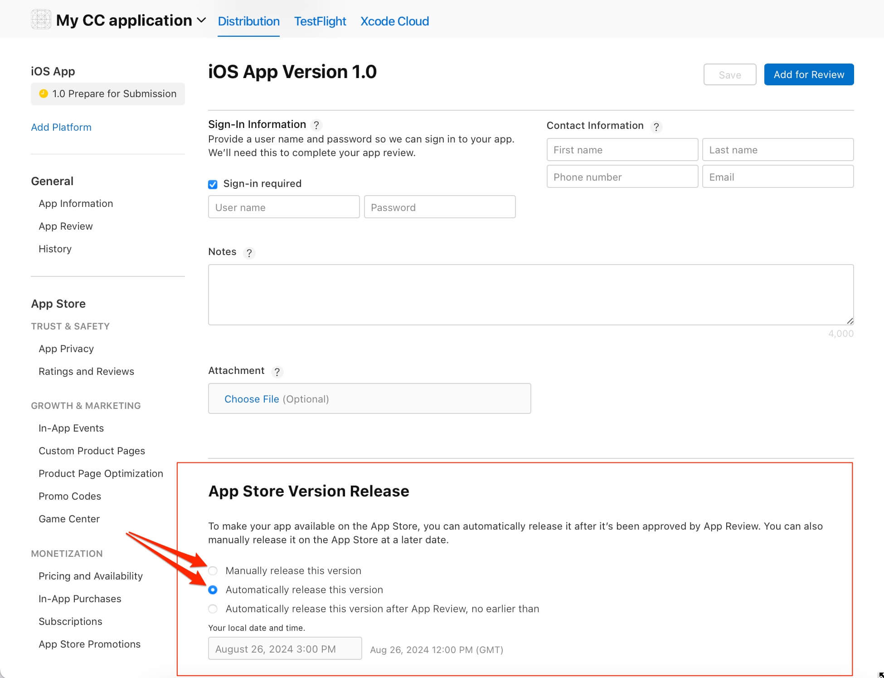

* Click the __"Add for Review"__ button.

    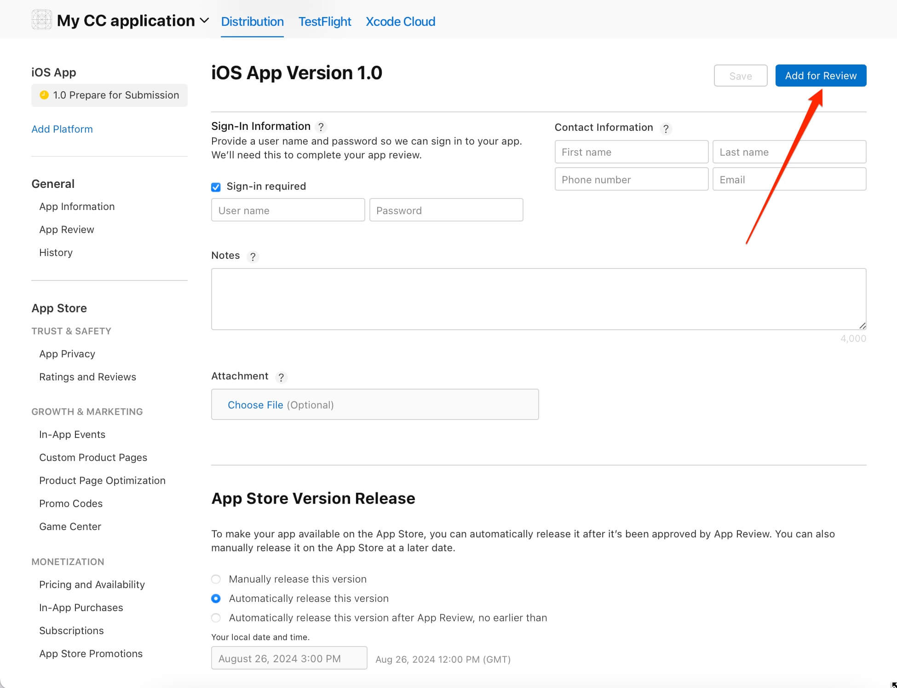

* Confirm submitting

Congrats! Now the app is in the __‘Wait for Approval’__ status. Apple’s review process can take a few days to a week. You may receive feedback requiring changes. If Apple provides feedback, address the issues and resubmit the app.

If you choose __manual release__, go back to App Store Connect once your app is approved and release it.
If you choose __automatic release__, the app will be released as soon as it’s approved.

## Conclusion

Thorough preparation can ensure a smooth submission. Once your app is live, you'll be ready to reach a global audience and provide them with a high-quality iOS experience. Remember, the journey doesn’t end here—continue to monitor user feedback and update your app to keep it at its best.