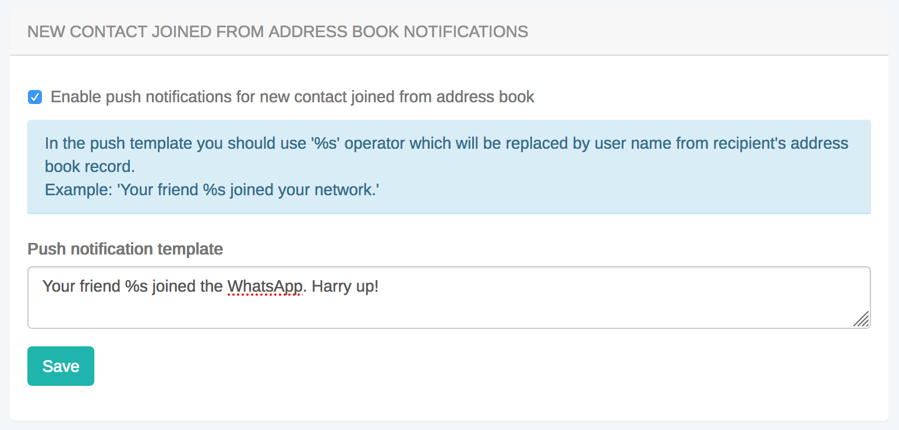

import { Tabs, TabItem } from "@astrojs/starlight/components";

Address Book API provides an interface to work with phone address book, upload it to server and retrieve already registered ConnectyCube users from your address book.

With conjunction of [User authentication via phone number](/ios/authentication-and-users#authentication-via-phone-number) you can easily organize a modern state of the art logic in your App where you can easily start chatting with your phone contacts, without adding them manually as friends - the same what you can see in WhatsApp, Telegram, Facebook Messenger and Viber.

## Upload Address Book

First of all you need to upload your Address Book to the backend. It's a normal practice to do a full upload for the 1st time and then upload diffs on future app logins.

<Tabs syncKey="codeExamples">
<TabItem label='SDK v2'>
```swift
var addressBook = [ConnectycubeContact]()

let contact = ConnectycubeContact(name: "Jony Ive", phone: "1-800-300-2000", destroy: false)// set true to remove a contact

addressBook.append(contact)

//let udid = UUID().uuidString

ConnectyCube().uploadAddressBook(contacts: addressBook, force: false, udid: nil, successCallback: { (updates) in

}) { (error) in

}

````

</TabItem>
<TabItem label='SDK v1 (deprecated)'>
```objectivec
NSMutableOrderedSet *addressBook = [[NSMutableOrderedSet alloc] init];

CYBAddressBookContact *contact = [[CYBAddressBookContact alloc] init];
contact.name = @"Jony Ive";
contact.phone = @"1-800-300-2000";

[addressBook addObject:contact];

[CYBRequest uploadAddressBookWithUdid:nil addressBook:addressBook force:false successBlock:^(CYBAddressBookUpdates * _Nonnull updates) {

} errorBlock:^(NSError * _Nonnull error) {

}];
````

```swift
let addressBook = NSMutableOrderedSet()

let contact = AddressBookContact()
contact.name = "Jony Ive"
contact.phone = "1-800-300-2000"

addressBook.add(contact)

Request.uploadAddressBook(withUdid: nil, addressBook: addressBook, force: false, successBlock: { (updates) in

}) { (error) in

}

````

</TabItem>
</Tabs>

- You also can edit an existing contact by providing a new name for it.
- You also can upload more contacts, not just all in one request - they will be added to your address book on the backend. If you want to override the whole address book on the backend - just provide `force: true`.
- You also can remove a contact by setting `contact.destroy = true`.
- A device UDID is used in cases where user has 2 or more devices and contacts sync is off. Otherwise - user has a single global address book.

## Retrieve Address Book

If you want you can retrieve your uploaded address book:

<Tabs syncKey="codeExamples">
<TabItem label='SDK v2'>
```swift
ConnectyCube().getAddressBook(udid: nil, successCallback: { (contacts) in

}) { (error) in

}
````

</TabItem>
<TabItem label='SDK v1 (deprecated)'>
```objectivec
[CYBRequest addressBookWithUdid:nil successBlock:^(NSArray<CYBAddressBookContact *> * _Nonnull contacts) {

} errorBlock:^(NSError \* \_Nonnull error) {

}];

````

```swift
Request.addressBook(withUdid: nil, successBlock: { (contacts) in

}) { (error) in

}
````

</TabItem>
</Tabs>

## Retrieving Registered Users

Using this request you can easily retrieve the ConnectyCube users - you phone Address Book contacts that already registered in your app, so you can start communicate with these users right away:

<Tabs syncKey="codeExamples">
<TabItem label='SDK v2'>
```swift
ConnectyCube().getRegisteredUsersFromAddressBook(compact: false, udid: nil, successCallback: {(users) in

}) { (error) in

}

````

</TabItem>
<TabItem label='SDK v1 (deprecated)'>
```objectivec
[CYBRequest registeredUsersFromAddressBookWithUdid:nil isCompact:false successBlock:^(NSArray<CYBUser *> * _Nonnull users) {

} errorBlock:^(NSError * _Nonnull error) {

}];
````

```swift
Request.registeredUsersFromAddressBook(withUdid: nil, isCompact: false, successBlock: { (users) in

}) { (error) in

}

```

</TabItem>
</Tabs>

if `isCompact: true` - server will return only id and phone fields of User. Otherwise - all User's fields will be returned.

## Push notification on new contact joined

There is a way to get a push notification when some contact from your Address Book registered in an app.

You can enable this feature at [ConnectyCube Dashboard](https://admin.connectycube.com), Users module, Address Book Settings tab:


```
