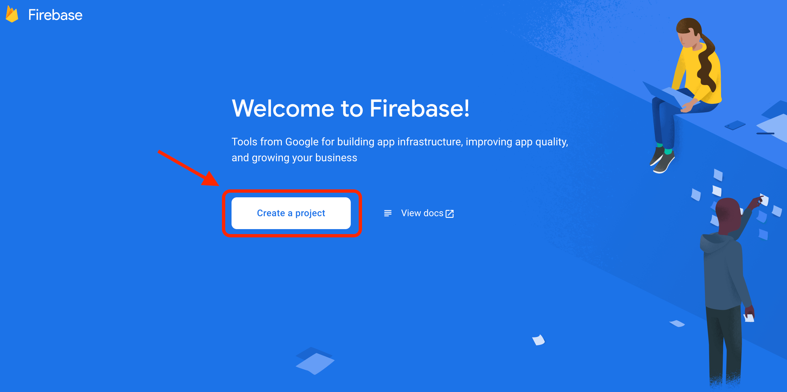
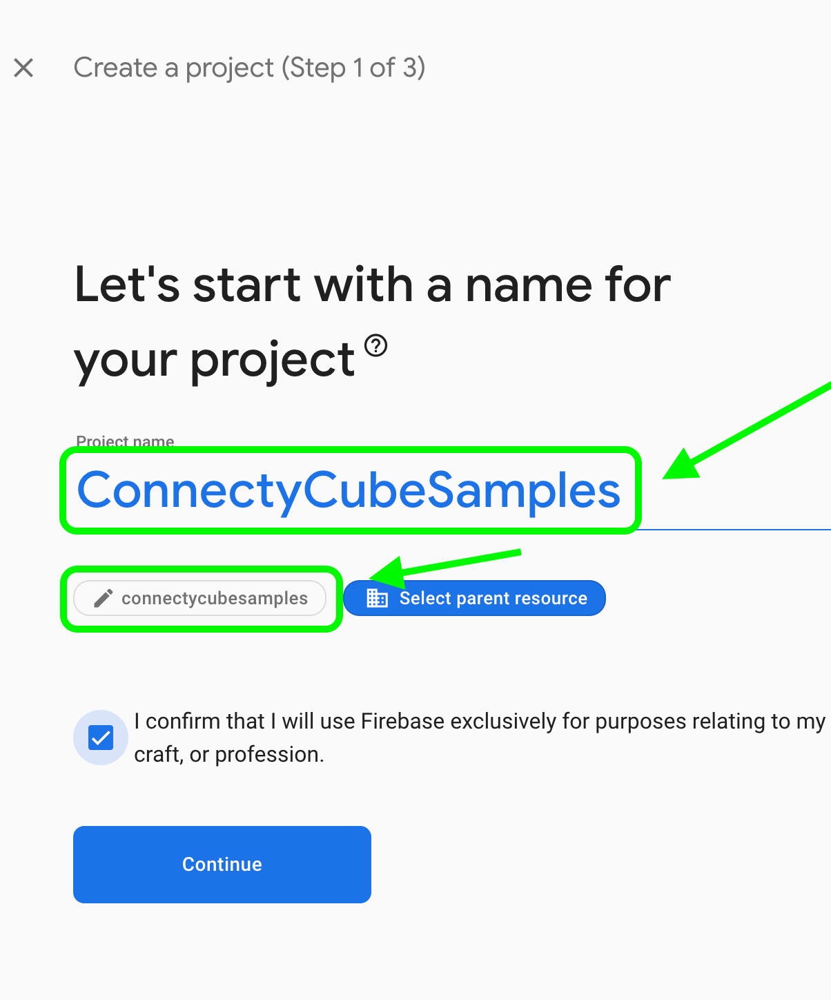
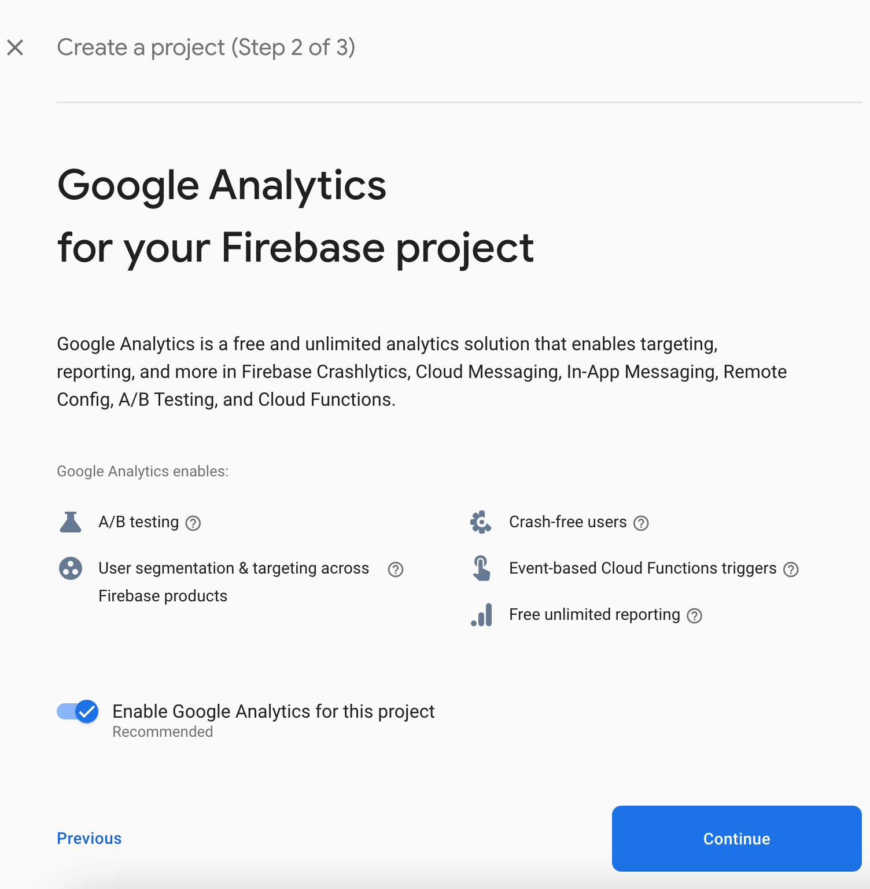
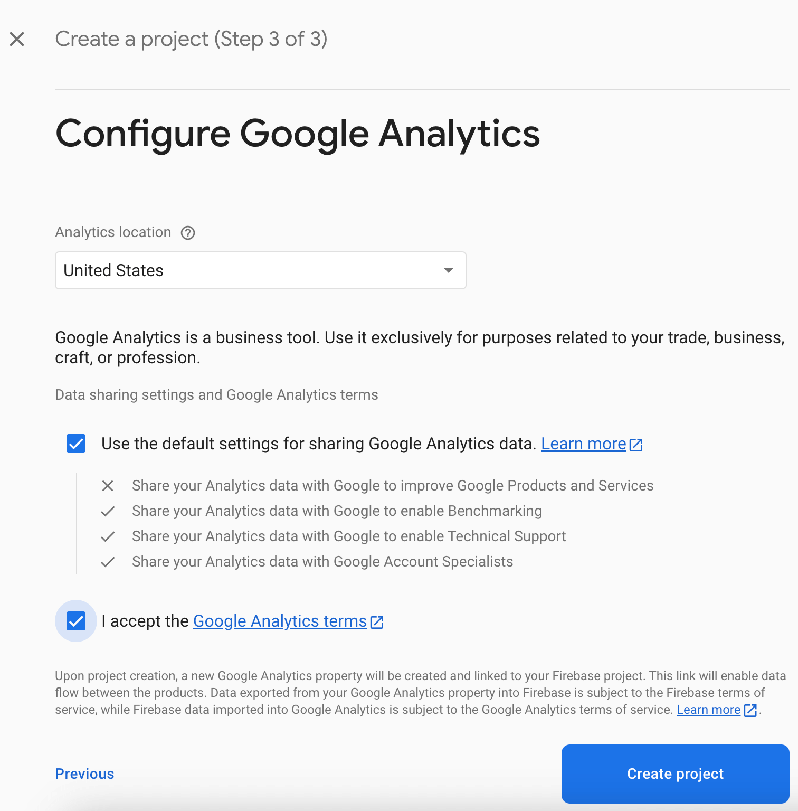
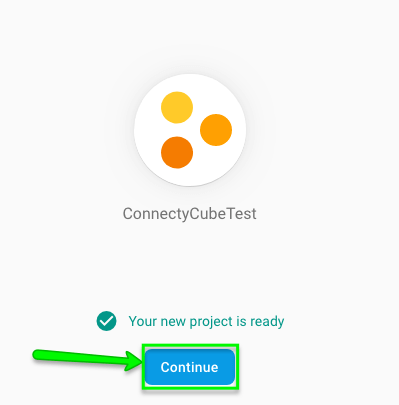
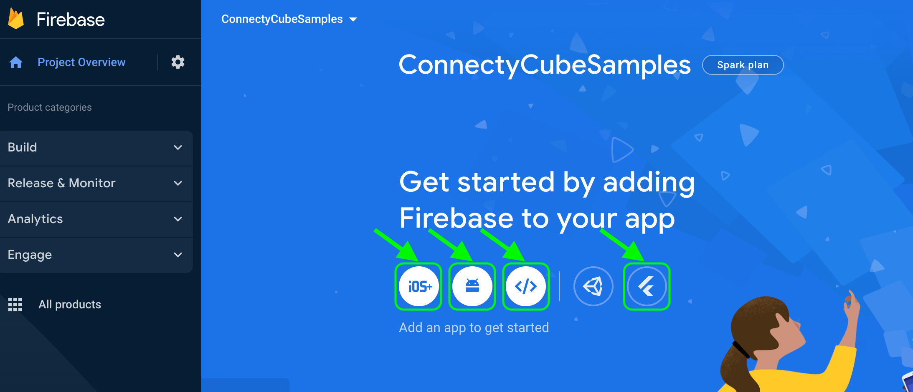
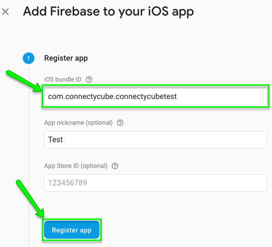
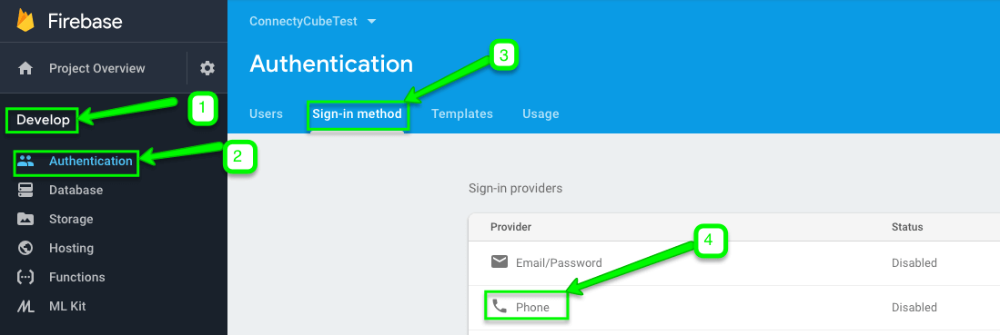
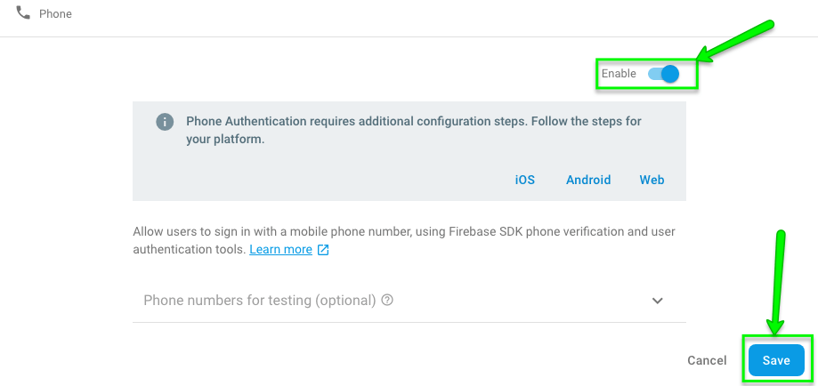
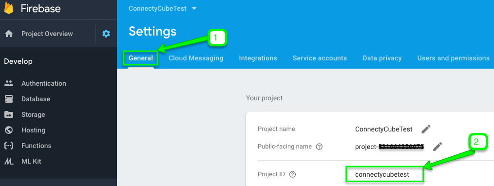

import { Tabs, TabItem } from "@astrojs/starlight/components";

You might need to use Firebase for Firebase authentication of users in your app via phone number.

It might look a bit scary at first. But don’t panic and let's check how to do this right step by step.

## Firebase account and project registration

Follow these steps to register your Firebase account and create a Firebase project:

1. **Register a Firebase account** at [Firebase console](https://console.firebase.google.com/) .
   You can use your Google account to authenticate at Firebase.

2. Click **Create project**

   

   > **Note**: If you have a Google project registered for your mobile app, select it from the **Project name** dropdown menu.

   You can also edit your **Project ID** if you need. A unique ID is assigned automatically to each project. This ID is used in publicly visible Firebase features. For example, it will be used in database URLs and in your Firebase Hosting subdomain. If you need to use a specific subdomain, you can change it.

3. Fill in the fields required (Project name, Project ID, etc.) and click **Continue**.

   

   

4. Configure Google Analytics for your project and click **Create project**.

   

   Then click Continue.

   

5. Select platform for which you need Firebase

   

6. Fill in the fields on **Add Firebase to your iOS App** screen and click **Register App**

   

   > **Note**: Please pay attention to add the **bundle ID** your app is using. It can be set only when you add an app to your Firebase project.

## Connect Firebase SDK

For **iOS** projects Firebase has the following **requirements** to be added successfully:

- Xcode 9.0 or later
- An Xcode project for iOS 8 version or above
- For Swift projects - Swift 3.0 or later
- Your app’s bundle identifier
- CocoaPods 1.4.0 or later
- For Cloud Messaging:
  - A physical iOS device
  - Your Apple Developer account’s Apple Push Notification Authentication Key
  - In Xcode you need to enable Push Notifications in App > Capabilities

Here is a step by step guide how to connect Firebase SDK to your iOS Project:

1. Download **GoogleService-Info.plist** config file. It can be also downloaded later if you need.

2. Add Firebase SDK

   A. With CocoaPods

   It is recommended using CocoaPods to install the libraries. CocoaPods can be installed according to this [guide](https://guides.cocoapods.org/using/getting-started.html#getting-started).
   You need to add the pods for the libraries you need to use.

   1. If you don’t have an Xcode project yet, you need to create it.

   2. Create a Podfile if you don’t have one. You can do that as follows:

   ```groovy
   $ cd your-project directory
   $ pod init
   ```

````

   3) Add the pods you are going to install. A Pod can be included in your Podfile as follows:

   ```groovy
pod 'Firebase/Core'
````

> **Note**: The above pod should add the libraries needed to make Firebase work in your iOS app as well as Google Analytics for Firebase.
The list of available pods with their specifications can be found [here](https://firebase.google.com/docs/ios/setup#available_pods).

4.  Install the pods of your choice and open your-project.xcworkspace file to see the project in Xcode.

```groovy
$ pod install
$ open your-project.xcworkspace
```

5.  Download a **GoogleService-Info.plist** file from your Firebase account and add it to your app.

> **Note**: Each bundle ID must be connected in Firebase. If you have several bundle IDs in your project, each of them can have its own GoogleService-Info.plist file.

B. Without CocoaPods

SDK frameworks can be imported directly without using CocoaPods as follows:

1.  Download the [framework SDK zip](https://firebase.google.com/download/ios) (since the file is about 500MB in size, it may take some time).

2.  Unzip it and find README file.

3.  Add the [ObjC linker flag](https://developer.apple.com/library/content/qa/qa1490/_index.html) in your Other Linker Settings in your target's build settings.

3) Add initialisation code:

   1. Import the Firebase module in your `UIApplicationDelegate`:

   ```objectivec
   @import Firebase;
   ```

   ```swift
   import Firebase
   ```

   2. Configure a [FirebaseApp](https://firebase.google.com/docs/reference/ios/firebasecore/api/reference/Classes/FIRApp) shared instance, typically in your application's `application:didFinishLaunchingWithOptions:` method:

   ```objectivec
   // Use Firebase library to configure APIs
   [FIRApp configure];
   ```

   ```swift
   // Use Firebase library to configure APIs
   FirebaseApp.configure()
   ```

   You are done now.

## Firebase authentication

This option allows users in your app authenticate themselves via phone number. If you use this method for user authentication, the user receives an SMS with verification code and authenticates via that code in your app.

You need to follow these steps to add Firebase authentication to your iOS project:

1.  Include the following pods in your Podfile:

    ```groovy
    pod 'Firebase/Auth'
    ```

2.  Go to **Firebase console >> Authentication >> Sign-in method** section:

    

3.  Enable **Phone** number sign-in method:

    

4.  Enable app verification
    For Firebase phone authentication to work Firebase must be able to verify that phone number sign-in requests are coming from your app. There are two options how to verify it:

    - **Silent APNs notifications**

      In order to enable APNS notifications for Firebase authentication follow these steps:

      1. [Enable push notifications](http://help.apple.com/xcode/mac/current/#/devdfd3d04a1) for your project in Xcode

      2. Upload your APNS certificate to Firebase. If you do not know how to create APNS certificate - please use our [How to generate APNS certificate guide](/ios/how-to-create-apns-certificate)

    - **reCAPTCHA verification**

           If sending silent push notifications fails (user has disabled background refresh or your app or you are testing on a simulator), Firebase uses reCAPTCHA verification to complete the phone log in.

      In order to enable reCAPTCHA verification follow these steps:


        1) Add custom URL schemes to your project in Xcode:

           A. In your **GoogleService-Info.plist** configuration file find **REVERSED_CLIENT_ID** key and copy it.

           B. Go to your **project configuration >> Your Project name**, then select your app from the **Targets** section, choose **Info** tab and open **URL Types** section.

           C. Click **+** button and add your **REVERSED_CLIENT_ID** key to **URL Schemes** field.

         2) (Optional) It is possible to customize the way your app presents `SFSafariViewController` or `UIWebView` when displaying the reCAPTCHA to the user. For that purpose you need to create a custom class that conforms to the `FIRAuthUIDelegate` protocol, and pass it to `verifyPhoneNumber:UIDelegate:completion:`.

5.  Call `verifyPhoneNumber:UIDelegate:completion:` passing to it the user's phone number to request that Firebase send an authentication code to the user's phone by SMS:

    ```objectivec
     [[FIRPhoneAuthProvider provider] verifyPhoneNumber:phoneNumber
                                           UIDelegate:nil
                                           completion:^(NSString * _Nullable verificationID, NSError * _Nullable error) {
     if (error) {
       [self showMessagePrompt:error.localizedDescription];
       return;
     }
     // Sign in using the verificationID and the code sent to the user
     // ...
     }];
    ```

    ```swift
     PhoneAuthProvider.provider().verifyPhoneNumber(phoneNumber, uiDelegate: nil) { (verificationID, error) in
     if let error = error {
       self.showMessagePrompt(error.localizedDescription)
       return
     }
     // Sign in using the verificationID and the code sent to the user
     // ...
     }
    ```

    > **Note**
    >
    > As a best practice please do not forget to inform your users that if they use phone sign-in, they might receive an SMS message for verification and standard rates apply.

6.  `languageCode` property on your Auth instance allows specifying the auth language and therefore localize SMS message sent by Firebase:

    ```objectivec
    // Change language code to french.
    [FIRAuth auth].languageCode = @"fr";
    ```

    ```swift
    // Change language code to french.
    Auth.auth().languageCode = "fr";
    ```

7.  Save the **verification ID** and restore it when your app loads.

    This measure should help you to have a valid verification ID if your app closes before the user can sign in (if the user checks SMS app, for instance).

    A simple way is to save the verification ID with the `NSUserDefaults` object:

    ```objectivec
    NSUserDefaults *defaults = [NSUserDefaults standardUserDefaults];
    [defaults setObject:verificationID forKey:@"authVerificationID"];
    ```

    ```swift
    UserDefaults.standard.set(verificationID, forKey: "authVerificationID")
    ```

    Then, you can restore the saved value:

    ```objectivec
    NSString *verificationID = [defaults stringForKey:@"authVerificationID"];
    ```

    ```swift
    let verificationID = UserDefaults.standard.string(forKey: "authVerificationID")
    ```

8.  Create a `FIRPhoneAuthCredential` object using the **verification code** and the **verification ID**:

    ```objectivec
    FIRAuthCredential *credential = [[FIRPhoneAuthProvider provider]
    credentialWithVerificationID:verificationID
                verificationCode:verificationCode];
    ```

    ```swift
    let credential = PhoneAuthProvider.provider().credential(
        withVerificationID: verificationID,
        verificationCode: verificationCode)
    ```

9.  Sign in the user with the FIRPhoneAuthCredential object:

    ```objectivec
    [[FIRAuth auth] signInAndRetrieveDataWithCredential:credential
                                             completion:^(FIRAuthDataResult * _Nullable authResult,
                                                          NSError * _Nullable error) {
        if (error) {
            // ...
            return;
        }
        // User successfully signed in. Get user data from the FIRUser object
        if (authResult == nil) { return; }
        FIRUser *user = authResult.user;
        // ...
    }];
    ```

    ```swift
    Auth.auth().signInAndRetrieveData(with: credential) { (authResult, error) in
      if let error = error {
        // ...
        return
      }
      // User is signed in
      // ...
    }
    ```

10. Get Firebase `access_token` after SMS code verification as follows:

```objectivec
[FIRUser getIDTokenWithCompletion:^(NSString * _Nullable token, NSError * _Nullable __unused error) {

}];
```

```swift
User.getIDToken { (tokenResult, error) in

}
```

11. Add ConnectyCube user sign in to your project as follows:

1)  Get your **Project ID** from your **Firebase console**



2.  Pass your Firebase `project_id` and Firebase `access_token` parameters to `signInUsingFirebasePhone` (`logInWithFirebaseProjectID` v1 deprecated) method:

<Tabs syncKey="codeExamples">
<TabItem label='SDK v2'>
```swift
let projectId = ""
let accessToken = ""

ConnectyCube().signInUsingFirebasePhone(projectId: projectId, accessToken: accessToken, successCallback: { user in

}) { (error) in

}

````

</TabItem>
<TabItem label='SDK v1 (deprecated)'>
   ```objectivec
   NSString *projectId = @"...";
   NSString *accessToken = @"...";

   [CYBRequest logInWithFirebaseProjectID:projectId accessToken:accessToken successBlock:^(CYBUser *user) {

   } errorBlock:^(NSError *error) {

   }];
````

```swift
let projectId = ""
let accessToken = ""

Request.logIn(withFirebaseProjectID: projectId, accessToken: accessToken, successBlock: { (user) in

}) { (error) in

}
```

</TabItem>
</Tabs>

12. Run your app to verify installation
    Once your user is logged in successfully, you will find him/her in your **Dashboard >> Your App >> Users** section.


So now you know how to use Firebase features in your ConnectyCube apps. If you have any difficulties - please let us know via [support channel](mailto:support@connectycube.com)
