## Create App ID

Each iOS application that uses the APNs must have a unique application ID that uniquely identifies your app. The following steps describe how to create an Apple App ID for your application.

> If you already have an App ID, you can skip these steps.

1. Once you have signed in to the [iPhone Developer Connection Portal](https://developer.apple.com/account/), click on **Identifiers** on  **Certificates, IDs & Profiles.** column 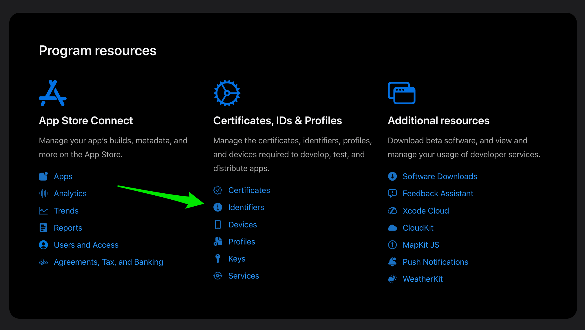

2. On the next screen, select **App IDs** in the right dropdown and then click on the plus button 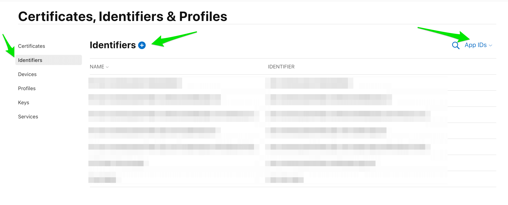

3. On the next screen, select **App IDs** in the radio menu and then click on the **Continue** button 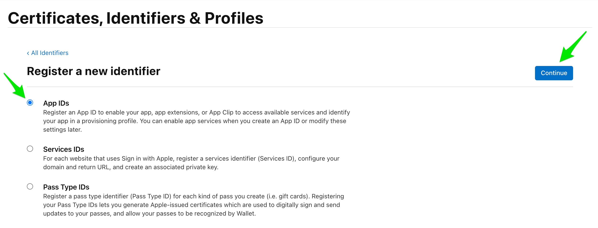

4. On the next screen, select **App** and then click on the **Continue** button 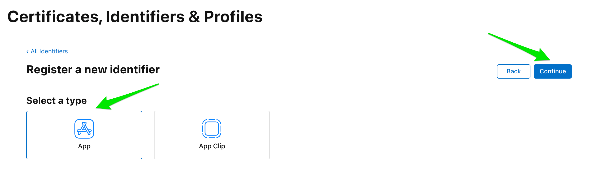

5. Enter your app name for the **App ID Description** section **(1)**. In the **App ID Prefix** section, select the **Explicit** option and enter **Bundle Identifier(2)**.

    For example, our iOS application ID looks like **com.awesomecorp.messagingspace**:

    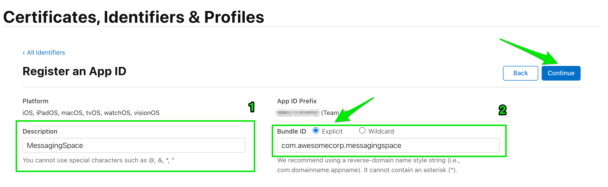

    **Note:**
    Ensure you have created an App ID without a wildcard(make sure it doesn’t have an asterisk in it). Wildcard IDs cannot use the push notification service.

5. Once you have entered all of the information, press **Continue** button.

You will now be presented with an overview of your new app ID. Click **Register** button to continue.

## Generate a Certificate Signing Request

You need to generate a certificate signing request file so that you can use it to request an APNS SSL certificate later on.

Follow the instructions below to create one:

1. Launch the **Keychain Access**  application in your macOS: 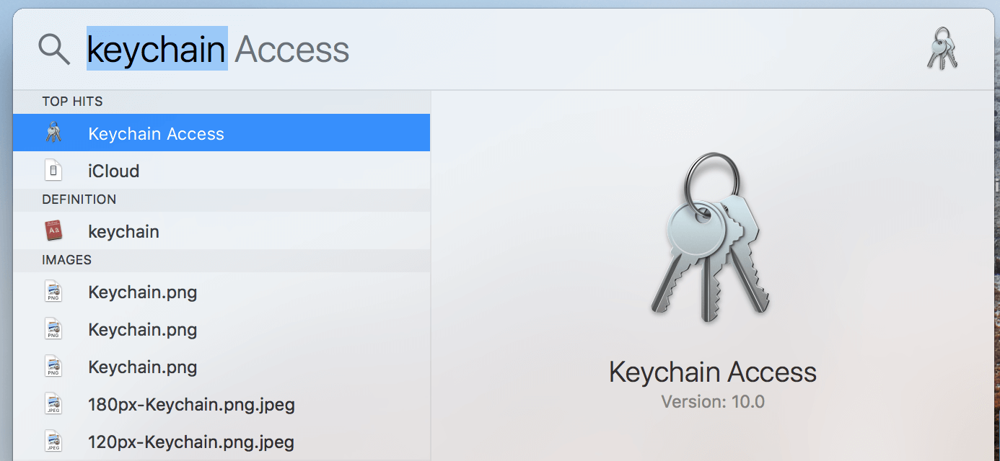

2. Select **Keychain Access -> Certificate Assistant -> Request a Certificate From a Certificate Authority**: 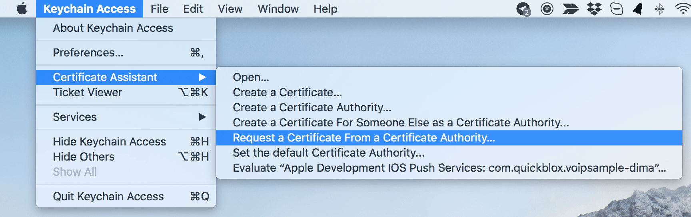

3. Enter the required information and check the **'Saved to disk'** option. Click Continue: 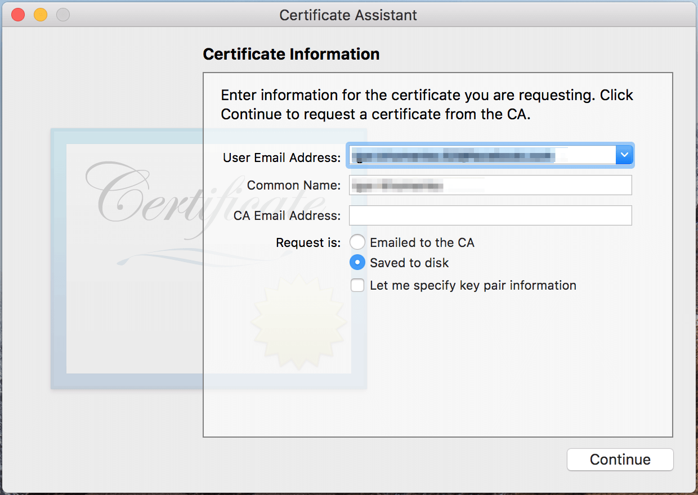

4. Save the certificate request using the suggested name and click **Save**. Click **Done** in the next screen: 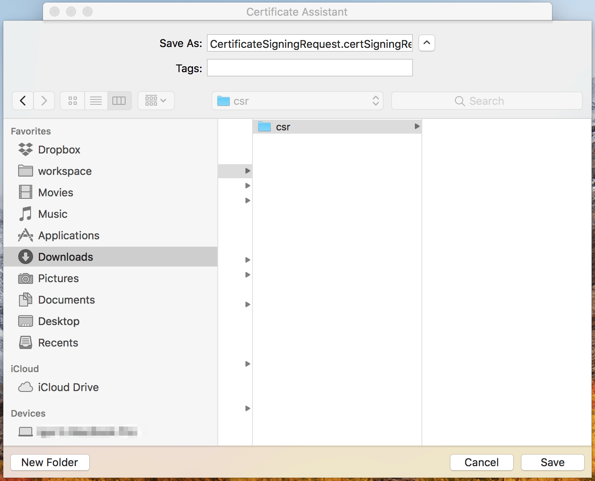

## Create universal APNS certificate

1. On the **Certificates, IDs & Profiles** screen, select **Certificates** in the left sidebar and then select **App IDs** in the right dropdown and then click on the plus button: 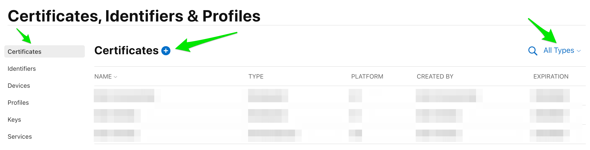

2. The **Add iOS Certificate** screen will appear. Choose **Apple Push Notifications service SSL (Sandbox & Production)** and click **Continue**: 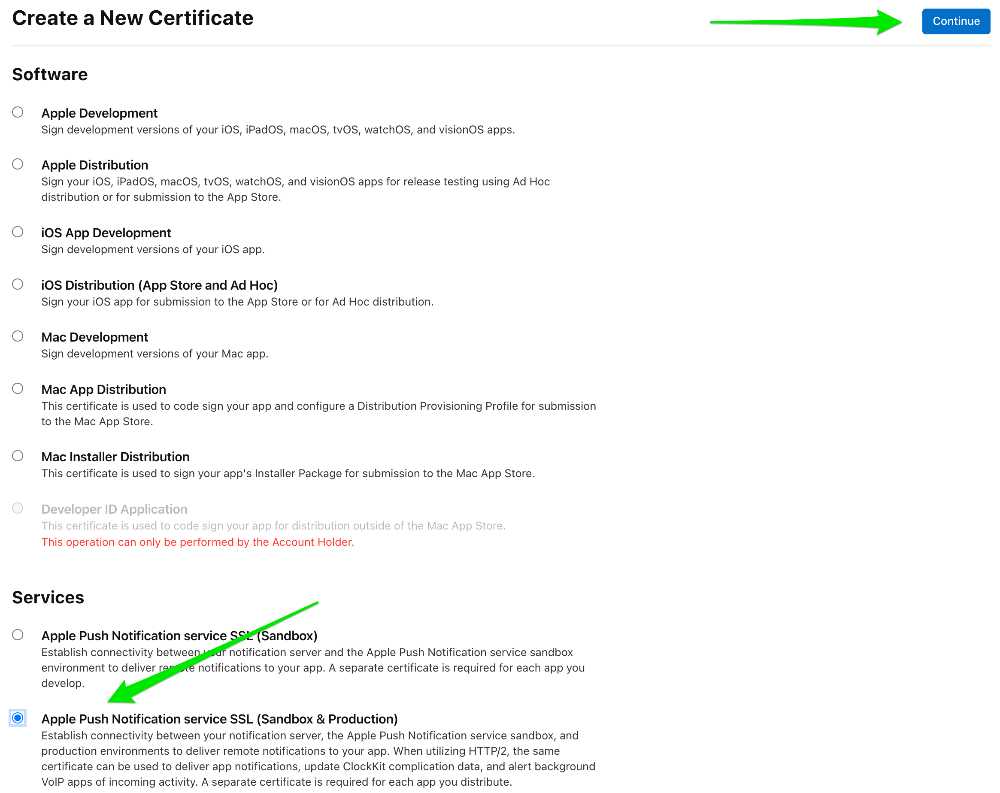

    Here we will create a single **universal** push certificate which is good for both Development and Production environments.

3. On the next screen choose an App ID you want to create a push certificate for. Then click **Continue**: 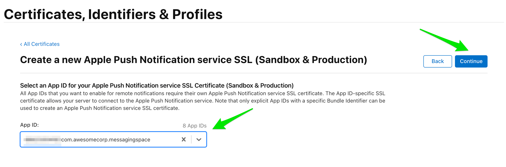

4. Click **'Choose File...'** button to locate **Certificate Request File** that you have saved earlier. Click **Continue**: 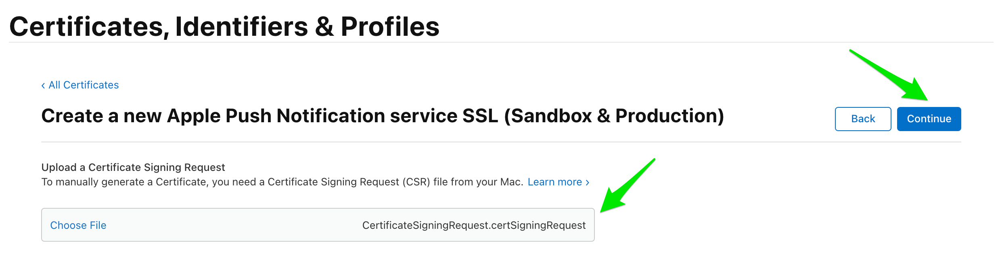

5. Your APNS SSL Certificate will now be generated. Click **Download** and save it to your hard disk: 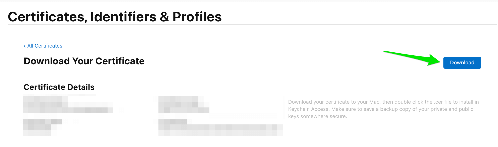

Also, you can download your new certificate on App ID details page. 
**Identifiers** > **Select your app id** > **Capabilities** > **Push Notifications** > **Edit**:
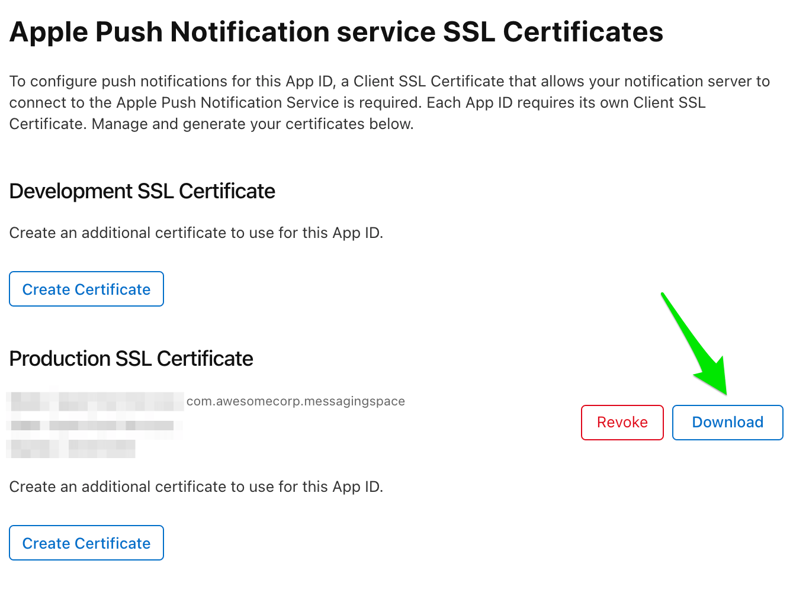

## Create p12 file

1. Once your certificate has been created,  open the file with **Keychain Access** app on your computer. If you are asked which keychain to add the certificate to, select **login** option. SSL certificate will be used by provider(ConnectyCube) application so that it can contact the APNs to send push notifications to your applications.

2. Still in **Keychain Access** app, select **Certificates** option in the bottom section of the left sidebar. You will now need to find the certificate you just made; it will have the name **Apple Push Services: < Bundle ID >**  and paired with a private key. 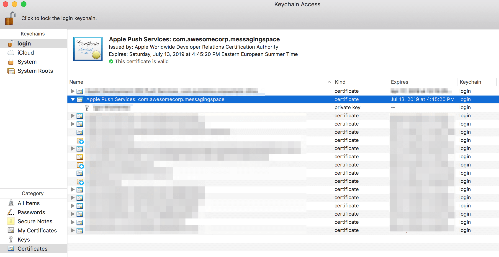

3. Right-click on this key and select **Export "Apple Push Services ..."** option. In the popup that appears, you can call the file whatever you want, but make sure that **File Format** is set to **Personal Information Exchange (.p12).**

When exporting the certificate, you can provide a password for the p12 file.

That's all - now you have a ready-to-go APNS certificate which can be used on both Development and Production environments of your iOS application.

## Upload certificate to Dashboard

To upload APNS certificate to ConnectyCube Dashboard you need to do the following:

1. Open your ConnectyCube Dashboard at [admin.connectycube.com](https://admin.connectycube.com)
2. Go to **Push notifications** module, **Credentials** page
3. Upload the newly created APNS certificate on **Apple Push Notification Service (APNS)** form.

Choose certificate and enter password if needed.

   

After this you will be able to start using push notifications in your iOS application.

### Links you might find useful: 

[How to submit an iOS app to the App Store: Step-by-step guide](/guides/uploading-ios-app-to-store)  
[How to upload app to the Google Play Store: Step-by-step guide](/guides/uploading-android-app-to-store)