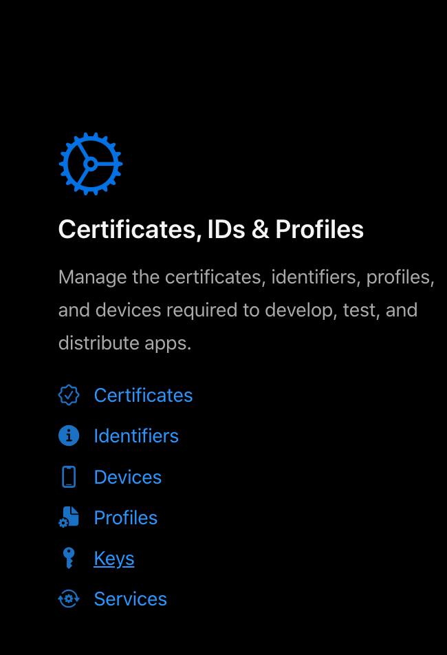
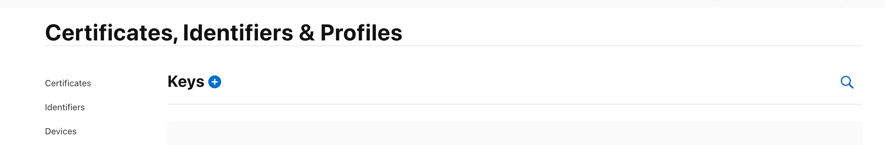
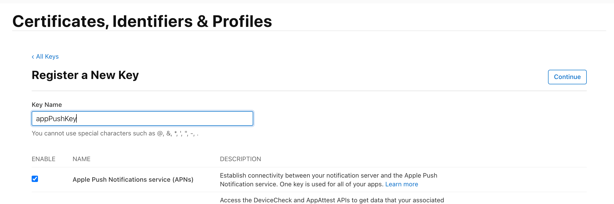
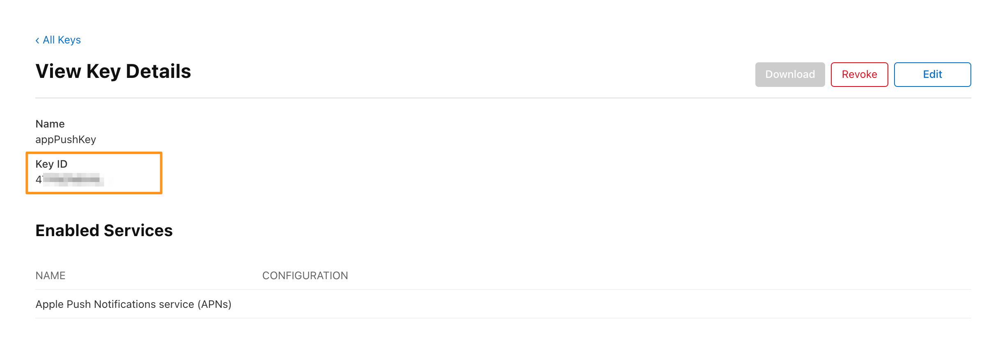
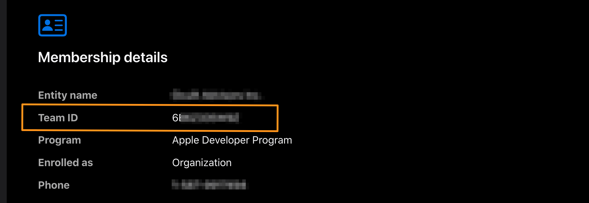

1. Once you have signed in to the [iPhone Developer Connection Portal](https://developer.apple.com/account/), click on **Keys** at **Certificates, IDs & Profiles** column 

2. Press **+** to generate new key 

3. **Select Apple Push Notifications service (APNs)**, and enter a name for the key .
Select Continue and on the next page, select Register.

4. Download your new key and save it in a secure place. You can only download it once, so don't lose it. Then, click Done and you will have a new key.

## Key Id and Team Id

## Upload key to Dashboard

To upload APNS key to ConnectyCube Dashboard you need to do the following:

1. Open your ConnectyCube Dashboard at [admin.connectycube.com](https://admin.connectycube.com)
2. Go to **Push notifications** module
3. Switch to **Credentials** tab
4. Upload the newly created APNS key on **APNS Authentication Token (JWT)** form.
5. Enter `key id` and `team id`
6. Press **Upload**

### Links you might find usefull: 
[How to submit an iOS app to the App Store: Step-by-step guide](/guides/uploading-ios-app-to-store)  
[How to upload app to the Google Play Store: Step-by-step guide](/guides/uploading-android-app-to-store)
