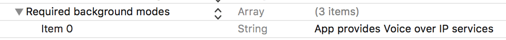

import { Tabs, TabItem } from "@astrojs/starlight/components";

ConnectyCube **Video Calling P2P API** is built on top of [WebRTC](https://webrtc.org/) protocol and based on top of [WebRTC Mesh](https://webrtcglossary.com/mesh/) architecture.

Max people per P2P call is 4.

> To get a difference between **P2P calling** and **Conference calling** please read our [ConnectyCube Calling API comparison](https://connectycube.com/2020/04/15/connectycube-calling-api-comparison/) blog page.


## Installation

### Installation with CocoaPods

[CocoaPods](https://cocoapods.org/pods/ConnectyCubeCalls) is a dependency manager for Objective-C and Swift, which automates and simplifies the process of using 3rd-party frameworks or libraries like ConnectyCubeCalls in your projects.
You can follow their [getting started guide](https://guides.cocoapods.org/using/getting-started.html) if you don’t have CocoaPods installed.

Copy and paste the following lines into your podfile:

<Tabs syncKey="codeExamples">
<TabItem label='SDK v2'>
```bash
pod 'ConnectyCube'
```

</TabItem>
<TabItem label='SDK v1 (deprecated)'>
```bash
pod 'ConnectyCube'
pod 'ConnectyCubeCalls'
```

</TabItem>
</Tabs>

Now you can install the dependencies in your project:

```bash
$ pod install
...
```

From now on, be sure to always open the generated Xcode workspace (.xcworkspace) instead of the project file when building your project.

### Importing framework

At this point, everything is ready for you to start using ConnectyCube and ConnectyCubeCalls frameworks. Just import the frameworks wherever you need to use them:

<Tabs syncKey="codeExamples">
<TabItem label='SDK v2'>
```swift
import ConnectyCube
```

</TabItem>
<TabItem label='SDK v1 (deprecated)'>
```objectivec
#import <ConnectyCube/ConnectyCube.h>
#import <ConnectyCubeCalls/ConnectyCubeCalls.h>
```

```swift
import ConnectyCube
import ConnectyCubeCalls
```

</TabItem>
</Tabs>

### Run script phase for archiving

Add a "Run Script Phase" to build phases of your project. Paste the following snippet into the script:

```bash
bash "${BUILT_PRODUCTS_DIR}/${FRAMEWORKS_FOLDER_PATH}/ConnectyCubeCalls.framework/strip-framework.sh"
```

This fixes the [known Apple bug](http://www.openradar.me/radar?id=6409498411401216), that does not allow to publish archives to the App store with dynamic frameworks that contain simulator platforms. Script is designed to work only for archiving.

### Swift namespacing

ConnectyCubeCalls framework supports simple swift names, which means that instead of, for example, `CYBCallSession` you can just type `CallSession`. Sometimes it might get you an error: `__someclass__ is ambiguous for type lookup in this context`, which means that there is another class with the same swift name, and they are conflicting (swift does not understand what class do you want in the current context to be):


In this case you must specify a namespace of that specific class with `.`, which has the same name as framework and will be:

<Tabs syncKey="codeExamples">
<TabItem label='SDK v2'>
```swift
ConnectyCube.P2PSession
```

</TabItem>
<TabItem label='SDK v1 (deprecated)'>
```swift
ConnectyCubeCalls.CallSession
```

</TabItem>
</Tabs>

## Preparations

[ConnectyCube Chat API](/ios/messaging) is used as a signaling transport for Video Calling API, so in order to start using Video Calling API you need to [connect to Chat](/ios/messaging#connect-to-chat).

## Initialization

Before any interaction with ConnectyCubeCalls you need to initialize it once using the method below:

<Tabs syncKey="codeExamples">
<TabItem label='SDK v2'>
```swift
ConnectyCube().p2pCalls.register()
```

</TabItem>
<TabItem label='SDK v1 (deprecated)'>
```objectivec
[CYBCallClient initializeRTC];
```

```swift
CallClient.initializeRTC()
```

</TabItem>
</Tabs>

### Logging

Logging is a powerful tool to see the exact flow of the ConnectyCubeCalls framework and analyze its decisions. By enabling logs you will be able to debug most issues, or perhaps help us analyze your problems.

Basic logs are enabled by default. To enable verbose logs use the method below:

<Tabs syncKey="codeExamples">
<TabItem label='SDK v2'>
```swift
ConnectycubeSettings().isDebugEnabled = true
```

</TabItem>
<TabItem label='SDK v1 (deprecated)'>
```objectivec
[CYBCallConfig setLogLevel:CYBCallLogLevelVerboseWithWebRTC];
```

```swift
CallConfig.setLogLevel(.verboseWithWebRTC)
```

Here are all possible log levels to use:

- `CYBCallLogLevelNothing`: turns off all logging
- `CYBCallLogLevelVerbose`: basic logs from our framework (enabled by default)
- `CYBCallLogLevelVerboseWithWebRTC`: verbose logs from our framework including all internal webrtc logging (might be helpful to debug some complicated problems with calls)

</TabItem>
</Tabs>

To get more info about active call you can also [enable stats reporting](#webrtc-stats-reporting).

### Background mode

You can use our SDK in the background mode as well, however this requires you to add a specific app permissions.
Under the app build settings, open the Capabilities tab. In this tab, turn on Background Modes and set the Audio, AirPlay and Picture in Picture checkbox to set the audio background mode.


If everything is correctly configured, iOS provides an indicator that your app is running in the background with an active audio session. This is seen as a red background of the status bar, as well as an additional bar indicating the name of the app holding the active audio session — in this case, your app.

## Client delegate

In order to operate and receive calls you need to setup client delegate. Your class must conform to `RTCCallSessionCallback` (`CYBCallClientDelegate` v1 deprecated) protocol. Use the method below to subscribe:

<Tabs syncKey="codeExamples">
<TabItem label='SDK v2'>
```swift
ConnectyCube().p2pCalls.addSessionCallbacksListener(callback: self)
```

</TabItem>
<TabItem label='SDK v1 (deprecated)'>
```objectivec
[[CYBCallClient instance] addDelegate:self];
```

```swift
CallClient.instance().add(self)
```

</TabItem>
</Tabs>

## Initiate a call

<Tabs syncKey="codeExamples">
<TabItem label='SDK v2'>
```swift
let opponentsIds = [3245, 2123, 3122].map{KotlinInt(value: $0)}
let newSession = ConnectyCube().p2pCalls.createSession(userIds: opponentsIds, callType: CallType.video)
// userInfo - the custom user information dictionary for the call. May be nil.
let userInfo = ["key":"value"] as? KotlinMutableDictionary<NSString, NSString> // optional
newSession.startCall(userInfo: userInfo)
```

</TabItem>
<TabItem label='SDK v1 (deprecated)'>
In order to perform a call, use `CYBCallClient` and `CYBCallSession` methods below:

```objectivec
// 2123, 2123, 3122 - opponent's
NSArray *opponentsIDs = @[@3245, @2123, @3122];
CYBCallSession *newSession = [[CYBCallClient instance] createNewSessionWithOpponents:opponentsIDs withConferenceType:CYBCallConferenceTypeVideo];
// userInfo - the custom user information dictionary for the call. May be nil.
NSDictionary *userInfo = @{ @"key" : @"value" }; // optional
[newSession startCall:userInfo];
```

```swift
// 2123, 2123, 3122 - opponent's
let opponentsIDs = [3245, 2123, 3122]
let newSession = CallClient.instance().createNewSession(withOpponents: ids! as [NSNumber], with: .video)
// userInfo - the custom user information dictionary for the call. May be nil.
let userInfo = ["key":"value"] // optional
newSession.startCall(userInfo)
```

</TabItem>
</Tabs>

After this your opponents will receive one call request per 5 second for a duration of 45 seconds (you can configure these settings with `WebRTCConfig` (`CYBCallConfig` v1 deprecated):

<Tabs syncKey="codeExamples">
<TabItem label='SDK v2'>
```swift
//MARK: RTCCallSessionCallback
ConnectyCube().p2pCalls.addSessionCallbacksListener(callback: self)

extension YourClass: RTCCallSessionCallback {
    func onReceiveNewSession(session: P2PSession) {
        if self.session != nil {
            // we already have a video/audio call session, so we reject another one
            // userInfo - the custom user information dictionary for the call from caller. May be nil.
            let userInfo = ["key":"value"] as? KotlinMutableDictionary<NSString, NSString> // optional
            session.rejectCall(userInfo: userInfo)
            return
        }
        // saving session instance here
        self.session = session
    }
    ...  
}

````

</TabItem>
<TabItem label='SDK v1 (deprecated)'>
```objectivec
- (void)didReceiveNewSession:(CYBCallSession *)session userInfo:(NSDictionary *)userInfo {
    if (self.session) {
        // we already have a video/audio call session, so we reject another one
        // userInfo - the custom user information dictionary for the call from caller. May be nil.
        NSDictionary *userInfo = @{ @"key" : @"value" }; // optional
        [session rejectCall:userInfo];
        return;
    }
    // saving session instance here
    self.session = session;
}
````

```swift
func didReceiveNewSession(_ session: CallSession, userInfo: [String : String]? = nil) {
   if self.session != nil {
       // we already have a video/audio call session, so we reject another one
       // userInfo - the custom user information dictionary for the call from caller. May be nil.
       let userInfo = ["key":"value"] // optional
       session.rejectCall(userInfo)
       return
   }
   // saving session instance here
   self.session = session
}
```

</TabItem>
</Tabs>

`self.session` refers to the current session. Each particular audio - video call has a unique `sessionID`. This allows you to have more than one independent audio-video conferences.
If you want to increase the call timeout, e.g. set to 60 seconds:

<Tabs syncKey="codeExamples">
<TabItem label='SDK v2'>
```swift
WebRTCConfig().answerTimeInterval = 60
```

</TabItem>
<TabItem label='SDK v1 (deprecated)'>
```objectivec
[CYBCallConfig setAnswerTimeInterval:60];
```

```swift
CallConfig.setAnswerTimeInterval(60)
```

</TabItem>
</Tabs>

> Default value is 60 seconds.

In case opponent did not respond to your call within a specific timeout time, the callback listed below will be called:

<Tabs syncKey="codeExamples">
<TabItem label='SDK v2'>
```swift
//MARK: RTCCallSessionCallback
ConnectyCube().p2pCalls.addSessionCallbacksListener(callback: self)

func onUserNotAnswer(session: P2PSession, opponentId: Int32) {
}

````

</TabItem>
<TabItem label='SDK v1 (deprecated)'>
```objectivec
- (void)session:(CYBCallSession *)session userDidNotRespond:(NSNumber *)userID {
}
````

```swift
func session(_ session: CallSession, userDidNotRespond userID: NSNumber) {
}
```

</TabItem>
</Tabs>

## Accept a call

In order to accept a call, use the `P2PSession` method below:

<Tabs syncKey="codeExamples">
<TabItem label='SDK v2'>
```swift
// userInfo - the custom user information dictionary for the accept call. May be nil.
let userInfo: KotlinMutableDictionary<NSString, NSString> = ["key":"value"] // optional
self.session?.acceptCall(userInfo: userInfo)
```

</TabItem>
<TabItem label='SDK v1 (deprecated)'>
In order to accept a call, use the `CYBCallSession` method below:

```objectivec
// userInfo - the custom user information dictionary for the accept call. May be nil.
NSDictionary *userInfo = @{ @"key" : @"value" }; // optional
[self.session acceptCall:userInfo];
```

```swift
// userInfo - the custom user information dictionary for the accept call. May be nil.
let userInfo = ["key":"value"] // optional
self.session?.acceptCall(userInfo)
}
```

</TabItem>
</Tabs>

After this your opponent will receive an **accept** signal:

<Tabs syncKey="codeExamples">
<TabItem label='SDK v2'>
```swift
//MARK: RTCCallSessionCallback
ConnectyCube().p2pCalls.addSessionCallbacksListener(callback: self)

func onCallAcceptByUser(session: P2PSession, opponentId: Int32, userInfo: [String : Any]?) {
}

````

</TabItem>
<TabItem label='SDK v1 (deprecated)'>
```objectivec
- (void)session:(CYBCallSession *)session acceptedByUser:(NSNumber *)userID userInfo:(NSDictionary *)userInfo {
}
````

```swift
func session(_ session: CallSession, acceptedByUser userID: NSNumber, userInfo: [String : String]? = nil) {
}
```

</TabItem>
</Tabs>

## Reject a call

<Tabs syncKey="codeExamples">
<TabItem label='SDK v2'>
In order to reject a call, use the `P2PSession` method below:

```swift
// userInfo - the custom user information dictionary for the reject call. May be nil.
let userInfo: KotlinMutableDictionary<NSString, NSString> = ["key":"value"] // optional
self.session?.rejectCall(userInfo: userInfo)

// and release session instance
self.session = nil
```

</TabItem>
<TabItem label='SDK v1 (deprecated)'>
In order to reject a call, use the `CYBCallSession` method below:

```objectivec
// userInfo - the custom user information dictionary for the reject call. May be nil.
NSDictionary *userInfo = @{ @"key" : @"value" }; // optional
[self.session rejectCall:userInfo];

// and release session instance
self.session = nil;
```

```swift
// userInfo - the custom user information dictionary for the reject call. May be nil.
let userInfo = ["key":"value"] // optional
self.session?.rejectCall(userInfo)

// and release session instance
self.session = nil
```

</TabItem>
</Tabs>

After this your opponent will receive a **reject** signal:

<Tabs syncKey="codeExamples">
<TabItem label='SDK v2'>
```swift
//MARK: RTCCallSessionCallback
ConnectyCube().p2pCalls.addSessionCallbacksListener(callback: self)

func onCallRejectByUser(session: P2PSession, opponentId: Int32, userInfo: [String : Any]?) {  
}

````

</TabItem>
<TabItem label='SDK v1 (deprecated)'>
```objectivec
- (void)session:(CYBCallSession *)session rejectedByUser:(NSNumber *)userID userInfo:(NSDictionary *)userInfo  {
    NSLog(@"Rejected by user %@", userID);
}
````

```swift
func session(_ session: CallSession, rejectedByUser userID: NSNumber, userInfo: [String : String]? = nil) {
    print("Rejected by user \(userID)")
}
```

</TabItem>
</Tabs>

## End a call

<Tabs syncKey="codeExamples">
<TabItem label='SDK v2'>
In order to end a call, use the `P2PSession` method below:

```swift
// userInfo - the custom user information dictionary for the reject call. May be nil.
let userInfo: KotlinMutableDictionary<NSString, NSString> = ["key":"value"] // optional
self.session?.hangUp(userInfo: userInfo)

// and release session instance
self.session = nil
```

</TabItem>
<TabItem label='SDK v1 (deprecated)'>
In order to end a call, use the `CYBCallSession` method below:

```objectivec
// userInfo - the custom user information dictionary for the reject call. May be nil.
NSDictionary *userInfo = @{ @"key" : @"value" }; // optional
[self.session hangUp:userInfo];

// and release session instance
self.session = nil;
```

```swift
// userInfo - the custom user information dictionary for the reject call. May be nil.
let userInfo = ["key":"value"] // optional
self.session?.hangUp(userInfo)

// and release session instance
self.session = nil
```

</TabItem>
</Tabs>

After this your opponent will receive a **hangup** signal:

<Tabs syncKey="codeExamples">
<TabItem label='SDK v2'>
```swift
//MARK: RTCCallSessionCallback
ConnectyCube().p2pCalls.addSessionCallbacksListener(callback: self)

func onReceiveHangUpFromUser(session: P2PSession, opponentId: Int32, userInfo: [String : Any]?) {
}

````

</TabItem>
<TabItem label='SDK v1 (deprecated)'>
```objectivec
- (void)session:(CYBCallSession *)session hungUpByUser:(NSNumber *)userID userInfo:(NSDictionary<NSString *,NSString *> *)userInfo {
}
````

```swift
func session(_ session: CallSession, hungUpByUser userID: NSNumber, userInfo: [String : String]? = nil) {
}
```

</TabItem>
</Tabs>

## Connection life cycle

All starts when you have received new session and accepted the call.

<Tabs syncKey="codeExamples">
<TabItem label='SDK v2'>
```swift
//not supported
```

</TabItem>
<TabItem label='SDK v1 (deprecated)'>
The first thing you will get is `startedConnectingToUser` callback:

```objectivec
- (void)session:(__kindof CYBCallBaseSession *)session startedConnectingToUser:(NSNumber *)userID {
}
```

```swift
func session(_ session: CallBaseSession, startedConnectingToUser userID: NSNumber) {
}
```

</TabItem>
</Tabs>

After that webrtc will perform all operations that needed to connect both users internally, and you will either get `onConnectedToUser ` or `onDisconnectedFromUser ` if connection failed to connect for some reason:

<Tabs syncKey="codeExamples">
<TabItem label='SDK v2'>
```swift
//MARK: RTCSessionStateCallback
ConnectyCube().p2pCalls.addSessionStateCallbacksListener(callback: self)

func onConnectedToUser(session: BaseSession<AnyObject>, userId: Int32) {
}

func onDisconnectedFromUser(session: BaseSession<AnyObject>, userId: Int32) {
}

````

</TabItem>
<TabItem label='SDK v1 (deprecated)'>
After that webrtc will perform all operations that needed to connect both users internally, and you will either get `connectedToUser` or `connectionFailedForUser` (you will also receive this callback before `connectionClosedForUser` if connection failed during active call) if connection failed to connect for some reason:

```objectivec
- (void)session:(__kindof CYBCallBaseSession *)session connectedToUser:(NSNumber *)userID {
}

- (void)session:(__kindof CYBCallBaseSession *)session connectionFailedForUser:(NSNumber *)userID {
}
````

```swift
func session(_ session: CallBaseSession, connectedToUser userID: NSNumber) {
}

func session(_ session: CallBaseSession, connectionFailedForUser userID: NSNumber) {
}
```

</TabItem>
</Tabs>

<Tabs syncKey="codeExamples">
<TabItem label='SDK v2'>
When you or your opponent close the call, you will receive `onDisconnectedFromUser` callback first, and then `onConnectionClosedForUser` when connection is fully closed:

```swift
//MARK: RTCSessionStateCallback
ConnectyCube().p2pCalls.addSessionStateCallbacksListener(callback: self)

func onDisconnectedFromUser(session: BaseSession<AnyObject>, userId: Int32) {
}

func onConnectionClosedForUser(session: BaseSession<AnyObject>, userId: Int32) {
}
```

</TabItem>
<TabItem label='SDK v1 (deprecated)'>
When you or your opponent close the call, you will receive `disconnectedFromUser` callback first, and then `connectionClosedForUser` when connection is fully closed:

```objectivec
- (void)session:(__kindof CYBCallBaseSession *)session disconnectedFromUser:(NSNumber *)userID {
}

- (void)session:(__kindof CYBCallBaseSession *)session connectionClosedForUser:(NSNumber *)userID {
}
```

```swift
func session(_ session: CallBaseSession, disconnectedFromUser userID: NSNumber) {
}

func session(_ session: CallBaseSession, connectionClosedForUser userID: NSNumber) {
}
```

</TabItem>
</Tabs>

## Session states

<Tabs syncKey="codeExamples">
<TabItem label='SDK v2'>
Each session has its own state. You can always access current state by simply calling the `P2PSession` property:

```swift
let sessionState = self.session?.state
```

</TabItem>
<TabItem label='SDK v1 (deprecated)'>
Each session has its own state. You can always access current state by simply calling the `CYBCallSession` property:

```objectivec
CYBCallSessionState sessionState = self.session.state;
```

```swift
let sessionState = self.session.state
```

</TabItem>
</Tabs>

You can also receive a live time callbacks on session changing its own state:

<Tabs syncKey="codeExamples">
<TabItem label='SDK v2'>
```swift
//MARK: RTCSessionStateCallback
ConnectyCube().p2pCalls.addSessionStateCallbacksListener(callback: self)

func onStateChanged(session: BaseSession<AnyObject>, state: BaseSessionRTCSessionState) {
}

````

Here are all possible states that can occur:

- `RTC_SESSION_NEW`: session was successfully created and ready for the next step
- `RTC_SESSION_PENDING`: session is in pending state for other actions to occur
- `RTC_SESSION_CONNECTING`: session is in progress of establishing connection
- `RTC_SESSION_CONNECTED`: session was successfully established
- `RTC_SESSION_GOING_TO_CLOSE`: session is going to close
- `RTC_SESSION_CLOSED`: session was closed
</TabItem>
<TabItem label='SDK v1 (deprecated)'>
```objectivec
- (void)session:(CYBCallSession *)session didChangeState:(CYBCallSessionState)state {
}
````

```swift
func session(_ session: CallBaseSession, didChange state: CallSessionState) {
}
```

Here are all possible states that can occur:

- `CYBCallSessionStateNew`: session was successfully created and ready for the next step
- `CYBCallSessionStatePending`: session is in pending state for other actions to occur
- `CYBCallSessionStateConnecting`: session is in progress of establishing connection
- `CYBCallSessionStateConnected`: session was successfully established
- `CYBCallSessionStateClosed`: session was closed

</TabItem>
</Tabs>

## Monitor connection state

<Tabs syncKey="codeExamples">
<TabItem label='SDK v2'>
Use session state to know connection state. You can always access current state by simply calling the `P2PSession` property:

```swift
let sessionState = self.session?.state
```

</TabItem>
<TabItem label='SDK v1 (deprecated)'>
Each user connection has its own state. By default you can access that state by calling this method from `CYBCallSession`:

```objectivec
NSNumber *userID = @(20450); // user with ID 20450
CYBCallConnectionState connectionState = [self.session connectionStateForUser:userID];
```

```swift
let userID = 20450 as NSNumber // user with ID 20450
let connectionState = self.session.connectionState(forUser: userID)
```

There is also a callback about connection state being changed in the live time:

```objectivec
- (void)session:(CYBCallSession *)session didChangeConnectionState:(CYBCallConnectionState)state forUser:(NSNumber *)userID {
}
```

```swift
func session(_ session: CallSession, didChange state: CallConnectionState, forUser userID: NSNumber) {
}
```

Here are all possible connection states that can occur:

- `CYBCallConnectionUnknown`: connection state is unknown; this can occur when none of the other states are fit for the current situation
- `CYBCallConnectionNew`: connection was created and ready for the next step
- `CYBCallConnectionPending`: connection is in pending state for other actions to occur
- `CYBCallConnectionConnecting`: one or more of the ICE transports are currently in the process of establishing a connection
- `CYBCallConnectionChecking`: the ICE agent has been given one or more remote candidates and is checking pairs of local and remote candidates against one another to try to find a compatible match, but has not yet found a pair which will allow the peer connection to be made; it's possible that gathering of candidates is also still underway
- `CYBCallConnectionConnected`: connection was performed successfully
- `CYBCallConnectionDisconnected`: disconnected, but not closed; can still be reconnected
- `CYBCallConnectionClosed`: connection was closed
- `CYBCallConnectionCount`: ICE connection reached max numbers
- `CYBCallConnectionStateDisconnectTimeout`: connection was disconnected by timeout
- `CYBCallConnectionStateNoAnswer`: connection did not receive answer from the opponent user
- `CYBCallConnectionStateRejected`: connection was rejected by the opponent user
- `CYBCallConnectionStateHangUp`: connection was hanged up by the opponent user
- `CYBCallConnectionStateFailed`: one or more of the ICE transports on the connection is in the failed state; this can occur on the different circumstances, e.g. bad network etc.
  
</TabItem>
</Tabs>


## Tackling Network changes

If a user's network environment changes (e.g., switching from Wi-Fi to mobile data), the existing call connection might no longer be valid. Normally, in a case of short network interruptions, the ConnectyCube SDK will automatically restore the call so you can see via `RTCSessionStateCallback` callback with `peer connection state` changing to `onDisconnectedFromUser` and then again to `onConnectedToUser`.

But not all cases are the same, and in some of them the connection needs to be **manually** refreshed due to various issues like NAT or firewall behavior changes or even longer network environment changes, e.g. when a user is offline for more than 30 seconds.

This is where ICE restart helps to re-establish the connection to find a new network path for communication.

The correct and recommended way for an application to handle all such 'bad' cases is to trigger an ICE restart when the connection state goes to either `FAILED` or `DISCONNECTED` for an extended period of time (e.g. > 30 seconds).

  
```swift
  code snippet with ice restart (coming soon)
```

## Show local video

In order to show your local video track from camera you should create `UIView` on storyboard and then use the following code:

<Tabs syncKey="codeExamples">
<TabItem label='SDK v2'>
```swift
// your view controller interface code

//MARK: VideoTracksCallback
ConnectyCube().p2pCalls.addVideoTrackCallbacksListener(callback: self)

var localVideo = RTCMTLVideoView()

override func viewDidLoad() {
    setupVideo(localVideo)
    //...
}

private func setupVideo(\_ videoView: RTCMTLVideoView) {
    insertSubview(videoView, at: 0)
    videoView.translatesAutoresizingMaskIntoConstraints = false
    videoView.videoContentMode = .scaleAspectFill
    //...
}

func onLocalVideoTrackReceive(session: BaseSession<AnyObject>, videoTrack: ConnectycubeVideoTrack) {
    videoTrack.addSink(videoSink: VideoSink(renderer: localVideo))
}

````

</TabItem>
<TabItem label='SDK v1 (deprecated)'>
In order to show your local video track from camera you should create `UIView` on storyboard and then use the following code:

```objectivec
// your view controller interface code

@interface CallController()
@property (weak, nonatomic) IBOutlet UIView *localVideoView; // your video view to render local camera video stream
@property (strong, nonatomic) CYBCallCameraCapture *videoCapture;
@property (strong, nonatomic) CYBCallSession *session;
@end

@implementation CallController

- (void)viewDidLoad {
    [super viewDidLoad];
    [[CYBCallClient instance] addDelegate:self];

    CYBCallVideoFormat *videoFormat = [[CYBCallVideoFormat alloc] init];
    videoFormat.frameRate = 30;
    videoFormat.pixelFormat = CYBCallPixelFormat420f;
    videoFormat.width = 640;
    videoFormat.height = 480;

    // CYBCallCameraCapture class used to capture frames using AVFoundation APIs
    self.videoCapture = [[CYBCallCameraCapture alloc] initWithVideoFormat:videoFormat position:AVCaptureDevicePositionFront]; // or AVCaptureDevicePositionBack

    // add video capture to session's local media stream
    self.session.localMediaStream.videoTrack.videoCapture = self.videoCapture;

    self.videoCapture.previewLayer.frame = self.localVideoView.bounds;
    [self.videoCapture startSession];

    [self.localVideoView.layer insertSublayer:self.videoCapture.previewLayer atIndex:0];

   // start call
}

// ...

@end
````

```swift
// your view controller interface code

import Foundation

class CallController: UIViewController, CallClientDelegate {

    @IBOutlet weak var localVideoView : UIView! // your video view to render local camera video stream

    var videoCapture: CallCameraCapture?
    var session: CallSession?

    override func viewDidLoad() {
        CallClient.instance().addDelegate(self)

        let videoFormat = VideoFormat.init()
        videoFormat.frameRate = 30
        videoFormat.pixelFormat = .format420f
        videoFormat.width = 640
        videoFormat.height = 480

        // CYBCallCameraCapture class used to capture frames using AVFoundation APIs
        self.videoCapture = CallCameraCapture.init(videoFormat: videoFormat, position: .front)

        // add video capture to session's local media stream
        self.session?.localMediaStream.videoTrack.videoCapture = self.videoCapture

        self.videoCapture?.previewLayer.frame = self.localVideoView.bounds
        self.videoCapture?.startSession()

        self.localVideoView.layer.insertSublayer(self.videoCapture!.previewLayer, atIndex: 0)

        // start call
    }

    //...
}
```

</TabItem>
</Tabs>

## Show remote video

<Tabs syncKey="codeExamples">
<TabItem label='SDK v2'>
```swift
// your view controller interface code

//MARK: VideoTracksCallback
ConnectyCube().p2pCalls.addVideoTrackCallbacksListener(callback: self)

var remoteVideo = RTCMTLVideoView()

private func setupVideo(\_ videoView: RTCMTLVideoView) {
    insertSubview(videoView, at: 0)
    videoView.translatesAutoresizingMaskIntoConstraints = false
    videoView.videoContentMode = .scaleAspectFill
    //...
}

func onRemoteVideoTrackReceive(session: BaseSession<AnyObject>, videoTrack: ConnectycubeVideoTrack, userId: Int32) { {
    setupVideo(remoteVideo)
    videoTrack.addSink(videoSink: VideoSink(renderer: remoteVideo))
}

````

</TabItem>
<TabItem label='SDK v1 (deprecated)'>
In order to show video views with streams which you have received from your opponents you should create `CYBCallRemoteVideoView` views on storyboard and then use the following code:

```objectivec
- (void)session:(CYBCallSession *)session receivedRemoteVideoTrack:(CYBCallVideoTrack *)videoTrack fromUser:(NSNumber *)userID {
    // we suppose you have created UIView and set it's class to CYBCallRemoteVideoView class
    // also we suggest you to set view mode to UIViewContentModeScaleAspectFit or
    // UIViewContentModeScaleAspectFill
    [self.opponentVideoView setVideoTrack:videoTrack];
}
````

```swift
func session(_ session: CallBaseSession, receivedRemoteVideoTrack videoTrack: CallVideoTrack, fromUser userID: NSNumber) {
   // we suppose you have created UIView and set it's class to RemoteVideoView class
   // also we suggest you to set view mode to UIViewContentModeScaleAspectFit or
   // UIViewContentModeScaleAspectFill
   self.opponentVideoView.setVideoTrack(videoTrack)
}
```

</TabItem>
</Tabs>

<Tabs syncKey="codeExamples">
<TabItem label='SDK v2'>
You can always get remote video tracks for a specific user ID in the call using these `P2PSession` methods (assuming that they are existent):

```swift
let remoteVideoTrack = session?.mediaStreamManager?.videoTracks[24450] as! ConnectycubeVideoTrack // video track for user 24450
```

</TabItem>
<TabItem label='SDK v1 (deprecated)'>
You can always get remote video tracks for a specific user ID in the call using these `CYBCallSession` methods (assuming that they are existent):

```objectivec
CYBCallVideoTrack *remoteVideoTrack = [self.session remoteVideoTrackWithUserID:@(24450)]; // video track for user 24450
```

```swift
let remoteVideoTrack = self.session?.remoteVideoTrack(withUserID: 24450) // video track for user 24450
```

</TabItem>
</Tabs>

## Mute audio

You can disable/enable audio during a call:

<Tabs syncKey="codeExamples">
<TabItem label='SDK v2'>
```swift
self.session?.mediaStreamManager?.localAudioTrack?.enabled = !(self.session?.mediaStreamManager?.localAudioTrack!.enabled)!
```

</TabItem>
<TabItem label='SDK v1 (deprecated)'>
```objectivec
self.session.localMediaStream.audioTrack.enabled ^= 1;
```

```swift
self.session?.localMediaStream.audioTrack.enabled = !self.session?.localMediaStream.audioTrack.enabled
```

</TabItem>
</Tabs>

## Mute remote audio

<Tabs syncKey="codeExamples">
<TabItem label='SDK v2'>
You can always get remote audio tracks for a specific user ID in the call using these `P2PSession` methods (assuming that they are existent):

```swift
let remoteAudioTrack = self.session?.mediaStreamManager?.audioTracks[24450] as! ConnectycubeAudioTrack// audio track for user 24450
```

</TabItem>
<TabItem label='SDK v1 (deprecated)'>
You can always get remote audio tracks for a specific user ID in the call using these `CYBCallSession` methods (assuming that they are existent):

```objectivec
CYBCallAudioTrack *remoteAudioTrack = [self.session remoteAudioTrackWithUserID:@(24450)]; // audio track for user 24450
```

```swift
let remoteAudioTrack = self.session?.remoteAudioTrack(withUserID: 24450) // audio track for user 24450
```

</TabItem>
</Tabs>

You can also mute remote media tracks on your side, by changing value of **enabled** property for a specific remote media track:

<Tabs syncKey="codeExamples">
<TabItem label='SDK v2'>
```swift
remoteAudioTrack.enabled = false
```

</TabItem>
<TabItem label='SDK v1 (deprecated)'>
```objectivec
remoteAudioTrack.enabled = NO;
```

```swift
remoteAudioTrack.enabled = false
```

`CYBCallAudioTrack` class (that represents remote audio track for a specific user) supports audio data sink through `CYBCallAudioTrackSinkInterface` protocol.
In order to access audio data in real time, simply subscribe to sink interface using methods:

```objectivec
/**
 *  Add sink.
 *
 *  @param sink class instance that conforms to CYBCallAudioTrackSinkInterface protocol
 *
 *  @see CYBCallAudioTrackSinkInterface
 */
- (void)addSink:(id<CYBCallAudioTrackSinkInterface>)sink;

/**
 *  Remove sink.
 *
 *  @param sink class instance that conforms to CYBCallAudioTrackSinkInterface protocol
 *
 *  @see CYBCallAudioTrackSinkInterface
 */
- (void)removeSink:(id<CYBCallAudioTrackSinkInterface>)sink;
```

Now handle protocol method to access audio data:

```objectivec
- (void)audioTrack:(CYBCallAudioTrack *)audioTrack didSinkAudioBufferList:(const AudioBufferList *)audioBufferList audioStreamDescription:(const AudioStreamBasicDescription)audioStreamDescription numberOfFrames:(size_t)numberOfFrames time:(CMTime)time {
}
```

```swift
func audioTrack(_ audioTrack: CallAudioTrack, didSinkAudioBufferList audioBufferList: UnsafePointer<AudioBufferList>, audioStreamDescription: AudioStreamBasicDescription, numberOfFrames: Int, time: CMTime) {
}
```

> **_Note_**
>
> This interface provides AudioBufferList with audio data, AudioStreamBasicDescription description of audio data, a number of frames in current packet, and current media time that conforms to each packet.

</TabItem>
</Tabs>

## Mute video

You can disable/enable video during a call:

<Tabs syncKey="codeExamples">
<TabItem label='SDK v2'>
```swift
self.session?.mediaStreamManager?.localVideoTrack?.enabled = !(self.session?.mediaStreamManager?.localVideoTrack!.enabled)!
```

</TabItem>
<TabItem label='SDK v1 (deprecated)'>
```objectivec
self.session.localMediaStream.videoTrack.enabled ^= 1;
```

```swift
self.session?.localMediaStream.videoTrack.enabled = !self.session?.localMediaStream.videoTrack.enabled
```

</TabItem>
</Tabs>

> **_Note_**
>
> Due to [webrtc restrictions](https://www.w3.org/TR/webrtc/) black frames will be placed into stream content if video is disabled.

## Switch camera

You can switch the video capture position during a call (default: front camera):

<Tabs syncKey="codeExamples">
<TabItem label='SDK v2'>
```swift
self.session?.mediaStreamManager?.videoCapturer?.switchCamera()
```

</TabItem>
<TabItem label='SDK v1 (deprecated)'>
```objectivec
// to change some time after, for example, at the moment of call
AVCaptureDevicePosition position = self.videoCapture.position;
AVCaptureDevicePosition newPosition = position == AVCaptureDevicePositionBack ? AVCaptureDevicePositionFront : AVCaptureDevicePositionBack;

// check whether videoCapture has or has not camera position
// for example, some iPods do not have front camera
if ([self.videoCapture hasCameraForPosition:newPosition]) {
self.videoCapture.position = newPosition;
}

````

```swift
// to change some time after, for example, at the moment of call
let position = self.videoCapture?.position
let newPosition = position == AVCaptureDevice.Position.Front ? AVCaptureDevice.Position.Back : AVCaptureDevice.Position.Front

// check whether videoCapture has or has not camera position
// for example, some iPods do not have front camera
if self.videoCapture?.hasCameraForPosition(newPosition) {
    self.videoCapture?.position = newPosition
}
````

</TabItem>
</Tabs>

## Audio session management

<Tabs syncKey="codeExamples">
<TabItem label='SDK v2'>
```swift
//not supported
```

</TabItem>
<TabItem label='SDK v1 (deprecated)'>
ConnectyCubeCalls has its own audio session management which you need to use. It's located in `CYBCallAudioSession` class. This class represented as singleton and you can always access shared session by calling `instance` method:

```objectivec
CYBCallAudioSession *audioSession = [CYBCallAudioSession instance];
```

```swift
let audioSession = CallAudioSession.instance()
```

See `CYBCallAudioSession` class header for more information.

</TabItem>
</Tabs>

### Initialization and deinitialization

<Tabs syncKey="codeExamples">
<TabItem label='SDK v2'>
```swift
//not supported
```

</TabItem>
<TabItem label='SDK v1 (deprecated)'>
You must initialize audio session before every call:

```objectivec
[[CYBCallAudioSession instance] initializeWithConfigurationBlock:^(CYBCallAudioSessionConfiguration *configuration) {
    // adding blutetooth support
    configuration.categoryOptions |= AVAudioSessionCategoryOptionAllowBluetooth;
    configuration.categoryOptions |= AVAudioSessionCategoryOptionAllowBluetoothA2DP;

    // adding airplay support
    configuration.categoryOptions |= AVAudioSessionCategoryOptionAllowAirPlay;
    configuration.mode = AVAudioSessionModeVideoChat; // setting mode to video chat to enable airplay audio and speaker only for video call
}];
```

```swift
CallAudioSession.instance().initialize { (configuration: CallAudioSessionConfiguration) -> () in

    var options = configuration.categoryOptions
    // adding blutetooth support
    options = options.union(AVAudioSessionCategoryOptions.allowBluetoothA2DP)
    // adding airplay support
    options = options.union(AVAudioSessionCategoryOptions.allowAirPlay)

    configuration.categoryOptions = options
    configuration.mode = AVAudioSessionModeVideoChat // setting mode to video chat to enable airplay audio and speaker only for video call
}
```

And deinitialize it after the call ends:

```objectivec
[[CYBCallAudioSession instance] deinitialize];
```

```swift
CallAudioSession.instance().deinitialize()
```

</TabItem>
</Tabs>

### Audio output

<Tabs syncKey="codeExamples">
<TabItem label='SDK v2'>
```swift
func switchSpeaker(_ sender: UIButton) {
    let isCurrentSpeaker: Bool = !AVAudioSession.sharedInstance().currentRoute.outputs.filter{$0.portType == AVAudioSession.Port.builtInSpeaker }.isEmpty
    let port = isCurrentSpeaker ? AVAudioSession.PortOverride.none: AVAudioSession.PortOverride.speaker
    do {
        try AVAudioSession.sharedInstance().overrideOutputAudioPort(port)
    } catch let error as NSError {
        print("audioSession error: \(error.localizedDescription)")
    }
}
```

</TabItem>
<TabItem label='SDK v1 (deprecated)'>
You can output audio either from receiver (unless you set mode `AVAudioSessionModeVideoChat`) or speaker:

```objectivec
CYBCallAudioSession *audioSession = [CYBCallAudioSession instance];
// setting audio through receiver
audioSession.currentAudioDevice = CYBCallAudioDeviceReceiver;
// setting audio through speaker
audioSession.currentAudioDevice = CYBCallAudioDeviceSpeaker;
```

```swift
let audioSession = CallAudioSession.instance()
// setting audio through receiver
audioSession.currentAudioDevice = .receiver
// setting audio through speaker
audioSession.currentAudioDevice = .speaker
```

</TabItem>
</Tabs>

## Screen sharing

Screen sharing allows you to share information from your application to all of your opponents.
It gives you an ability to promote your product, share a screen with formulas to students, distribute podcasts, share video/audio/photo moments of your life in real-time all over the world.

> **_Note_**
>
> Due to Apple iOS restrictions screen sharing feature works only within an app you are using it in.

With iOS 11 Apple has introduced a new way to capture your in-app screen using [ReplayKit's RPScreenRecorder](https://developer.apple.com/documentation/replaykit/rpscreenrecorder) class. This is the most optimal way to share screen and requires minimum resources as this is handled by iOS itself.

<Tabs syncKey="codeExamples">
<TabItem label='SDK v2'>
```swift
// Coming soon
```

</TabItem>
<TabItem label='SDK v1 (deprecated)'>
```objectivec
self.screenCapture = [[CYBCallVideoCapture alloc] init];

[RPScreenRecorder.sharedRecorder startCaptureWithHandler:^(CMSampleBufferRef \_Nonnull sampleBuffer, RPSampleBufferType bufferType, NSError * \_Nullable error) {
switch (bufferType) {
case RPSampleBufferTypeVideo: {
CVPixelBufferRef pixelBuffer = CMSampleBufferGetImageBuffer(sampleBuffer);
CYBCallVideoFrame *frame = [[CYBCallVideoFrame alloc] initWithPixelBuffer:pixelBuffer videoRotation:CYBCallVideoRotation_0];
[self.screenCapture adaptOutputFormatToWidth:(NSUInteger)[UIScreen mainScreen].bounds.size.width height:(NSUInteger)[UIScreen mainScreen].bounds.size.height fps:30];
[self.screenCapture sendVideoFrame:frame];
break;
}
default:
break;
}
} completionHandler:^(NSError \* \_Nullable error) {
NSLog(@"error: %@", error);
}];

self.session.localMediaStream.videoTrack.videoCapture = self.screenCapture;

````

```swift
self.screenCapture = CallVideoCapture()

RPScreenRecorder.shared().startCapture(handler: { (sampleBuffer, type, error) in

    switch type {
    case .video :
        let source = CMSampleBufferGetImageBuffer(sampleBuffer)
        let frame = CallVideoFrame(pixelBuffer: source, videoRotation: ._0)
        self.screenCapture.adaptOutputFormat(toWidth: UInt(UIScreen.main.bounds.width), height: UInt(UIScreen.main.bounds.height), fps: 30)
        self.screenCapture.send(frame)
        break

    default:
        break
    }

}) { (error) in
    if (error != nil) {
        print(error)
    }
}

self.session?.localMediaStream.videoTrack.videoCapture = self.screenCapture
````

**self.screenCapture** should be a property of `CYBCallVideoCapture` class type.

</TabItem>
</Tabs>

> **_Note_**
>
> 30 fps is a maximum webrtc can go, even though `RPScreenRecorder` supports 60, you must set it to 30 or lower.

## WebRTC stats reporting

Stats reporting is an insanely powerful tool which can help to debug a call if there are any problems with it (e.g. lags, missing audio/video etc.).

<Tabs syncKey="codeExamples">
<TabItem label='SDK v2'>
```swift
// Coming soon
```

</TabItem>
<TabItem label='SDK v1 (deprecated)'>
To enable stats report you should first set stats reporting frequency using `CYBCallConfig` method below:

```objectivec
[CYBCallConfig setStatsReportTimeInterval:5]; // receive stats report every 5 seconds
```

```swift
CallConfig.setStatsReportTimeInterval(5) // receive stats report every 5 seconds
```

Now you will be able to receive a client delegate callback and perform operations with `CYBCallStatsReport` instance for the current period of time:

```objectivec
- (void)session:(CYBCallBaseSession *)session updatedStatsReport:(CYBCallStatsReport *)report forUserID:(NSNumber *)userID {
    NSLog(@"%@", [report statsString]);
}
```

```swift
func session(_ session: CallBaseSession, updatedStatsReport report: CallStatsReport, forUserID userID: NSNumber) {
    print(report.statsString())
}
```

</TabItem>
</Tabs>

By calling `statsString` you will receive a generic report string, which will contain the most useful data to debug a call, example:

```logos
CN 565ms | local->local/udp | (s)248Kbps | (r)869Kbps
VS (input) 640x480@30fps | (sent) 640x480@30fps
VS (enc) 279Kbps/260Kbps | (sent) 200Kbps/292Kbps | 8ms | H264
AvgQP (past 30 encoded frames) = 36
VR (recv) 640x480@26fps | (decoded)27 | (output)27fps | 827Kbps/0bps | 4ms
AS 38Kbps | opus
AR 37Kbps | opus | 168ms | (expandrate)0.190002
Packets lost: VS 17 | VR 0 | AS 3 | AR 0
```

> **_Note_**
>
> _CN_ - connection info, _VS_ - video sent, _VR_ - video received, _AvgQP_ - average quantization parameter (only valid for video; it is calculated as a fraction of the current delta sum over the current delta of encoded frames; low value corresponds with good quality; the range of the value per frame is defined by the codec being used), _AS_ - audio sent, _AR_ - audio received.

You can also use stats reporting to see who is currently talking in a group call. You must use `audioReceivedOutputLevel` for that.

Take a look to the `CYBCallStatsReport` header file to see all of the other stats properties that might be useful for you.

## Receive a call in background (CallKit)

For mobile apps, it can be a situation when an opponent's user app is either in closed (killed) or background (inactive) state.

In this case, to be able to still receive a call request, you can use Push Notifications. The flow should be as follows:

- a call initiator should send a push notification along with a call request;
- when an opponent's app is killed or in background state - an opponent will receive a push notification about an incoming call, and will be able to accept/reject the call. If accepted or pressed on a push notification - an app will be opened, a user should auto login and connect to chat and then will be able to join an incoming call;

Please refer to [Push Notifications API guides](/ios/push-notifications) regarding how to integrate Push Notifications in your app.

### Apple CallKit using VOIP push notifications

ConnectyCubeCalls fully supports [Apple CallKit](https://developer.apple.com/documentation/callkit). In this block, we will guide you through the most important things you need to know when integrating CallKit into your application (besides those Apple has already provided in the link above).

#### Project preparations

In your Xcode project, make sure that your app supports Voice over IP services. For that open your Info.plist and make sure you have a specific line in Required background modes array:



Now you are ready to integrate CallKit methods using [Apple's guide here](https://developer.apple.com/documentation/callkit).

<Tabs syncKey="codeExamples">
<TabItem label='SDK v2'>
```swift
//not supported
```

</TabItem>
<TabItem label='SDK v1 (deprecated)'>
#### Managing audio session

CallKit requires you to manage Audio session by yourself. Use CYBCallAudioSession for that task. See [Audio session management](#audio-session-management).

#### Initializing audio session

You must initialize audio session every time before you call `-[CXProvider reportNewIncomingCallWithUUID:update:completion:]` method, which shows incoming call screen.
Before initializing audio session, set `useManualAudio` property value to `YES`. This will not activate webrtc audio before iOS allows us to. We will be activating audio manually later. See [Audio session initialization](#initialization-and-deinitialization) for more information.

#### Managing audio session activations and deinitializing it

`CXProviderDelegate` has 2 delegate methods that you must conform to. These are `-[CXProviderDelegate provider:didActivateAudioSession:]` and `-[CXProviderDelegate provider:didDeactivateAudioSession:]`. Using `CYBCallAudioSessionActivationDelegateprotocol` of `CYBCallAudioSession` class, you need to notify that session was activated outside of it.
`-[CXProviderDelegate provider:didActivateAudioSession:]` is also a delegate where we need to activate our audio manually. Set `audioEnabledproperty` of `CYBCallAudioSession` class in here, to enable webrtc audio as iOS have pushed audio session priority of our app to the top.

```objectivec
- (void)provider:(CXProvider *)__unused provider didActivateAudioSession:(AVAudioSession *)audioSession {
    NSLog(@"[CallKitManager] Activated audio session.");
    CYBCallAudioSession *callAudioSession = [CYBCallAudioSession instance];
    [callAudioSession audioSessionDidActivate:audioSession];
    // enabling audio now
    callAudioSession.audioEnabled = YES;
}
```

```swift
func provider(_ provider: CXProvider, didActivate audioSession: AVAudioSession) {
        print("[CallKitManager] Activated audio session.")
        let callAudioSession = CallAudioSession.instance()
        callAudioSession.audioSessionDidActivate(audioSession)
        // enabling audio now
        callAudioSession.isAudioEnabled = true
}
```

Deinitialize audio session every time `CXProvider` deactivates it in `-[CXProviderDelegate provider:didDeactivateAudioSession:]` delegate. Deinitializing audio session earlier would lead to issues with the audio session.

```objectivec
- (void)provider:(CXProvider *)provider didDeactivateAudioSession:(AVAudioSession *)audioSession {
    NSLog(@"[CallKitManager] Dectivated audio session.");
    CYBCallAudioSession *callAudioSession = [CYBCallAudioSession instance];
    [callAudioSession audioSessionDidDeactivate:audioSession];
    // deinitializing audio session after iOS deactivated it for us
    if (callAudioSession.isInitialized) {
        NSLog(@"Deinitializing session in CallKit callback.");
        [callAudioSession deinitialize];
    }
}
```

```swift
func provider(_ provider: CXProvider, didDeactivate audioSession: AVAudioSession) {
        print("[CallKitManager] Dectivated audio session.")
        let callAudioSession = CallAudioSession.instance()
        callAudioSession.audioSessionDidDeactivate(audioSession)
        // deinitializing audio session after iOS deactivated it for us
        if (callAudioSession.isInitialized) {
            print("Deinitializing session in CallKit callback.");
            callAudioSession.deinitialize()
        }
}
```

If you also have deinitialization code of `CYBCallAudioSession` somewhere else in your app, you can check and ignore it with `-[CYBCallAudioSessionActivationDelegate audioSessionIsActivatedOutside:]` method. By this, you will know for sure that **CallKit** is in charge of your audio session.
Don't forget to restore `CYBCallAudioSession` properties to default values in `-[CXProviderDelegate provider:performEndCallAction:]`:

```objectivec
- (void)provider:(CXProvider *)__unused provider performEndCallAction:(CXEndCallAction *)action {
    CYBCallAudioSession *audioSession = [CYBCallAudioSession instance];
    audioSession.audioEnabled = NO;
    audioSession.useManualAudio = NO;
    [action fulfillWithDateEnded:[NSDate date]];
}
```

```swift
func provider(_ provider: CXProvider, perform action: CXEndCallAction) {
        let audioSession = CallAudioSession.instance()
        audioSession.isAudioEnabled = false
        audioSession.useManualAudio = false
        action.fulfill(withDateEnded: Date())
}
```

</TabItem>
</Tabs>

## Group video calls

Because of [Mesh architecture](https://webrtcglossary.com/mesh/) we use for multipoint where every participant sends and receives its media to all other participants, current solution supports group calls with up to 4 people.

Also ConnectyCube provides an alternative solution for up to 12 people - [Multiparty Video Conferencing API](/ios/videocalling-conference).

## Recording

<Tabs syncKey="codeExamples">
<TabItem label='SDK v2'>
```swift
//not supported
```

</TabItem>
<TabItem label='SDK v1 (deprecated)'>
`CYBCallRecorder` class handles calls recording. You cannot allocate it by yourself, but it is stored in each instance of `CYBCallSession` by the property named recorder if the requirements conform. Otherwise, recorder property value will be nil.

### Recorder requirements

- Device must not be in a low-performance category. To check whether your device is in low performance category use `UIDevice+CYBCallPerformance` category property `CYBCall_lowPerformance`.
- Only 1 to 1 audio and video calls are supported for now.

### Usage

Once you have created new rtc session, you can start recorder by accessing recorder property in session instance. Call start method and input desired file url:

```objectivec
NSArray *searchPaths = NSSearchPathForDirectoriesInDomains(NSDocumentDirectory, NSUserDomainMask, YES);
NSString *documentPath = [searchPaths firstObject];
NSString *filePath = [NSString stringWithFormat:@"%@/file_%f.mp4", documentPath, [NSDate date].timeIntervalSince1970];
[self.session.recorder startRecordWithFileURL:[NSURL fileURLWithPath:filePath]];
```

```swift
let searchPaths = NSSearchPathForDirectoriesInDomains(.documentDirectory, .userDomainMask, true)
let documentPath = searchPaths.first
let filePath = String(format: "%@/file_%f.mp4", documentPath!, Date().timeIntervalSince1970)
self.session?.recorder?.startRecord(withFileURL: URL(fileURLWithPath: filePath))
```

You can configure output file video settings and video orientation using these methods of `CYBCallRecorder` class:

```objectivec
/**
 Set video recording format.

 @param width video width
 @param height video height
 @param bitrate video bitrate
 @param fps video fps

 @note You can only set this params while recording is not in active state (e.g. haven't started yet).

 @remark Default values are 640x480 with 636528 bitrate 30 fps

 @see https://www.dr-lex.be/info-stuff/videocalc.html for bitrate calculation
 */
- (void)setVideoRecordingWidth:(NSUInteger)width
                        height:(NSUInteger)height
                       bitrate:(NSUInteger)bitrate
                           fps:(NSUInteger)fps;

/**
 Set video recording orientation.

 @param videoRotation video rotation

 @note You can only set this params while recording is not in active state (e.g. haven't started yet).
 Cannot be changed mid record.

 @remark Default is 0 degrees, e.g. landscape orientation.
 */
- (void)setVideoRecordingRotation:(CYBCallVideoRotation)videoRotation;
```

Once the call is finished or whenever you want before that you need to simply call stop method:

```objectivec
[self.session.recorder stopRecord:^(NSURL *file) {
}];
```

```swift
self.session?.recorder?.stopRecord({ (url) in
})
```

> **_Note_**
>
> Stop method is asynchronous and will take some time to finalize record file. Once the completion block is called, recording file should be ready by expected url unless some error happens.

In order to handle any recorder errors, simply subscribe to delegate of `CYBCallRecorder` and handle this method:

```objectivec
- (void)recorder:(CYBCallRecorder *)recorder didFailWithError:(NSError *)error {
}
```

```swift
func recorder(_ recorder: CallRecorder, didFailWithError error: Error) {
}
```

</TabItem>
</Tabs>

## Settings and configuration

You can change different settings for your calls using `WebRTCConfig` (`CYBCallConfig` v1) class. All of them are listed below:

### Answer time interval

<Tabs syncKey="codeExamples">
<TabItem label='SDK v2'>
If an opponent did not answer you within dialing time interval, then `onUserNotAnswer:` and then `onConnectionClosedForUser:` delegate methods will be called.

> Default value: 60 seconds
>
> Minimum value: 10 seconds

```swift
WebRTCConfig().answerTimeInterval = 45
```

</TabItem>
<TabItem label='SDK v1 (deprecated)'>
If an opponent did not answer you within dialing time interval, then `userDidNotRespond:` and then `connectionClosedForUser:` delegate methods will be called.

> Default value: 45 seconds
>
> Minimum value: 10 seconds

```objectivec
[CYBCallConfig setAnswerTimeInterval:45];
```

```swift
CallConfig.setAnswerTimeInterval(45)
```

</TabItem>
</Tabs>

### Dialing time interval

Indicates how often we send notifications to your opponents about your call.

> Default value: 5 seconds
>
> Minimum value: 3 seconds

<Tabs syncKey="codeExamples">
<TabItem label='SDK v2'>
```swift
WebRTCConfig().dialingTimeInterval = 5
```

</TabItem>
<TabItem label='SDK v1 (deprecated)'>
```objectivec
[CYBCallConfig setDialingTimeInterval:5];
```

```swift
CallConfig.setDialingTimeInterval(5)
```

</TabItem>
</Tabs>

### DTLS (Datagram Transport Layer Security)

Datagram Transport Layer Security (DTLS) is used to provide communications privacy for datagram protocols. This fosters a secure signaling channel that cannot be tampered with. In other words, no eavesdropping or message forgery can occur on a DTLS encrypted connection.

> DTLS is enabled by default.

<Tabs syncKey="codeExamples">
<TabItem label='SDK v2'>
```swift
// DTLS is enabled by default
```

</TabItem>
<TabItem label='SDK v1 (deprecated)'>
```objectivec
[CYBCallConfig setDTLSEnabled:YES];
```

```swift
CallConfig.setDTLSEnabled(true)
```

</TabItem>
</Tabs>

### Custom ICE servers

You can customize a list of ICE servers. By default ConnectyCubeCalls will use internal ICE servers which is usually enough, but you can always set your own.

> Q: How does WebRTC select which TURN server to use if multiple options are given?
>
> A: During the connectivity checking phase, WebRTC will choose the TURN relay with the lowest round-trip time. Thus, setting multiple TURN servers allows your application to scale-up in terms of bandwidth and number of users.

<Tabs syncKey="codeExamples">
<TabItem label='SDK v2'>
```swift
let username = "turn_login"
let password = "turn_password"

let serverStun = ConnectycubeIceServer(uri: "stun:stun.randomserver.example")
let serverTurn = ConnectycubeIceServer(uri: "turn:turn.randomserver.example", userName: username, password: password)

WebRTCConfig().iceServerList.add(serverStun)
WebRTCConfig().iceServerList.add(serverTurn)

````

</TabItem>
<TabItem label='SDK v1 (deprecated)'>
```objectivec
NSString *userName = @"turn_login";
NSString *password = @"turn_password";

NSArray *urls = @[
    @"stun:stun.randomserver.example",
    @"turn:turn.randomserver.example",
];

CYBCallICEServer *server = [CYBCallICEServer serverWithURLs:urls username:userName password:password];
[CYBCallConfig setICEServers:@[server]];
````

```swift
let username = "turn_login"
let password = "turn_password"

let urls = [
    "stun:stun.randomserver.example",
    "turn:turn.randomserver.example",
]

let server = CallICEServer.init(urls: urls, username: username, password: password)
CallConfig.setICEServers([server!])
```

</TabItem>
</Tabs>

### Video codecs

You can choose video codecs from available values:

<Tabs syncKey="codeExamples">
  <TabItem label="SDK v2">
    - `WebRTCMediaConfig.VideoCodec.vp8`: VP8 video codec -
    `WebRTCMediaConfig.VideoCodec.vp9`: VP9 video codec -
    `WebRTCMediaConfig.VideoCodec.h264`: h264 high video codec
  </TabItem>
  <TabItem label="SDK v1 (deprecated)">
    - `CYBCallVideoCodecVP8`: VP8 video codec - `CYBCallVideoCodecH264Baseline`:
    h264 baseline video codec - `CYBCallVideoCodecH264High`: h264 high video
    codec
  </TabItem>
</Tabs>

**VP8** is software supported video codec on Apple devices, which means it is the most demanding among all available ones.

**VP9** is an improved version of VP8. It has better compression performance, improved rate control, and more efficient coding tools, which allow for higher-quality video at lower bitrates.

**H264** is hardware supported video codec, which means that it is the most optimal one for use when performing video codec, using hardware acceleration you can always gurantee the best performance when encoding and decoding video frames. There are two options available:

- **baseline**: the most suited one for video calls as it has low cost (default value)
- **high**: mainly suited for broadcast to ensure you have the best picture possible. Takes more resources to encode/decode for the same resolution you set

<Tabs syncKey="codeExamples">
<TabItem label='SDK v2'>
```swift
WebRTCMediaConfig().videoCodec = .h264
```

</TabItem>
<TabItem label='SDK v1 (deprecated)'>
```objectivec
[CYBCallConfig mediaStreamConfiguration].videoCodec = CYBCallVideoCodecH264Baseline;
```

```swift
CallConfig.mediaStreamConfiguration().videoCodec = .h264Baseline
```

</TabItem>
</Tabs>

> **_Note_**
>
> This will set your preferred codec, as webrtc will always choose the most suitable one for both sides in call through negotiations.

### Video quality

Video quality depends on hardware you use. iPhone 4s will not handle FullHD rendering, but iPhone 6+ will. It also depends on network you use and how many connections you have.
For multi-calls set lower video quality. For 1 to 1 calls you can set higher quality.

<Tabs syncKey="codeExamples">
<TabItem label='SDK v2'>
```swift
WebRTCMediaConfig().videoWidth = WebRTCMediaConfig.VideoQuality.hdVideo.width
WebRTCMediaConfig().videoHeight = WebRTCMediaConfig.VideoQuality.hdVideo.height
```

</TabItem>
<TabItem label='SDK v1 (deprecated)'>
You can use our `CYBCallCameraCapture` `formatsWithPosition` method in order to get all supported formats for current device:

```objectivec
/**
 *  Retrieve available array of CYBCallVideoFormat instances for given camera position.
 *
 *  @param position requested camera position
 *
 *  @return Array of possible CYBCallVideoFormat video formats for requested position
 */
+ (NSArray <CYBCallVideoFormat *> *)formatsWithPosition:(AVCaptureDevicePosition)position;
```

</TabItem>
</Tabs>

WebRTC has auto scaling of video resolution and quality to keep network connection active.
To get best quality and performance you should use h264-baseline codec as your preferred one.

1. If some opponent user in call does not support h264, then automatically VP8 will be used.
2. If both caller and callee have h264 support, then h264 will be used.

### Audio codecs

You can choose audio codecs from available values:

<Tabs syncKey="codeExamples">
<TabItem label='SDK v2'>
- `WebRTCMediaConfig.AudioCodec.opus`
- `WebRTCMediaConfig.AudioCodec.isac`

> Default value: WebRTCMediaConfig.AudioCodec.isac

```swift
WebRTCMediaConfig().audioCodec = .opus
```

</TabItem>
<TabItem label='SDK v1 (deprecated)'>
- `CYBCallAudioCodecOpus`
- `CYBCallAudioCodecISAC`
- `CYBCallAudioCodeciLBC`

> Default value: CYBCallAudioCodecOpus

```objectivec
[CYBCallConfig mediaStreamConfiguration].audioCodec = CYBCallAudioCodecOpus;
```

```swift
CallConfig.mediaStreamConfiguration().audioCodec = .codecOpus
```

</TabItem>
</Tabs>

#### Opus

In the latest versions of Firefox and Chrome this codec is used by default for encoding audio streams. This codec is relatively new (released in 2012). It implements lossy audio compression. Opus can be used for both low and high bitrates.

Supported bitrate: constant and variable, from 6 kbit/s to 510 kbit/s Supported sampling rates: from 8 kHz to 48 kHz.

If you develop a Calls application that is supposed to work with high-quality audio, the only choice on audio codecs is OPUS.

OPUS has the best quality, but it also requires a good internet connection.

#### iSAC

This codec was developed specially for VoIP applications and streaming audio.

Supported bitrates: adaptive and variable. From 10 kbit/s to 52 kbit/s. Supported sampling rates: 32 kHz.

Good choice for the voice data, but not nearly as good as OPUS.

#### iLBC

This audio codec is well-known, it was released in 2004, and became part of the WebRTC project in 2011 when Google acquired Global IP Solutions (the company that developed iLIBC).

When you have very bad channels and low bandwidth, you definitely should try iLBC — it should be strong on such cases.

Supported bitrates: fixed bitrate. 15.2 kbit/s or 13.33 kbit/s Supported sampling rate: 8 kHz.

> **_Note_**
>
> When you have a strong reliable and good internet connection, then use OPUS. If you use Calls on 3g networks, use iSAC. If you still have problems, try iLBC.

### Bandwidth cap

In a case of low bandwidth network, you can try to limit the call bandwidth cap to get better quality vs stability results:

<Tabs syncKey="codeExamples">
<TabItem label='SDK v2'>
```swift
WebRTCMediaConfig().audioStartBitrate = 50
WebRTCMediaConfig().videoStartBitrate = 256
```

</TabItem>
<TabItem label='SDK v1 (deprecated)'>
```objectivec
// [CYBCallConfig mediaStreamConfiguration].audioBandwidth = 50;
[CYBCallConfig mediaStreamConfiguration].videoBandwidth = 256;
```

```swift
// CallConfig.mediaStreamConfiguration().audioBandwidth = 50
CallConfig.mediaStreamConfiguration().videoBandwidth = 256
```

</TabItem>
</Tabs>
