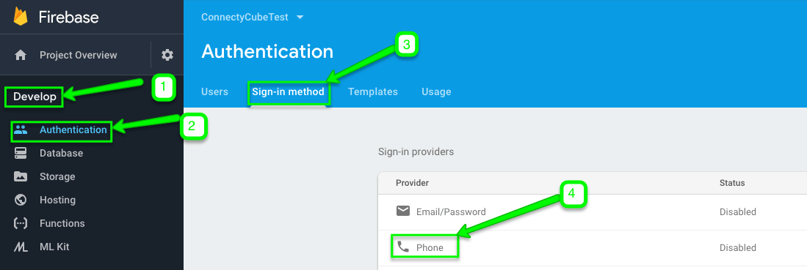
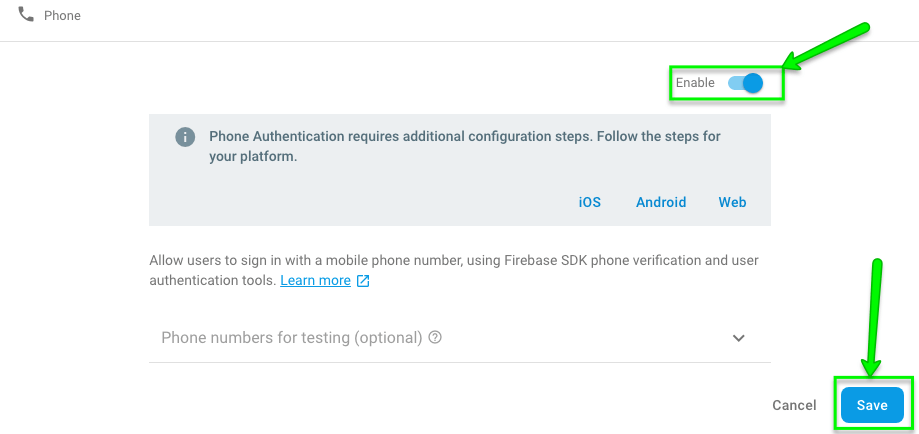

## Firebase account and project registration

Follow these steps to register your Firebase account and create a Firebase project:

1. **Register a Firebase account** at [Firebase console](https://console.firebase.google.com/) .
   You can use your Google account to authenticate at Firebase.

2. Click **Create project**

   

   > **Note**: If you have a Google project registered for your mobile app, select it from the **Project name** dropdown menu.

   You can also edit your **Project ID** if you need. A unique ID is assigned automatically to each project. This ID is used in publicly visible Firebase features. For example, it will be used in database URLs and in your Firebase Hosting subdomain. If you need to use a specific subdomain, you can change it.

3. Fill in the fields required (Project name, Project ID, etc.) and click **Continue**.

   

   

4. Configure Google Analytics for your project and click **Create project**.

   

   Then click Continue.

   

5. Select platform for which you need Firebase

   

   If you already have an app in your project, go to project Overview page and click Add another app link:

   

## Connect Firebase SDK

Here is a step by step guide how to connect Firebase SDK to your **Web** Project:

1. Copy the code from **Add Firebase to your web app** screen and paste it in the **<head>** tag of your HTML page before other script tags:

   

   > **Note**: The above code snippet should be used to initialize Firebase Javascript SDK for _Authentication, Cloud Storage, Realtime Database_, and _Cloud Firestore_. You can include only the features that you need. In our case **Authentication (firebase-auth)** component is necessary. If you use **FCM push notifications on Web**, then you need to include **Firebase Cloud Messaging (firebase-messaging)** component as well.

2. From the CDN you need to **include the following components**:

   ```html
   <!-- Firebase App is always required and must be first -->
   <script src="https://www.gstatic.com/firebasejs/5.3.0/firebase-app.js"></script>
   <!-- Add additional services that you want to use -->
   <script src="https://www.gstatic.com/firebasejs/5.3.0/firebase-auth.js"></script>
   <script src="https://www.gstatic.com/firebasejs/5.3.0/firebase-messaging.js"></script>
   <script>
     const config = {
       // ...
     };

     firebase.initializeApp(config);
   </script>
   ```

   In case you are using a bundler like Browserify or webpack, you can just require() the components that you use:

   ```javascript
   // Firebase App is always required and must be first
   const firebase = require("firebase/app");

   // Add additional services that you want to use
   require("firebase/auth");
   require("firebase/messaging");

   const config = {
     // ...
   };

   firebase.initializeApp(config);
   ```

## Firebase authentication

This option allows users in your app authenticate themselves via phone number. If you use this method for user authentication, the user receives an SMS with verification code and authenticates via that code in your app.

You need to follow these steps to add Firebase authentication to your Web project:

1. Go to **Firebase console >> Authentication >> Sign-in method** section:

   

2. Enable **Phone** number sign-in method:

   

3. In **Firebase console >> Authentication >> Sign-in method** section check **Authorized domains** block and if your domain that will host your app is not added there, add it:

   

   Then enter your domain name on the pop-up window that appears and click **Add**:

   

4. Set up **reCAPTCHA verification**:

   > **Note**: If you use Firebase SDK's `RecaptchaVerifier` object, Firebase creates and handles any necessary client keys and secrets automatically, so you do not need to set up a reCAPTCHA client manually.

   **reCAPTCHA** options:

   1. **Invisible reCAPTCHA**

   `RecaptchaVerifier` object supports [invisible reCAPTCHA](https://www.google.com/recaptcha/intro/invisible.html), which can verify the user without requiring any user action.

   In order to set it you need to create a `RecaptchaVerifier` object with the `size` parameter set to `invisible`, specifying the ID of the button that submits your sign-in form:

   ```javascript
   window.recaptchaVerifier = new firebase.auth.RecaptchaVerifier("sign-in-button", {
     size: "invisible",
     callback: (response) => {
       // reCAPTCHA solved, allow signInWithPhoneNumber.
       onSignInSubmit();
     },
   });
   ```

````

 2) **reCAPTCHA widget**

 `RecaptchaVerifier` object supports reCAPTCHA widget, which always requires user interaction to complete successfully.

 In order to set it you need create an element on your page to contain the widget, and then create a `RecaptchaVerifier` object, specifying the ID of the container when you do so.

 ```javascript
 window.recaptchaVerifier = new firebase.auth.RecaptchaVerifier('recaptcha-container');
````

**Optional features**:

1. **Localization**

reCAPTCHA can be localized by updating the language code on the Auth instance before rendering the reCAPTCHA. This localization will apply to the SMS message with verification code sent to the user as well.

```javascript
firebase.auth().languageCode = "it";
// To apply the default browser preference instead of explicitly setting it.
// firebase.auth().useDeviceLanguage();
```

2. **reCAPTCHA parameters**

It is possible to set callback functions on the `RecaptchaVerifier` object that are called when the user solves the reCAPTCHA or the reCAPTCHA expires before the user submits the form:

```javascript
window.recaptchaVerifier = new firebase.auth.RecaptchaVerifier("recaptcha-container", {
  size: "normal",
  callback: (response) => {
    // reCAPTCHA solved, allow signInWithPhoneNumber.
    // ...
  },
  "expired-callback": () => {
    // Response expired. Ask user to solve reCAPTCHA again.
    // ...
  },
});
```

3. **Pre-render the reCAPTCHA**

It is possible to pre-render the reCAPTCHA before you submit a sign-in request, if you call `render`:

```javascript
recaptchaVerifier.render().then((widgetId) => {
  window.recaptchaWidgetId = widgetId;
});
```

After `render` resolves, you get the **reCAPTCHA's widget ID**. You can use it to make calls to the [reCAPTCHA](https://developers.google.com/recaptcha/intro) API:

```javascript
const recaptchaResponse = grecaptcha.getResponse(window.recaptchaWidgetId);
```

5. Send a verification code to user’s phone:

   In order to request that Firebase send an authentication code to the user's phone by SMS, set an interface that prompts users to provide their phone number, and then call `signInWithPhoneNumber` as follows:

   1. Get the user’s phone number

   > **Note**
   >
   > As a best practice please do not forget to inform your users that if they use phone sign-in, they might receive an SMS message for verification and standard rates apply.

   2. Call `signInWithPhoneNumber`, passing to it the user's phone number and `RecaptchaVerifier` you created earlier:

   ```javascript
   const phoneNumber = getPhoneNumberFromUserInput();
   const appVerifier = window.recaptchaVerifier;

   firebase
     .auth()
     .signInWithPhoneNumber(phoneNumber, appVerifier)
     .then((confirmationResult) => {
       // SMS sent. Prompt user to type the code from the message, then sign the
       // user in with confirmationResult.confirm(code).
       window.confirmationResult = confirmationResult;
     })
     .catch((error) => {
       // Error; SMS not sent
       // ...
     });
   ```

   If `signInWithPhoneNumber` results in an error, reset reCAPTCHA so that the user can try verifying again:

   ```javascript
   grecaptcha.reset(window.recaptchaWidgetId);

   // Or, if you haven't stored the widget ID:
   window.recaptchaVerifier.render().then(widgetId => {
     grecaptcha.reset(widgetId);
   }
   ```

   > **Note**: `signInWithPhoneNumber` method issues reCAPTCHA challenge to the user, and if the user passes the challenge, requests that Firebase Authentication send an SMS message containing a verification code to the user's phone.

6. Sign in the user with the verification code:

   1. Once the call to `signInWithPhoneNumber` succeeds, you need to prompt the user to type the verification code they received by SMS.

   2. Then, sign in the user by passing the code to `confirm` method of `ConfirmationResult` object that was passed to `signInWithPhoneNumber`'s fulfillment handler (that is, its `then` block):

   ```javascript
   const code = getCodeFromUserInput();

   let user;

   confirmationResult
     .confirm(code)
     .then((result) => {
       // User signed in successfully.
       user = result.user;
       // ...
     })
     .catch((error) => {
       // User couldn't sign in (bad verification code?)
       // ...
     });
   ```

   If the call to `confirm` succeeded, the user is successfully signed in.

   3. Get the intermediate `AuthCredential` object:

   If you need to get an `AuthCredential` object for the user's account, pass the verification code from the confirmation result and the verification code to `PhoneAuthProvider.credential` instead of calling `confirm`:

   ```javascript
   const credential = firebase.auth.PhoneAuthProvider.credential(confirmationResult.verificationId, code);
   ```

   Then, you can sign in the user with the credential:

   ```javascript
   let user;

   firebase
     .auth()
     .signInAndRetrieveDataWithCredential(credential)
     .then((result) => {
       // User signed in successfully.
       user = result.user;
     })
     .catch((error) => {});
   ```

7. Get **Firebase accessToken** after SMS code verification as follows:

   ```javascript
   let accessToken;
   user.getIdToken().then((idToken) => {
     accessToken = idToken;
   });
   ```

8. Get your **Project ID** from your **Firebase console**:

   

9. Pass your Firebase `project_id` and Firebase `access_token` parameters to `login` method:

   ```javascript
   const userCredentials = {
     provider: 'firebase_phone',
     firebase_phone[project_id]: '...',
     firebase_phone[access_token]: accessToken
   };

   ConnectyCube.login(userCredentials)
       .then(user => {});
       .catch(error => {});
   ```

10. Try running a test.

Once your user is logged in successfully, you will find him/her in your **Dashboard >> Your App >> Users** section.


So now you know how to use Firebase features in your ConnectyCube apps. If you have any difficulties - please let us know via [support channel](mailto:support@connectycube.com)

```

```
