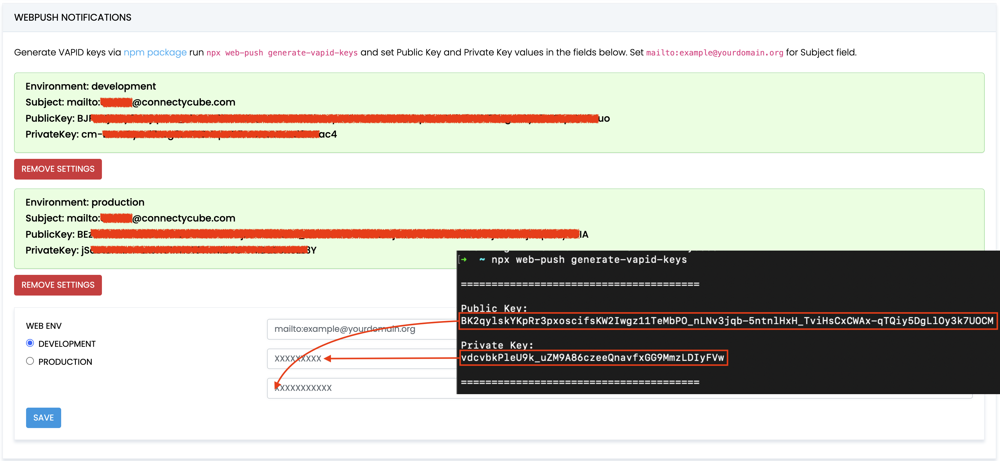

Push Notifications provide a way to deliver some information to users while they are not using your app actively.
The following use cases can be covered additionally with push notifications:

- send a chat message when a recipient is offline (a push notification will be initiated automatically in this case)
- make a video call with offline opponents (need to send a push notification manually)

## Configuration

In order to start work with push notifications you need to configure it.

1. Generate VAPID keys via npm package: run `npx web-push generate-vapid-keys` to get **Public Key** and **Private Key** values. 

2. Set keys in  ConnectyCube dashboard: 

    - Open your ConnectyCube Dashboard at [admin.connectycube.com](https://admin.connectycube.com)
    - Go to **Push notifications** module, **Credentials** page
    - Set **Public Key** and **Private Key** values in the fields for "WebPush Notifications". Set `mailto:example@yourdomain.org` for Subject field.

    

## Subscribe to push notifications

1. Create a service worker file (`*.js`) and place it on your site.

2. Use the following example to register the Service Worker at the correct path and subscribe to [PushManager](https://developer.mozilla.org/en-US/docs/Web/API/PushManager) using the **Public Key** as the `applicationServerKey`:

    ```javascript
    const registration = await navigator.serviceWorker
      .register("path_to/serviceWorker.js");
    const subscription = await registration.pushManager
      .subscribe({
        applicationServerKey: "<public-key>",
        userVisibleOnly: true
      });
    const subscriptionData = subscription.toJSON();
    ```

3. Retrieve `subscriptionData` to create ConnectyCube subscription:

    ```javascript
    const uniqDeviceIdentifier = "<fingerprint>" // Any unique fingerprint to identify the subscription with the browser tab, e.g. https://github.com/fingerprintjs/fingerprintjs
    const params = {
      notification_channels: "web",
      device: {
        platform: "web",
        udid: uniqDeviceIdentifier,
      },
      push_token: {
        environment: "development",
        web_endpoint: subscriptionData.endpoint,
        web_auth: subscriptionData.auth,
        web_p256dh: subscriptionData.p256dh,
      },
    };

    const result = await ConnectyCube.pushnotifications.subscriptions.create(params);
    ```

## Send push notifications

You can manually initiate a push notification to user/users on any event in your application. To do so you need to form a push notification parameters (payload) and set the push recipients:

```javascript
const payload = JSON.stringify({ message: "This is a new chat message" });
const params = {
  notification_type: "push",
  user: { ids: [21, 12] }, // recipients.
  environment: "development", // environment, can be 'production'.
  message: ConnectyCube.pushnotifications.base64Encode(payload),
};

const result = await ConnectyCube.pushnotifications.events.create(params);
```

## Receive push notifications

You will receive notifications in the service worker and display them using the [Notification API](https://developer.mozilla.org/en-US/docs/Web/API/Notifications_API).

To successfully use the [`ServiceWorkerRegistration: showNotification()`](https://developer.mozilla.org/en-US/docs/Web/API/ServiceWorkerRegistration/showNotification) method, you first need to request permission via the [`Notification: requestPermission()`](https://developer.mozilla.org/en-US/docs/Web/API/Notification/requestPermission_static) method.

The following code demonstrates how to handle push notifications in a service worker:

```javascript
self.addEventListener('install', (event) => {
  self.skipWaiting();
});

self.addEventListener('push', (event) => {
  const data = event.data.json().data;
  const title = data.title;
  const options = { body: data.message, icon: data.photo };

  event.waitUntil(self.registration.showNotification(title, options));
});

self.addEventListener('notificationclick', (event) => {
  event.notification.close();
  event.waitUntil(clients.openWindow('/'));
});

```

## Unsubscribe

In order to unsubscribe and stop receiving push notifications you need to list your current subscriptions and then choose those to be deleted:

```javascript
const subscriptions = await ConnectyCube.pushnotifications.subscriptions
  .list();
const subscriptionId = subscriptions[0].subscription.id;
const result = await ConnectyCube.pushnotifications.subscriptions
  .delete(subscriptionId);
```