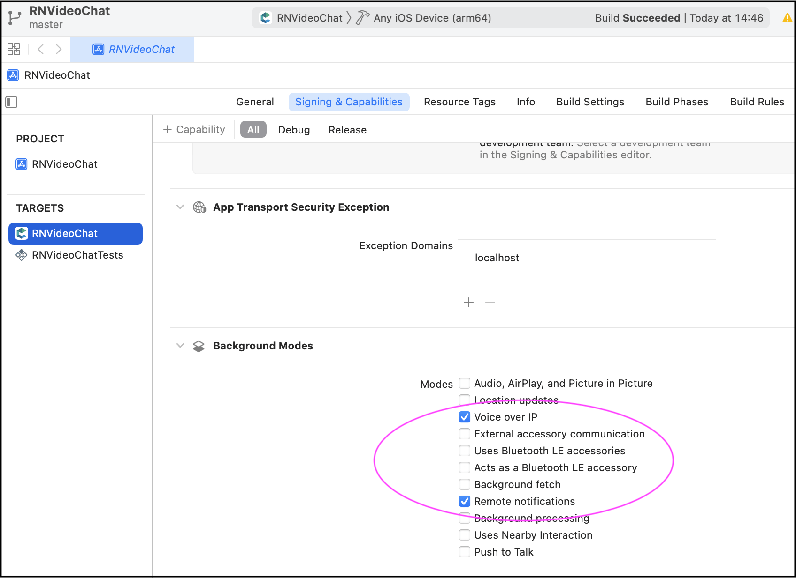

import { Aside } from '@astrojs/starlight/components';

ConnectyCube **Multiparty Video Conferencing API** is built on top of [WebRTC](https://webrtc.org/) protocol and based on top of [WebRTC SFU](https://webrtcglossary.com/sfu/) architecture.

Max people per Conference call is 12.

Video Conferencing is available starting from [Advanced plan](https://connectycube.com/pricing/).

> To get a difference between **P2P calling** and **Conference calling** please read our [ConnectyCube Calling API comparison](https://connectycube.com/2020/04/15/connectycube-calling-api-comparison/) blog page.

## Features supported

- Video/Audio Conference with up to 12 people
- Join-Rejoin video room functionality (like Skype)
- Guest rooms
- Mute/Unmute audio/video streams
- Display bitrate
- Switch video input device (camera)
- Switch audio input device (microphone)

## Preparations

### Connect adapter.js

Make sure you connected the latest version of [adapter.js](https://github.com/webrtc/adapter/tree/master/release)

<Aside  type="caution" title="Note">If you use Chrome browser and emulate iOS device - you may get "The adapter.js addTrack polyfill only supports a single stream which is associated with the specified track" error. That's a known issue with adapter.js where it wrongly parses the user agent. Either use real iOS device or Safari browser to test iOS behaviour.</Aside>

### Set up config

In order to start working with Multiparty Video Conferencing API you need to initialize a client:

```javascript
const credentials = {
  appId: ...,
  authKey: "...",
}

const MULTIPARTY_SERVER_ENDPOINT = 'wss://...:8989';

const appConfig = {
  debug: { mode: 1 },
  conference: { server: MULTIPARTY_SERVER_ENDPOINT },
}

ConnectyCube.init(credentials, appConfig)
```

> Default multiparty server endpoint is wss://janus.connectycube.com:8989 ([see](/js/#default-configuration)).

## Create meeting

In order to have a conference call, a meeting object has to be created.

```javascript
const params = {
  name: "My meeting",
  start_date: timestamp,
  end_date: timestamp
  attendees: [
    {id: 123, email: "..."},
    {id: 124, email: "..."}
  ],
  record: false,
  chat: false
};

ConnectyCube.meeting.create(params)
  .then(meeting => {
    const confRoomId = meeting._id;
  })
  .catch(error => { });
```

- As for `attendees` - either ConnectyCube users ids or external emails can be provided.
- If you want to schedule a meeting - pass `start_date` and `end_date`.
- Pass `chat: true` if you want to have a chat connected to meeting.
- Pass `record: true` if you want to have a meeting call recorded. Read more about Recording feature https://connectycube.com/2021/02/23/connectycube-releases-server-side-calls-recording-along-with-new-meetings-api/

Once meeting is created, you can use `meeting._id` as a conf room identifier in the below requests when join a call.

## Create call session

Once a meeting is created/retrieved, you can create a conf call session. Normally, each browser tab will need a single session with the server:

```javascript
const session = ConnectyCube.videochatconference.createNewSession();
```

Once a session is created, you can interact with a Video Conferencing API.

## Access local media stream

In order to have a video chat session you need to get an access to the user's devices (webcam / microphone):

```javascript
const mediaParams = {
  audio: true,
  video: true,
};

session
  .getUserMedia(mediaParams)
  .then((localStream) => {})
  .catch((error) => {});
```

This method lets the browser ask the user for permission to use devices. You should allow this dialog to access the stream. Otherwise, the browser can't obtain access and will throw an error for `getUserMedia` callback function.

For more information about possible audio/video constraints, here is a good code sample from WebRTC team how to work with getUserMedia constraints: https://webrtc.github.io/samples/src/content/getusermedia/resolution/

### HD video quality

If HD video quality is required - the following audio/video constraints are required to pass:

```javascript
{video: { width: 1280, height: 720 }, audio: true}
```

More info about all possible is are available here https://developer.mozilla.org/en-US/docs/Web/API/MediaDevices/getUserMedia

## Attach local media stream

Then you should attach your local media stream to HTML video element.

For **Web-like environments**, including Cordova - use the following method:

```javascript
session.attachMediaStream("myVideoElementId", localStream, {
  muted: true,
  mirror: true,
});
```

For **ReactNative environment** - use the following method:

```javascript
import {RTCView} from 'react-native-connectycube';

// pass a local or remote stream to the RTCView component
...
<RTCView  objectFit="cover" style={styles.rtcView} key={userId} streamURL={localStream.toURL()} />
...
```

## Join room

To jump into video chat with users you should join it:

```javascript
session
  .join(confRoomId, userId, userDisplayName)
  .then(() => {})
  .catch((error) => {});
```

To check current joined video room use the following property:

```javascript
const confRoomId = session.currentRoomId;
```

## Join as listener

It can be a requirement where it needs to join a room as listener only, w/o publishing own media stream. It can be useful for a case with a teacher and many students where normally students join a call as listeners and only a teacher publishes own media stream:

```javascript
session
  .joinAsListener(confRoomId, userId, userDisplayName)
  .then(() => {})
  .catch((error) => {});
```

## List online participants

To list online users in a room:

```javascript
session
  .listOfOnlineParticipants()
  .then((participants) => {})
  .catch((error) => {});
```

## Events

There are 6 events you can listen for:

```javascript
ConnectyCube.videochatconference.onParticipantJoinedListener = (
  session,
  userId,
  userDisplayName,
  isExistingParticipant
) => {};
ConnectyCube.videochatconference.onParticipantLeftListener = (session, userId) => {};
ConnectyCube.videochatconference.onRemoteStreamListener = (session, userId, stream) => {};
ConnectyCube.videochatconference.onSlowLinkListener = (session, userId, uplink, nacks) => {};
ConnectyCube.videochatconference.onRemoteConnectionStateChangedListener = (session, userId, iceState) => {};
ConnectyCube.videochatconference.onSessionConnectionStateChangedListener = (session, iceState) => {};
ConnectyCube.videochatconference.onErrorListener = (session, error) => {};
```

## Mute/Unmute audio

You can mute/unmute your own audio:

```javascript
// mute
session.muteAudio();

// unmute
session.unmuteAudio();

//check mute state
session.isAudioMuted(); // true/false
```

## Mute/Unmute video

You can mute/unmute your own video:

```javascript
// mute
session.muteVideo();

// unmute
session.unmuteVideo();

//check mute state
session.isVideoMuted(); // true/false
```

## List of devices

```javascript
// get all devices
ConnectyCube.videochatconference
  .getMediaDevices()
  .then((allDevices) => {})
  .catch((error) => {});

// only video devices
ConnectyCube.videochatconference
  .getMediaDevices(ConnectyCube.videochatconference.DEVICE_INPUT_TYPES.VIDEO)
  .then((videoDevices) => {})
  .catch((error) => {});

// only audio devices
ConnectyCube.videochatconference
  .getMediaDevices(ConnectyCube.videochatconference.DEVICE_INPUT_TYPES.AUDIO)
  .then((audioDevices) => {})
  .catch((error) => {});
```

## Switch video(camera)/audio(microphone) input device

```javascript
const deviceId = "...";

// switch video
session
  .switchMediaTracks({ video: deviceId })
  .then((updatedLocaStream) => {}) // you can reattach local stream
  .catch((error) => {});
// switch audio
session
  .switchMediaTracks({ audio: deviceId })
  .then((updatedLocaStream) => {}) // you can reattach local stream
  .catch((error) => {});
```

## Screen Sharing

Request a desktop stream by calling `getDisplayMedia`:

```javascript
const constraints = {
  video: {
    width: 1280,
    height: 720,
    frameRate: { ideal: 10, max: 15 },
  },
  audio: true,
};

session
  .getDisplayMedia(constraints)
  .then((localDesktopStream) => {})
  .catch((error) => {});
```

More info about what else options can be passed can be found here https://developer.mozilla.org/en-US/docs/Web/API/MediaDevices/getDisplayMedia

If the local stream already exists, the next call to getUserMedia or getDisplayMedia will update the tracks in the stream and preserve the track's enabled state for the audio track.

## Get remote user bitrate

```javascript
const bitrate = session.getRemoteUserBitrate(userId);
```

## Get remote user mic level

```javascript
const micLevel = session.getRemoteUserVolume(userId);
```

## Leave room and destroy conf session

To leave current joined video room:

```javascript
session
  .leave()
  .then(() => {})
  .catch((error) => {});
```

## Retrieve meetings

Retrieve a meeting by id:

```javascript
const params = {
  _id: meetingId,
};
ConnectyCube.meeting
  .get(params)
  .then((meeting) => {})
  .catch((error) => {});
```

Retrieve a list of meetings:

```javascript
const params = { limit: 5, offset: 0 };
ConnectyCube.meeting
  .get(params)
  .then((meetings) => {})
  .catch((error) => {});
```

## Edit meeting

A meeting creator can edit a meeting:

```javascript
const params = { name, start_date, end_date };

ConnectyCube.meeting
  .update(meetingId, params)
  .then((meeting) => {})
  .catch((error) => {});
```

## Delete meeting

A meeting creator can delete a meeting:

```javascript
ConnectyCube.meeting
  .delete(meetingId)
  .then(() => {})
  .catch((error) => {});
```

## Recording

Server-side recording is available. Read more about Recording feature https://connectycube.com/2021/02/23/connectycube-releases-server-side-calls-recording-along-with-new-meetings-api/

### Retrieve recordings with download url

```javascript
ConnectyCube.meeting
  .getRecordings(meetingId)
  .then(() => {})
  .catch((error) => {});
```

## Continue calling in background

If you are developing dedicated apps for iOS and Android - it's required to apply additional configure for the app to continue playing calling audio when it goes into the background.

On iOS: there is no way to continue a video call in background because of some OS restrictions. What is supported there is to continue with voice calling while an app is in background. Basically, the recommended to achieve this is to switch off device camera when an app goes to background and then switch camera on back when an app goes to foreground.

Furthermore, even voice background call are blocked by default on iOS. To unblock - you need to setup proper background mode capabilities in your project. Please find the [Enabling Background Audio link](https://developer.apple.com/documentation/avfoundation/media_playback_and_selection/creating_a_basic_video_player_ios_and_tvos/enabling_background_audio) with more information how to do it properly. Generally speaking, you need to enable `Voice over IP` and `Remote notifications` capabilities:

  

For Android, we also recommend to implement the same camera switch flow when go to background and then return to foreground.

