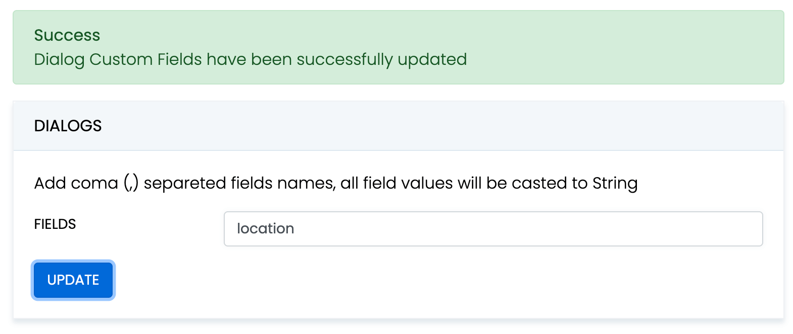

ConnectyCube Chat API is built on top of Real-time(XMPP) protocol.
In order to use it you need to setup real-time connection with ConnectyCube Chat server and use it to exchange data.

By default Real-time Chat works over secure TLS connection.

## Connect to chat

```javascript
const userCredentials = {
  userId: 4448514,
  password: "awesomepwd",
};

ConnectyCube.chat
  .connect(userCredentials)
  .then(() => {
    // connected
  })
  .catch((error) => {});
```

### Connect to chat using custom authentication providers

In some cases we don't have a user's password, for example when login via:

- Facebook
- Twitter
- Firebase phone authorization
- Custom identity authentication
- etc.

In such cases ConnectyCube API provides possibility to use ConnectyCube session token as a password for chat connection:

<!-- tabs:start -->

```java
// get current ConnectyCube session token and set as user's password
const token = ConnectyCube.service.sdkInstance.session.token;

const userCredentials = {
    userId: 4448514,
    password: token
};
```

## Connection status

The following snippet can be used to determine whether a user is connected to chat or not:

```javascript
const isConnected = ConnectyCube.chat.isConnected;
```

## Disconnect

```javascript
ConnectyCube.chat.disconnect();

ConnectyCube.chat.onDisconnectedListener = onDisconnectedListener;

function onDisconnectedListener() {}
```

## Reconnection

The SDK reconnects automatically when connection to Chat server is lost.

The following 2 callbacks are used to track the state of connection:

```javascript
ConnectyCube.chat.onDisconnectedListener = onDisconnectedListener;
ConnectyCube.chat.onReconnectListener = onReconnectListener;

function onDisconnectedListener() {}
function onReconnectListener() {}
```

## Dialogs

All chats between users are organized in dialogs.
The are 4 types of dialogs:

- 1-1 chat - a dialog between 2 users.
- group chat - a dialog between specified list of users.
- public group chat - an open dialog. Any user from your app can chat there.
- broadcast - chat where a message is sent to all users within application at once. All the users from the application are able to join this group. Broadcast dialogs can be created only via Admin panel.

You need to create a new dialog and then use it to chat with other users. You also can obtain a list of your existing dialogs.

## Create new dialog

### Create 1-1 chat

You need to pass `type: 3` (1-1 chat) and an id of an opponent you want to create a chat with:

```javascript
const params = {
  type: 3,
  occupants_ids: [56],
};

ConnectyCube.chat.dialog
  .create(params)
  .then((dialog) => {})
  .catch((error) => {});
```

### Create group chat

You need to pass `type: 2` and ids of opponents you want to create a chat with:

```javascript
const params = {
  type: 2,
  name: "Friday party",
  occupants_ids: [29085, 29086, 29087],
  description: "lets dance the night away",
  photo: "party.jpg",
};

ConnectyCube.chat.dialog
  .create(params)
  .then((dialog) => {})
  .catch((error) => {});
```

### Create public group chat

It's possible to create a public group chat, so any user from you application can join it. There is no a list with occupants, this chat is just open for everybody.

You need to pass `type: 4` and ids of opponents you want to create a chat with:

```javascript
const params = {
  type: 4,
  name: "Blockchain trends",
};

ConnectyCube.chat.dialog
  .create(params)
  .then((dialog) => {})
  .catch((error) => {});
```

Response example from `ConnectyCube.chat.dialog.create(params)` - [see](/server/chat#response-1)

### Chat metadata

A dialog can have up to 3 custom sub-fields to store additional information that can be linked to chat. 

To start using extensions, allowed fields should be added first. Go to [Admin panel](https://admin.connectycube.com) > Chat > Custom Fields and provide allowed custom fields.



When create a dialog, the `extensions` field object must contain allowed fields only. Others fields will be ignored. The values will be casted to string.

```javascript
const params = {
  type: 2,
  name: "Friday party",
  occupants_ids: [29085, 29086, 29087],
  description: "lets dance the night away",
  extensions: {location: "Sun bar"},
};

ConnectyCube.chat.dialog
  .create(params)
  .then((dialog) => {})
  .catch((error) => {});
```

When remove custom field in Admin panel, this field will be removed in all dialogs respectively.

These parameters also can be used as a filter for retrieving dialogs.

### Chat permissions

Chat could have different permissions to managa data access. This is managed via `permissions` field.

At the moment, only one permission available - `allow_preview` - which allows to retrieve dialog's messages for user who is not a member of dialog. This is useful when implement feature like Channels where a user can open chat and preview messages w/o joining it.

## List dialogs

It's common to request all your dialogs on every app login:

```javascript
const filters = {};

ConnectyCube.chat.dialog
  .list(filters)
  .then((result) => {})
  .catch((error) => {});
```

Response example from `ConnectyCube.chat.dialog.list(filters)` - [see](/server/chat#response)

More filters available [here](/server/chat#retrieve-chat-dialogs)

If you want to retrieve only dialogs updated after some specific date time, you can use `updated_at[gt]` filter. This is useful if you cache dialogs somehow and do not want to obtain the whole list of your dialogs on every app start.

## Update dialog

User can update group chat name, photo or add/remove occupants:

```javascript
const dialogId = "5356c64ab35c12bd3b108a41";
const toUpdateParams = { name: "Crossfit2" };

ConnectyCube.chat.dialog
  .update(dialogId, toUpdateParams)
  .then((dialog) => {})
  .catch((error) => {});
```

## Add/Remove occupants

To add more occupants use `push_all` operator.
To remove yourself from the dialog use `pull_all` operator:

```javascript
const dialogId = "5356c64ab35c12bd3b108a41";
const toUpdateParams = { push_all: { occupants_ids: [97, 789] } };

ConnectyCube.chat.dialog
  .update(dialogId, toUpdateParams)
  .then((dialog) => {})
  .catch((error) => {});
```

Response example from `ConnectyCube.chat.dialog.update(dialogId, toUpdateParams)` - [see](/server/chat#response-2)

> **Note**
>
> Only group chat owner can remove other users from group chat.

## Remove dialog

The following snippet is used to delete a dialog:

```javascript
const dialogId = "5356c64ab35c12bd3b108a41";
// const dialogIds = ['5356c64ab35c12bd3b108a41', ..., '5356c64ab35c12bd3b108a84']

ConnectyCube.chat.dialog.delete(dialogId).catch((error) => {});
```

This request will remove this dialog for current user, but other users still will be able to chat there.
Only group chat owner can remove the group dialog for all users.

You can also delete multiple dialogs in a single request.

## Clear dialog history

The following snippet is used to clear dialog history by ID:

```javascript
const dialogId = "5356c64ab35c12bd3b108a41";

ConnectyCube.chat.dialog.clearHistory(dialogId).catch((error) => {});
```

This request will clear all messages in the dialog for current user, but not for other users.

## Subscribe to dialog

In order to be able to chat in public dialog, you need to subscribe to it:

```javascript
const dialogId = "5356c64ab35c12bd3b108a41";

ConnectyCube.chat.dialog
  .subscribe(dialogId)
  .then((dialog) => {})
  .catch((error) => {});
```

It's also possible to subscribe to group chat dialog.

Response example from `ConnectyCube.chat.dialog.subscribe(dialogId)` - [see](/server/chat#response-5)

## Unsubscribe from dialog

```javascript
const dialogId = "5356c64ab35c12bd3b108a41";

ConnectyCube.chat.dialog.unsubscribe(dialogId).catch((error) => {});
```

## Retrieve public dialog occupants

A public chat dialog can have many occupants. There is a separated API to retrieve a list of public dialog occupants:

```javascript
const dialogId = "5356c64ab35c12bd3b108a41";

ConnectyCube.chat.dialog
  .getPublicOccupants(dialogId)
  .then((result) => {
    // result.items
  })
  .catch((error) => {});
```

Response example from `ConnectyCube.chat.dialog.getPublicOccupants(dialogId)`:

```json
{
  "items": [
    {
      "id": 51941,
      "full_name": "Dacia Kail",
      "email": "dacia_k@domain.com",
      "login": "Dacia",
      "phone": "+6110797757",
      "website": null,
      "created_at": "2018-12-06T09:16:26Z",
      "updated_at": "2018-12-06T09:16:26Z",
      "last_request_at": null,
      "external_user_id": 52691165,
      "facebook_id": "91234409",
      "twitter_id": "83510562734",
      "blob_id": null,
      "custom_data": null,
      "avatar": null,
      "user_tags": null
    },
    {
      "id": 51946,
      "full_name": "Gabrielle Corcoran",
      "email": "gabrielle.corcoran@domain.com",
      "login": "gabby",
      "phone": "+6192622155",
      "website": "http://gabby.com",
      "created_at": "2018-12-06T09:29:57Z",
      "updated_at": "2018-12-06T09:29:57Z",
      "last_request_at": null,
      "external_user_id": null,
      "facebook_id": "95610574",
      "twitter_id": null,
      "blob_id": null,
      "custom_data": "Responsible for signing documents",
      "avatar": null,
      "user_tags": "vip,accountant"
    }
    ...
  ]
}
```

## Add / Remove admins

Options to add or remove admins from the dialog can be done by Super admin (dialog's creator) only. Options are supported in group chat, public or broadcast.

Up to 5 admins can be added to chat.

```javascript
const dialogId = "5356c64ab35c12bd3b108a41";
const adminsUsersIds = [45, 89];

ConnectyCube.chat.dialog
  .addAdmins(dialogId, adminsUsersIds)
  .then((dialog) => {})
  .catch((error) => {});
```

```javascript
const dialogId = "5356c64ab35c12bd3b108a41";
const adminsUsersIds = [45, 89];

ConnectyCube.chat.dialog
  .removeAdmins(dialogId, adminsUsersIds)
  .then((dialog) => {})
  .catch((error) => {});
```

Response example from `ConnectyCube.chat.dialog.addAdmins(dialogId, adminsUsersIds)`/`ConnectyCube.chat.dialog.removeAdmins(dialogId, adminsUsersIds)` - [see](/server/chat#response-7)

## Update notifications settings

A user can turn on/off push notifications for offline messages in a dialog. By default push notification are turned ON, so offline user receives push notifications for new messages in a chat.

```javascript
const dialogId = "5356c64ab35c12bd3b108a41";
const enabled = false;

ConnectyCube.chat.dialog
  .updateNotificationsSettings(dialogId, enabled)
  .then((result) => {})
  .catch((error) => {});
```

Response example from `ConnectyCube.chat.dialog.updateNotificationsSettings(dialogId, enabled)` - [see](/server/chat#response-8)

## Get notifications settings

Check a status of notifications setting - either it is ON or OFF for a particular chat.

Available responses: 1 - enabled, 0 - disabled.

```javascript
const dialogId = "5356c64ab35c12bd3b108a41";

ConnectyCube.chat.dialog
  .getNotificationsSettings(dialogId)
  .then((result) => {})
  .catch((error) => {});
```

Response example from `ConnectyCube.chat.dialog.getNotificationsSettings(dialogId)` - [see](/server/chat#response-9)

## Chat history

Every chat dialog stores its chat history which you can retrieve:

```javascript
const dialogId = "5356c64ab35c12bd3b108a41";
const params = {
  chat_dialog_id: dialogId,
  sort_desc: "date_sent",
  limit: 100,
  skip: 0,
};

ConnectyCube.chat.message
  .list(params)
  .then((messages) => {})
  .catch((error) => {});
```

Response example from `ConnectyCube.chat.message.list(params)` - [see](/server/chat#response-10)

If you want to retrieve chat messages that were sent after or before specific date time only, you can use `date_sent[gt]` or `date_sent[lt]` filter. This is useful if you implement pagination for loading messages in your app.

## Send/Receive chat messages

### 1-1 chat

```javascript
const dialog = ...;
const opponentId = 78;
const message = {
  type: dialog.type === 3 ? 'chat' : 'groupchat',
  body: "How are you today?",
  extension: {
    save_to_history: 1,
    dialog_id: dialog._id
  }
};

message.id = ConnectyCube.chat.send(opponentId, message);

// ...

ConnectyCube.chat.onMessageListener = onMessage;

function onMessage(userId, message) {
    console.log('[ConnectyCube.chat.onMessageListener] callback:', userId, message)
}
```

### Group chat

> The group chat join is not a required step anymore. You can send/receive chat messages in a group chat w/o joining it.

Before you start chatting in a group dialog, you need to join it by calling `join` function:

```javascript
const dialog = ...;

ConnectyCube.chat.muc.join(dialog._id).catch(error => {});
```

Then you are able to send/receive messages:

```javascript
const message = {
  type: dialog.type === 3 ? "chat" : "groupchat",
  body: "How are you today?",
  extension: {
    save_to_history: 1,
    dialog_id: dialog._id,
  }
};

message.id = ConnectyCube.chat.send(dialog._id, message);

// ...

ConnectyCube.chat.onMessageListener = onMessage;

function onMessage(userId, message) {
  console.log("[ConnectyCube.chat.onMessageListener] callback:", userId, message);
}
```

When it's done you can leave the group dialog by calling `leave` function:

```javascript
ConnectyCube.chat.muc.leave(dialog._id).catch((error) => {});
```

## Message metadata

A chat message can have custom sub-fields to store additional information that can be linked to the particular chat message.

When create a message, the custom data can be attached via `extension` field:

```javascript
const message = {
  ...
  extension: {
    field_one: "value_one",
    field_two: "value_two"
  }
};
```

## 'Sent' status

There is a 'sent' status to ensure that message is delivered to the server.

In order to use the feature you need to enable it when you pass config in `ConnectyCube.init`:

```javascript
chat: {
  streamManagement: {
    enable: true;
  }
}
```

The following callback is used to track it:

```javascript
ConnectyCube.chat.onSentMessageCallback = function (messageLost, messageSent) {};
```

## 'Delivered' status

The following callback is used to track the 'delivered' status:

```javascript
ConnectyCube.chat.onDeliveredStatusListener = function (messageId, dialogId, userId) {
  console.log("[ConnectyCube.chat.onDeliveredStatusListener] callback:", messageId, dialogId, userId);
};
```

The SDK sends the 'delivered' status automatically when the message is received by the recipient.
This is controlled by `markable: 1` parameter when you send a message. If `markable` is `0` or omitted, then you can send the delivered status manually:

```javascript
const params = {
  messageId: "557f1f22bcf86cd784439022",
  userId: 21,
  dialogId: "5356c64ab35c12bd3b108a41",
};

ConnectyCube.chat.sendDeliveredStatus(params);
```

## 'Read' status

Send the 'read' status:

```javascript
const params = {
  messageId: "557f1f22bcf86cd784439022",
  userId: 21,
  dialogId: "5356c64ab35c12bd3b108a41",
};

ConnectyCube.chat.sendReadStatus(params);

// ...

ConnectyCube.chat.onReadStatusListener = function (messageId, dialogId, userId) {
  console.log("[ConnectyCube.chat.onReadStatusListener] callback:", messageId, dialogId, userId);
};
```

## 'Is typing' status

The following 'typing' notifications are supported:

- typing: The user is composing a message. The user is actively interacting with a message input interface specific to this chat session (e.g., by typing in the input area of a chat window)
- stopped: The user had been composing but now has stopped. The user has been composing but has not interacted with the message input interface for a short period of time (e.g., 30 seconds)

Send the 'is typing' status:

```javascript
const opponentId = 78; // for 1-1 chats
// const dialogJid = ..; // for group chat

ConnectyCube.chat.sendIsTypingStatus(opponentId);
ConnectyCube.chat.sendIsStopTypingStatus(opponentId);

// ...

ConnectyCube.chat.onMessageTypingListener = function (isTyping, userId, dialogId) {
  console.log("[ConnectyCube.chat.onMessageTypingListener] callback:", isTyping, userId, dialogId);
};
```

## Attachments (photo / video)

Chat attachments are supported with the cloud storage API. In order to send a chat attachment you need to upload the file to ConnectyCube cloud storage and obtain a link to the file (file UID). Then you need to include this UID into chat message and send it.

```javascript
// for example, a file from HTML form input field
const inputFile = $("input[type=file]")[0].files[0];
const fileParams = {
  name: inputFile.name,
  file: inputFile,
  type: inputFile.type,
  size: inputFile.size,
  public: false,
};

const prepareMessageWithAttachmentAndSend = (file) => {
  const message = {
    type: dialog.type === 3 ? "chat" : "groupchat",
    body: "attachment",
    extension: {
      save_to_history: 1,
      dialog_id: dialog._id,
      attachments: [{ uid: file.uid, id: file.id, type: "photo" }],
    },
  };

  // send the message
  message.id = ConnectyCube.chat.send(dialog._id, message);
};

ConnectyCube.storage
  .createAndUpload(fileParams)
  .then(prepareMessageWithAttachmentAndSend)
  .catch((error) => {});
```

Response example from `ConnectyCube.storage.createAndUpload(fileParams)`:

```json
{
  "account_id": 7,
  "app_id": 12,
  "blob_object_access": {
    "blob_id": 421517,
    "expires": "2020-10-06T15:51:38Z",
    "id": 421517,
    "object_access_type": "Write",
    "params": "https://s3.amazonaws.com/cb-shared-s3?Content-Type=text%2Fplain..."
  },
  "blob_status": null,
  "content_type": "text/plain",
  "created_at": "2020-10-06T14:51:38Z",
  "id": 421517,
  "name": "awesome.txt",
  "public": false,
  "set_completed_at": null,
  "size": 11,
  "uid": "7cafb6030d3e4348ba49cab24c0cf10800",
  "updated_at": "2020-10-06T14:51:38Z"
}
```

If you are running **Node.js** environment, the following code snippet can be used to access a file:

```javascript
const fs = require("fs");
const imagePath = __dirname + "/dog.jpg";

let fileParams;

fs.stat(imagePath, (error, stats) => {
  fs.readFile(srcIMG, (error, data) => {
    if (error) {
      throw error;
    } else {
      fileParams = {
        file: data,
        name: "image.jpg",
        type: "image/jpeg",
        size: stats.size,
      };

      // upload
      // ...
    }
  });
});
```

The same flow is supported on the receiver's side. When you receive a message, you need to get the file UID and then download the file from the cloud storage.

```javascript
ConnectyCube.chat.onMessageListener = (userId, message) => {
  if (message.extension.hasOwnProperty("attachments")) {
    if (message.extension.attachments.length > 0) {
      const fileUID = message.extension.attachments[0].uid;
      const fileUrl = ConnectyCube.storage.privateUrl(fileUID);
      const imageHTML = "";

      // insert the imageHTML as HTML template
    }
  }
};
```

In a case you want remove a shared attachment from server:

```javascript
ConnectyCube.storage
  .delete(file.id)
  .then(() => {})
  .catch((error) => {});
```

## Attachments (location)

Sharing location attachments is nothing but sending 2 numbers: **latitude** and **longitude**.

These values can be accessed using any JS library available in npm registry.

```javascript
const latitude = "64.7964274";
const longitude = "-23.7391878";

const message = {
  type: dialog.type === 3 ? "chat" : "groupchat",
  body: "attachment",
  extension: {
    save_to_history: 1,
    dialog_id: dialog._id,
    attachments: [{ latitude, longitude, type: "place" }],
  },
};

// send the message
message.id = ConnectyCube.chat.send(dialog._id, message);
```

On the receiver's side the location attachment can be accessed the following way:

```javascript
ConnectyCube.chat.onMessageListener = (userId, message) => {
  if (message.extension.hasOwnProperty("attachments")) {
    if (message.extension.attachments.length > 0) {
      const attachment = message.extension.attachments[0];

      const latitude = attachment.latitude;
      const longitude = attachment.longitude;

      // and now display the map
      // ...
    }
  }
};
```

## Edit message

Use the following code snippet to edit a message (correct message body).
Other user(s) will receive the 'edit' message info via callback:

```javascript
ConnectyCube.chat.editMessage({
  to: 123, // either a user id if this is 1-1 chat or a chat dialog id
  dialogId: "52e6a9c8a18f3a3ea6001f18",
  body: "corrected message body",
  originMessageId: "58e6a9c8a1834a3ea6001f15", // origin message id to edit
  last: false // pass 'true' if edit last (the newest) message in history
})

...

ConnectyCube.chat.onMessageUpdateListener = (messageId, isLast, updatedBody, dialogId, userId) => {

}
```

Also, you can update a message via HTTP API:

```javascript
// const messageIds = ""; // to update all
const messageIds = ["55fd42369575c12c2e234c64", "55fd42369575c12c2e234c68"].join(","); // or one - "55fd42369575c12c2e234c64"
const params = {
  read: 1, // mark message as read
  delivered: 1, // mark message as delivered
  message: "corrected message body", // update message body
  chat_dialog_id: "5356c64ab35c12bd3b108a41",
};

ConnectyCube.chat.message
  .update(messageIds, params)
  .then(() => {})
  .catch((error) => {});
```

## Delete messages

Use the following code snippet to delete a message.
Other user(s) will receive the 'delete' message info via callback:

```javascript
ConnectyCube.chat.deleteMessage({
  to: 123, // either a user id if this is 1-1 chat or a chat dialog id
  dialogId: "52e6a9c8a18f3a3ea6001f18",
  messageId: "58e6a9c8a1834a3ea6001f15" // message id to delete
})

...

ConnectyCube.chat.onMessageDeleteListener = (messageId, dialogId, userId) => {

}

```

If you want to delete a message for yourself only, use the following API:

```javascript
const messageIds = ["55fd42369575c12c2e234c64", "55fd42369575c12c2e234c68"].join(",");
const params = {};

ConnectyCube.chat.message
  .delete(messageIds, params)
  .then((result) => {})
  .catch((error) => {});
```

Response example from `ConnectyCube.chat.message.delete(messageIds)` - [see](/server/chat#response-14)

This request will remove the messages from current user history only, without affecting the history of other users.

## Unread messages count

You can request total unread messages count and unread count for particular dialog:

```javascript
const params = { dialogs_ids: ["5356c64ab35c12bd3b108a41"] };

ConnectyCube.chat.message
  .unreadCount(params)
  .then((result) => {})
  .catch((error) => {});
```

Response example from `ConnectyCube.chat.message.unreadCount(params)` - [see](/server/chat#response-11)

## Mark as read all chat messages

The following snippet is used to mark all messages as read on a backend for dialog ID:

```javascript
const messageIds = ""; // use "" to update all
const params = {
  read: 1,
  chat_dialog_id: "5356c64ab35c12bd3b108a41",
};

ConnectyCube.chat.message
  .update("", params)
  .then(() => {})
  .catch((error) => {});
```

## Search

The following API is used to search for messages and chat dialogs:

```javascript
const params = {
  /* ... */
};

ConnectyCube.chat
  .search(params)
  .then((result) => {})
  .catch((error) => {});
```

Response example from `ConnectyCube.chat.search(params)` - [see](/server/chat#response-15)

Please refer to [Global search parameters](/server/chat#global-search) for more info on how to form search params.

## Chat alerts

When you send a chat message and the recipient/recipients is offline, then automatic push notification will be fired.

In order to receive push notifications you need to subscribe for it. Please refer to [Push Notifications](/nativescript/push-notifications) guide.

To configure push template which users receive - go to [Dashboard Console, Chat Alerts page](https://admin.connectycube.com/)

Also, here is a way to avoid automatically sending push notifications to offline recipient/recipients. For it add the `silent` parameter with value `1` to the `extension` of the message.

```javascript
const message = {
  ...
  extension: {
    ...
    silent: 1,
  },
};
```

After sending such a message, the server won't create the push notification for offline recipient/recipients.

> **Note**
>
> Currently push notifications are supported on mobile environment only.

## Mark a client as Active/Inactive

When you send a chat message and the recipient/recipients is offline, then automatic push notification will be fired.

Sometimes a client app can be in a background mode, but still online. In this case it's useful to let server know that a user wants to receive push noificattions while still is connected to chat.

For this particular case we have 2 handy methods: 'markInactive' and 'markActive':

```javascript
ConnectyCube.chat.markInactive();
```

```javascript
ConnectyCube.chat.markActive();
```

The common use case for these APIs is to call 'markInactive' when an app goes to background mode and to call 'markActive' when an app goes to foreground mode.

## Get last activity

There is a way to get an info when a user was active last time, in seconds.

This is a modern approach for messengers apps, e.g. to display this info on a Contacts screen or on a User Profile screen.

```javascript
const userId = 123234;

ConnectyCube.chat
  .getLastUserActivity(userId)
  .then((result) => {
    const userId = result.userId;
    const seconds = result.seconds;
    // 'userId' was 'seconds' ago
  })
  .catch((error) => {});
```

## Last activity subscription

Listen to user last activity status via subscription.

```javascript
ConnectyCube.chat.subscribeToUserLastActivityStatus(userId);
ConnectyCube.chat.unsubscribeFromUserLastActivityStatus(userId);

ConnectyCube.chat.onLastUserActivityListener = (userId, seconds) => {};
```

## System messages

In a case you want to send a non text message data, e.g. some meta data about chat, some events or so - there is a system notifications API to do so:

```javascript
const userId = 123234;

const msg = {
  body: "dialog/UPDATE_DIALOG",
  extension: {
    photo_uid: "7cafb6030d3e4348ba49cab24c0cf10800",
    name: "Our photos",
  },
};

ConnectyCube.chat.sendSystemMessage(userId, msg);

ConnectyCube.chat.onSystemMessageListener = function (msg) {};
```

## Moderation

The moderation capabilities help maintain a safe and respectful chat environment. We have options that allow users to report inappropriate content and manage their personal block lists, giving them more control over their experience.

### Report user

For user reporting to work, it requires the following:
1. Go to [ConnectyCube Daashboard](https://admin.connectycube.com/)
2. select your Application
3. Navigate to **Custom** module via left sidebar
4. Create new table called **UserReports** with the following fields:
  - **reportedUserId** - integer
  - **reason** - string


Once the table is created, you can create a report with the following code snippet and then see all the reports in Dashboard:


```javascript
const reportedUserId = 45
const reason = "User is spamming with bad words"
await ConnectyCube.data.create('UserReports', { reportedUserId, reason });
```

### Report message

For message reporting to work, the same approach to user reporting above could be used. 

You need to create new table called **MessageReports** with the following fields:
- **reportedMessageId** - integer
- **reason** - string

Once the table is created, you can create a report with the following code snippet and then see all the reports in Dashboard:


```javascript
const reportedMessageId = "58e6a9c8a1834a3ea6001f15"
const reason = "The message contains phishing links"
await ConnectyCube.data.create('MessageReports', { reportedMessageId, reason });
```


### Block user

Block list (aka Privacy list) allows enabling or disabling communication with other users. You can create, modify, or delete privacy lists, define a default list.

> The user can have multiple privacy lists, but only one can be active.

#### Create privacy list

A privacy list must have at least one element in order to be created.

You can choose a type of blocked logic. There are 2 types:

- Block in one way. When you blocked a user, but you can send messages to him.
- Block in two ways. When you blocked a user and you also can't send messages to him.

```javascript
const users = [
  { user_id: 34, action: "deny" },
  { user_id: 48, action: "deny", mutualBlock: true }, // it means you can't write to user
  { user_id: 18, action: "allow" },
];
const list = { name: "myList", items: users };

ConnectyCube.chat.privacylist.create(list).catch((error) => {});
```

> In order to be used the privacy list should be not only set, but also activated(set as default).

#### Activate privacy list

In order to activate rules from a privacy list you should set it as default:

```javascript
const listName = "myList";

ConnectyCube.chat.privacylist.setAsDefault(listName).catch((error) => {});
```

#### Update privacy list

There is a rule you should follow to update a privacy list:

- If you want to update or set new privacy list instead of current one, you should decline current default list first.

```javascript
const listName = "myList";
const list = {
  name: listName,
  items: [{ user_id: 34, action: "allow" }],
};

ConnectyCube.chat.privacylist
  .setAsDefault(null)
  .then(() => ConnectyCube.chat.privacylist.update(list))
  .then(() => ConnectyCube.chat.privacylist.setAsDefault(listName))
  .catch((error) => {});
```

#### Retrieve privacy list names

To get a list of all your privacy lists' names use the following request:

```javascript
let names;

ConnectyCube.chat.privacylist
  .getNames()
  .then((response) => (names = response.names))
  .catch((error) => {});
```

Response example from `ConnectyCube.chat.privacylist.getNames()`:

```json
{
  "active": null,
  "default": null,
  "names": ["myList", "blockedusers"]
}
```

#### Retrieve privacy list with name

To get the privacy list by name you should use the following method:

```javascript
const listName = "myList";

let name, items;

ConnectyCube.chat.privacylist.getList(listName).then((response) => {
  name = response.name;
  items = response.items;
});
```

Response example from `ConnectyCube.chat.privacylist.getList(listName)`:

```json
{
  "name": "myList",
  "items": [
    { "user_id": 34, "action": "deny" },
    { "user_id": 48, "action": "deny", "mutualBlock": true },
    { "user_id": 18, "action": "allow" }
  ]
}
```

#### Remove privacy list

To delete a list you can call a method below or you can edit a list and set items to `nil`.

```javascript
const listName = "myList";

ConnectyCube.chat.privacylist.delete(listName).catch((error) => {});
```

#### Blocked user attempts to communicate with user

Blocked users will be receiving an error when trying to chat with a user in a 1-1 chat and will be receiving nothing in a group chat:

```javascript
ConnectyCube.chat.onMessageErrorListener = function (messageId, error) {};
```

## Ping server

Sometimes, it can be cases where TCP connection to Chat server can go down without the application layer knowing about it.

To check that chat connection is still alive or to keep it to be alive there is a ping method:

```javascript
const msTimeout = 3000;

ConnectyCube.chat.pingWithTimeout(msTimeout).then(() => {

}).catch((e) => {
  // No connection with server
  //
  // Let's try to re-connect
  // ...
})
```