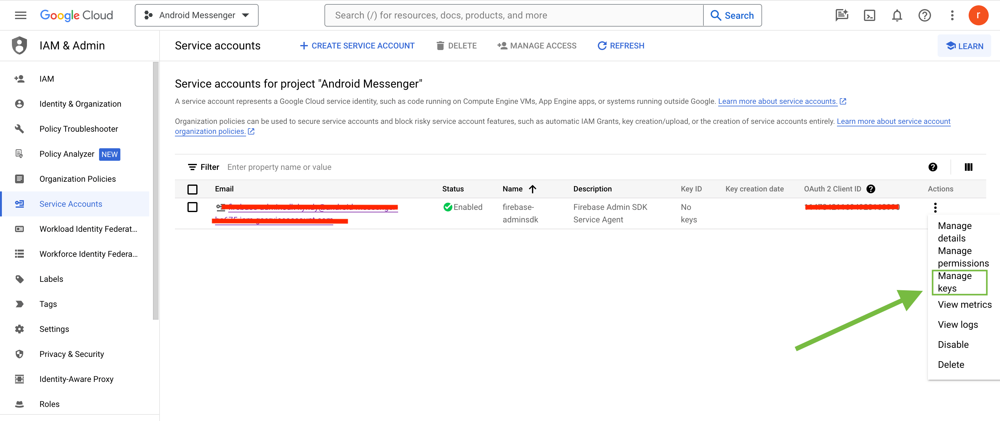
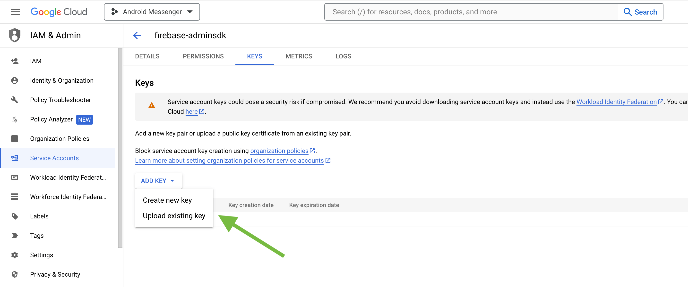
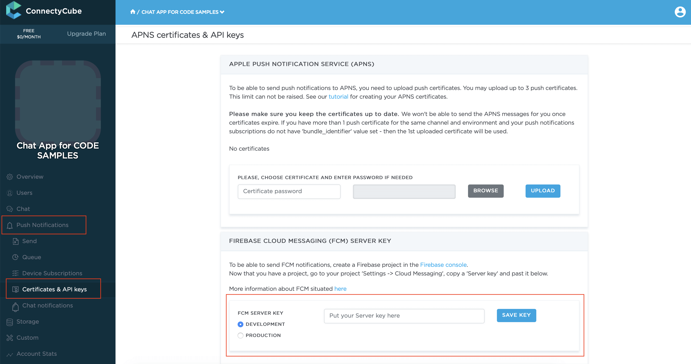

Push Notifications provide a way to deliver some information to users while they are not using your app actively.
The following use cases can be covered additionally with push notifications:

- send a chat message when a recipient is offline (a push notification will be initiated automatically in this case)
- make a video call with offline opponents (need to send a push notification manually)

## Configuration

In order to start work with push notifications you need to configure it.

First of all we need to install [nativescript-plugin-firebase](https://github.com/EddyVerbruggen/nativescript-plugin-firebase/blob/master/docs/NON_FIREBASE_MESSAGING.md) lib. Just follow [the guide](https://github.com/EddyVerbruggen/nativescript-plugin-firebase/blob/master/docs/NON_FIREBASE_MESSAGING.md).

Then follow the platform specific steps.

### iOS

1. First of all you need to generate Apple push certificate (*.p12 file) and upload it to ConnectyCube dashboard.
Here is a guide on how to create a certificate https://developers.connectycube.com/ios/how-to-create-apns-certificate

2. Upload Apple push certificate (*.p12 file) to ConnectyCube dashboard:

    - Open your ConnectyCube Dashboard at [admin.connectycube.com](https://admin.connectycube.com)
    - Go to **Push notifications** module, **Credentials** page
    - Upload the newly created APNS certificate on **Apple Push Notification Service (APNS)** form.
 
   

3. Lastly, open Xcode project of your Flutter app and enable Push Notifications capabilities. Open Xcode, 
  choose your project file, Signing & Capabilities tab and then add a Push Notifications capability. Also - tick a 
  'Remote notifications' checkbox in Background Modes section.

   

### Android

#### Configure Firebase project and Service account key (recommended)

In order to start working with push notifications functionality you need to configure it.

1. Create and configure your [Firebase project](https://console.firebase.google.com) and obtain the **Service account key**. If you have any difficulties with Firebase project registration, [follow our guide](/android/firebase-setup-guide).

   To find your **FCM service account key** go to your **Firebase console > Cloud Messaging > Manage Service Accounts** section:
   

2. Select and configure **Manage Keys** option:

   

3. Select **ADD KEY**, **Create new key**:

   

4. Select **Key type** (json recommended) and create:

   

5. Save it locally:

   

6. Browse your saved **FCM Service account key** in your **Dashboard > Your App > Push Notifications > Credentials**, select the environment for which you are adding the key. Use the same key for development and production zones.
   

7. Copy **Sender ID** value from your Firebase console **Cloud Messaging** section. You may require it later.

   

8. In order to use push notifications on Android, you need to create `google-services.json` file and copy it into project's `android/app` folder. Also, you need to update the `applicationId` in `android/app/build.gradle` to the one which is specified in `google-services.json`, so they must match. If you have no existing API project yet, the easiest way to go about in creating one is using this [step-by-step installation process](https://firebase.google.com/docs/android/setup)

#### Configure Firebase project and Server key (DEPRECATED)

1. Create and configure your [Firebase project](https://console.firebase.google.com) and obtain the **Server key**. If you have any difficulties with Firebase project registration, [follow our guide](/android/firebase-setup-guide).

   To find your **FCM server key** go to your **Firebase console > Cloud Messaging** section:
   

2. Copy your **FCM server key** to your **Dashboard > Your App > Push Notifications > Credentials**, select the environment for which you are adding the key and hit **Save key**. Use the same key for development and production zones.
   

3. Copy **Sender ID** value from your Firebase console **Cloud Messaging** section. You may require it later.

   

4. In order to use push notifications on Android, you need to create `google-services.json` file and copy it into project's `android/app` folder. Also, you need to update the `applicationId` in `android/app/build.gradle` to the one which is specified in `google-services.json`, so they must match. If you have no existing API project yet, the easiest way to go about in creating one is using this [step-by-step installation process](https://firebase.google.com/docs/android/setup)


## Setup nativescript-plugin-firebase lib

Next step is to setup the **nativescript-plugin-firebase** lib:

```javascript
import { messaging, Message } from "nativescript-plugin-firebase/messaging";

messaging.registerForPushNotifications({
  onPushTokenReceivedCallback: (token: string): void => {
    console.log("Firebase plugin received a push token: " + token);
  },

  onMessageReceivedCallback: (message: Message) => {
    console.log("Push message received: " + message.title);
  },

  // Whether you want this plugin to automatically display the notifications or just notify the callback. Currently used on iOS only. Default true.
  showNotifications: true,

  // Whether you want this plugin to always handle the notifications when the app is in foreground. Currently used on iOS only. Default false.
  showNotificationsWhenInForeground: true
}).then(() => console.log("Registered for push"));
```

## Subscribe to push notifications

In order to start receiving push notifications you need to subscribe your current device as follows:

```javascript
import ConnectyCube from "react-native-connectycube";

...

onPushTokenReceivedCallback: (token: string): void => {
  console.log("TOKEN:", token);

  this.subscribeToPushNotification(token);
}

...

subscribeToPushNotification(deviceToken) {
  const deviceUDID = "..."; // unique device identifier
  const platform = "ios"; // "android"
  const env = 'development'; // 'production'

  const params = {
    // for iOS VoIP it should be 'apns_voip'
    notification_channel: platform === 'ios' ? 'apns' : 'gcm',
    device: {
      platform: platform,
      udid: deviceUDID
    },
    push_token: {
      environment: env,
      client_identification_sequence: deviceToken,
      bundle_identifier: "com.your.app.package.id"
    }
  }

  ConnectyCube.pushnotifications.subscriptions.create(params)
    .then(result => {})
    .catch(error => {});
}
```

## Send push notifications

You can manually initiate a push notification to user/users on any event in your application. To do so you need to form a push notification parameters (payload) and set the push recipients:

```javascript
const payload = JSON.stringify({
  message: "Alice is calling you",
  ios_badge: 1,
  // ios_voip: 1    
});

const env = 'development'; // 'production'

const pushParameters = {
  notification_type: "push",
  user: { ids: [21, 12] }, // recipients.
  environment: env,
  message: ConnectyCube.pushnotifications.base64Encode(payload),
};

ConnectyCube.pushnotifications.events
  .create(pushParameters)
  .then((result) => {})
  .catch((error) => {});
```

Please refer [Universal Push Notifications standard parameters](/server/push_notifications#universal-push-notifications) section on how to form the payload.

## Unsubscribe from push notifications

In order to unsubscribe and stop receiving push notifications you need to list your current subscriptions and then choose those to be deleted:

```javascript
const deviceUDID = "..."; // unique device identifier
const platform = "ios"; // "android"

const deleteSubscription = (subscriptions) => {
  let subscriptionIdToDelete;

  subscriptions.forEach((sbs) => {
    if (sbs.subscription.device.platform === platform && sbs.subscription.device.udid === deviceUDID) {
      subscriptionIdToDelete = sbs.subscription.id;
    }
  });

  if (subscriptionIdToDelete) {
    ConnectyCube.pushnotifications.subscriptions.delete(subscriptionIdToDelete);
  }
};

ConnectyCube.pushnotifications.subscriptions
  .list()
  .then(deleteSubscription)
  .catch((error) => {});
```

## CallKit and VoIP push notifications

In a case you need to show a native calling interface  on incoming call - you need to integrate a CallKit functionality via [NativeScript Call plugin](https://github.com/EddyVerbruggen/nativescript-call).

For iOS, this will also require to integrate **VoIP push notifications** along with CallKit.

ConnectyCube supports iOS VoIP push notifications via same API described above:

- for VoIP pushes it requires to generate a separated VoIP device token.
- then when token is retrieved, you need to subscribe to voip pushes by passing a `notification_channel: apns_voip` channel in a subscription request
- then when you want to send a voip push notification, use `ios_voip: 1` parameter in a push payload in a create event request.
