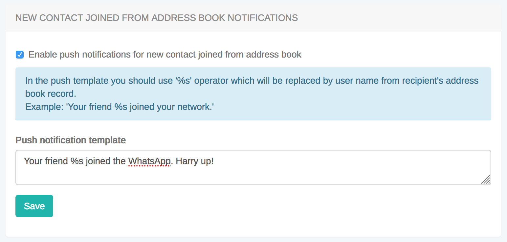

Address Book API provides an interface to work with phone address book, upload it to server and retrieve already registered ConnectyCube users from your address book.

With conjunction of [User authentication via phone number](/reactnative/authentication-and-users#authentication-via-phone-number) you can easily organise a state of the art logic in your App where you can easily start chatting with your phone contacts, without adding them manually as friends - the same what you can see in WhatsApp, Telegram, Facebook Messenger and Viber.

## Upload Address Book

First of all you need to upload your Address Book to the backend. It's a normal practice to do a full upload for the 1st time and then upload diffs on future app logins.

```javascript
const CONTACTS = [
  {
    name: "Gordie Kann",
    phone: "1879108395",
  },
  {
    name: "Wildon Gilleon",
    phone: "2759108396",
  },
  {
    name: "Gaston Center",
    phone: "3759108396",
  },
];

const options = {};
// const options = {'force': 1, 'udid': 'XXX'};

ConnectyCube.addressbook
  .uploadAddressBook(CONTACTS, options)
  .then(() => {})
  .catch((error) => {});
```

Response example from `ConnectyCube.addressbook.uploadAddressBook(params)` - [see](/server/address_book#response)

- You also can edit an existing contact by providing a new name for it.
- You also can upload more contacts, not just all in one request - they will be added to your address book on the backend. If you want to override the whole address book on the backend - just provide `force: 1` option.
- You also can remove a contact by setting `contact.destroy = 1;`
- A device UDID is used in cases where user has 2 or more devices and contacts sync is off. Otherwise - user has a single global address book.

## Retrieve Address Book

If you want you can retrieve your uploaded address book:

```javascript
ConnectyCube.addressbook
  .get()
  .then((result) => {})
  .catch((error) => {});
```

or with UDID:

```javascript
const UDID = "XXX";

ConnectyCube.addressbook
  .get(UDID)
  .then((result) => {})
  .catch((error) => {});
```

Response example from `ConnectyCube.addressbook.get()` - [see](/server/address_book#response-1)

## Retrieve Registered Users

Using this request you can easily retrieve the ConnectyCube users - you phone Address Book contacts that already registered in your app, so you can start communicate with these users right away:

```javascript
ConnectyCube.addressbook
  .getRegisteredUsers()
  .then((result) => {})
  .catch((error) => {});
```

Response example from `ConnectyCube.addressbook.getRegisteredUsers()` - [see](/server/address_book#response-2)

If isCompact = true - server will return only id and phone fields of User. Otherwise - all User's fields will be returned.

## Push notification on new contact joined

There is a way to get a push notification when some contact from your Address Book registered in an app.

You can enable this feature at [ConnectyCube Dashboard](https://admin.connectycube.com), Users module, Settings tab:


