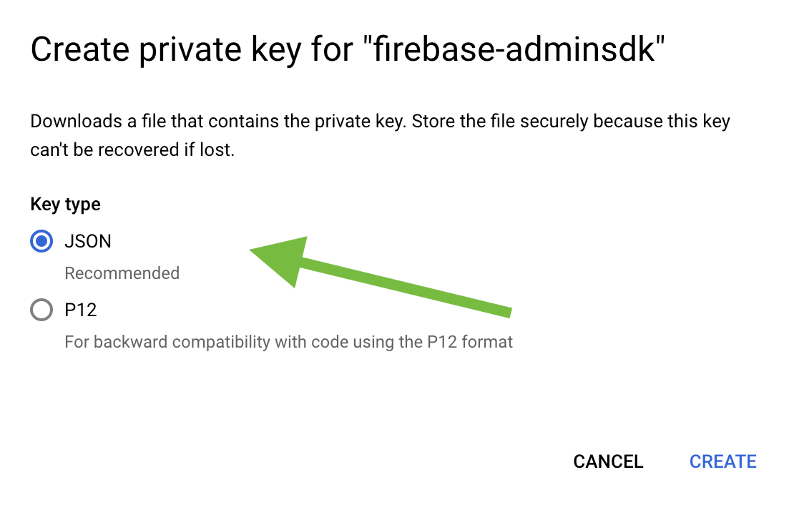
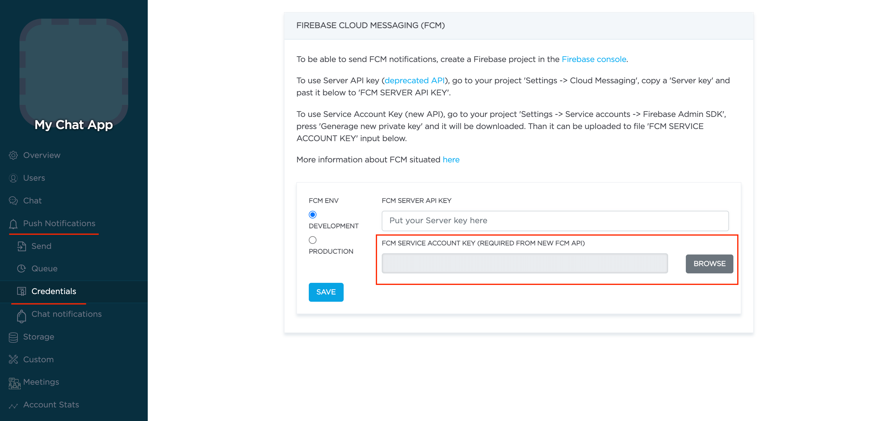

Push Notifications provide a way to deliver some information to users while they are not using your app actively.
The following use cases can be covered additionally with push notifications:

- send a chat message when a recipient is offline (a push notification will be initiated automatically in this case)
- make a video call with offline opponents (need to send a push notification manually)

> Ready push notifications code sample DEMO is available as a part of [React Native Chat code sample](https://github.com/ConnectyCube/connectycube-reactnative-samples/tree/master/RNChat) (src/services/push-notification.js)

> Ready push notifications + VOIP push notifications + CallKit code sample DEMO is available as a part of [React Native Video Chat code sample](https://github.com/ConnectyCube/connectycube-reactnative-samples/tree/master/RNVideoChat)

## Configuration

In order to start work with push notifications you need to configure it.

First of all we need to install [react-native-notifications](https://github.com/wix/react-native-notifications) lib. Just follow the 'Installation' guide in the lib's README and then do the rest manual setup steps.

Then follow the platform specific steps.

### iOS

1. First of all you need to generate Apple push certificate (*.p12 file) and upload it to ConnectyCube dashboard.
Here is a guide on how to create a certificate https://developers.connectycube.com/ios/how-to-create-apns-certificate

2. Upload Apple push certificate (*.p12 file) to ConnectyCube dashboard:

    - Open your ConnectyCube Dashboard at [admin.connectycube.com](https://admin.connectycube.com)
    - Go to **Push notifications** module, **Credentials** page
    - Upload the newly created APNS certificate on **Apple Push Notification Service (APNS)** form.
 
   

3. Lastly, open Xcode project of your Flutter app and enable Push Notifications capabilities. Open Xcode, 
  choose your project file, Signing & Capabilities tab and then add a Push Notifications capability. Also - tick a 
  'Remote notifications' checkbox in Background Modes section.

   

### Android

#### Configure Firebase project and Service account key (recommended)

In order to start working with push notifications functionality you need to configure it.

1. Create and configure your [Firebase project](https://console.firebase.google.com) and obtain the **Service account key**. If you have any difficulties with Firebase project registration, [follow our guide](/android/firebase-setup-guide).

   To find your **FCM service account key** go to your **Firebase console > Cloud Messaging > Manage Service Accounts** section:
   

2. Select and configure **Manage Keys** option:

   

3. Select **ADD KEY**, **Create new key**:

   

4. Select **Key type** (json recommended) and create:

   

5. Save it locally:

   

6. Browse your saved **FCM Service account key** in your **Dashboard > Your App > Push Notifications > Credentials**, select the environment for which you are adding the key. Use the same key for development and production zones.
   

7. Copy **Sender ID** value from your Firebase console **Cloud Messaging** section. It will be required on a following step, when init **react-native-push-notification** lib:

   

8. In order to use push notifications on Android, you need to create `google-services.json` file and copy it into project's `android/app` folder. Also, you need to update the `applicationId` in `android/app/build.gradle` to the one which is specified in `google-services.json`, so they must match. If you have no existing API project yet, the easiest way to go about in creating one is using this [step-by-step installation process](https://firebase.google.com/docs/android/setup)

#### Configure Firebase project and Server key (DEPRECATED)

1. Create and configure your [Firebase project](https://console.firebase.google.com) and obtain the **Server key**. If you have any difficulties with Firebase project registration, [follow our guide](/android/firebase-setup-guide).

   To find your **FCM server key** go to your **Firebase console > Cloud Messaging** section:
   

2. Copy your **FCM server key** to your **Dashboard > Your App > Push Notifications > Credentials**, select the environment for which you are adding the key and hit **Save key**. Use the same key for development and production zones.
   

3. Copy **Sender ID** value from your Firebase console **Cloud Messaging** section. It will be required on a following step, when init **react-native-push-notification** lib:

   

4. In order to use push notifications on Android, you need to create `google-services.json` file and copy it into project's `android/app` folder. Also, you need to update the `applicationId` in `android/app/build.gradle` to the one which is specified in `google-services.json`, so they must match. If you have no existing API project yet, the easiest way to go about in creating one is using this [step-by-step installation process](https://firebase.google.com/docs/android/setup)


## react-native-notifications lib installation

- [react-native-notifications iOS Installation](https://wix.github.io/react-native-notifications/docs/installation-ios)
- [react-native-notifications Android Installation](https://wix.github.io/react-native-notifications/docs/installation-android)

## Init react-native-notifications lib

The following installation steps are a TL;DR of [react-native-notifications Getting Started](https://wix.github.io/react-native-notifications/docs/getting-started). You can entierly follow it OR use our guide below.

```javascript
import { Notifications } from 'react-native-notifications';

...

init() {
  if (Platform.OS === 'ios') {
    Notifications.ios.checkPermissions().then((currentPermissions) => {
        console.log('Badges enabled: ' + !!currentPermissions.badge);
        console.log('Sounds enabled: ' + !!currentPermissions.sound);
        console.log('Alerts enabled: ' + !!currentPermissions.alert);
        console.log('Car Play enabled: ' + !!currentPermissions.carPlay);
        console.log('Critical Alerts enabled: ' + !!currentPermissions.criticalAlert);
        console.log('Provisional enabled: ' + !!currentPermissions.provisional);
        console.log('Provides App Notification Settings enabled: ' + !!currentPermissions.providesAppNotificationSettings);
        console.log('Announcement enabled: ' + !!currentPermissions.announcement);
    });
  }

  Notifications.getInitialNotification().then((notification) => {
    console.log("Initial notification was:", (notification ? notification.payload : 'N/A'));

    // this.displayNotification({message: "hello"});
  })      
  .catch((err) => console.error("getInitialNotifiation() failed", err));

  Notifications.events().registerRemoteNotificationsRegistered((event) => {
    // TODO: Send the token to my server so it could send back push notifications...
    console.log("[PushNotificationService] Device Token Received", event.deviceToken);

    this.subscribeToPushNotification(event.deviceToken)
  });
  Notifications.events().registerRemoteNotificationsRegistrationFailed((event) => {
    console.error("[PushNotificationService] Failed to get Device Token", event);
  });

  Notifications.events().registerNotificationReceivedForeground((notification, completion) => {
    console.log(`[PushNotificationService] Notification received in foreground`, notification.payload, notification?.payload?.message);

    if (Platform.OS === 'android') {
      PushNotificationService.displayNotification(notification.payload);
    }
  
    completion({alert: false, sound: false, badge: false});
  });

  Notifications.events().registerNotificationReceivedBackground((notification, completion) => {
    console.log("[PushNotificationService] Notification Received - Background", notification.payload, notification?.payload?.message);

    if (Platform.OS === 'android') {
      PushNotificationService.displayNotification(notification.payload);
    }

    // Calling completion on iOS with `alert: true` will present the native iOS inApp notification.
    completion({alert: true, sound: true, badge: false});
  });

  Notifications.events().registerNotificationOpened(async (notification, completion) => {
    console.log(`[PushNotificationService] Notification opened`, notification.payload);

    await this.onNotificationOpened(notification.payload)

    completion();
  });

  Notifications.registerRemoteNotifications();
}
```

## Subscribe to push notifications

In order to start receiving push notifications you need to subscribe your current device as follows:

```javascript
import ConnectyCube from "react-native-connectycube";

...

Notifications.events().registerRemoteNotificationsRegistered((event) => {
  // TODO: Send the token to my server so it could send back push notifications...
  console.log("[PushNotificationService] Device Token Received", event.deviceToken);

  this.subscribeToPushNotification(event.deviceToken)
});

...

subscribeToPushNotification(deviceToken) {
  const DeviceInfo = require('react-native-device-info').default

  const params = {
    // for iOS VoIP it should be 'apns_voip'
    notification_channel: Platform.OS === 'ios' ? 'apns' : 'gcm',
    device: {
      platform: Platform.OS,
      udid: DeviceInfo.getUniqueID()
    },
    push_token: {
      environment: __DEV__ ? 'development' : 'production',
      client_identification_sequence: deviceToken,
      bundle_identifier: "com.your.app.package.id"
    }
  }

  ConnectyCube.pushnotifications.subscriptions.create(params)
    .then(result => {})
    .catch(error => {});
}
```

## Send push notifications

You can manually initiate a push notification to user/users on any event in your application. To do so you need to form a push notification parameters (payload) and set the push recipients:

```javascript
const payload = JSON.stringify({
  message: "Alice is calling you",
  ios_badge: 1,
  // ios_voip: 1
});

const pushParameters = {
  notification_type: "push",
  user: { ids: [21, 12] }, // recipients.
  environment: __DEV__ ? "development" : "production",
  message: ConnectyCube.pushnotifications.base64Encode(payload),
};

ConnectyCube.pushnotifications.events
  .create(pushParameters)
  .then((result) => {})
  .catch((error) => {});
```

Please refer [Universal Push Notifications standard parameters](/server/push_notifications#universal-push-notifications) section on how to form the payload.

## Receive push notifications

```javascript
Notifications.events().registerNotificationReceivedForeground((notification, completion) => {
  console.log(`[PushNotificationService] Notification received in foreground`, notification.payload, notification?.payload?.message);

  if (Platform.OS === 'android') {
    PushNotificationService.displayNotification(notification.payload);
  }

  completion({alert: false, sound: false, badge: false});
});

Notifications.events().registerNotificationReceivedBackground((notification, completion) => {
  console.log("[PushNotificationService] Notification Received - Background", notification.payload, notification?.payload?.message);

  if (Platform.OS === 'android') {
    PushNotificationService.displayNotification(notification.payload);
  }

  // Calling completion on iOS with `alert: true` will present the native iOS inApp notification.
  completion({alert: true, sound: true, badge: false});
});

static displayNotification(payload) {
  const extra = {dialog_id: payload.dialog_id, isLocal: true}

  const localNotification = Notifications.postLocalNotification({
    body: payload.message,
    title: "New message", // TODO: to use here chat name/sender name
    // sound: "chime.aiff",
    silent: false,
    category: "SOME_CATEGORY",
    userInfo: extra,
    extra,
  });
}

```

Here you can add an appropriate logic in your app. The things can be one of the following:

- If this is a chat message, once clicked on it - we can redirect a user to an appropriate chat by **dialog_id** data param
- Raise a local notification https://wix.github.io/react-native-notifications/docs/localNotifications with an alternative info to show for a user

## Receive pushes in killed state (Android)

There was an issue on Android with receiving a callback when a push arrived and an app is in killed/dead state. 

We addressed it here:
- we created a patch to push notification lib - [patches/react-native-notifications+4.3.1.patch](https://github.com/ConnectyCube/connectycube-reactnative-samples/blob/master/RNChat/patches/react-native-notifications%2B4.3.1.patch) - which is applied automatically when you do yarn (it's specified as a part of `package.json` postinstall step - `"postinstall": "patch-package && npx jetify && cd ios && pod install"`)
- you also need to add `<service android:name="com.wix.reactnativenotifications.JSNotifyWhenKilledTask" />` into `AndroidManifest.xml` file
- and now you can process the notifications in killed/dead state via the following code snippet:

```javascript
const { AppRegistry } = require("react-native");

// https://reactnative.dev/docs/headless-js-android
//
AppRegistry.registerHeadlessTask(
  "JSNotifyWhenKilledTask",
  () => {
    return async (notificationBundle) => {
      console.log('[JSNotifyWhenKilledTask] notificationBundle', notificationBundle);

      PushNotificationService.displayNotification(notificationBundle);
    }
  },
);
```

> Ready push notifications code sample DEMO is available as a part of [React Native Chat code sample](https://github.com/ConnectyCube/connectycube-reactnative-samples/tree/master/RNChat) (src/services/push-notification.js)

## Unsubscribe from push notifications

In order to unsubscribe and stop receiving push notifications you need to list your current subscriptions and then choose those to be deleted:

```javascript
const deleteSubscription = (subscriptions) => {
  let subscriptionIdToDelete;

  subscriptions.forEach((sbs) => {
    if (sbs.subscription.device.platform === Platform.OS && sbs.subscription.device.udid === DeviceInfo.getUniqueID()) {
      subscriptionIdToDelete = sbs.subscription.id;
    }
  });

  if (subscriptionIdToDelete) {
    ConnectyCube.pushnotifications.subscriptions.delete(subscriptionIdToDelete);
  }
};

ConnectyCube.pushnotifications.subscriptions
  .list()
  .then(deleteSubscription)
  .catch((error) => {});
```

## VoIP push notifications

ConnectyCube supports iOS VoIP push notifications via same API described above. The main use case for iOS VoIP push notifications is to show a native calling interface on incoming call when an app is in killed/background state - via CallKit.

The common flow of using VoIP push notifications is the following:

- for VoIP pushes it requires to generate a separated VoIP device token. With [react-native-notifications](https://github.com/wix/react-native-notifications) lib it can be done the following way:


```javascript
if (Platform.OS === 'ios') {
  Notifications.ios.registerPushKit();
}
```

- then when token is retrieved, you need to subscribe to voip pushes by passing a `notification_channel: apns_voip` channel in a subscription request:

```javascript
if (Platform.OS === 'ios') {
  Notifications.ios.events().registerPushKitRegistered(event => {
    this.subscribeToVOIPPushNotifications(event.pushKitToken);
  });
}

...

subscribeToVOIPPushNotifications(deviceToken) {
  const params = {
    notification_channel: 'apns_voip',
    device: {
      platform: Platform.OS,
      udid: getUniqueId()
    },
    push_token: {
      environment: __DEV__ ? 'development' : 'production',
      client_identification_sequence: deviceToken
    }
  }

  ConnectyCube.pushnotifications.subscriptions.create(params)
    .then(result => {
      console.log("[PushNotificationsService][subscribeToVOIPPushNotifications] Ok");
    }).catch(error => {
      console.warn("[PushNotificationsService][subscribeToVOIPPushNotifications] Error", error);
    });
}
```

- then when you want to send a voip push notification, use `ios_voip: 1` parameter in a push payload in a create event request:

```javascript

const pushParams = {
  message: `Incoming call from ${currentUser.full_name}`,
  ios_voip: 1,
  handle: currentUser.full_name,
  initiatorId: callSession.initiatorID,
  opponentsIds: selectedOpponentsIds.join(","),
  uuid: callSession.ID,
  callType: callType === ConnectyCube.videochat.CallType.VIDEO ? "video" : "audio"
};
this.sendPushNotification(selectedOpponentsIds, pushParams);

...

sendPushNotification(recipientsUsersIds, params) {
  const payload = JSON.stringify(params);
  const pushParameters = {
    notification_type: "push",
    user: { ids: recipientsUsersIds },
    environment: __DEV__ ? "development" : "production",
    message: ConnectyCube.pushnotifications.base64Encode(payload),
  };

  ConnectyCube.pushnotifications.events.create(pushParameters)
    .then(result => {
      console.log("[PushNotificationsService][sendPushNotification] Ok");
    }).catch(error => {
      console.warn("[PushNotificationsService][sendPushNotification] Error", error);
    });
}

```

## react-native-firebase lib

In a case you use a [react-native-firebase](https://rnfirebase.io) lib for push notifications integration - please refer a GitHub issue for any potential drawnbacks https://github.com/ConnectyCube/connectycube-reactnative-samples/issues/31

## notifee lib

In a case you use a [notifee](https://notifee.app/react-native/docs/ios/remote-notification-support) lib for push notifications integration - please refer a GitHub issue for any potential drawnbacks https://github.com/ConnectyCube/connectycube-reactnative-samples/issues/289#issuecomment-1411636978

## Expo

If you use React Native [Expo](https://expo.dev), then it requires to provide an [experienceId](https://docs.expo.dev/push-notifications/sending-notifications-custom/) in a push payload for a push to be delivered successfully. It is passed to the expo app so if the device has more than one Expo app it knows which messages are for which app. Without this Expo can't handle the data messages.

**experienceId** follows this format: **@yourExpoUsername/yourProjectSlug**.

For the push notifications initiated via API you can provide it by yourself. 

For the push notifications initiate automatically for offline users in chat - you can provide this filed at **Admin panel > Chat > Offline notifications**. There is a React Native block with 'experienceId' field value.