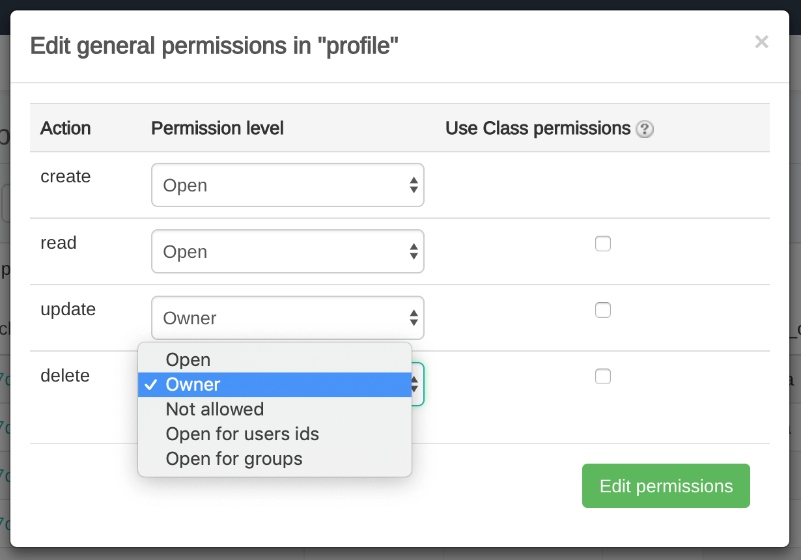
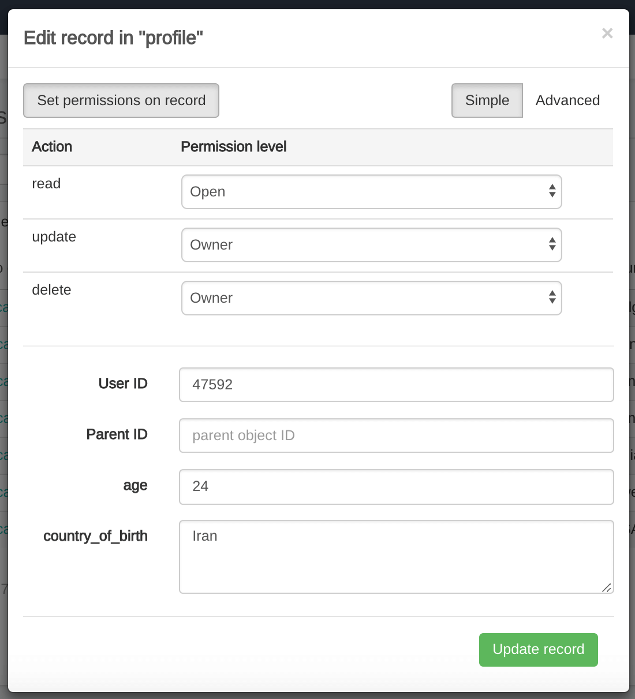

**Custom Objects** module allows to build the own data structure or schema and provides a flexibility for those who needs to go beyond the standard solutions.
Data schema is defined in ConnectyCube dashboard and is called as 'class'.

To start using Custom Objects module, data schema should be created first.

Field types supported in Custom object module:

* Integer
* String
* Float
* Boolean
* Array
* File
* Location (Array of [<longitude>, <latitude>])
* Date

## Create data schema

Data schema can be created in the ConnectyCube dashboard within 'Custom' module. Go to 'Add' options and select 'Add new class' from the list:


Input a Class name and identify at least one field to add in the Class by specifying data type:


Click on 'Create class' to complete creation of data schema. Newly created class is now available and contains the following data:

* **ID** - record indentifier generated by system automatically
* **User ID** - identifier of user who created a record
* **Parent ID** - by default is null
* **Field_1** - field defined in a scheme
* **Field_2** - field defined in a scheme
* ...
* **Field_N** - field defined in a scheme
* **Created_at** - date and time when a record is created


## Create a new record
Create a new record with the defined parameters in the class. Fields that weren't defined in the request but available in the scheme (class) will have null values.

###### Endpoint
```
POST https://api.connectycube.com/data/{class_name}
```
###### Parameters

Any custom parameter (field in the schema) can be used in the request to identify a new record.

###### Request example

```bash
curl -X POST \
-H "CB-Token: <TOKEN>" \
-H "Content-Type: application/json" \
-d '{"full_name": "Nadine Collier", "age": "41", "job": "accountant", "country_of_birth": "Germany"}' \
https://api.connectycube.com/data/profile
```

###### Response
```json
{
	"_id":"5c09798aca8bf468ab8d2936",
	"_parent_id":null,
	"age":41,
	"country_of_birth":"Germany",
	"created_at":1544124810,
	"full_name":"Nadine Collier",
	"job":"accountant",
	"updated_at":1544124810,
	"user_id":47592,
	"permissions":
		{
			"read":{
					"access":"open"
			},
			"update":{
					"access":"owner"
			},
			"delete":{
					"access":"owner"
			}
		}
}
```

## Create multi records
Create several new records in the class. Fields that weren't defined in the request but available in the scheme would have null values.

###### Endpoint
```
POST https://api.connectycube.com/data/{class_name}/multi
```

###### Set parameters

**Format:** `{"record": {"0": {"field_1": "value", "field_2": "value"}, "1": {"field_1": "value", "field_2": "value"}}}`

**Note:** the first `record_number` is always **0**.

###### Request example

```bash
curl -X POST \
-H "CB-Token: <TOKEN>" \
-H "Content-Type: application/json" \
-d '{"record": {"0": {"age": "11"}, "1": {"age": "55"}}}' \
https://api.connectycube.com/data/profile/multi
```

###### Response
```json
{
	"class_name":"profile",
	"items":[
		{
			"_id":"5c098d1fca8bf4291e8d220b",
			"_parent_id":null,
			"age":11,
			"country_of_birth":null,
			"created_at":1544129823,
			"full_name":null,
			"job":null,
			"updated_at":1544129823,
			"user_id":47592,
			"permissions":
				{
					"read":{
						"access":"open"
					},
					"update":{
						"access":"owner"
					},
					"delete":{
						"access":"owner"
					}
				}
		},
		{
			"_id":"5c098d1fca8bf4291e8d220c",
			"_parent_id":null,
			"age":55,
			"country_of_birth":null,
			"created_at":1544129823,
			"full_name":null,
			"job":null,
			"updated_at":1544129823,
			"user_id":47592,
			"permissions":
				{
					"read":{
						"access":"open"
					},
					"update":{
						"access":"owner"
					},
					"delete":{
						"access":"owner"
					}
				}
		}
	]
}
```


## Record with permissions
Access control list (ACL) is a list of permissions attached to some object. An ACL specifies which users have an access to objects, as well as what operations are allowed on given objects. Each entry in a typical ACL specifies a subject and an operation. ACL models may be applied to collections of objects as well as to individual entities within the system's hierarchy.

Adding the Access Control list is only available withinh the Custom objects module.

### Permissions scheme
ConnectyCube permission scheme contains five permissions levels:

* **Open** (open) - any user within application can access the record(s) in the class and is allowed to perform actions with a record
* **Owner** (owner) - only Owner (user who created a record) is allowed to perform action with a record
* **Not allowed** (not_allowed) - no one (except the Account Administrator) can proceed with a chosen action
* **Open for groups** (open_for_groups) - users which have a specified tag(s) will be included in the group which is allowed to perform actions with a record. Several groups can be specified (number of groups is not limited).
* **Open for users ids** (open_for_users_ids) - only users with listed IDs can perform actions with a record.

Actions to work with entity:

* **Create** - create a new record
* **Read** - retrieve information about a record and view it in the read-only mode
* **Update** - update any parameter of the chosen record that can be updated by user
* **Delete** - delete a record

To set a permission schema for the Class, go to ConnectyCube dashboard and find a required class within Custom objects module Click on ‘Edit permission’ button to open permissions schema to edit.


Each listed action has a separate permission level to select. The exception is a 'Create' action that isn’t available for 'Owner' permission level.




### Permission levels
Two access levels are available in the ConnectyCube: access to Class and access to Record.

Only one permission schema can be applied for the record. Using the Class permission schema means that Record permission schema won’t be affected on a reсord.

**Class entity**

**Class** is an entity that contains records. Class can be created via ConnecyCube dashboard only withing Custom oblects module. Operations with Class entity are not allowed in API.

All actions (Create, Read, Update and Delete) that are available for the ‘Class’ entity are also applicable for all records within a class.

Default Class permission schema is using while creating a class:

* **Create:** Open
* **Read:** Open
* **Update:** Owner
* **Delete:** Owner

To enable applying Class permissions for any of actions type, 'Use Class permissions' check box should be ticked. It means that record permission schema (if any) won’t be affected on a record.

**Record entity**

**Record** is an entity within the Class in the Custom Objects module that can be created in ConnectyCube dashaboard and via API. Each record within a Class has its own permission level. Unlike Class entity, 'Not allowed' permission level isn't available for a record as well as only three actions are available to work with a record - read, update and delete.

Default values for Record permission scheme:

* Read: Open
* Update: Owner
* Delete: Owner

To set a separate permission scheme for a record, open a record to edit and click on 'Set permissions on record' button:


Define the permission level for each of available actions:




## Create a record with permissions

To create a new record with permissions, add `permissions[action_name][access]` parameter to 'Create a record' request.

###### Endpoint
```
POST https://api.connectycube.com/data/{class_name}
```

###### Parameters
| Permissions | Syntax | Example |
|------------- |-------------- |-------------
| Open / Owner | "permissions": {"action_name": {"access": "owner"} | "permissions": {"read": {"access": "owner"}
| Open for users IDs | "permissions": {"action_name": {"access": "open_for_users_ids", "ids": ["{id_1}","{id_2}"]} | "permissions": {"update": {"access": "open_for_users_ids", "ids": ["51941","51943"]}}
| Open for groups | "permissions": {"action_name": {"access": "open_for_groups", "groups": ["group_1","group_2"]}} | "permissions": {"delete": {"access": "open_for_groups", "groups": ["officers","assistants"]}}

###### Request example

```bash
curl -X POST \
-H "Content-Type: application/json" \
-H "CB-Token: <TOKEN>" \
-d '{"full_name": "Jacelyn Millard", "age":"25", "country_of_birth": "India", "permissions": {"read": {"access":"owner"}, "update": {"access": "open_for_users_ids", "ids": ["51941","51943"]}, "delete": {"access": "open_for_groups", "groups": ["officers","assistants"]}}}' \
https://api.connectycube.com/data/profile
```

###### Response
```json
{
	"_id":"5c0d6d8cca8bf4291e8d3d1b",
	"_parent_id":null,
	"age":25,
	"avatar":null,
	"country_of_birth":"India",
	"created_at":1544383884,
	"full_name":"Jacelyn Millard",
	"job":null,
	"updated_at":1544383884,
	"user_id":47592,
	"permissions":
		{
			"read":
				{
					"access":"owner"
				},
			"update":
				{
					"access":"open_for_users_ids",
					"users_ids":
						[
							"51941","51943"
						]
				},
			"delete":
				{
					"access":"open_for_groups",
					"users_groups":
						[
							"officers","assistants"
						]
				}
		}
}
```


## Retrieve records by IDs
Retrieve records by specifying their identifiers.

###### Endpoint

```
GET https://api.connectycube.com/data/{class_name}/{record_id1},{record_id2}
```

###### Request example

```bash
curl -X GET \
-H "CB-Token: <TOKEN>" \
https://api.connectycube.com/data/profile/5c09798aca8bf468ab8d2936,5c097c45ca8bf468ab8d294e
```

###### Response
```json
{
	"class_name":"profile",
	"items":[
		{
			"_id":"5c09798aca8bf468ab8d2936",
			"_parent_id":null,
			"age":41,
			"country_of_birth":"Germany",
			"created_at":1544124810,
			"full_name":"Nadine Collier",
			"job":"accountant",
			"updated_at":1544124810,
			"user_id":47592,
			"permissions":
				{
					"read":{
						"access":"open"
					},
					"update":{
						"access":"owner"
					},
					"delete":{
						"access":"owner"}
					}
		},
		{
			"_id":"5c097c45ca8bf468ab8d294e",
			"_parent_id":null,
			"age":25,
			"country_of_birth":"Sweden",
			"created_at":1544125509,
			"full_name":"Lacey Idec",
			"job":"secretary",
			"updated_at":1544125521,
			"user_id":47592,
			"permissions":
				{
					"read":{
						"access":"open"
					},
					"update":{
						"access":"owner"
					},
					"delete":{
						"access":"owner"
				}
			}
		}
	]
}
```


## Retrieve records within a class
Search records within the particular class.

**Note:** If you are sorting records by time, use the `_id` field. It is indexed and will be much faster than sorting by `created_at` field.

###### Endpoint
```
GET https://api.connectycube.com/data/{class_name}
```
###### Options to apply

###### 1. Sorting
| Parameter | Applicable to type| Description |
|---------- |:--------------: |------------------
| {field_name} | all types | Search records by the specified field
| {field_name}[search_operator] | all types | Search records by the specified field with applying filters to filter the query result set
| sort_asc | all types | Sorting the query result set in ascending order
| sort_desc | all types | Sorting the query result set in descending order
| skip | integer | Skip N records in the query result set. By default, all found records are shown
| limit | integer | Set a limit for displaying the query results. Default and max values - 100. To show the last record only, set `limit=-1` in the request
| count | integer | Number of records returned in the query result set
| output[include] | all types | Fields to include in the query result set
| output[exclude] | all types | Fields to exclude from the query result set
| near | Location | Search records in a defined radius (in meters) starting from the current position. Format: {field_name}[near]=longitude,latitude;radius

Example:

```bash
curl -X GET \
-H "CB-Token: <TOKEN>" \
-d 'sort_asc=age' \
https://api.connectycube.com/data/profile
```

###### 2. Search criterias

**Format:** `{field_name}[operator]={value}`

|Operator | Applicable to types |Description | Data to return |   
|:--------:|------------|-------------   |------------
| gt      | <li>integer</li><li>float</li> | greater than| Records where the specified parameter has values greater than specified in the request
| lt      | <li>integer</li><li>float</li> |less than    | Records where the specified parameter has values less than specified in the request      
| gte | <li>integer</li><li>float</li> | greater than or equal to | Records where the specified parameter has values greater than or equal to the specified in the request
| lte | <li>integer</li><li>float</li> | less than or equal to | Records where the specified parameter has values less than or equal to the specified in the request
| ne     | <li>integer</li><li>float</li><li>string</li> <li>boolean</li>| not equal    | Records where the specified parameter has values not equal to the specified in the request
| in     | <li>integer</li><li>float</li><li>string</li> | **in** array | Records with the specified values to found in the array    
| nin | <li>integer</li><li>float</li><li>string</li> | not **in** array | Specified records not included in the array
| all | <li>array</li> | all contained **in** array | All records that correspond to parameters specified in the request
| or | <li>integer</li><li>float</li><li>string</li> | one **or** another parameter | Records with one of the specified parameters
| ctn | <li>integer</li><li>float</li><li>string</li> | contain | Returns all records where field contains adjusted substring

Example:

```bash
curl -X GET \
-H "CB-Token: <TOKEN>" \
-d 'age[gt]=28' \
https://api.connectycube.com/data/profile
```

###### 3. Aggregation operators
| Parameter | Applicable to types | Description |
|---------- |-------------- |------------------
| {field_name}[**calc**]={operator} | <li>integer</li> <li>float</li> | `avg`, `min`, `max`, `sum` should be used with `group_by` operator
| **group_by**={field_name} | <li>integer</li> <li>float</li> <li>string</li> <li>boolean</li> | `group_by` works similar to [SQL GROUP BY](https://en.wikipedia.org/wiki/SQL#Queries) operator, should be used with `calc` operator

Example:

```bash
curl -X GET \
-H "CB-Token: <TOKEN>" \
-d 'age[calc]=avg&group_by=country_of_birth' \
https://api.connectycube.com/data/profile
```

###### Request example

```bash
curl -X GET \
-H "CB-Token: <TOKEN>" \
-d 'age[gt]=28&sort_desc=full_name' \
https://api.connectycube.com/data/profile
```

###### Response
```json
{
	"class_name":"profile",
	"skip":0,
	"limit":100,
	"items":
		[
			{
				"_id":"5c0d7458ca8bf43a5b8cf487",
				"_parent_id":"",
				"age":41,
				"avatar":null,
				"country_of_birth":"India",
				"created_at":1544385624,
				"full_name":"Zach Whitehouse",
				"job":"Operation officer",
				"updated_at":1544385624,
				"user_id":47592
			},
			{
				"_id":"5c0d4f95ca8bf4291e8d3c2d",
				"_parent_id":"",
				"age":50,
				"avatar":null,
				"country_of_birth":"USA",
				"created_at":1544376213,
				"full_name":"Nadine Collier",
				"job":null,
				"updated_at":1544381152,
				"user_id":47592
			}
		]
}
```

## Retrieve record by ID to view its permissions

To retrieve the records to view their permissions use the parameter ‘permissions’ and set it as true ‘permissions=1’. Use GET method.

Note: record permissions are checking while request is processing. Only owner has an ability to view a record’s permissions.

###### Endpoint
```
GET https://api.connectycube.com/data/{class_name}/{record_id}
```

###### Parameters
| Parameter | Description |
|----------- |---------------
| permissions | To retrieve the records to view their permissions use the parameter ‘permissions’ and set it as true `permissions=1`

###### Request example

```bash
curl -X GET \
-H "CB-Token: <TOKEN>" \
-d 'permissions=1' \
https://api.connectycube.com/data/profile/5bf7da90ca8bf42dae037dea
```

###### Response
```json
{
	"permissions":
		{
			"read":
				{
					"access":"owner"
				},
			"update":
				{
					"access":"open_for_users_ids",
					"users_ids":
						[
							"51941","51943"
						]
				},
			"delete":
				{
					"access":"open_for_groups",
					"users_groups":
						[
							"officers","assistants"
						]
				}
		},
	"record_id":"5c0d6d8cca8bf4291e8d3d1b"
}
```

## Update record by ID
Update record data by specifying its ID.

###### Endpoint
```
PUT https://api.connectycube.com/data/{class_name}/{record_id}
```
###### Parameters
| Parameter | Description |
| ----------- | -------------- |
| field_name | Name of the fields to update |

###### Special update operators
| Operator | Applicable to types | Description | Syntax |
|--------- |--------------------- |-------------- |------------
| inc | <li>integer</li> <li>float</li> | Increment a value in the field to specified one. Value can be either positive or negative (i.e. decrement operation) | "inc": {"field_name": "value"}
| pull | arrays | Remove specified value from the array | "pull": {"field_name": "value"}
| pull with filter | arrays | Remove all found elements from array after applying a filter | "pull": {"field_name": {"operator": "value"}}
| pull_all | arrays | Remove all specified values from the array | "pull_all": {"field_name": ["value_1", "value_2"]}
| pop | arrays | Remove the last element in the array. To remove the first element, set parameter to '-1' | "pop": {"groups": "1"}
| push | arrays | Append specified values to the array | "push": {"field_name": ["value_1", "value_2"]}
| add_to_set | arrays | Add a value to the array if this value is not in the array yet. Existing value will be skipped | "add_to_set": {"field_name": ["value_1", "value_2"]}}' \
| Update array element by index operator | arrays | Update array element by specifying element index. The first one in the array is always '0' | "field_name": {"index_1": "value", "index_2": "value"}


To nullify an existing value, specify "null" for application/x-www-/form-urlencoded and null for application/json content-type (depends on the format used in the request).
For numeric fields (Integer & Float) there is a special increment operator - **inc** that increments or decrements a numeric field.

###### Request example

```bash
curl -X PUT \
-H "CB-Token: <TOKEN>" \
-H "Content-Type: application/json" \
-d '{"age": "22", "job": "technical director"}' \
https://api.connectycube.com/data/profile/5c097e8cca8bf4291e8d219f
```

###### Response
```json
{
	"_id":"5c097e8cca8bf4291e8d219f",
	"_parent_id":null,
	"age":22,
	"country_of_birth":"Poland",
	"created_at":1544126092,
	"full_name":"Barret Campbell",
	"job":"technical director",
	"updated_at":1544128080,
	"user_id":47592,
	"permissions":
		{
			"read":{
				"access":"open"
			},
			"update":{
				"access":"owner"
			},
			"delete":{
				"access":"owner"
			}
	}
}
```

## Update records by criteria
Update records found by the specified search criteria with a new parameter(s).

###### Endpoint
```
PUT https://api.connectycube.com/data/{class_name}/by_criteria
```
###### Parameters

| Parameter | Description | Syntax
| ----------- | -------------- | ---------------
| search_criteria[field_name][operator] | `search_criteria` - required on the beginning, `field_name` - name of the fields to use for search, `operator` - search operator to find the records | "search_criteria": {"field": {"operator": "value"}}

###### Search criterias

|Operator | Applicable to types |Description | Data to return |   
|:-------:|------------|-------------   |------------
| gt      | <li>integer</li> <li>float</li> | greater than| Records where the specified parameter has values greater than specified in the request
| lt      | <li>integer</li> <li>float</li> |less than    | Records where the specified parameter has values less than specified in the request      
| gte | <li>integer</li> <li>float</li> | greater than or equal to | Records where the specified parameter has values greater than or equal to the specified in the request
| lte | <li>integer</li> <li>float</li> | less than or equal to | Records where the specified parameter has values less than or equal to the specified in the request
| ne     | <li>integer</li> <li>float</li> <li>string</li> <li>boolean</li> | not equal    | Records where the specified parameter has values not equal to the specified in the request
| in     | <li>integer</li> <li>float</li> <li>string</li> | contained **in** array | Records with the specified values to found in the array     
| nin | <li>integer</li> <li>float</li> <li>string</li> | not contained **in** array | Records with the specified values that are not in the array   
| all | array | all contained IN array | All records that correspond to parameters specified in the request
| or |  <li>integer</li> <li>float</li> <li>string</li> | one **or** another | Records found by one of the specified parameters
| ctn | <li>integer</li> <li>float</li> <li>string</li> | contain | Return all records that contain a specified data

###### Request example

```bash
curl -X PUT \
-H "Content-Type: application/json" \
-H "CB-Token: <TOKEN>" \
-d '{"search_criteria": {"age":{"lt":30}}, "country_of_birth":"Iran"}' \
https://api.connectycube.com/data/profile/by_criteria
```

###### Response
```json
{
	"class_name":"profile",
	"skip":0,
	"limit":100,
	"total_found":1,
	"items":[
		{
			"_id":"5c09798aca8bf468ab8d2936",
			"_parent_id":null,
			"age":22,
			"country_of_birth":"Iran",
			"created_at":1544124810,
			"full_name":"Nadine Collier",
			"job":"accountant",
			"updated_at":1544367921,
			"user_id":47592,
			"permissions":
				{
					"read":{
						"access":"open"
					},
					"update":{
						"access":"open"
					},
					"delete":{
						"access":"open"
					}
				}
		}
	]
}
```

## Update multi records
Update several records within a class by specifying new values.

###### Endpoint
```
PUT https://api.connectycube.com/data/{class_name}/multi
```
###### The format of query

```json
{"record": {"record_number": {"id": "value", "field_1": "value", "field_2":"value"}}}
```

where:

* `record_number` - record number in the query. Numbering begins with '1'
* `field_name` - field in Custom Object to update

###### Request example

```bash
curl -X PUT \
-H "Content-Type: application/json" \
-H "CB-Token: <TOKEN>" \
-d '{"record": {"1": {"id": "5c0d4f95ca8bf4291e8d3c2d", "country_of_birth": "USA", "age":"50"}, "2": {"id": "5c0d625aca8bf43a5b8cf3de", "country_of_birth": "Lithuania", "age":"28"}, "3": {"id": "5c0d625aca8bf43a5b8cf111", "country_of_birth": "Greece", "age":"35"}}}' \
https://api.connectycube.com/data/profile/multi
```

###### Response
```json
{
	"class_name":"profile",
	"not_found":
		{
			"ids":["5c0d625aca8bf43a5b8cf111"]
		},
	"items": [
		{
			"_id":"5c0d4f95ca8bf4291e8d3c2d",
			"_parent_id":"",
			"age":50,
			"avatar":null,
			"country_of_birth":"USA",
			"created_at":1544376213,
			"full_name":"Nadine Collier",
			"job":null,
			"updated_at":1544381152,
			"user_id":47592,
			"permissions":
				{
					"read": {
						"access":"open"
					},
					"update": {
						"access":"owner"
					},
					"delete": {
						"access":"owner"
					}
				}
		},
		{
			"_id":"5c0d625aca8bf43a5b8cf3de",
			"_parent_id":"",
			"age":28,
			"avatar":null,
			"country_of_birth":"Lithuania",
			"created_at":1544381018,
			"full_name":"Georgia Barny",
			"job":"Managing officer",
			"updated_at":1544381152,
			"user_id":47592,
			"permissions":
				{
					"read": {
						"access":"open"
					},
					"update": {
						"access":"owner"
					},
					"delete": {
						"access":"owner"
					}
				}
		}
	]
}
```

## Delete record by ID
Delete a record from a class by record identifier.

###### Endpoint
```
DELETE https://api.connectycube.com/data/{class_name}/{id}
```

###### Request example

```bash
curl -X DELETE \
-H "CB-Token: <TOKEN>" \
https://api.connectycube.com/data/profile/5c090e0fe588ce59fff873df
```

###### Response

```json
200 OK
```

## Delete several records by their IDs
Delete several records from a class by specifying their identifiers. If one or more records can not be deleted, an appropriate error is shown for that record(s).

###### Endpoint

```
DELETE https://api.connectycube.com/data/{class_name}/{id_1},{id_2},{id_3}
```
###### Request example

```bash
curl -X DELETE \
-H "CB-Token: <TOKEN>" \
https://api.connectycube.com/data/profile/5bf7da90ca8bf42dae037dea,5bf7db7cca8bf45ff403449c,5bf7d621ca8bf45ff4034463
```

###### Response
```json
{
  "SuccessfullyDeleted": {
    "ids": [
      "5c097c45ca8bf468ab8d294e"
    ]
  },
  "WrongPermissions": {
    "ids": [
      "5c097e8cca8bf4291e8d219f"
    ]
  },
  "NotFound": {
    "ids": [
      "55c09798aca8bf468ab8d2936"
    ]
  }
}

```

## Delete records by criteria
Delete records from the class by specifying a criteria to find records to delete.

###### Endpoint
```
DELETE https://api.connectycube.com/data/{class_name}/by_criteria
```

###### Query format

```bash
'{field_name}[operator]={value}'
```

###### Search criterias
|Operator | Applicable to types |Description | Data to return |   
|---------|------------|-------------   |------------
| gt      | <li>integer </li><li>float</li> | greater than| Records where the specified parameter has values greater than specified in the request
| lt      |<li>integer </li><li>float</li> |less than    | Records where the specified parameter has values less than specified in the request      
| gte | <li>integer </li><li>float</li> | greater than or equal to | Records where the specified parameter has values greater than or equal to the specified in the request
| lte | <li>integer </li><li>float</li> | less than or equal to | Records where the specified parameter has values less than or equal to the specified in the request
| ne     | <li>integer </li><li>float</li><li>string</li> <li>boolean</li> | not equal    | Records where the specified parameter has values not equal to the specified in the request
| in     | <li>integer </li><li>float</li><li>string</li> | **in** array | Users with the specified IDs      
| nin |<li>integer </li><li>float</li><li>string</li> | not **in** array | Records not specified in the array
| all | array | **all** contained **in** array | All records that correspond to parameters specified in the request
| or | <li>integer </li><li>float</li><li>string</li> | one **or** another | Records with one of the specified parameters
| ctn | <li>integer </li><li>float</li><li>string</li> | contain | Returns all records where field contains adjusted substring

###### Request example

```bash
curl -X DELETE \
-H "CB-Token: <TOKEN>" \
-d 'age[gte]=41' \
https://api.connectycube.com/data/profile/by_criteria
```

###### Response
```json
{
    "total_deleted": 2
}
```


## Relations
Objects (records) in different classes can be linked with a `_parent_id` field. If record from the Class 1 is pointed with a record from Class 2 via its `_parent_id`, the `_parent_id` field will contain an ID of a record from the Class 2.

If a record from the Class 2 is deleted, all its children (records of the Class 1 with `_parent_id` field set to the Class 2 record ID) will be automatically deleted as well.

The linked children can be retrieved with  `_parent_id={id_of_parent_class_record}` parameter.
