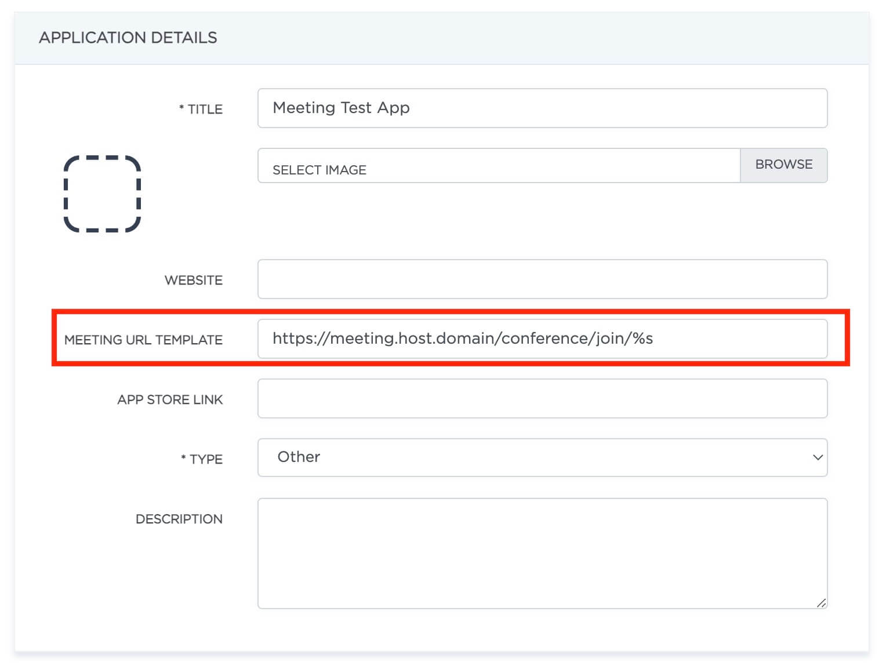
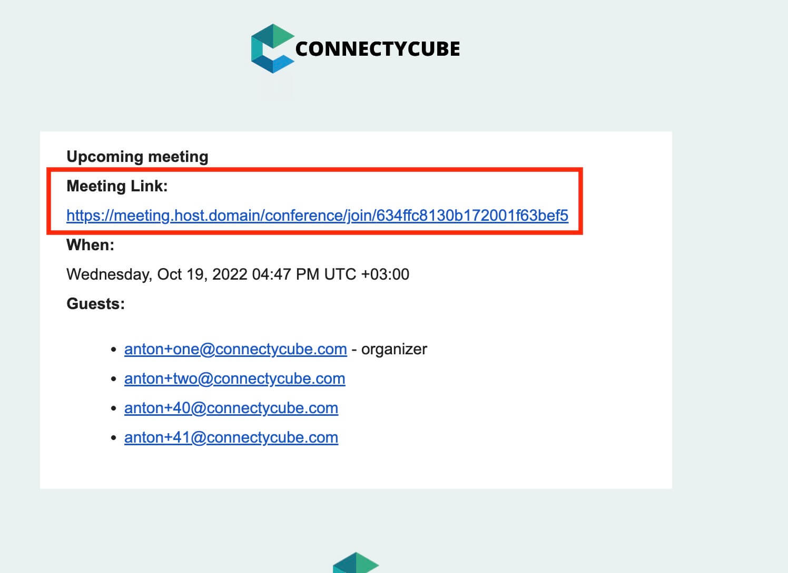
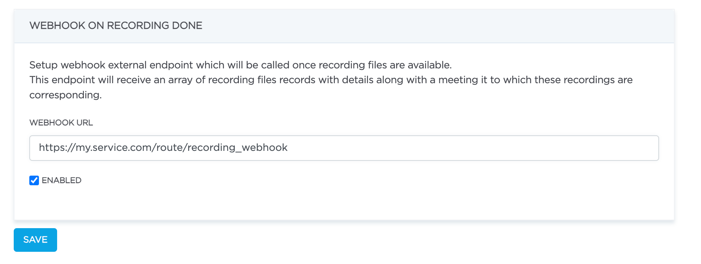

**Meetings API** allows to schedule conference call with attendees.

A meeting can have a chat dialog associated with it.

A meeting call can be recorded on server and then a file can be downloaded via Web Admin panel.

## Meeting model

| Parameter | Description |
|---------- | --------------
| _id | Meeting identifier
| name | Meeting name
| start_date | Date and time when meeting starts
| end_date | Date and time when meeting ends
| attendees | Users who will be in meeting
| record | Whether a meeting should be recorded
| chat_dialog_id | Meeting chat identifier
| host_id | Meeting creator user id
| created_at | Meeting created date
| updated_at | Meeting updated date
| public | Indicate meeting public or not
| scheduled | Indicate meeting scheduled or not
| notify | Send notification after meeting is created
| notify_before | Timing before meeting start to send notification
| timezone | Meeting timezone settings

## Create meeting

###### Endpoint
```
POST https://api.connectycube.com/meetings
```
###### Parameters
| Parameter | Required | Description | Data type | Value example
|---------- |--------- |------------ |---------- |--------------
| name | Yes | Meeting name | String | "Friday weekly sync"
| start_date | Yes | Date when meeting starts | Timestamp | 1613729948
| end_date | Yes | Date when meeting ends | Timestamp | 1613829948
| attendees | Yes | Array of meeting participants. `id` is a ConnectyCube user id. `email` can be anything. `id` or `email` is required | Array of objects | ```'{"id": 5243, "email": "example@mail.com"}' ```
| chat | No | Whether a chat dialog should be created along with a meeting  | Boolean | true
| record | No | Whether a meeting should be recorded | Boolean | false
| public | No | If public is true any user can retrieve this meeting by id | Boolean | true
| scheduled | No | Can be use as filter | Boolean | true
| notify | No | Send notification after meeting is created | Boolean | true
| notify_before | No | Timing before meeting start to send notification | Object | ```'{"metric": "minutes", "value": 10}' ```
| timezone | No | Meeting timezone settings | Object | ```'{"offset": 120, "name": "Europe/Riga"}' ```

###### notify_before parameter object

| Parameter | Date type | Description      |
|---------- |---------- |------------------|
| metric    | string (enum)    | ``` 'minutes' ```, ```'hours'```, ```'days'```, ```'weeks' ```
| value     | int       | ```'minutes'``` range `[0 - 55]`, ```'hours'``` range `[1 - 24]`,  ```'days'``` range `[1 - 30]`,  ```'weeks'``` range `[1 - 4]`

###### timezone parameter object

| Parameter | Date type | Description      |
|---------- |---------- |------------------|
| offset    | int       | Minutes UTC offset
| name      | string    | Timezone Name


###### Request example

```bash
curl -X POST \
-H "Content-Type: application/json" \
-H "CB-Token: <TOKEN>" \
-d '{"name": "Friday weekly sync", "start_date": 1613729948, "end_date": 1613731012, "attendees": [{"id": 245,"email": "email1@domen.com"}, {"id": 343}, {"email": "email2@domen.com"}], "record": false, "chat": true, "notify": true, "notify_before": {"metric": "minutes", "value": 10}, "timezone": {"offset": 120, "name": "Europe/Riga"} }' \
https://api.connectycube.com/meetings
```
###### Response
```json
{
  "_id": "602f926aaa81493ce4c5788e",
  "name": "Friday weekly sync",
  "start_date": 1613729948,
  "end_date": 1613731012,
  "attendees": [
    {
      "id": 245,
      "email": "email1@domen.com"
    },
    {
      "id": 343
    },
    {
      "email": "email2@domen.com"
    }
  ],
  "record": false,
  "chat_dialog_id": "602f9ea20740a24ec238d9da",
  "created_at": "2021-02-19T10:26:50.013Z",
  "updated_at": "2021-02-19T10:26:50.013Z",
  "host_id": 811,
  "scheduled": false,
  "notify": true,
  "notify_before": { "metric": "minutes", "value": 10 },
  "timezone": { "offset": 120, "name": "Europe/Riga" }
}
```

## Retrieve meetings

###### Endpoint
```
GET https://api.connectycube.com/meetings
```
###### Parameters
| Parameter | Data types | Description |
|---------- |--------- |--------------
| _id | string (ObjectId) | Specify to retrieve a specific meeting by id
| limit | number | Setting of limit for a number of results to display. Default - 100
| offset | number | Skip the defined number of records in the results
| start_date | number (timestamp in seconds) | Filter by start_date field
| end_date | number (timestamp in seconds) | Filter by end_date field
| updated_at | string (date) | Filter by updated_at field
| created_at | string (date) | Filter by created_at field
| scheduled | boolean | Filter by scheduled field

Without `_id` parameter specified, a user will retrieve meetings in which a current user is host or attendee.

###### Request example

```bash
curl -X GET \
-H "CB-Token: <TOKEN>" \
-d 'start_date[gte]=1613729948&scheduled=true&created_at[gt]=2021-02-19T10:26:49.013Z' \
https://api.connectycube.com/meetings
```
###### Response
```json
[
    {
        "_id": "602f926aaa81493ce4c5788e",
        "name": "Friday weekly sync",
        "start_date": 1613729948,
        "end_date": 1613731012,
        "attendees": [
            {
            "id": 245,
            "email": "email1@domen.com"
            },
            {
            "id": 343
            },
            {
            "email": "email2@domen.com"
            }
        ],
        "record": null,
        "chat_dialog_id": null,
        "created_at": "2021-02-19T10:26:50.013Z",
        "updated_at": "2021-02-19T10:26:50.013Z",
        "host_id": 811,
        "scheduled": false,
        "notify": true,
        "notify_before": { "metric": "minutes", "value": 10 },
        "timezone": { "offset": 120, "name": "Europe/Riga" }
    }
]
```

## Update meeting

A request to update meeting's parameters.
Only meeting creator (host) can update a meeting.

###### Endpoint
```
PUT https://api.connectycube.com/meetings/{meeting_id}
```
###### Parameters
| Parameter | Required | Description | Data type | Value example
|---------- |--------- |------------ |---------- |--------------
| name | Yes | Meeting name | String | "New meeting name"
| start_date | Yes | Date when meeting starts | Timestamp | 1613429948
| end_date | Yes | Date when meeting ends | Timestamp | 1613329948
| attendees | Yes | Array of meeting participants. `id` is a ConnectyCube user id. `email` can be anything. `id` or `email` is required | Array of objects | ```'{"id": 4123, "email": "example@mail.com"}' ```
| record | No | Update from `false` to `true` start recording, from `true` to `false` stop recording | Boolean | true
| public | No | If public is true any user can retrieve this meeting by id | Boolean | true
| scheduled | No | Can be use as filter | Boolean | true
| notify | No | Send notification after meeting is created | Boolean | true
| notify_before | No | Timing before meeting start to send notification | Object | ```'{"metric": "hours", "value": 1}' ```
| timezone | No | Meeting timezone settings | Object | ```'{"offset": -300, "name": "America/New_York"}' ```

###### Request example

```bash
curl -X PUT \
-H "Content-Type: application/json" \
-H "CB-Token: <TOKEN>" \
-d '{"name": "Another meeting name", "start_date": 1613959948, "end_date": 1613956048, "attendees": [{"id": 1445,"email": "email3@domen.com"}, {"id": 3456 "email": "email4@domen.com"}], "record":true, "chat":true, "public": true, "scheduled": true, "notify_before": { "metric": "hours", "value": 1 }, "timezone": { "offset": -300, "name": "America/New_York" } }' \
https://api.connectycube.com/meetings/602f926aaa81493ce4c5788e
```
###### Response
```json
{
  "_id": "602f926aaa81493ce4c5788e",
  "name": "Another meeting name",
  "start_date": 1613959948,
  "end_date": 1613956048,
  "attendees": [
    {
      "id": 1445,
      "email": "email3@domen.com"
    },
    {
      "id": 3456
    },
    {
      "email": "email4@domen.com"
    }
  ],
  "record": true,
  "chat_dialog_id": null,
  "created_at": "2021-02-19T10:26:50.013Z",
  "updated_at": "2021-02-19T10:28:50.142Z",
  "host_id": 811,
  "public": true,
  "scheduled": true,
  "notify": true,
  "notify_before": { "metric": "hours", "value": 1 },
  "timezone": { "offset": -300, "name": "America/New_York" } 
}
```

###### Meeting notification updating

- If ```"notify"``` was updated from ```'false'``` to ```'true'```, mails will be send to all attendees + host
- If ```"start_date"``` was updated, mails will be sent to all attendees + host

- If ```"attendees"``` was updated, mails will be sent only to added attendees

## Delete meeting

Delete a meeting by ID.
Only meeting creator (host) can delete a meeting.

###### Endpoint
```
DELETE https://api.connectycube.com/meetings/{meeting_id}
```
###### Request example

```bash
curl -X DELETE \
-H "CB-Token: <TOKEN>" \
https://api.connectycube.com/meetings/602f926aaa81493ce4c5788e
```
###### Response
```
200 OK
```

## Meeting Email Link Settings

You can set meeting url template in Admin App settings ```MEETING URL TEMPLATE```

```https://meeting.host.domain/conference/join/%s``` where ```%s``` will be replaced by meeting _id



## Meeting recordings

Retrieve meeting records with download url

### Recording model

| Parameter | Description |
|---------- | --------------
| _id | Recording identifier
| room_id | Meeting identifier
| participants_ids | array of user ids in recording
| participants_count | users count in recording
| duration | recording file duration in seconds
| size | recording file size in MB
| download_url | url to download recording file form storage (expired after 1 hour)
| created_at | recording created date
| updated_at | recording updated date

###### Endpoint
```
GET https://api.connectycube.com/meetings/recordings/{meeting_id}
```
###### Request example

```bash
curl -X GET \
-H "CB-Token: <TOKEN>" \
https://api.connectycube.com/meetings/recordings/602f926aaa81493ce4c5788e
```
###### Response
```json
[
  {
    "_id": "649061c8d0b83a4a6dc85d0c",
    "room_id": "602f926aaa81493ce4c5788e",
    "participants_ids": [ 78934, 894946 ],
    "updated_at": "2023-06-19T14:10:17Z",
    "created_at": "2023-06-19T14:10:16Z",
    "download_url": "https://cb-recordings.s3.amazonaws.com/videos/dHk9xJQkGjw4ZD8rpuPsVeiD?AWSAccessKeyId=XXXXXXXXXXXX&Expires=1687187417&Signature=uRGxX1mCqLFKoPpP3RJGS0hG5pc%3D&response-cache-control=max-age%3D604800",
    "participants_count": 2,
    "duration": 6.062,
    "size": 0.34
  },
  {
    "_id": "649061c8d0b83a4a6dc85d0d",
    "room_id": "602f926aaa81493ce4c5788e",
    "participants_ids": [ 32885, 894946 ],
    "updated_at": "2023-06-19T14:10:16Z",
    "created_at": "2023-06-19T14:10:16Z",
    "download_url": "https://cb-recordings.s3.amazonaws.com/videos/kUZumRHnumFTmdmZ5TKYOKWa?AWSAccessKeyId=XXXXXXXXXXXXXXXX&Expires=1687187417&Signature=RVxkOJ4psx92nL%2B%2FPzZ%2BD6BlH7Q%3D&response-cache-control=max-age%3D604800",
    "participants_count": 2,
    "duration": 8.671,
    "size": 0.57
  }
]
```

## Recording done webhook

You can enable and set webhook endpoint url in Meetings Settings



Once recording files are available server will send `POST` requires on webhook url, payload will be an array of recording files records with details along with a meeting and host user.

NOTE: recording files are not available during meeting, only after meeting is finished

##### Request payload example
```json
{
  "meeting": {
    "_id": "64ba8ab043e599002b5bdbca",
    "name": "My meeting",
    "start_date": 1689946801,
    "end_date": 1689950401,
    "attendees": [
      { "id": 6892473, "email": "example-sam@email.com" },
      { "id": 6892477, "email": "example-smith@email.com" }
    ],
    "public": false,
    "scheduled": false,
    "record": false,
    "chat_dialog_id": "64ba8ab043e599002b5bdbc9",
    "created_at": "2023-07-21T13:40:00Z",
    "updated_at": "2023-07-21T13:40:21Z",
    "host_id": 6892473,
    "notify": false,
    "notify_before": null,
    "timezone": null
  },
  "hostUser": {
    "_id": "64ba8aac43e599002b5bdbc8",
    "id": 6892473,
    "created_at": "2023-07-21T13:39:56Z",
    "updated_at": "2023-07-21T13:40:00Z",
    "last_request_at": "2023-07-21T13:40:00Z",
    "login": "resourceful-norris-75",
    "full_name": "Sam Fisher",
    "timezone": null,
    "email": "example-sam@email.com",
    "phone": null,
    "website": null,
    "twitter_id": null,
    "external_user_id": null,
    "facebook_id": null,
    "custom_data": null,
    "user_tags": null,
    "avatar": null,
    "external_id": null,
    "is_guest": null
  },
  "callRecords": [
    {
      "_id": "64ba8abeea1de683a37139fd",
      "room_id": "64ba8ab043e599002b5bdbca",
      "participants_count": 1,
      "participants_ids": [
          6892473
      ],
      "file_uid": "619486cc-3cb5-4171-afe0-74c1f1805e9a_64ba8ab043e599002b5bdbca",
      "duration": 5.082,
      "size": 0.29,
      "updated_at": "2023-07-21T13:40:14Z",
      "created_at": "2023-07-21T13:40:14Z",
      "download_url": "https://cb-staging-recordings.s3.amazonaws.com/videos/619486cc-3cb5-4171-afe0-74c1f1805e9a_64ba8ab043e599002b5bdbca?AWSAccessKeyId=XXXXXXXXXXXXXXXX&Expires=1690551720&Signature=8%2BOxOEQga2MP%XXXXX%2B4%2BYHAVjvQE%3D&response-cache-control=max-age%3D604800"
    },
    {
      "_id": "64ba8acdea1de683a37139fe",
      "room_id": "64ba8ab043e599002b5bdbca",
      "participants_count": 2,
      "participants_ids": [
          6892473,
          6892477
      ],
      "file_uid": "5dfdffd3-1ffc-41f5-8d3c-6425df91c4b5_64ba8ab043e599002b5bdbca",
      "duration": 8.862,
      "size": 0.52,
      "updated_at": "2023-07-21T13:40:29Z",
      "created_at": "2023-07-21T13:40:29Z",
      "download_url": "https://cb-staging-recordings.s3.amazonaws.com/videos/5dfdffd3-1ffc-41f5-8d3c-6425df91c4b5_64ba8ab043e599002b5bdbca?AWSAccessKeyId=XXXXXXXXXXXXXXXX&Expires=1690551720&Signature=XXXXXXXXXXXXXXXXXX%3D&response-cache-control=max-age%3D604800"
    }
  ]
}
```