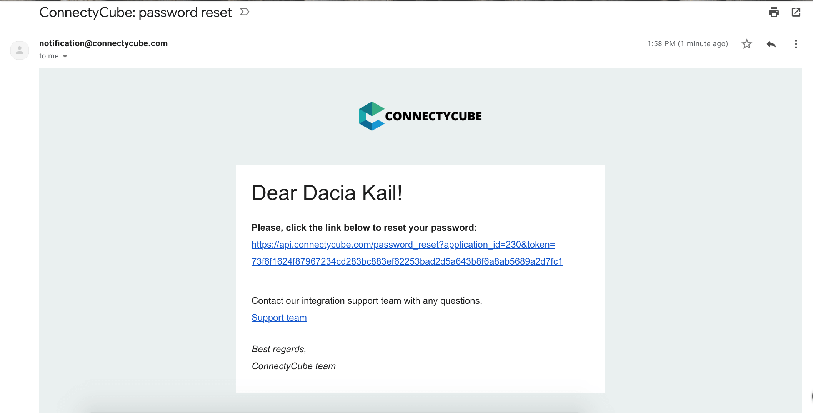

**Users API** allows to work with users within the application and manage user's information - add, update and/or remove. To work with user's data, session with user authorisation should be created initially.

## Users model
A Users model captures certain characteristics about an individual user or group of users registered in the application.

|Field name | Description |
|----------- |-----------------
|id | User's identifier on server|
|login|	User's login on server. Usually login OR email is required to log in into the application
|password | User's password sets for his user's account. Required for log in process|
|email |	User's email. Usually login OR email is required to log in into the application|
|external_user_id|	ID of User in external system (**Deprecated**) |
|external_id|	ID of User in external system |
|facebook_id|ID of User in Facebook |
|twitter_id|	ID of User in Twitter |
|full_name| User's full name |
|phone|	User's phone number |
|website|	User's Website address |
|custom_data|	User's additional info (if any)|
|user_tags|	Tag(s) added for User. Several tags comma separated can be added. Same tags can be used for any number of users |
|avatar|	An ID of the graphical representation of the user |
|blob_id|	**Deprecated** - 'avatar' field should be used instead. ID of associated blob. Note: [blob should be created](/server/storage#create-a-file) before |
|created_at | Date and time when User was registered in the application. System creates this parameter automatically
|updated_at| System creates / updates this parameter automatically when user's data are updated
|last_request_at| Date and time where the latest request was sent. System creates this parameter automatically
|timezone| Minutes UTC offset |

## User Sign Up
To have an ability to work with user's data, user should be registered in the application.
To register a new user in the application, at least login / email and password should be specified. Other parameters are optional and can be added later.

###### Endpoint
```
POST https://api.connectycube.com/users
```

###### Headers
- **CB-AuthKey** - an Authorization Key from [Admin panel app's Credentials page](https://admin.connectycube.com)

###### Parameters
| Parameter | Required | Description
|-----------|:------------: |-------- |
|user[login]|	Yes |User's login. Only login OR email is required |
|user[password] | Yes | User's password |
|user[email] |Yes |	User's email. Only login OR email is required|
|user[external_user_id]| Optional (**Deprecated**) |	ID of User in external system |
|user[external_id]| Optional |	ID of User in external system |
|user[facebook_id]| Optional |ID of User in Facebook |
|user[twitter_id]| Optional | ID of User in Twitter |
|user[full_name]| Optional |Full name |
|user[phone]|	Optional | Phone number |
|user[website]| Optional | Website address
|user[custom_data]|	 Optional | User's additional info (if any)|
|user[timezone]|Optional |	Minutes UTC offset |
|user[tag_list]|Optional |	Tags added for User. Several tags comma separated can be added. Same tags can be used for any number of users |
|user[avatar]|Optional |	The graphical representation of the user |
|user[blob_id]| Optional |	**Deprecated** - 'avatar' field should be used instead. ID of associated blob. Note: [blob should be created](/server/storage#create-a-file) before |

###### Request example

```bash
curl -X POST \
-H "Content-Type: application/json" \
-H "CB-AuthKey: 29WfrNWdvkhmX6V" \
-d '{"user": {"login": "Dacia", "password": "petU4or!", "email": "dacia_k@domain.com", "facebook_id": "91234409", "twitter_id": "83510562734", "full_name": "Dacia Kail ", "phone": "+6110797757", "timezone": 180}}' \
https://api.connectycube.com/users
```

###### Response

```json
{
	"user":{
		"id":51941,
		"full_name":"Dacia Kail",
		"email":"dacia_k@domain.com",
		"login":"Dacia",
		"phone":"+6110797757",
		"website":null,
		"created_at":"2018-12-06T09:16:26Z",
		"updated_at":"2018-12-06T09:16:26Z",
		"last_request_at":null,
		"external_user_id":null,
		"external_id":null,
		"facebook_id":"91234409",
		"twitter_id":"83510562734",
		"blob_id":null,
		"custom_data":null,
		"avatar":null,
		"user_tags":null,
		"timezone": 180
	}
}
```

## Retrieve Users V2
Retrieving users within the application. Query result set can be sorted or / and filtered with defining the number of results to shown per page.

###### Endpoint
```
GET https://api.connectycube.com/users/v2
```

###### Parameters
Optional parameters to use for data representative.

**Pagination**

Parameter | Required  | Description                                                     | Value example 
----------|-----------|-----------------------------------------------------------------|----------------
offset    | No        | Number of users to skip before show. Default = 0                | `offset=50`
limit     | No        | Number of results to show per request. Max = 100, default = 100 | `limit=20`

**Sort the query result set**

Type     | Description   | Example
---------|---------------| ----------------------
asc      | Ascending     | `sort_asc=id`
desc     | Descending    | `sort_desc=created_at`

**Available fields to filter**

|Field              | Type                       | Apply Type  
|-------------------|--------------------------- |-------------
| id                | integer                    | stand-alone
| login             | string                     | stand-alone
| email             | string                     | stand-alone
| full_name       	| string                     | stand-alone
| phone             | string                     | stand-alone
| external_id       | string                     | stand-alone
| facebook_id       | string                     | stand-alone
| twitter_id        | string                     | stand-alone
| user_tags         | array of strings           | stand-alone/additional
| last_request_at   | date (string or timestamp) | additional
| created_at        | date (string or timestamp) | additional
| updated_at        | date (string or timestamp) | additional

**Operators**

| Operator   | Description                          | Value example                               | Type
|------------|--------------------------------------|---------------------------------------------|------------
| eq         | equal                                | `id=51946`                                  | primary
| in         | list of data equal                   | `id[in][]=51946&id[in][]=51943`             | primary
| start_with | match string starting with substring | `full_name[start_with]=diver`               | primary
| nin        | list of data not equal               | `user_tags[nin][]=vip`                      | exclude
| gt         | greater than                         | `updated_at[gt]=2019-11-06T09:21:41Z`       | compare
| lt         | less than                            | `created_at[lt]=2019-11-06T09:21:41Z`       | compare
| gte        | greater than or equal                | `last_request_at[gte]=2017-12-06T09:21:41Z` | compare
| lte        | less than or equal                   | `last_request_at[lte]=2018-11-06T09:21:41Z` | compare

Query need to contain at least one `stand-alone` field with `primary` operator<br>
`stand-alone` field can't be used with `compare` operators<br>
`start_with` operator search for a match at the beginning of the string, this operator automatic set `limit` = 5, minimum argument length for searching = 4

Examples of valid/invalid query:
- `id=51946` - valid (`stand-alone` with `primary` operator)
- `id[in][]=51946&id[in][]=51943&last_request_at[gt]=2018-12-06T09:21:41Z` - valid (`stand-alone` with `primary` operator and `additional` with `compare` operator)
- `user_tags=guest` - valid (`stand-alone` with `primary` operator)
- `user_tags=guest&created_at[lt]=1690886495` - valid (`stand-alone/additional` with `primary` operator and `additional` with `compare` operator)
- `login=smith1&phone=6754987345566&user_tags[nin][]=vip&updated_at[lte]=2018-12-06T09:21:41Z` - valid (has `stand-alone` with `primary` operator)
- `phone=6754987345566&last_request_at=2020-11-09T08:21:41Z` - valid (`stand-alone` with `primary` operator)
- `full_name[start_with]=hunter&id[nin][]=68647` - valid (`stand-alone` with `primary` operator, `start_with` argument length = 6)
- `login[nin][]=admin19` - invalid (`stand-alone` only with `exclude` operator)
- `user_tags[nin][]=guest` - invalid (`stand-alone/additional` only with `exclude` operator)
- `last_request_at=2017-07-06T11:21:41Z` - invalid (`additional` with `primary` operator)
- `created_at[gte]=2019-11-06T09:21:41Z` - invalid (`additional` with `compare` operator)
- `login[start_with]=vip` - invalid (`stand-alone` with `primary` operator, but `start_with` argument length = 3)


Example:

```bash
curl -X GET \
-H "CB-Token: <TOKEN>" \
-d 'id[in][]=52671&id[in][]=51943&phone=5464579797975&last_request_at[gt]=2018-12-06T09:21:41Z&sort_desc=id&limit=10' \
https://api.connectycube.com/users/v2
```

###### Response

```json
{
	"limit":10,
	"skip":0,
	"total_entries":1,
	"items":[
		{
			"id":52671,
			"full_name":"David Smith",
			"email":null,
			"login":"smithguest18",
			"phone":"5464579797975",
			"website":null,
			"created_at":"2018-12-06T09:16:26Z",
			"updated_at":"2018-12-06T09:16:26Z",
			"last_request_at":"2019-12-07T10:21:41Z",
			"external_user_id":null,
			"external_id":null,
			"facebook_id":null,
			"twitter_id":null,
			"blob_id":null,
			"custom_data":null,
			"avatar":null,
			"user_tags":null,
			"timezone": null
		}
	]
}
```

## Retrieve Users V1 (**Deprecated**)
Retrieving users within the application. Query result set can be sorted or / and filtered with defining the number of results to shown per page.

To enable this deprecated API go to https://admin.connectycube.com `Overview` -> `Permissions`, and uncheck option `DISABLE LIST USERS API V1`.


###### Endpoint
```
GET https://api.connectycube.com/users
```

###### Parameters
Optional parameters to use for data representative.

**Pagination**

Parameter     | Required      | Description
------------- | :-------------: | -------------
page          | No            | Number of page to show. The first page  is shown by default
per_page      | No            | Number of results to show per page. Default number of results per page - 10, maximum number of results per page - 100

Example:

```bash
curl -X GET \
-H "CB-Token: <TOKEN>" \
-d "per_page=7" \
https://api.connectycube.com/users
```

**Filtering the query result set**

* Parameter to use to filter data - filter[]
* Filter by -  all fields (exclude 'custom_data') are allowed to be used as a filter for results
* Data types:
	* number
	* string
	* date - date format must be yyyy-mm-dd or yyyy.mm.dd)
* **Request format:** `filter[]={data_type}+{field_to_filter}+[operator]+{value_to_filter}`

|Operator |Description | Value example  |   Data to return
|---------|------------|-------------   |-------------
|gt       |greater than| filter[gt]=number+id+gt+51496 | Users with IDs greater than 51496
|lt       |less than    | filter[lt]=number+id+lt+51946 | Users with IDs less than specified ID
|ge       |greater than or equal | filter[ge]=number+id+ge+51946| Users with IDs greater than or equal to specified ID      |
|le       |less than or equal  | filter[le]=number+id+le+51946   | Users with IDs less than or equal to specified ID |
|eq       |equal     | filter[eq]=number+id+eg+51946 | User with ID equal to specified ID      |
|ne       |not equal  | filter[ne]=number+id+ne+51946  | Users with IDs not equal to specified ID      |
|between  |between     | filter[between]=number+id+between+51941,51959 | List of users with IDs between the specified range. Range limits should be comma separated      |
|in       |list of data  | filter[in]=number+id+in+51943,51946   | Users with the specified IDs      |

Example:

```bash
curl -X GET \
-H "CB-Token: <TOKEN>" \
-d 'filter[]=number+id+gt+51946' \
https://api.connectycube.com/users
```


**Sort the query result set**

Type of sort| Description | Value Example
------ | -------------  |-------------
asc | sort the query result set in an ascending order by any of the field| order=asc+{data_type}+{field}. Example: order=asc+string+login
desc           | sort the query result set in an descending order by any of the field| order=desc+{data_type}+{field}. Example: order=desc+integer+facebook_id

Example:

```bash
curl -X GET \
-H "CB-Token: <TOKEN>" \
-d 'order=desc+string+full_name' \
https://api.connectycube.com/users
```

###### Request example

```bash
curl -X GET \
-H "CB-Token: <TOKEN>" \
-d 'order=asc+string+login' \
https://api.connectycube.com/users
```

###### Response

```json
{
	"current_page":1,
	"per_page":10,
	"total_entries":3,
	"items":[
		{
			"user": {
				"id":51941,
				"full_name":"Dacia Kail",
				"email":"dacia_k@domain.com",
				"login":"Dacia",
				"phone":"+6110797757",
				"website":null,
				"created_at":"2018-12-06T09:16:26Z",
				"updated_at":"2018-12-06T09:16:26Z",
				"last_request_at":null,
				"external_user_id":52691165,
				"external_id":null,
				"facebook_id":"91234409",
				"twitter_id":"83510562734",
				"blob_id":null,
				"custom_data":null,
				"avatar":null,
				"user_tags":null,
				"timezone": null
			}
		},
		{
			"user": {
				"id":51946,
				"full_name":"Gabrielle Corcoran",
				"email":"gabrielle.corcoran@domain.com",
				"login":"gabby",
				"phone":"+6192622155",
				"website":"http://gabby.com",
				"created_at":"2018-12-06T09:29:57Z",
				"updated_at":"2018-12-06T09:29:57Z",
				"last_request_at":null,
				"external_user_id":null,
				"external_id":null,
				"facebook_id":"95610574",
				"twitter_id":null,
				"blob_id":null,
				"custom_data":"Responsible for signing documents",
				"avatar":null,
				"user_tags":"vip,accountant",
				"timezone": null
			}
		},
		{
			"user": {
				"id":51943,
				"full_name":"Pallavi Purushottam",
				"email":"pavallip@domain.com",
				"login":"ppavalli",
				"phone":"+6138907507",
				"website":null,
				"created_at":"2018-12-06T09:21:41Z",
				"updated_at":"2018-12-06T09:21:41Z",
				"last_request_at":null,
				"external_user_id":null,
				"external_id":null,
				"facebook_id":null,
				"twitter_id":null,
				"blob_id":null,
				"custom_data":null,
				"avatar":null,
				"user_tags":"accountant",
				"timezone": null
			}
		},
	]
}

```

**Note:** if 'Allow to retrieve a list of users via API' is un-ticked, retrieving users is forbidden, error is shown in the response:

```json
{
	"errors":{
		"base":["Users retrieving forbidden in admin panel, application settings. Setup it here https://admin.connectycube.com/apps/230/service/users/settings"]
	}
}
```

### Show User by identifier (**Deprecated**)
Retrieve information about User stored in the data base by specifying user's identifier.

###### Endpoint
```
GET https://api.connectycube.com/users/{user_id}
```

###### Request example

```bash
curl -X GET \
-H "CB-Token: <TOKEN>" \
https://api.connectycube.com/users/51946
```

###### Response

```json
{
	"user":{
		"id":51946,
		"full_name":"Gabrielle Corcoran",
		"email":"gabrielle.corcoran@domain.com",
		"login":"gabby",
		"phone":"+6192622155",
		"website":"http://gabby.com",
		"created_at":"2018-12-06T09:29:57Z",
		"updated_at":"2018-12-06T09:29:57Z",
		"last_request_at":null,
		"external_user_id":null,
		"facebook_id":"95610574",
		"twitter_id":null,
		"blob_id":null,
		"custom_data":"Responsible for signing documents",
		"avatar":null,
		"user_tags":"vip,accountant",
		"timezone": null
	}
}
```

## Retrieve User by login (**Deprecated**)
Retrieve information about User stored in the bata base by specifying user's login.

###### Endpoint
```
GET https://api.connectycube.com/users/by_login
```

###### Parameters
|Parameter |	Required	| Description
|--------- |:----------: | -------------
|login	     |Yes	       | User's login to login into the system

###### Request example

```bash
curl -X GET \
-H "CB-Token: <TOKEN>" \
-d 'login=Dacia' \
https://api.connectycube.com/users/by_login
```
###### Response

```json
{
	"user":{
		"id":51941,
		"full_name":"Dacia Kail",
		"email":"dacia_k@domain.com",
		"login":"Dacia",
		"phone":"+6110797757",
		"website":null,
		"created_at":"2018-12-06T09:16:26Z",
		"updated_at":"2018-12-06T09:16:26Z",
		"last_request_at":null,
		"external_user_id":52691165,
		"facebook_id":"91234409",
		"twitter_id":"83510562734",
		"blob_id":null,
		"custom_data":null,
		"avatar":null,
		"user_tags":null,
		"timezone": null
	}
}
```

### Retrieve Users by full name (**Deprecated**)
Retrieve information about User stored in the data base by specifying user's full name.

###### Endpoint
```
GET https://api.conectycube.com/users/by_full_name
```

###### Parameters
Parameter     | Required      | Description
------------- | :-------------: | -------------
full_name      | Yes           | Full name of user
page          | No            | Number of page to show. The first page  is shown by default
per_page      | No            | Number of results to show per page. Default number of results per page - 10, maximum number of results per page - 100

###### Request example
```bash
curl -X GET \
-H "CB-Token: <TOKEN>" \
-d 'full_name=Gabrielle%20Corcoran' \
https://api.connectycube.com/users/by_full_name
```

###### Response

```json
{
	"current_page":1,
	"per_page":10,
	"total_entries":1,
	"items":[
		{
			"user": {
				"id":51946,
				"full_name":"Gabrielle Corcoran",
				"email":"gabrielle.corcoran@domain.com",
				"login":"gabby",
				"phone":"+6192622155",
				"website":"http://gabby.com",
				"created_at":"2018-12-06T09:29:57Z",
				"updated_at":"2018-12-06T09:29:57Z",
				"last_request_at":null,
				"external_user_id":null,
				"facebook_id":"95610574",
				"twitter_id":null,
				"blob_id":null,
				"custom_data":"Responsible for signing documents",
				"avatar":null,
				"user_tags":"vip,accountant",
				"timezone": null
			}
		}
	]
}
```

## Retrieve User by Facebook identifier (**Deprecated**)
Retrieve information about User stored in the data base by specifying user's Facebook identifier. If no Facebook ID is available for User, system will return 404 error.

###### Endpoint
```
GET https://api.connectycube.com/users/by_facebook_id
```

###### Parameters
Parameter     | Required      | Description
------------- | :------------: | -------------
facebook_id   | Yes           | User's ID on Facebook

###### Request example

```bash
curl -X GET \
-H "CB-Token: <TOKEN>" \
-d 'facebook_id=95610574' \
https://api.connectycube.com/users/by_facebook_id
```
###### Response

```json
{
	"user": {
		"id":51946,
		"full_name":"Gabrielle Corcoran",
		"email":"gabrielle.corcoran@domain.com",
		"login":"gabby",
		"phone":"+6192622155",
		"website":"http://gabby.com",
		"created_at":"2018-12-06T09:29:57Z",
		"updated_at":"2018-12-06T09:29:57Z",
		"last_request_at":null,
		"external_user_id":null,
		"facebook_id":"95610574",
		"twitter_id":null,
		"blob_id":null,
		"custom_data":"Responsible for signing documents",
		"avatar":null,
		"user_tags":"vip,accountant",
		"timezone": null
	}
}
```


## Retrieve User by Twitter identifier (**Deprecated**)
Retrieve information about User stored in the data base by specifying user's Twitter identifier. If no Twitter ID is available for User, system will return 404 error.

###### Endpoint
```
GET https://api.connectycube.com/users/by_twitter_id
```

###### Parameters
Parameter     | Required      | Description
------------- | :-------------: | -------------
twitter_id   | Yes            | User's ID on Twitter

###### Request example

```bash
curl -X GET \
-H "CB-Token: <TOKEN>" \
-d 'twitter_id=83510562734' \
https://api.connectycube.com/users/by_twitter_id
```

###### Response

```json
{
	"user": {
		"id":51941,
		"full_name":"Dacia Kail",
		"email":"dacia_k@domain.com",
		"login":"Dacia",
		"phone":"+6110797757",
		"website":null,
		"created_at":"2018-12-06T09:16:26Z",
		"updated_at":"2018-12-06T09:16:26Z",
		"last_request_at":null,
		"external_user_id":52691165,
		"facebook_id":"91234409",
		"twitter_id":"83510562734",
		"blob_id":null,
		"custom_data":null,
		"avatar":null,
		"user_tags":null,
		"timezone": null
	}
}
```


## Retrieve User by email (**Deprecated**)

Retrieve information about User stored in the data base by specifying user's email.

###### Endpoint
```
GET https://api.connectycube.com/users/by_email
```

###### Parameters
Parameter     | Required      | Description
------------- | ------------- | -------------
email         | Yes           | User's email address

###### Request example

```bash
curl -X GET \
-H "CB-Token: <TOKEN>" \
-d 'email=dacia_k@domain.com' \
https://api.connectycube.com/users/by_email
```
###### Response

```json
{
	"user": {
		"id":51941,
		"full_name":"Dacia Kail",
		"email":"dacia_k@domain.com",
		"login":"Dacia",
		"phone":"+6110797757",
		"website":null,
		"created_at":"2018-12-06T09:16:26Z",
		"updated_at":"2018-12-06T09:16:26Z",
		"last_request_at":null,
		"external_user_id":52691165,
		"facebook_id":"91234409",
		"twitter_id":"83510562734",
		"blob_id":null,
		"custom_data":null,
		"avatar":null,
		"user_tags":null,
		"timezone": null
	}
}
```

## Retrieve Users by tags (**Deprecated**)

Retrieve information about User(s) stored in the data base by specifying one or more tags added for their profiles. At least one specified tag must match with User's tags to retrieve User's information.

###### Endpoint
```
GET https://api.connectycube.com/users/by_tags
```

###### Parameters
Param         | Required      | Description
------------- | ------------- | -------------
tags          | Yes           | API User tag(s). The maximum number of tags per user: 5. Several tags comma separated can be specified
page          | No            | Page number of the book of the results that you want to get. Default: 1
per_page      | No            | The maximum number of results per page. Min: 1. Max: 100. Default: 10

###### Request example

```bash
curl -X GET \
-H "CB-Token: <TOKEN>" \
-d 'tags=accountant' \
https://api.connectycube.com/users/by_tags
```
###### Response

```json
{
	"current_page":1,
	"per_page":10,
	"total_entries":2,
	"items":[
		{
			"user": {
				"id":51943,
				"full_name":"Pallavi Purushottam",
				"email":"pavallip@domain.com",
				"login":"ppavalli",
				"phone":"+6138907507",
				"website":null,
				"created_at":"2018-12-06T09:21:41Z",
				"updated_at":"2018-12-06T09:21:41Z",
				"last_request_at":null,
				"external_user_id":null,
				"facebook_id":null,
				"twitter_id":null,
				"blob_id":null,
				"custom_data":null,
				"avatar":null,
				"user_tags":"accountant",
				"timezone": null
			}
		},
		{
			"user": {
				"id":51946,
				"full_name":"Gabrielle Corcoran",
				"email":"gabrielle.corcoran@domain.com",
				"login":"gabby",
				"phone":"+6192622155",
				"website":"http://gabby.com",
				"created_at":"2018-12-06T09:29:57Z",
				"updated_at":"2018-12-06T09:29:57Z",
				"last_request_at":null,
				"external_user_id":null,
				"facebook_id":"95610574",
				"twitter_id":null,
				"blob_id":null,
				"custom_data":"Responsible for signing documents",
				"avatar":null,
				"user_tags":"vip,accountant",
				"timezone": null
			}
		}
	]
}
```

## Retrieve User by external user id (**Deprecated**)

Retrieve information about User stored in the data base by specifying user's external User ID.

###### Endpoint
```
GET https://api.connectycube.com/users/external/{id}
```

###### Request example

```bash
curl -X GET \
-H "CB-Token: <TOKEN>" \
https://api.connectycube.com/users/external/52691165
```

###### Response

```json
{
	"user": {
		"id":51941,
		"full_name":"Dacia Kail",
		"email":"dacia_k@domain.com",
		"login":"Dacia",
		"phone":"+6110797757",
		"website":null,
		"created_at":"2018-12-06T09:16:26Z",
		"updated_at":"2018-12-06T09:16:26Z",
		"last_request_at":null,
		"external_user_id":52691165,
		"facebook_id":"91234409",
		"twitter_id":"83510562734",
		"blob_id":null,
		"custom_data":null,
		"avatar":null,
		"user_tags":null,
		"timezone": null
	}
}
```

## Update User by identifier
Update User's information stored in the data base by specifying user's identifier. One or more parameters can be updated at once. System will return the updated data in the response.

###### Endpoint
```
PUT https://api.connectycube.com/users/{user_id}
```

###### Parameters
| Parameter | Required | Description |
|-----------|:------------: |-------- |
|user[login]|	Optional | User login|
|user[password] | Optional | User password |
|user[old_password] | Optional | Old user password. Required if new password provided |
|user[email] |Optional |	User email |
|user[external_user_id]|	Optional | ID of User in external system
|user[facebook_id]|Optional | ID of User in Facebook |
|user[twitter_id]|	Optional | ID of User in Twitter |
|user[full_name]| Optional | Full name |
|user[phone]|	Optional | Phone |
|user[website]|	Optional | Website |
|user[custom_data]|	Optional | User's additional info (if any)
|user[tag_list]|	Optional | Tags |
|user[timezone]|	Optional | Minutes UTC offset |
|user[avatar]|Optional |	The graphical representation of the user
|user[blob_id]|	Optional | **Deprecated** - ID of associated blob (for example, user's photo)


###### Request example

```bash
curl -X PUT \
-H "Content-Type: application/json" \
-H "CB-Token: <TOKEN>" \
-d '{"user": {"email": "pallavi.purushottam@yahoo.com", "website": "pavalli.com.au"}}' \
https://api.connectycube.com/users/51943
```

###### Response

```json
{
	"user": {
		"id":51943,
		"full_name":"Pallavi Purushottam",
		"email":"pallavi.purushottam@yahoo.com",
		"login":"ppavalli",
		"phone":"+6138907507",
		"website":"http://pavalli.com.au",
		"created_at":"2018-12-06T09:21:41Z",
		"updated_at":"2018-12-06T11:50:16Z",
		"last_request_at":null,
		"external_user_id":null,
		"facebook_id":null,
		"twitter_id":null,
		"blob_id":null,
		"custom_data":null,
		"avatar":null,
		"user_tags":"accountant",
		"timezone": null
	}
}
```

## Delete User by identifier

Delete User by user's identifier. Users can delete their own accounts only.

###### Endpoint
```
DELETE https://api.connectycube.com/users/{user_id}
```

###### Request example

```bash
curl -X DELETE \
-H "CB-Token: <TOKEN>" \
https://api.connectycube.com/users/51959
```
###### Response

```json
Status: 200
```

## Delete User by external user ID

Delete User by specifying an external user id.

###### Request
```
DELETE https://api.connectycube.com/users/external/{external_user_id}
```

###### Request example

```bash
curl -X DELETE \
-H "CB-Token: <TOKEN>" \
https://api.connectycube.com/users/external/52691165
```
###### Response

```json
Status: 200
```

## Reset User password by email

Reseting User's password by specifying an email. Reset link will be sent on the specified email.

###### Endpoint
```
GET https://api.connectycube.com/users/password/reset
```

###### Parameters
Parameter     | Required      | Description
------------- | ------------- | -------------
email   | Yes | User's email available in the user's profile

###### Request example

```bash
curl -X GET \
-H "CB-Token: <TOKEN>" \
-d 'email=dacia_k@domain.com' \
https://api.connectycube.com/users/password/reset
```
###### Response

```json
Status: 200
```

User whose email was specified in the requests receives an email immidiately with a reset link:


